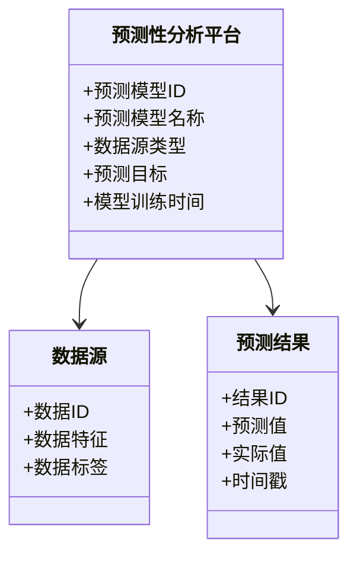
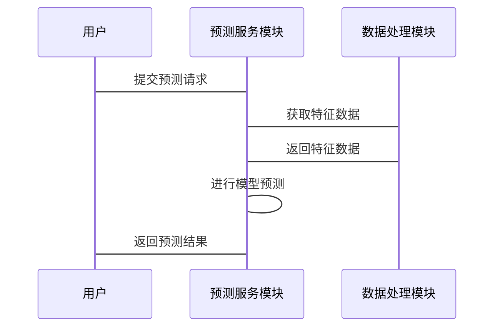

                 


# 第三部分: 系统分析与架构设计

# 第4章: 系统分析与架构设计

## 4.1 项目背景与目标
### 4.1.1 项目背景介绍
### 4.1.2 项目目标设定
### 4.1.3 项目范围界定

## 4.2 系统功能设计
### 4.2.1 领域模型设计


### 4.2.2 功能模块划分
### 4.2.3 功能流程描述

## 4.3 系统架构设计
### 4.3.1 总体架构设计


### 4.3.2 模块间关系与协作
### 4.3.3 关键模块设计

## 4.4 接口设计与交互流程
### 4.4.1 系统接口设计
### 4.4.2 交互流程设计


## 4.5 本章小结

# 第五部分: 项目实战与案例分析

# 第5章: 项目实战——构建预测性分析平台

## 5.1 环境安装与配置
### 5.1.1 安装Python环境
### 5.1.2 安装相关库
### 5.1.3 配置开发环境

## 5.2 核心代码实现
### 5.2.1 数据预处理代码
```python
import pandas as pd
from sklearn.preprocessing import StandardScaler

# 加载数据
data = pd.read_csv('data.csv')

# 数据清洗
data.dropna(inplace=True)

# 特征提取
X = data.drop('target', axis=1)
y = data['target']

# 特征标准化
scaler = StandardScaler()
X_scaled = scaler.fit_transform(X)
```

### 5.2.2 模型训练代码
```python
from sklearn.linear_model import LinearRegression
from sklearn.metrics import mean_squared_error

# 训练模型
model = LinearRegression()
model.fit(X_scaled, y)

# 模型评估
y_pred = model.predict(X_scaled)
print(mean_squared_error(y, y_pred))
```

### 5.2.3 模型部署代码
```python
import joblib

# 保存模型
joblib.dump(model, 'model.pkl')

# 加载模型
loaded_model = joblib.load('model.pkl')

# 预测新数据
new_data = scaler.transform(new_data)
prediction = loaded_model.predict(new_data)
```

## 5.3 案例分析与结果解读
### 5.3.1 案例背景介绍
### 5.3.2 数据准备与特征工程
### 5.3.3 模型训练与优化
### 5.3.4 模型部署与实时预测
### 5.3.5 结果分析与业务解读

## 5.4 项目总结与经验分享
### 5.4.1 项目成果总结
### 5.4.2 实施过程中的经验与教训
### 5.4.3 可能遇到的问题与解决方案

## 5.5 本章小结

# 第6章: 最佳实践与注意事项

## 6.1 小结与回顾
### 6.1.1 核心知识点回顾
### 6.1.2 项目实施的关键点总结

## 6.2 注意事项与常见问题
### 6.2.1 数据质量问题
### 6.2.2 模型选择与调优
### 6.2.3 模型部署与维护
### 6.2.4 业务与技术结合的注意事项

## 6.3 拓展阅读与深入学习
### 6.3.1 推荐阅读资料
### 6.3.2 相关技术领域扩展
### 6.3.3 未来发展趋势展望

## 6.4 本章小结

# 附录: 详细代码与配置

## 附录A: 完整代码实现
### 附录A.1 数据预处理代码
### 附录A.2 模型训练代码
### 附录A.3 模型部署代码

## 附录B: 系统架构配置
### 附录B.1 系统配置文件示例
### 附录B.2 网络接口配置
### 附录B.3 数据库连接配置

## 附录C: 项目部署脚本
### 附录C.1 本地部署脚本
### 附录C.2 集群部署脚本
### 附录C.3 调度任务脚本

## 附录D: 常见问题解答
### 附录D.1 数据处理中的问题
### 附录D.2 模型训练中的问题
### 附录D.3 模型部署中的问题

## 附录E: 工具与库版本要求
### 附录E.1 Python版本
### 附录E.2 各个库的版本要求
### 附录E.3 其他工具版本要求

# 参考文献

# 索引

# 致谢

---

### 文章摘要
构建企业级预测性分析平台需要从背景、核心概念、算法原理、系统架构到实际项目实施进行全面考量。通过本篇文章，您将深入了解预测性分析的核心要素，掌握多种算法的原理与实现，学会系统架构设计的方法，并通过实际案例掌握项目实战技巧。文章最后还提供了最佳实践经验和拓展阅读资料，帮助您更好地将预测性分析技术应用到实际业务中，提升企业的数据驱动决策能力。

