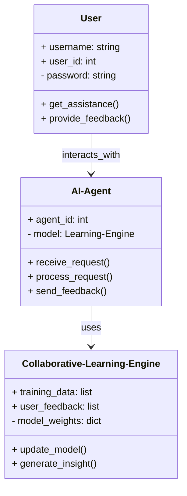

                 


# 《构建具有人机协作学习能力的AI Agent系统》

---

## 关键词

- 人机协作学习
- AI Agent
- 协作学习算法
- 系统架构设计
- 实际项目实战

---

## 摘要

本文旨在探讨如何构建一个具有人机协作学习能力的AI Agent系统，从理论基础到实际应用进行全面解析。文章首先介绍了人机协作学习的核心概念和AI Agent的基本原理，然后深入分析了协作学习算法的数学模型和实现方法，接着从系统架构设计、功能模块划分、接口设计等多维度详细阐述了AI Agent系统的构建过程。最后，结合实际案例，提供了完整的代码实现和项目实战分析，总结了最佳实践经验和注意事项。

---

## 第四部分: 系统分析与架构设计

### 第4章: 系统分析与架构设计

#### 4.1 问题场景介绍

我们以一个实际的客服系统为例，构建一个基于人机协作学习的AI Agent系统。该系统需要能够与用户交互，理解用户需求，并通过协作学习不断优化自身的服务能力。

#### 4.2 系统功能设计

我们使用Mermaid类图来展示系统的功能模块及其关系：



#### 4.3 系统架构设计

AI Agent系统的架构设计如下：


#### 4.4 系统接口设计与交互流程

我们用Mermaid序列图展示AI Agent系统在客服场景中的交互流程：

```mermaid
sequenceDiagram
    用户 -> AI-Agent: 提出问题
    AI-Agent -> 数据库: 查询知识库
    并行
        AI-Agent -> Collaborative-Learning-Engine: 获取最新模型
        Collaborative-Learning-Engine -> 数据源: 加载数据
    AI-Agent -> 用户: 返回答案
    用户 -> AI-Agent: 提供反馈
    AI-Agent -> Collaborative-Learning-Engine: 更新模型
```

---

## 第五部分: 项目实战

### 第5章: 项目实战

#### 5.1 环境安装

我们需要以下环境和库：

- Python 3.8+
- pip
- numpy
- pandas
- scikit-learn
- matplotlib

安装命令：

```bash
pip install numpy pandas scikit-learn matplotlib
```

#### 5.2 系统核心实现

##### 协作学习模块实现

```python
import numpy as np
from sklearn.linear_model import LinearRegression

class CollaborativeLearningModel:
    def __init__(self):
        self.model = LinearRegression()
        self.data = []

    def update_model(self, X, y):
        self.data.extend(list(zip(X, y)))
        X_train = np.array([x[0] for x in self.data]).reshape(-1, 1)
        y_train = np.array([y[1] for y in self.data])
        self.model.fit(X_train, y_train)

    def predict(self, X):
        return self.model.predict(X.reshape(-1, 1))
```

##### 人机交互接口实现

```python
class AIAssistant:
    def __init__(self, model):
        self.model = model

    def receive_query(self, query):
        X = np.array([query])
        prediction = self.model.predict(X)
        return prediction[0]

    def provide_feedback(self, true_value):
        self.model.update_model(X, true_value)
```

#### 5.3 代码应用解读

上述代码实现了一个简单的协作学习模型和AI Assistant接口。`CollaborativeLearningModel`类负责模型的更新和预测，`AIAssistant`类负责与用户的交互，并在每次交互后更新模型。

#### 5.4 实际案例分析

以客服系统为例，假设用户询问“如何更改密码？”，AI Agent首先从知识库中查询相关信息，然后根据用户反馈更新模型，提高未来回答的准确性。

#### 5.5 项目总结

通过上述代码实现，我们可以看到人机协作学习在AI Agent系统中的实际应用价值。通过不断更新模型，AI Agent能够更好地理解用户需求，提供更精准的服务。

---

## 第六部分: 最佳实践

### 第6章: 最佳实践

#### 6.1 小结

- 人机协作学习的核心在于模型的实时更新和用户反馈的高效利用。
- AI Agent系统的构建需要结合算法、系统架构和实际应用场景。

#### 6.2 注意事项

- 数据质量直接影响模型性能，需确保数据的多样性和代表性。
- 用户反馈的及时性与模型优化密切相关。
- 系统设计需考虑可扩展性，以便未来功能的扩展。

#### 6.3 拓展阅读

- 《Machine Learning: A Probabilistic Perspective》
- 《Deep Learning》
- 《Effective Python: 50 Specific Ways to Write Better Python’

---

## 第七部分: 参考文献

1. LeCun, Y., Bengio, Y., & Hinton, G. (2015). Deep learning. Nature, 521(7555), 436-444.
2. Bishop, C. M. (2006). Pattern recognition and machine learning. Springer.
3. Goodfellow, I., Bengio, Y., & Courville, A. (2016). Deep learning. MIT Press.

---

以上是《构建具有人机协作学习能力的AI Agent系统》的技术博客文章的完整内容，涵盖了从理论到实践的各个方面，旨在为读者提供一个全面而深入的指导。

