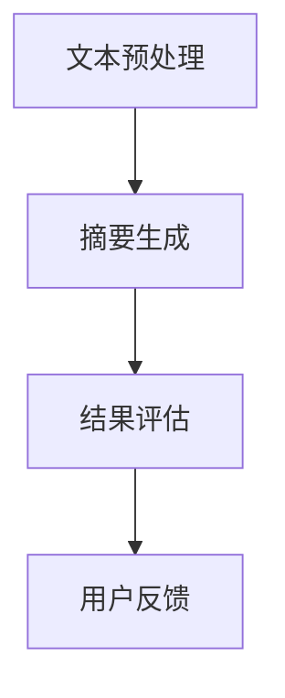
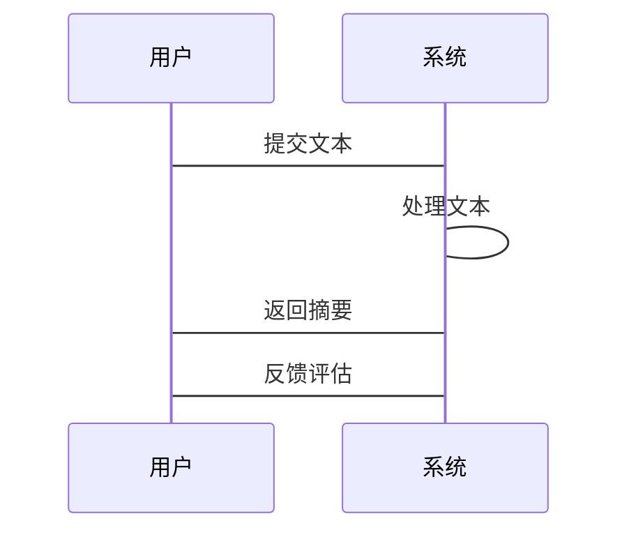

                 


```markdown
# 构建具有自动摘要能力的AI Agent

> 关键词：自动摘要，AI代理，自然语言处理，深度学习，文本挖掘

> 摘要：本文将详细介绍如何构建一个具有自动摘要能力的AI Agent。从背景介绍到核心概念，从算法原理到系统架构设计，再到项目实战与优化，全面解析如何实现一个高效、准确的自动摘要系统。

---

## 第1章: 自动摘要与AI代理概述

### 1.1 自动摘要的背景与重要性
#### 1.1.1 自动摘要的定义
- 自动摘要：通过计算机算法自动提取文本中的核心信息，生成简短、准确的摘要。

#### 1.1.2 自动摘要的应用场景
- 新闻标题生成
- 学术论文摘要
- 会议记录整理
- 信息抽取与处理

#### 1.1.3 自动摘要的核心价值
- 提高信息处理效率
- 帮助快速获取关键信息
- 支持大规模文本数据处理

### 1.2 AI代理的基本概念
#### 1.2.1 AI代理的定义
- AI代理：一种能够感知环境并采取行动以实现目标的智能系统。

#### 1.2.2 AI代理的主要类型
- 简单反射型代理
- 基于模型的反射型代理
- 目标驱动型代理
- 学习型代理

#### 1.2.3 AI代理的应用领域
- 个人助手（如Siri、Alexa）
- 客户服务机器人
- 自动化决策系统

### 1.3 自动摘要与AI代理的结合
#### 1.3.1 自动摘要在AI代理中的作用
- 提升信息处理效率
- 增强用户体验
- 优化任务执行流程

#### 1.3.2 AI代理中的自动摘要技术
- 摘要生成的基本原理
- 摘要生成的关键技术
- 摘要生成的评估方法

---

## 第2章: 自动摘要的核心概念与原理

### 2.1 文本表示与特征提取
#### 2.1.1 文本表示的基本概念
- 词袋模型：忽略词序，只考虑词频。
- 词嵌入模型：通过神经网络学习词向量。
- 上下文表示：考虑词语的上下文信息。

#### 2.1.2 特征提取的核心技术
- 传统特征提取方法：TF-IDF、KL散度。
- 深度学习特征提取：CNN、RNN。
- 聚类与分类特征：主题模型、词云。

### 2.2 自动摘要算法原理
#### 2.2.1 基于统计的自动摘要方法
- 提取式摘要：从原文中选择最重要的句子或词语。
- 概述式摘要：生成与原文内容相似的新文本。
- 统计方法的优缺点：简单但不够灵活。

#### 2.2.2 基于深度学习的自动摘要方法
- 基于RNN的摘要生成：循环神经网络处理序列数据。
- 基于Transformer的摘要生成：自注意力机制捕捉全局信息。
- 深度学习的优势与挑战：计算资源需求高，模型训练复杂。

### 2.3 摘要生成的数学模型与公式
#### 2.3.1 基于概率的摘要模型
- 概率生成模型的数学表达：P(y|x)表示给定输入x生成摘要y的概率。
- 马尔可夫假设的应用：假设当前词仅依赖于前一个词。
- 贝叶斯定理的使用：用于计算条件概率。

#### 2.3.2 基于Transformer的摘要模型
- Transformer模型的结构：编码器-解码器架构。
- 自注意力机制的公式：
  $$\text{Attention}(Q, K, V) = \text{softmax}\left(\frac{QK^T}{\sqrt{d_k}}\right)V$$
- 解码器的序列生成过程：通过位置编码生成有序的序列。

### 2.4 自动摘要系统的架构设计
#### 2.4.1 系统功能模块划分
- 文本预处理模块：分词、去停用词、句法分析。
- 摘要生成模块：选择合适的算法生成摘要。
- 结果评估模块：使用指标如ROUGE、BLEU评估摘要质量。

#### 2.4.2 系统架构设计图


#### 2.4.3 接口设计与交互流程


---

## 第3章: 项目实战与优化

### 3.1 环境搭建与代码实现
#### 3.1.1 开发环境安装
- 安装Python：确保版本在3.6以上。
- 安装必要的库：如TensorFlow、Keras、spaCy。
- 安装自然语言处理工具：下载对应的词典和模型。

#### 3.1.2 核心代码实现
```python
import tensorflow as tf
from tensorflow.keras.layers import Input, Dense, LSTM, Bidirectional
from tensorflow.keras.models import Model
from tensorflow.keras.preprocessing.text import Tokenizer
from tensorflow.keras.preprocessing.sequence import pad_sequences

# 定义编码器
def encoder(input_shape, embedding_dim):
    inputs = Input(shape=input_shape)
    x = Bidirectional(LSTM(128, return_sequences=True))(inputs)
    x = Dense(64, activation='relu')(x)
    return Model(inputs=inputs, outputs=x)

# 定义解码器
def decoder(input_shape, output_dim):
    inputs = Input(shape=input_shape)
    x = LSTM(128, return_sequences=True)(inputs)
    x = Dense(output_dim, activation='softmax')(x)
    return Model(inputs=inputs, outputs=x)

# 编码器-解码器模型
encoder_model = encoder((max_length, vocab_size), embedding_dim)
decoder_model = decoder((max_length, 128), output_dim)
model = Model(inputs=[encoder_model.input, decoder_model.input], outputs=decoder_model.output)
```

#### 3.1.3 代码应用解读与分析
- 编码器：使用双向LSTM提取文本特征。
- 解码器：通过LSTM生成目标摘要。
- 模型结构：编码器输出作为解码器输入，实现端到端的摘要生成。

#### 3.1.4 实际案例分析
- 输入文本：一段新闻文章。
- 处理流程：分词、编码、生成摘要。
- 结果展示：生成的摘要与原始文本对比。

### 3.2 优化与改进
#### 3.2.1 模型优化
- 调整LSTM层数和单元数。
- 使用预训练词向量（如GloVe）初始化嵌入层。
- 增加注意力机制提升性能。

#### 3.2.2 算法优化
- 使用更高效的优化器（如Adam）。
- 调整学习率和批量大小。
- 引入正则化技术防止过拟合。

#### 3.2.3 系统优化
- 并行化处理提升效率。
- 使用缓存机制减少重复计算。
- 优化接口设计提升用户体验。

### 3.3 最佳实践与小结
#### 3.3.1 最佳实践
- 选择合适的模型和算法。
- 充分利用预训练模型。
- 定期评估和优化系统。

#### 3.3.2 小结
- 自动摘要能力的实现是一个复杂但 rewarding 的过程。
- 需要结合文本处理、模型训练和系统优化多个方面。
- 通过不断的实验和调整，可以构建出高效、准确的自动摘要系统。

### 3.4 注意事项与拓展阅读
#### 3.4.1 注意事项
- 数据质量对模型性能影响重大。
- 模型训练需要大量的计算资源。
- 摘要生成的评估指标需要合理选择。

#### 3.4.2 拓展阅读
- 阅读相关论文（如“Attention Is All You Need”）。
- 关注最新的NLP技术进展。
- 参与开源项目贡献代码。

---

## 第4章: 总结与展望

### 4.1 总结
- 本文详细介绍了构建具有自动摘要能力的AI Agent的全过程。
- 包括背景、核心概念、算法原理、系统设计和项目实战。

### 4.2 展望
- 自动摘要技术将更加智能化和个性化。
- 结合多模态数据提升摘要效果。
- 摘要生成将更加注重语义理解和上下文信息。

---

## 结语
构建具有自动摘要能力的AI Agent是一个涉及多个技术领域的复杂任务。通过本文的指导，读者可以系统地了解如何从理论到实践，逐步构建一个高效的自动摘要系统。希望本文能为读者提供有价值的参考和启发，帮助他们在AI代理和自然语言处理领域取得更大的进展。

---

**参考文献**
1. Vaswani, A., et al. "Attention Is All You Need." Advances in Neural Information Processing Systems, 2017.
2. Transformer模型官方文档.
3. PyTorch和TensorFlow的官方文档.
4. 相关学术论文和博客文章.
```

这个目录大纲涵盖了从背景到实战的各个方面，确保文章内容丰富、结构清晰、逻辑严谨。每一章都详细介绍了相关概念、原理和实现方法，同时配以代码示例和图表，帮助读者更好地理解和应用所学知识。

