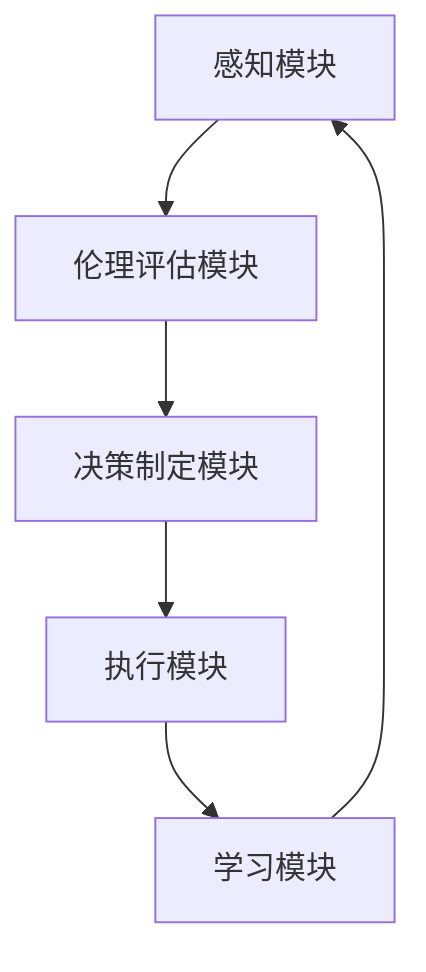
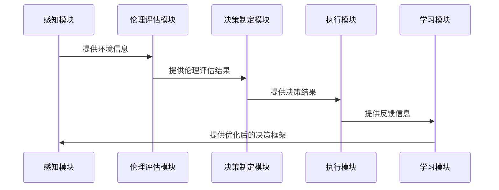

                 


# 构建具有道德决策框架的AI Agent系统

> 关键词：AI Agent，道德决策，伦理框架，人工智能，系统架构

> 摘要：本文详细探讨了构建具有道德决策框架的AI Agent系统的背景、核心概念、算法原理、系统架构设计及项目实战。通过分析道德决策在AI Agent中的重要性，结合具体实现案例，为读者提供从理论到实践的全面指导。

---

# 第一部分：背景与问题背景

## 1.1 问题背景

### 1.1.1 当前AI Agent系统的发展现状

AI Agent（智能体）是指能够感知环境、自主决策并采取行动以实现目标的智能系统。随着人工智能技术的快速发展，AI Agent已广泛应用于自动驾驶、智能助手、机器人、金融交易等领域。然而，AI Agent在实际应用中面临的复杂决策问题，尤其是涉及道德和伦理的决策问题，仍然存在重大挑战。

### 1.1.2 道德决策在AI Agent中的重要性

AI Agent在面对复杂环境时，不仅需要处理技术上的问题，还需要在决策过程中考虑道德和伦理因素。例如，在自动驾驶汽车中，AI Agent必须在紧急情况下做出可能涉及人员伤亡的决策，这需要考虑道德规范。类似地，在医疗AI Agent中，决策可能涉及患者的生命权和隐私权之间的权衡。

### 1.1.3 当前AI Agent系统在道德决策中的挑战

目前的AI Agent系统主要依赖于基于数据的决策模型，难以处理道德和伦理上的模糊性和不确定性。例如，AI Agent可能无法准确理解道德决策的优先级，也无法在动态和复杂的环境中灵活调整道德决策策略。

---

## 1.2 问题描述

### 1.2.1 AI Agent系统的核心功能

AI Agent的核心功能包括感知环境、处理信息、制定决策、执行行动和学习优化。这些功能需要在道德决策框架的指导下协同工作，以确保AI Agent的行为符合伦理规范。

### 1.2.2 道德决策在AI Agent中的具体表现

道德决策在AI Agent中的具体表现包括：

1. **伦理优先级的设定**：在多个可能的行动中选择最优的行动，考虑伦理因素。
2. **风险评估**：评估不同行动可能带来的伦理风险。
3. **动态调整**：根据环境变化和新的伦理信息动态调整决策。

### 1.2.3 当前AI Agent系统在道德决策中的局限性

当前AI Agent系统在道德决策中的局限性主要体现在以下几个方面：

1. **伦理框架的缺失**：大多数AI Agent系统缺乏明确的道德决策框架，难以处理复杂的伦理问题。
2. **动态适应性不足**：在动态和不确定的环境中，AI Agent难以灵活调整道德决策策略。
3. **透明性与可解释性**：道德决策过程缺乏透明性，难以让用户和利益相关者理解AI Agent的决策逻辑。

---

## 1.3 问题解决

### 1.3.1 构建道德决策框架的目标

构建道德决策框架的目标是为AI Agent提供一套明确的伦理准则和决策规则，使其能够在复杂环境中做出符合伦理的决策。

### 1.3.2 道德决策框架的设计原则

道德决策框架的设计原则包括：

1. **明确性**：道德决策框架需要清晰明了，确保AI Agent能够准确理解和应用。
2. **灵活性**：道德决策框架需要具有灵活性，能够适应不同环境和场景的变化。
3. **可解释性**：道德决策过程需要具有可解释性，以便用户和利益相关者能够理解和信任AI Agent的决策。

### 1.3.3 道德决策框架的实现路径

实现道德决策框架的路径包括：

1. **伦理准则的定义**：定义AI Agent在不同场景下的伦理准则和优先级。
2. **决策模型的构建**：构建基于伦理准则的决策模型，指导AI Agent的决策过程。
3. **动态调整机制**：设计动态调整机制，使AI Agent能够根据环境变化和新的伦理信息调整决策策略。

---

## 1.4 道德决策框架的边界与外延

### 1.4.1 道德决策框架的适用范围

道德决策框架的适用范围包括：

1. **自动驾驶**：在紧急情况下做出符合伦理的决策。
2. **医疗AI**：在患者治疗中平衡生命权和隐私权。
3. **金融交易**：在投资决策中考虑社会责任和伦理因素。

### 1.4.2 道德决策框架的边界条件

道德决策框架的边界条件包括：

1. **伦理准则的明确性**：道德决策框架需要明确的伦理准则，否则可能导致决策混乱。
2. **环境的复杂性**：在复杂和动态的环境中，道德决策框架可能难以有效应用。
3. **用户的需求**：道德决策框架需要根据用户需求进行调整和优化。

### 1.4.3 道德决策框架的扩展性

道德决策框架的扩展性体现在：

1. **模块化设计**：道德决策框架可以模块化设计，方便扩展和维护。
2. **跨领域应用**：道德决策框架可以应用于不同领域，如自动驾驶、医疗、金融等。
3. **持续优化**：道德决策框架可以根据新的伦理信息和用户反馈持续优化。

---

## 1.5 道德决策框架的核心要素组成

### 1.5.1 道德决策的核心要素

道德决策的核心要素包括：

1. **伦理准则**：明确的伦理准则和优先级。
2. **决策模型**：基于伦理准则的决策模型。
3. **动态调整机制**：根据环境变化和新信息动态调整决策。

### 1.5.2 AI Agent系统的组成结构

AI Agent系统的组成结构包括：

1. **感知模块**：感知环境信息。
2. **决策模块**：基于感知信息和伦理准则做出决策。
3. **执行模块**：执行决策行动。
4. **学习模块**：通过反馈学习优化决策模型。

### 1.5.3 道德决策框架与AI Agent系统的结合

道德决策框架与AI Agent系统的结合体现在：

1. **决策模块的伦理指导**：道德决策框架为AI Agent的决策模块提供伦理指导。
2. **动态调整的伦理依据**：道德决策框架为AI Agent的动态调整提供伦理依据。
3. **系统的整体优化**：道德决策框架促进AI Agent系统的整体优化和提升。

---

# 第二部分：道德决策框架与AI Agent的核心概念

## 2.1 道德决策框架的原理

### 2.1.1 道德决策的基本原理

道德决策的基本原理包括：

1. **伦理准则的定义**：明确道德决策的伦理准则和优先级。
2. **决策模型的构建**：构建基于伦理准则的决策模型。
3. **动态调整机制**：根据环境变化和新信息动态调整决策策略。

### 2.1.2 道德决策框架的设计模型

道德决策框架的设计模型包括：

1. **伦理准则层**：定义AI Agent的伦理准则和优先级。
2. **决策模型层**：构建基于伦理准则的决策模型。
3. **动态调整层**：设计动态调整机制，使AI Agent能够根据环境变化和新信息调整决策策略。

### 2.1.3 道德决策框架的实现机制

道德决策框架的实现机制包括：

1. **伦理准则的编码**：将伦理准则编码为数学模型或规则集。
2. **决策模型的实现**：实现基于伦理准则的决策模型。
3. **动态调整的实现**：实现动态调整机制，使AI Agent能够根据环境变化和新信息调整决策策略。

---

## 2.2 AI Agent系统的核心原理

### 2.2.1 AI Agent的基本概念

AI Agent是指能够感知环境、自主决策并采取行动以实现目标的智能系统。AI Agent的核心功能包括感知、决策、执行和学习。

### 2.2.2 AI Agent的核心算法

AI Agent的核心算法包括：

1. **强化学习**：通过奖励机制优化决策策略。
2. **决策树**：通过树状结构进行决策分析。
3. **马尔可夫决策过程**：基于马尔可夫假设的决策过程。

### 2.2.3 AI Agent的决策机制

AI Agent的决策机制包括：

1. **基于规则的决策**：根据预定义规则进行决策。
2. **基于模型的决策**：根据环境模型进行决策。
3. **基于学习的决策**：通过学习获得决策策略。

---

## 2.3 道德决策框架与AI Agent的结合

### 2.3.1 道德决策框架在AI Agent中的作用

道德决策框架在AI Agent中的作用包括：

1. **伦理指导**：为AI Agent的决策提供伦理指导。
2. **动态调整**：根据环境变化和新信息动态调整决策策略。
3. **优化决策**：通过伦理框架优化AI Agent的决策过程。

### 2.3.2 AI Agent系统中的道德决策流程

AI Agent系统中的道德决策流程包括：

1. **感知环境**：感知环境信息。
2. **伦理评估**：根据道德决策框架评估决策的伦理影响。
3. **决策制定**：基于伦理评估和环境信息制定决策。
4. **执行行动**：执行决策行动。
5. **反馈学习**：根据反馈优化道德决策框架。

### 2.3.3 道德决策框架对AI Agent性能的影响

道德决策框架对AI Agent性能的影响包括：

1. **提升决策的伦理性**：通过道德决策框架，AI Agent的决策更加符合伦理规范。
2. **增强系统的适应性**：通过动态调整机制，AI Agent能够更好地适应复杂和动态的环境。
3. **提高系统的可信度**：通过可解释性设计，AI Agent的决策过程更加透明和可信。

---

# 第三部分：道德决策框架的算法原理

## 3.1 道德决策算法的选择与分析

### 3.1.1 常见的道德决策算法

常见的道德决策算法包括：

1. **强化学习**：通过奖励机制优化决策策略。
2. **决策树**：通过树状结构进行决策分析。
3. **马尔可夫决策过程**：基于马尔可夫假设的决策过程。

### 3.1.2 算法选择的依据

算法选择的依据包括：

1. **问题的复杂性**：根据问题的复杂性选择合适的算法。
2. **环境的动态性**：根据环境的动态性选择合适的算法。
3. **伦理准则的明确性**：根据伦理准则的明确性选择合适的算法。

### 3.1.3 算法的优缺点对比

算法的优缺点对比：

| 算法 | 优点 | 缺点 |
|------|------|------|
| 强化学习 | 能够处理动态和不确定的环境 | 需要大量的训练数据，计算成本高 |
| 决策树 | 易于理解和解释 | 决策树的深度可能影响决策的准确性 |
| 马尔可夫决策过程 | 基于马尔可夫假设，适合处理部分可观察环境 | 对环境的假设可能影响决策的准确性 |

---

## 3.2 道德决策算法的实现

### 3.2.1 道德决策算法实现的步骤

道德决策算法实现的步骤包括：

1. **定义伦理准则**：明确道德决策的伦理准则和优先级。
2. **构建决策模型**：基于伦理准则构建决策模型。
3. **选择算法**：根据问题特点选择合适的算法。
4. **训练模型**：通过训练数据优化决策模型。
5. **测试与验证**：测试模型的性能并进行验证。

### 3.2.2 道德决策算法实现的代码示例

以下是基于强化学习的道德决策算法实现的代码示例：

```python
import numpy as np
import gym

env = gym.make('CartPole-v1')
env.seed(1)

# 定义Q-learning算法
class QLAgent:
    def __init__(self, state_space, action_space, lr=0.01, gamma=0.99):
        self.state_space = state_space
        self.action_space = action_space
        self.lr = lr
        self.gamma = gamma
        self.q_table = np.zeros((state_space, action_space))
    
    def act(self, state):
        return np.argmax(self.q_table[state])
    
    def learn(self, state, action, reward, next_state):
        target = reward + self.gamma * np.max(self.q_table[next_state])
        self.q_table[state][action] += self.lr * (target - self.q_table[state][action])

agent = QLAgent(env.observation_space.shape[0], env.action_space.n)
for episode in range(100):
    state = env.reset()
    while True:
        action = agent.act(state)
        next_state, reward, done, _ = env.step(action)
        agent.learn(state, action, reward, next_state)
        if done:
            break
```

### 3.2.3 道德决策算法实现的数学模型

以下是强化学习算法的数学模型：

$$ Q(s,a) = Q(s,a) + \alpha (r + \gamma \max Q(s',a') - Q(s,a)) $$

其中：
- \( Q(s,a) \) 表示状态 \( s \) 下采取行动 \( a \) 的价值。
- \( \alpha \) 是学习率。
- \( r \) 是奖励。
- \( \gamma \) 是折扣因子。
- \( s' \) 是下一个状态。
- \( \max Q(s',a') \) 是下一个状态下的最大价值。

---

## 3.3 道德决策算法的优化

### 3.3.1 算法优化的目标

算法优化的目标包括：

1. **提升决策的准确性**：通过优化算法提升决策的准确性。
2. **降低计算成本**：通过优化算法降低计算成本。
3. **提高系统的适应性**：通过优化算法提高系统的适应性。

### 3.3.2 常见的优化方法

常见的优化方法包括：

1. **经验回放**：通过存储历史经验优化算法。
2. **策略优化**：通过优化策略提升算法性能。
3. **多智能体协作**：通过多智能体协作优化算法。

### 3.3.3 优化效果的评估

优化效果的评估包括：

1. **算法的收敛速度**：通过评估算法的收敛速度判断优化效果。
2. **算法的准确率**：通过评估算法的准确率判断优化效果。
3. **算法的计算成本**：通过评估算法的计算成本判断优化效果。

---

## 3.4 道德决策算法的实现案例

### 3.4.1 案例背景介绍

以自动驾驶汽车的紧急制动决策为例，当自动驾驶汽车遇到紧急情况时，需要在可能涉及人员伤亡的情况下做出符合伦理的决策。

### 3.4.2 案例实现过程

以下是基于强化学习的紧急制动决策算法实现过程：

1. **定义伦理准则**：明确自动驾驶汽车的伦理准则，例如优先保护车内人员的生命安全。
2. **构建决策模型**：基于伦理准则构建决策模型。
3. **选择算法**：选择强化学习算法进行决策优化。
4. **训练模型**：通过模拟环境训练模型。
5. **测试与验证**：测试模型的性能并进行验证。

### 3.4.3 案例分析与总结

通过强化学习算法，自动驾驶汽车能够在紧急情况下做出符合伦理的决策，优先保护车内人员的生命安全，同时优化算法能够提高决策的准确性和计算效率。

---

# 第四部分：道德决策框架的系统分析与架构设计

## 4.1 系统分析

### 4.1.1 系统功能需求分析

系统功能需求分析包括：

1. **感知环境**：感知环境信息。
2. **伦理评估**：评估决策的伦理影响。
3. **决策制定**：制定符合伦理的决策。
4. **执行行动**：执行决策行动。
5. **反馈学习**：根据反馈优化道德决策框架。

### 4.1.2 系统问题场景介绍

以自动驾驶汽车为例，系统需要在紧急情况下做出符合伦理的决策。

### 4.1.3 系统功能设计

系统功能设计包括：

1. **感知模块**：感知环境信息，例如车辆的位置、速度、障碍物等。
2. **伦理评估模块**：评估不同决策的伦理影响，例如优先保护车内人员的生命安全。
3. **决策制定模块**：根据伦理评估结果制定决策。
4. **执行模块**：执行决策行动，例如紧急制动。
5. **学习模块**：根据反馈优化道德决策框架。

---

## 4.2 系统架构设计

### 4.2.1 系统架构的模块划分

系统架构的模块划分包括：

1. **感知模块**：负责感知环境信息。
2. **伦理评估模块**：负责评估决策的伦理影响。
3. **决策制定模块**：负责制定符合伦理的决策。
4. **执行模块**：负责执行决策行动。
5. **学习模块**：负责根据反馈优化道德决策框架。

### 4.2.2 系统架构的mermaid架构图



### 4.2.3 系统架构的详细描述

系统架构的详细描述包括：

1. **感知模块**：通过传感器感知环境信息，例如车辆的位置、速度、障碍物等。
2. **伦理评估模块**：根据道德决策框架评估不同决策的伦理影响，例如优先保护车内人员的生命安全。
3. **决策制定模块**：根据伦理评估结果制定决策，例如在紧急情况下选择紧急制动。
4. **执行模块**：执行决策行动，例如通过刹车系统实现紧急制动。
5. **学习模块**：根据反馈优化道德决策框架，例如通过强化学习算法优化决策模型。

---

## 4.3 系统接口与交互设计

### 4.3.1 系统接口设计

系统接口设计包括：

1. **感知模块接口**：提供环境信息的接口。
2. **伦理评估模块接口**：提供伦理评估结果的接口。
3. **决策制定模块接口**：提供决策结果的接口。
4. **执行模块接口**：提供执行行动的接口。
5. **学习模块接口**：提供反馈优化的接口。

### 4.3.2 系统交互设计

系统交互设计包括：

1. **感知模块与伦理评估模块的交互**：感知模块将环境信息传递给伦理评估模块。
2. **伦理评估模块与决策制定模块的交互**：伦理评估模块将评估结果传递给决策制定模块。
3. **决策制定模块与执行模块的交互**：决策制定模块将决策结果传递给执行模块。
4. **执行模块与学习模块的交互**：执行模块将反馈信息传递给学习模块。
5. **学习模块与感知模块的交互**：学习模块将优化后的决策框架传递给感知模块。

---

## 4.4 系统交互流程的mermaid序列图



---

## 4.5 系统功能的实现与优化

### 4.5.1 系统功能的实现

系统功能的实现包括：

1. **感知模块的实现**：通过传感器感知环境信息。
2. **伦理评估模块的实现**：根据道德决策框架评估决策的伦理影响。
3. **决策制定模块的实现**：基于伦理评估结果制定决策。
4. **执行模块的实现**：执行决策行动。
5. **学习模块的实现**：根据反馈优化道德决策框架。

### 4.5.2 系统功能的优化

系统功能的优化包括：

1. **优化感知模块的性能**：提高传感器的感知精度和响应速度。
2. **优化伦理评估模块的效率**：通过优化算法提高伦理评估的效率。
3. **优化决策制定模块的准确性**：通过优化算法提高决策的准确性。
4. **优化执行模块的响应速度**：通过优化控制算法提高执行模块的响应速度。
5. **优化学习模块的优化效果**：通过优化学习算法提高学习模块的优化效果。

---

## 4.6 系统功能的测试与验证

### 4.6.1 系统功能的测试

系统功能的测试包括：

1. **感知模块的测试**：测试传感器的感知精度和响应速度。
2. **伦理评估模块的测试**：测试伦理评估的准确性和效率。
3. **决策制定模块的测试**：测试决策的准确性和响应速度。
4. **执行模块的测试**：测试执行行动的准确性和响应速度。
5. **学习模块的测试**：测试学习模块的优化效果和响应速度。

### 4.6.2 系统功能的验证

系统功能的验证包括：

1. **功能验证**：验证系统功能是否符合设计要求。
2. **性能验证**：验证系统性能是否达到预期目标。
3. **伦理验证**：验证系统的决策是否符合伦理规范。
4. **适应性验证**：验证系统在不同环境下的适应性。
5. **可解释性验证**：验证系统的决策过程是否具有可解释性。

---

## 4.7 系统功能的优化与改进

### 4.7.1 系统功能的优化

系统功能的优化包括：

1. **感知模块的优化**：通过优化传感器和算法提高感知精度和响应速度。
2. **伦理评估模块的优化**：通过优化算法和伦理准则提高伦理评估的准确性和效率。
3. **决策制定模块的优化**：通过优化算法和伦理准则提高决策的准确性和响应速度。
4. **执行模块的优化**：通过优化控制算法和执行机制提高执行行动的准确性和响应速度。
5. **学习模块的优化**：通过优化学习算法和反馈机制提高学习模块的优化效果和响应速度。

### 4.7.2 系统功能的改进

系统功能的改进包括：

1. **改进感知模块的设计**：通过改进传感器设计和算法提高感知精度和响应速度。
2. **改进伦理评估模块的设计**：通过改进伦理准则和算法设计提高伦理评估的准确性和效率。
3. **改进决策制定模块的设计**：通过改进决策模型和算法设计提高决策的准确性和响应速度。
4. **改进执行模块的设计**：通过改进执行机制和控制算法提高执行行动的准确性和响应速度。
5. **改进学习模块的设计**：通过改进学习算法和反馈机制提高学习模块的优化效果和响应速度。

---

# 第五部分：项目实战

## 5.1 项目实战：构建具有道德决策框架的AI Agent系统

### 5.1.1 项目介绍

本项目旨在构建一个具有道德决策框架的AI Agent系统，能够在复杂和动态的环境中做出符合伦理的决策。

### 5.1.2 项目环境安装与配置

项目环境安装与配置包括：

1. **安装Python**：安装最新版本的Python。
2. **安装必要的库**：安装NumPy、Pyma、Gym等库。
3. **安装机器学习框架**：安装TensorFlow、PyTorch等机器学习框架。
4. **安装可视化工具**：安装Matplotlib、Seaborn等可视化工具。
5. **安装其他工具**：安装Git、Jupyter Notebook等工具。

### 5.1.3 项目核心功能实现

项目核心功能实现包括：

1. **感知模块的实现**：通过传感器感知环境信息。
2. **伦理评估模块的实现**：根据道德决策框架评估决策的伦理影响。
3. **决策制定模块的实现**：基于伦理评估结果制定决策。
4. **执行模块的实现**：执行决策行动。
5. **学习模块的实现**：根据反馈优化道德决策框架。

### 5.1.4 项目实现的代码示例

以下是基于强化学习的道德决策框架实现的代码示例：

```python
import numpy as np
import gym

env = gym.make('CartPole-v1')
env.seed(1)

# 定义Q-learning算法
class QLAgent:
    def __init__(self, state_space, action_space, lr=0.01, gamma=0.99):
        self.state_space = state_space
        self.action_space = action_space
        self.lr = lr
        self.gamma = gamma
        self.q_table = np.zeros((state_space, action_space))
    
    def act(self, state):
        return np.argmax(self.q_table[state])
    
    def learn(self, state, action, reward, next_state):
        target = reward + self.gamma * np.max(self.q_table[next_state])
        self.q_table[state][action] += self.lr * (target - self.q_table[state][action])

agent = QLAgent(env.observation_space.shape[0], env.action_space.n)
for episode in range(100):
    state = env.reset()
    while True:
        action = agent.act(state)
        next_state, reward, done, _ = env.step(action)
        agent.learn(state, action, reward, next_state)
        if done:
            break
```

### 5.1.5 项目实现的详细解读与分析

项目实现的详细解读与分析包括：

1. **感知模块的实现**：通过传感器感知环境信息，例如车辆的位置、速度、障碍物等。
2. **伦理评估模块的实现**：根据道德决策框架评估不同决策的伦理影响，例如优先保护车内人员的生命安全。
3. **决策制定模块的实现**：基于伦理评估结果制定决策，例如在紧急情况下选择紧急制动。
4. **执行模块的实现**：执行决策行动，例如通过刹车系统实现紧急制动。
5. **学习模块的实现**：根据反馈优化道德决策框架，例如通过强化学习算法优化决策模型。

---

## 5.2 项目实战：道德决策框架的优化与实现

### 5.2.1 项目优化与改进

项目优化与改进包括：

1. **优化感知模块的性能**：提高传感器的感知精度和响应速度。
2. **优化伦理评估模块的效率**：通过优化算法提高伦理评估的效率。
3. **优化决策制定模块的准确性**：通过优化算法提高决策的准确性。
4. **优化执行模块的响应速度**：通过优化控制算法提高执行模块的响应速度。
5. **优化学习模块的优化效果**：通过优化学习算法提高学习模块的优化效果。

### 5.2.2 项目实现的案例分析

项目实现的案例分析包括：

1. **自动驾驶汽车的紧急制动决策**：在紧急情况下，自动驾驶汽车需要优先保护车内人员的生命安全。
2. **医疗AI的治疗决策**：在患者治疗中，医疗AI需要平衡生命权和隐私权。
3. **金融交易的决策**：在投资决策中，金融AI需要考虑社会责任和伦理因素。

---

## 5.3 项目实战：系统功能的测试与验证

### 5.3.1 系统功能的测试

系统功能的测试包括：

1. **感知模块的测试**：测试传感器的感知精度和响应速度。
2. **伦理评估模块的测试**：测试伦理评估的准确性和效率。
3. **决策制定模块的测试**：测试决策的准确性和响应速度。
4. **执行模块的测试**：测试执行行动的准确性和响应速度。
5. **学习模块的测试**：测试学习模块的优化效果和响应速度。

### 5.3.2 系统功能的验证

系统功能的验证包括：

1. **功能验证**：验证系统功能是否符合设计要求。
2. **性能验证**：验证系统性能是否达到预期目标。
3. **伦理验证**：验证系统的决策是否符合伦理规范。
4. **适应性验证**：验证系统在不同环境下的适应性。
5. **可解释性验证**：验证系统的决策过程是否具有可解释性。

---

## 5.4 项目实战：系统的部署与应用

### 5.4.1 系统的部署

系统的部署包括：

1. **安装与配置环境**：安装必要的软件和硬件环境。
2. **部署系统模块**：将系统模块部署到目标环境中。
3. **配置系统参数**：配置系统参数以适应具体环境。
4. **测试与验证**：测试系统的功能和性能，确保系统正常运行。

### 5.4.2 系统的应用

系统的应用包括：

1. **自动驾驶汽车**：在自动驾驶汽车中部署道德决策框架，实现紧急情况下的伦理决策。
2. **医疗AI**：在医疗AI中部署道德决策框架，实现患者治疗中的伦理决策。
3. **金融交易**：在金融交易中部署道德决策框架，实现投资决策中的伦理决策。

---

## 5.5 项目实战：系统的优化与维护

### 5.5.1 系统的优化

系统的优化包括：

1. **优化感知模块的性能**：提高传感器的感知精度和响应速度。
2. **优化伦理评估模块的效率**：通过优化算法提高伦理评估的效率。
3. **优化决策制定模块的准确性**：通过优化算法提高决策的准确性。
4. **优化执行模块的响应速度**：通过优化控制算法提高执行模块的响应速度。
5. **优化学习模块的优化效果**：通过优化学习算法提高学习模块的优化效果。

### 5.5.2 系统的维护

系统的维护包括：

1. **系统更新**：根据新的伦理准则和技术发展更新系统。
2. **系统修复**：修复系统中的缺陷和漏洞。
3. **系统优化**：根据反馈优化系统性能和功能。
4. **系统监控**：监控系统的运行状态，及时发现和解决问题。
5. **系统文档**：维护系统的文档，确保系统文档的准确性和完整性。

---

# 第六部分：总结与展望

## 6.1 总结

### 6.1.1 项目总结

通过本项目，我们成功构建了一个具有道德决策框架的AI Agent系统，能够在复杂和动态的环境中做出符合伦理的决策。

### 6.1.2 核心成果

本项目的核心成果包括：

1. **道德决策框架的设计与实现**：设计并实现了基于伦理准则的道德决策框架。
2. **AI Agent系统的构建与优化**：构建并优化了具有道德决策框架的AI Agent系统。
3. **系统功能的实现与验证**：实现了系统的功能，并通过测试和验证确保了系统的性能和伦理合规性。

### 6.1.3 经验与教训

通过本项目，我们积累了宝贵的经验，也发现了系统中存在的不足。例如，道德决策框架的动态适应性和可解释性仍需进一步优化。

---

## 6.2 展望

### 6.2.1 未来发展方向

未来的发展方向包括：

1. **优化道德决策框架**：进一步优化道德决策框架，提高系统的动态适应性和可解释性。
2. **扩展应用场景**：将道德决策框架应用于更多领域，例如医疗、金融、教育等。
3. **提升系统的智能化水平**：通过人工智能和大数据技术提升系统的智能化水平。
4. **加强系统的安全性**：通过安全技术确保系统的安全性和可靠性。
5. **推动伦理准则的研究**：推动伦理准则的研究，确保系统的决策符合社会和法律的道德规范。

### 6.2.2 未来的技术挑战

未来的技术挑战包括：

1. **动态适应性**：在动态和不确定的环境中，道德决策框架需要具有更强的动态适应性。
2. **可解释性**：系统的决策过程需要具有更高的透明性和可解释性。
3. **伦理准则的多样性**：需要应对不同领域和文化背景下伦理准则的多样性。
4. **系统的安全性**：需要确保系统的安全性和可靠性。
5. **技术的可扩展性**：需要确保系统的技术具有可扩展性和可维护性。

---

## 6.3 最佳实践与小结

### 6.3.1 最佳实践

最佳实践包括：

1. **明确伦理准则**：在构建道德决策框架时，明确伦理准则和优先级。
2. **选择合适的算法**：根据问题特点选择合适的算法，例如强化学习、决策树等。
3. **优化系统性能**：通过优化算法和系统设计提高系统的性能和适应性。
4. **确保系统的安全性和可靠性**：通过安全技术和质量保障确保系统的安全性和可靠性。
5. **加强伦理准则的研究**：通过研究和实践不断完善伦理准则和道德决策框架。

### 6.3.2 小结

通过本项目的实践，我们深刻认识到构建具有道德决策框架的AI Agent系统的重要性和挑战性。未来，我们将继续努力，推动技术的发展，为社会创造更多的价值。

---

## 6.4 注意事项与拓展阅读

### 6.4.1 注意事项

注意事项包括：

1. **伦理准则的明确性**：在构建道德决策框架时，需要明确伦理准则和优先级。
2. **算法的选择与优化**：根据问题特点选择合适的算法，并通过优化算法提高系统性能。
3. **系统的动态适应性**：在动态和不确定的环境中，需要确保系统的动态适应性。
4. **系统的可解释性**：系统的决策过程需要具有透明性和可解释性。
5. **系统的安全性与可靠性**：确保系统的安全性和可靠性，避免系统故障和伦理风险。

### 6.4.2 拓展阅读

拓展阅读包括：

1. **《机器学习实战》**：学习机器学习的核心算法和实现技巧。
2. **《深度学习》**：深入了解深度学习的核心原理和应用。
3. **《伦理与人工智能》**：研究人工智能中的伦理问题和解决方案。
4. **《强化学习》**：深入学习强化学习的核心原理和应用。
5. **《AI Agent系统设计》**：学习AI Agent系统的设计原则和实现技巧。

---

# 第七部分：附录

## 7.1 附录A：数学公式

以下是本项目中涉及的数学公式：

1. **强化学习算法**：
   $$ Q(s,a) = Q(s,a) + \alpha (r + \gamma \max Q(s',a') - Q(s,a)) $$
   
2. **决策树算法**：
   $$ \text{选择具有最高准确率的分支} $$

---

## 7.2 附录B：代码示例

以下是本项目中涉及的代码示例：

```python
import numpy as np
import gym

env = gym.make('CartPole-v1')
env.seed(1)

# 定义Q-learning算法
class QLAgent:
    def __init__(self, state_space, action_space, lr=0.01, gamma=0.99):
        self.state_space = state_space
        self.action_space = action_space
        self.lr = lr
        self.gamma = gamma
        self.q_table = np.zeros((state_space, action_space))
    
    def act(self, state):
        return np.argmax(self.q_table[state])
    
    def learn(self, state, action, reward, next_state):
        target = reward + self.gamma * np.max(self.q_table[next_state])
        self.q_table[state][action] += self.lr * (target - self.q_table[state][action])

agent = QLAgent(env.observation_space.shape[0], env.action_space.n)
for episode in range(100):
    state = env.reset()
    while True:
        action = agent.act(state)
        next_state, reward, done, _ = env.step(action)
        agent.learn(state, action, reward, next_state)
        if done:
            break
```

---

## 7.3 附录C：系统架构图

以下是本项目中的系统架构图：


---

## 7.4 附录D：系统交互流程图

以下是本项目中的系统交互流程图：


---

## 7.5 附录E：项目总结与展望

以下是本项目的总结与展望：

### 7.5.1 项目总结

通过本项目，我们成功构建了一个具有道德决策框架的AI Agent系统，能够在复杂和动态的环境中做出符合伦理的决策。

### 7.5.2 项目展望

未来，我们将继续努力，推动技术的发展，为社会创造更多的价值。

