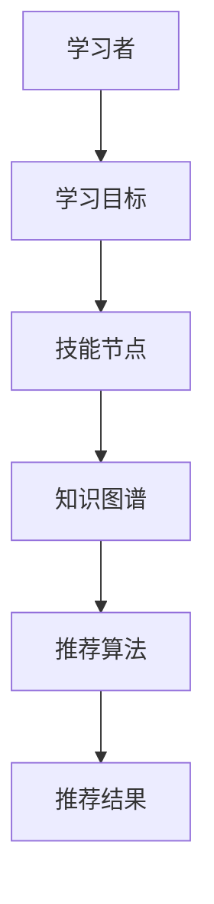
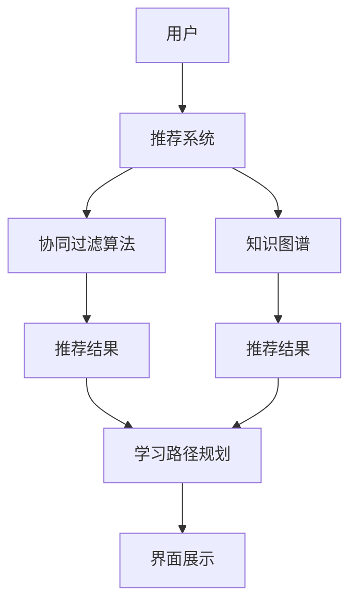

                 


# 构建智能企业知识推荐系统：个性化学习与技能提升路径规划

> 关键词：企业知识推荐系统, 个性化学习, 技能提升路径, 推荐算法, 知识图谱, 系统架构, 深度学习

> 摘要：本文系统性地探讨了智能企业知识推荐系统的构建方法，从个性化学习到技能提升路径规划，深入分析了推荐算法的核心原理与实现。文章结合实际应用场景，详细阐述了知识图谱的构建与应用、推荐算法的分类与优化策略，以及系统架构的设计与实现。通过对协同过滤算法、深度学习推荐模型的详细解读，结合具体代码实现和系统设计图，本文为读者提供了一个从理论到实践的完整指南，帮助企业在数字化转型中构建高效的智能推荐系统。

---

# 第一部分: 背景与核心概念

# 第1章: 问题背景与需求分析

## 1.1 问题背景介绍

### 1.1.1 知识推荐系统的定义与目标
知识推荐系统是一种基于用户特征和知识库构建的智能推荐系统，旨在为企业员工提供个性化学习资源和技能提升路径。其核心目标是通过分析用户的学习行为、兴趣偏好和职业发展需求，推荐相关知识内容，帮助用户快速掌握所需技能。

### 1.1.2 个性化学习与技能提升的重要性
在企业数字化转型的背景下，员工技能提升已成为企业竞争力的关键因素。个性化学习能够根据员工的岗位需求、职业发展方向和学习偏好，制定个性化的学习计划，最大化学习效率和效果。

### 1.1.3 企业知识推荐系统的现状与挑战
目前，企业知识推荐系统在以下几个方面面临挑战：
1. **数据稀疏性**：用户行为数据量不足，导致推荐效果不佳。
2. **知识表示**：如何有效地表示和组织企业知识，是推荐系统的核心难点。
3. **实时性**：用户需求和知识库内容动态变化，要求推荐系统具备实时性。
4. **模型泛化能力**：如何在不同领域和岗位中通用化推荐模型。

## 1.2 问题描述与目标设定

### 1.2.1 企业知识推荐系统的核心问题
1. 如何构建高效的推荐模型，解决数据稀疏性问题。
2. 如何设计知识图谱，实现知识的有效表示与关联。
3. 如何优化推荐算法，提高推荐结果的准确性和实时性。

### 1.2.2 个性化学习路径规划的关键点
1. 用户特征分析：包括用户的学习目标、兴趣偏好、职业发展阶段。
2. 知识内容分析：包括知识点的难度、相关性、适用场景。
3. 学习路径优化：基于用户特征和知识内容，规划最优学习路径。

### 1.2.3 系统边界与外延
系统边界：
- 输入：用户基本信息、学习历史、职业目标。
- 输出：个性化推荐列表、学习路径建议。
- 界面：用户操作界面、推荐结果展示界面。
- 数据源：企业知识库、学习资源库、用户行为数据库。

系统外延：
- 数据收集：用户行为跟踪、知识内容标注。
- 模型优化：推荐算法的迭代优化、知识图谱的动态更新。
- 应用场景：企业培训、知识管理、员工发展。

## 1.3 核心概念与系统架构

### 1.3.1 知识图谱与领域模型
知识图谱是将企业知识以结构化的形式表示，包括知识点、技能点、岗位需求等实体，以及它们之间的关系。领域模型则是根据岗位需求构建的知识体系，用于指导学习路径的规划。

### 1.3.2 推荐算法与个性化模型
推荐算法是系统的核心，包括基于协同过滤的推荐和基于知识图谱的推荐。个性化模型则是根据用户特征构建的数学模型，用于预测用户的兴趣和需求。

### 1.3.3 系统核心要素与组成
系统核心要素：
- 用户模型：包括用户的基本信息、学习目标、兴趣偏好。
- 知识库：包括知识点、技能点、课程资源。
- 推荐算法：包括协同过滤、深度学习推荐。
- 学习路径规划：基于用户特征和知识库构建的学习路径。

系统组成：
1. 数据采集模块：负责收集用户行为数据和知识内容数据。
2. 数据处理模块：对数据进行清洗、预处理和特征提取。
3. 推荐算法模块：包括协同过滤和深度学习推荐模型。
4. 学习路径规划模块：根据推荐结果生成学习路径。
5. 界面展示模块：将推荐结果和学习路径展示给用户。

---

# 第2章: 核心概念与系统关系

## 2.1 核心概念原理

### 2.1.1 知识图谱的构建与应用
知识图谱的构建包括实体识别、关系抽取和知识融合。应用包括知识检索、推荐和学习路径规划。

### 2.1.2 推荐算法的分类与特点
推荐算法分为基于协同过滤的推荐和基于知识图谱的推荐。协同过滤推荐基于用户行为相似性，知识图谱推荐基于知识点的语义关联。

### 2.1.3 个性化学习路径规划的数学模型
个性化学习路径规划模型基于用户特征和知识点的关联性，构建一个优化模型，目标是最小化学习路径的复杂度，最大化学习效果。

## 2.2 核心概念对比表

| 概念          | 描述                                                                 | 属性                       | 示例                         |
|---------------|----------------------------------------------------------------------|----------------------------|------------------------------|
| 知识图谱       | 结构化的知识表示，用于描述实体及其关系。                           | 分层、关联、语义           | 企业技能树                 |
| 推荐算法       | 根据用户行为推荐相关内容。                                         | 协同过滤、内容推荐、混合推荐 | 基于CF的推荐系统             |
| 个性化模型     | 根据用户特征构建的学习模型。                                       | 兴趣、能力、目标           | 基于CB的推荐系统             |

## 2.3 实体关系图



---

# 第3章: 算法原理与数学模型

## 3.1 协同过滤算法

### 3.1.1 基于用户的协同过滤
基于用户的协同过滤通过计算用户之间的相似度，推荐相似用户的喜欢的内容。

### 3.1.2 基于物品的协同过滤
基于物品的协同过滤通过计算物品之间的相似度，推荐与用户已喜欢物品相似的内容。

### 3.1.3 混合协同过滤模型
混合协同过滤模型结合基于用户和基于物品的协同过滤，通过加权的方式提高推荐的准确性。

---

## 3.2 深度学习推荐模型

### 3.2.1 基于神经网络的推荐系统
基于神经网络的推荐系统通过深度学习模型提取用户和物品的特征，进行推荐。

### 3.2.2 知识图谱嵌入与推荐
知识图谱嵌入通过将知识图谱中的实体和关系嵌入到低维空间，用于推荐。

### 3.2.3 图神经网络在推荐中的应用
图神经网络通过处理知识图谱的结构信息，进行推荐。

## 3.3 数学模型与公式

### 3.3.1 协同过滤的相似度计算
$$\text{相似度}(u_i, u_j) = \frac{\sum_{k} (r_{u_i,k} - \bar{r_{u_i}})(r_{u_j,k} - \bar{r_{u_j}})}{\sqrt{\sum_{k} (r_{u_i,k} - \bar{r_{u_i}})^2} \cdot \sqrt{\sum_{k} (r_{u_j,k} - \bar{r_{u_j}})^2}}$$

### 3.3.2 基于神经网络的推荐模型
$$P(u, i) = \sigma(W_u \cdot u + W_i \cdot i + b)$$

---

## 3.4 算法实现与代码示例

### 3.4.1 协同过滤算法实现
```python
def user_based_recommender(rating_matrix, user_id, k=3):
    # 计算用户相似度
    similarities = {}
    for user in rating_matrix:
        if user != user_id:
            similarity = cosine_similarity(rating_matrix[user], rating_matrix[user_id])
            similarities[user] = similarity
    # 排序相似度
    sorted_users = sorted(similarities.items(), key=lambda x: x[1], reverse=True)
    # 获取top-k用户
    top_k_users = sorted_users[:k]
    # 聚合推荐
    recommendations = {}
    for user in top_k_users:
        for item in rating_matrix[user]:
            recommendations[item] += rating_matrix[user][item]
    return recommendations
```

### 3.4.2 深度学习推荐模型实现
```python
import tensorflow as tf

def neural_network_recommender(user_input, item_input, embedding_dim=64):
    # 用户嵌入
    user_embeddings = tf.keras.layers.Embedding(user_count, embedding_dim)(user_input)
    # 物品嵌入
    item_embeddings = tf.keras.layers.Embedding(item_count, embedding_dim)(item_input)
    # 拼接
    concat = tf.keras.layers.Concatenate()([user_embeddings, item_embeddings])
    # 全连接层
    dense = tf.keras.layers.Dense(64, activation='relu')(concat)
    # 输出层
    output = tf.keras.layers.Dense(1, activation='sigmoid')(dense)
    model = tf.keras.Model(inputs=[user_input, item_input], outputs=output)
    return model
```

---

## 3.5 算法对比与优化策略

### 3.5.1 算法对比
| 算法类型       | 优缺点                     | 适用场景                 |
|----------------|----------------------------|--------------------------|
| 协同过滤       | 简单易实现，但计算量大       | 数据稀疏性较高的场景     |
| 深度学习推荐     | 表现力强，但需要大量数据     | 数据量充足且多样化的场景   |

### 3.5.2 优化策略
1. **基于矩阵分解的优化**：通过矩阵分解降低维度，提高计算效率。
2. **基于负采样的优化**：引入负采样，提高模型的鲁棒性。
3. **基于时间序列的优化**：考虑用户行为的时间因素，提高推荐的实时性。

---

# 第4章: 系统架构设计与实现

## 4.1 系统架构设计

### 4.1.1 系统功能设计
系统功能包括：
1. 用户信息管理：用户注册、登录、信息完善。
2. 知识库管理：知识点管理、技能点管理、课程资源管理。
3. 推荐系统：基于协同过滤和知识图谱的推荐。
4. 学习路径规划：根据推荐结果生成学习路径。
5. 界面展示：推荐结果展示、学习路径展示。

### 4.1.2 系统架构图


### 4.1.3 系统接口设计
系统接口包括：
1. 用户信息接口：获取用户信息、更新用户信息。
2. 知识库接口：获取知识点、技能点、课程资源。
3. 推荐接口：获取推荐结果、学习路径。
4. 界面展示接口：展示推荐结果和学习路径。

### 4.1.4 系统交互流程图
```mermaid
sequenceDiagram
    user ->+> 推荐系统: 请求推荐
    推荐系统 ->+> 协同过滤算法: 获取协同过滤推荐
    推荐系统 ->+> 知识图谱: 获取知识图谱推荐
    推荐系统 ->+> 学习路径规划: 获取学习路径
    推荐系统 ->+> 界面展示: 展示推荐结果
```

---

## 4.2 系统实现与代码示例

### 4.2.1 环境安装
```bash
pip install numpy pandas scikit-learn tensorflow
```

### 4.2.2 核心实现代码

#### 协同过滤算法实现
```python
import numpy as np
from sklearn.metrics.pairwise import cosine_similarity

def user_based_recommender(rating_matrix, user_id, k=3):
    # 计算用户相似度
    similarities = {}
    for user in rating_matrix:
        if user != user_id:
            similarity = cosine_similarity(rating_matrix[user].reshape(1, -1), rating_matrix[user_id].reshape(1, -1))[0]
            similarities[user] = similarity
    # 排序相似度
    sorted_users = sorted(similarities.items(), key=lambda x: x[1], reverse=True)
    # 获取top-k用户
    top_k_users = [user for user, _ in sorted_users[:k]]
    # 聚合推荐
    recommendations = {}
    for user in top_k_users:
        for item, rating in rating_matrix[user].items():
            if item not in recommendations:
                recommendations[item] = 0
            recommendations[item] += rating
    return recommendations
```

#### 神经网络推荐模型实现
```python
import tensorflow as tf
from tensorflow.keras.layers import Input, Embedding, Dense, Concatenate, Activation
from tensorflow.keras.models import Model

def neural_network_recommender(user_input, item_input, user_count, item_count, embedding_dim=64):
    # 用户嵌入
    user_embeddings = Embedding(user_count, embedding_dim)(user_input)
    # 物品嵌入
    item_embeddings = Embedding(item_count, embedding_dim)(item_input)
    # 拼接
    concat = Concatenate()([user_embeddings, item_embeddings])
    # 全连接层
    dense = Dense(64, activation='relu')(concat)
    # 输出层
    output = Dense(1, activation='sigmoid')(dense)
    model = Model(inputs=[user_input, item_input], outputs=output)
    return model
```

---

## 4.3 项目实战与案例分析

### 4.3.1 实战环境搭建
```bash
pip install numpy pandas scikit-learn tensorflow
```

### 4.3.2 核心功能实现
1. 数据预处理：清洗和格式化用户行为数据、知识内容数据。
2. 模型训练：训练协同过滤模型和神经网络推荐模型。
3. 推荐结果展示：基于推荐结果生成学习路径，并展示给用户。

### 4.3.3 案例分析
以一个企业培训场景为例，用户A是数据分析师，学习目标是提升数据分析能力。系统根据用户A的学习历史、兴趣偏好和职业目标，推荐相关课程和学习资源。

---

## 4.4 系统优化与扩展

### 4.4.1 系统优化策略
1. **数据优化**：引入更多特征，如用户行为的时间戳、用户属性。
2. **模型优化**：尝试不同的深度学习模型，如GAT、Transformer。
3. **系统性能优化**：优化推荐算法的计算效率，减少响应时间。

### 4.4.2 系统扩展方向
1. **多模态推荐**：结合文本、图像等多种数据形式进行推荐。
2. **实时推荐**：实现实时推荐，基于用户的实时行为进行推荐。
3. **个性化推荐**：进一步优化个性化推荐，提高推荐结果的精准度。

---

## 4.5 最佳实践与小结

### 4.5.1 最佳实践
1. **数据质量**：确保数据的完整性和准确性。
2. **模型选择**：根据数据特点选择合适的推荐算法。
3. **系统性能**：优化推荐算法的计算效率，确保系统的实时性。
4. **用户体验**：注重推荐结果的可解释性和用户体验。

### 4.5.2 小结
本文详细阐述了智能企业知识推荐系统的构建方法，从算法原理到系统架构，再到项目实战，为读者提供了一个从理论到实践的完整指南。通过协同过滤和深度学习推荐模型的实现，结合知识图谱的应用，本文为读者展示了如何构建一个高效的个性化推荐系统。

---

## 4.6 注意事项与拓展阅读

### 4.6.1 注意事项
1. **数据隐私**：在处理用户数据时，需要注意数据隐私和安全。
2. **模型泛化能力**：在设计推荐系统时，要注意模型的泛化能力，避免过拟合。
3. **系统维护**：定期更新知识库和优化模型，确保推荐系统的准确性和实时性。

### 4.6.2 拓展阅读
1. 《推荐系统实战：基于协同过滤和深度学习的推荐算法》
2. 《知识图谱与智能推荐：从理论到实践》
3. 《深度学习在推荐系统中的应用》

---

通过以上详细分析和具体实现，读者可以深入了解智能企业知识推荐系统的构建方法，掌握个性化学习与技能提升路径规划的核心技术，为企业的数字化转型提供有力支持。

