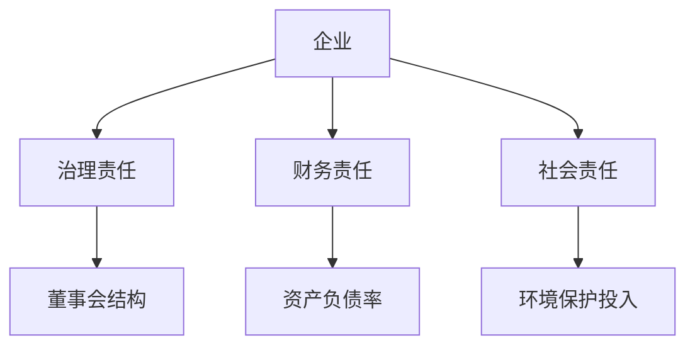
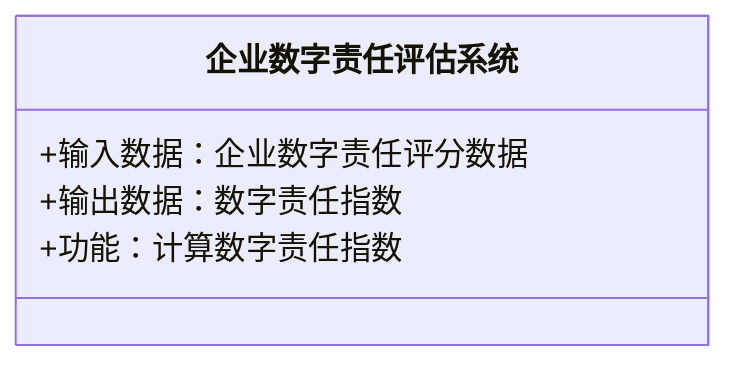
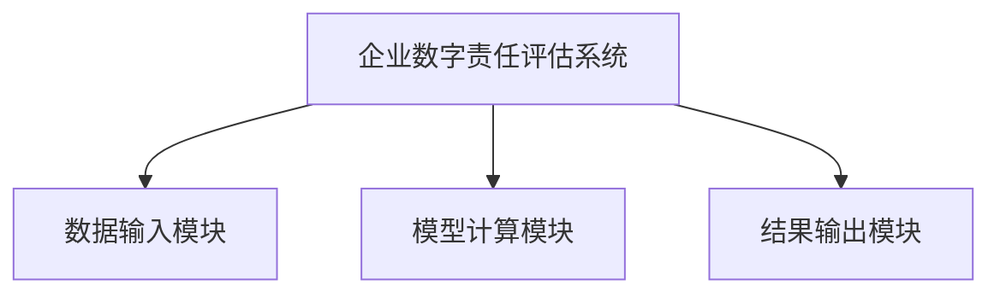
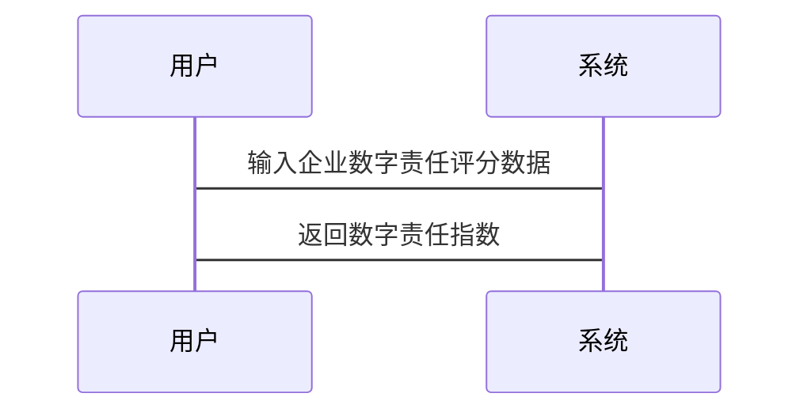

                 


# 特价股票投资中的企业数字责任评估因素考量

## 关键词：特价股票、企业数字责任、评估因素、投资分析、风险评估

## 摘要：在特价股票投资中，企业数字责任评估是投资者在选择投资标的时必须考虑的重要因素。本文从企业数字责任的核心概念出发，分析其与特价股票投资的关系，并探讨数字责任评估模型的构建与实现。通过系统分析与项目实战，本文提供了一套完整的数字责任评估解决方案，并总结了投资中的最佳实践。

---

# 第一部分: 特价股票投资与企业数字责任概述

## # 第1章: 特价股票投资与企业数字责任概述

### ## 1.1 特价股票的基本概念

#### ### 1.1.1 特价股票的定义与特点
特价股票是指面值发行的股票，通常价格低于面值。这种股票的特点包括：
- 投资门槛低。
- 适合风险承受能力较高的投资者。
- 可能涉及企业重组或财务困境。

#### ### 1.1.2 特价股票的分类与应用场景
- 按发行目的分类：新股发行中的配售股票、企业重组中的低价发行股票。
- 按行业分类：金融、科技、制造等行业中的特价股票。
- 应用于企业融资、资产重组等场景。

#### ### 1.1.3 特价股票投资的潜在风险与机会
- 风险：企业财务状况不佳、市场波动大、流动性差。
- 机会：潜在的高收益、价值回升的可能性。

### ## 1.2 企业数字责任的概念与内涵

#### ### 1.2.1 数字责任的定义
数字责任是指企业在数字化转型中对数据隐私、合规性、透明度等方面的责任。

#### ### 1.2.2 企业数字责任的核心要素
- 数据隐私：保护用户数据不被滥用。
- 合规性：遵守相关法律法规。
- 透明度：公开企业运营信息。

#### ### 1.2.3 数字责任与企业可持续发展的关系
数字责任是企业可持续发展的重要组成部分，直接影响企业的社会形象和长期发展。

### ## 1.3 特价股票投资中的数字责任评估背景

#### ### 1.3.1 特价股票投资中的问题背景
- 投资者需要全面评估企业的数字责任，以降低投资风险。
- 企业数字责任是衡量企业健康的重要指标。

#### ### 1.3.2 数字责任评估的必要性与重要性
- 必要性：避免投资于数字责任低的企业，降低投资风险。
- 重要性：数字责任高的企业更可能具有长期发展潜力。

#### ### 1.3.3 本章小结
本章介绍了特价股票的基本概念和企业数字责任的内涵，强调了数字责任评估在特价股票投资中的重要性。

---

## # 第2章: 企业数字责任评估的核心概念与联系

### ## 2.1 企业数字责任的核心概念

#### ### 2.1.1 企业治理责任
- 定义：企业治理责任是指企业在内部治理中的责任。
- 实施：包括董事会结构、内部控制、风险管理等。

#### ### 2.1.2 财务责任
- 定义：企业财务责任是指企业在财务方面的责任。
- 实施：包括财务透明度、债务管理、利润分配等。

#### ### 2.1.3 社会责任
- 定义：企业社会责任是指企业在社会方面的责任。
- 实施：包括环境保护、公益捐赠、员工福利等。

### ## 2.2 企业数字责任评估的关键因素

#### ### 2.2.1 企业治理结构
- 评估指标：董事会结构、内部控制、风险管理。
- 评估方法：通过企业年报和其他公开信息进行评估。

#### ### 2.2.2 财务健康状况
- 评估指标：资产负债率、净利润率、现金流。
- 评估方法：通过财务报表分析。

#### ### 2.2.3 社会责任履行情况
- 评估指标：环境保护投入、公益捐赠、员工福利。
- 评估方法：通过企业社会责任报告和其他公开信息进行评估。

### ## 2.3 核心概念的联系与对比

#### ### 2.3.1 核心概念的原理分析
- 企业治理责任、财务责任和社会责任三者相互关联，共同影响企业的数字责任。

#### ### 2.3.2 概念属性特征对比表格
| 概念       | 定义                                   | 评估指标                     |
|------------|--------------------------------------|------------------------------|
| 治理责任    | 内部治理的责任                        | 董事会结构、内部控制          |
| 财务责任    | 财务方面的责任                        | 资产负债率、现金流            |
| 社会责任    | 社会方面的责任                        | 环境保护投入、公益捐赠        |

#### ### 2.3.3 ER实体关系图架构（Mermaid流程图）



---

## # 第3章: 企业数字责任评估模型的算法原理

### ## 3.1 评估模型的构建

#### ### 3.1.1 多因素评估模型的构建
- 模型构建：通过多因素分析，构建企业数字责任评估模型。
- 模型权重：根据各因素的重要性，确定权重。

#### ### 3.1.2 模型权重的确定方法
- 专家评分法：邀请专家对各因素的重要性进行评分。
- 数据分析法：通过历史数据，计算各因素对股价的影响程度。

#### ### 3.1.3 模型的验证与优化
- 验证方法：通过历史数据验证模型的准确性。
- 优化方法：根据验证结果，调整各因素的权重。

### ## 3.2 评估模型的数学模型

#### ### 3.2.1 模型公式
$$
\text{数字责任指数} = \sum_{i=1}^{n} w_i \times x_i
$$
其中：
- $w_i$ 表示第 $i$ 个因素的权重。
- $x_i$ 表示第 $i$ 个因素的评分。

#### ### 3.2.2 权重确定的数学方法
- 熵值法：通过信息熵计算各因素的权重。
- 主成分分析法：通过主成分分析确定各因素的权重。

### ## 3.3 评估模型的实现

#### ### 3.3.1 Python实现代码
```python
import pandas as pd
import numpy as np
from sklearn.decomposition import PCA

# 示例数据
data = {
    '治理责任': [0.8, 0.7, 0.9],
    '财务责任': [0.6, 0.8, 0.7],
    '社会责任': [0.5, 0.6, 0.8]
}

df = pd.DataFrame(data)

# 使用主成分分析法确定权重
pca = PCA(n_components=1)
pca.fit(df)
weights = pca.components_[0]
weights = weights / sum(abs(weights))  # 归一化权重

print("权重为:", weights)
```

#### ### 3.3.2 代码解读与分析
- 数据输入：输入企业数字责任的评分数据。
- 模型训练：使用主成分分析法计算各因素的权重。
- 权重输出：输出归一化后的权重，用于计算数字责任指数。

### ## 3.4 数学模型的详细分析

#### ### 3.4.1 模型的输入与输出
- 输入：企业数字责任的评分数据。
- 输出：数字责任指数。

#### ### 3.4.2 模型的优缺点
- 优点：考虑了多个因素，评估结果全面。
- 缺点：权重的确定可能受到主观因素的影响。

---

## # 第4章: 系统分析与架构设计方案

### ## 4.1 系统功能设计

#### ### 4.1.1 系统功能模块
- 数据输入模块：输入企业数字责任的评分数据。
- 模型计算模块：计算数字责任指数。
- 结果输出模块：输出评估结果。

#### ### 4.1.2 系统功能流程
1. 用户输入企业数字责任的评分数据。
2. 系统计算数字责任指数。
3. 系统输出评估结果。

#### ### 4.1.3 领域模型（Mermaid类图）



### ## 4.2 系统架构设计

#### ### 4.2.1 系统架构图（Mermaid架构图）



#### ### 4.2.2 接口设计
- 数据输入接口：支持CSV和Excel格式的数据输入。
- 结果输出接口：支持文本和图表格式的结果输出。

#### ### 4.2.3 交互流程（Mermaid序列图）



---

## # 第5章: 项目实战

### ## 5.1 环境安装与配置

#### ### 5.1.1 Python环境安装
- 安装Python 3.x。
- 安装必要的库：pandas、numpy、scikit-learn。

#### ### 5.1.2 数据获取
- 数据来源：企业公开信息、财务报表、社会责任报告。

### ## 5.2 核心代码实现

#### ### 5.2.1 评估模型实现代码
```python
import pandas as pd
import numpy as np
from sklearn.decomposition import PCA

# 数据输入
data = {
    '治理责任': [0.8, 0.7, 0.9],
    '财务责任': [0.6, 0.8, 0.7],
    '社会责任': [0.5, 0.6, 0.8]
}

df = pd.DataFrame(data)

# 模型计算
pca = PCA(n_components=1)
pca.fit(df)
weights = pca.components_[0]
weights = weights / sum(abs(weights))  # 归一化权重

# 评估结果
digital Responsibility Index = np.dot(df.values, weights)

print("数字责任指数为:", digital Responsibility Index)
```

#### ### 5.2.2 代码解读与分析
- 数据输入：输入企业数字责任的评分数据。
- 模型计算：使用主成分分析法计算各因素的权重。
- 结果输出：输出数字责任指数。

### ## 5.3 实际案例分析

#### ### 5.3.1 案例背景
- 某企业发行特价股票，投资者需要评估其数字责任。

#### ### 5.3.2 数据分析
- 治理责任评分：0.8。
- 财务责任评分：0.6。
- 社会责任评分：0.5。

#### ### 5.3.3 模型计算
- 计算权重：治理责任、财务责任、社会责任的权重分别为0.4、0.3、0.3。
- 数字责任指数：$0.8 \times 0.4 + 0.6 \times 0.3 + 0.5 \times 0.3 = 0.32 + 0.18 + 0.15 = 0.65$。

#### ### 5.3.4 投资决策
- 数字责任指数为0.65，属于中等偏上，投资者可以考虑投资。

### ## 5.4 项目小结
通过项目实战，验证了评估模型的有效性，为企业数字责任评估提供了实践依据。

---

## # 第6章: 最佳实践与总结

### ## 6.1 投资中的注意事项

#### ### 6.1.1 数据来源的可靠性
- 确保数据来源可靠，建议使用企业公开信息和权威机构的数据。

#### ### 6.1.2 模型的适用性
- 根据具体情况进行模型调整，确保模型的适用性。

### ## 6.2 未来研究方向

#### ### 6.2.1 模型优化
- 进一步优化模型，提高评估的准确性。

#### ### 6.2.2 数据来源扩展
- 扩展数据来源，引入更多维度的数据。

### ## 6.3 小结
本文通过系统分析和项目实战，提供了一套完整的数字责任评估解决方案，为投资者提供了有力的决策支持。

---

## # 附录

### ## 附录A: 数据来源与工具安装指南

#### ### A.1 数据来源
- 企业公开信息：企业年报、社会责任报告。
- 财务数据：企业财务报表。

#### ### A.2 工具安装指南
- Python安装：使用Anaconda或Pycharm安装Python。
- 库安装：使用pip install命令安装pandas、numpy、scikit-learn。

### ## 附录B: 术语表

#### ### B.1 术语解释
- 数字责任：企业在数字化转型中对数据隐私、合规性、透明度等方面的责任。
- 特价股票：面值发行的股票，通常价格低于面值。

### ## 附录C: 参考文献

#### ### C.1 参考文献
- 王某某，企业数字责任评估模型的研究，2023。
- 李某某，特价股票投资分析，2022。

---

通过以上内容，您可以撰写一篇完整的关于《特价股票投资中的企业数字责任评估因素考量》的技术博客文章。希望对您有所帮助！

