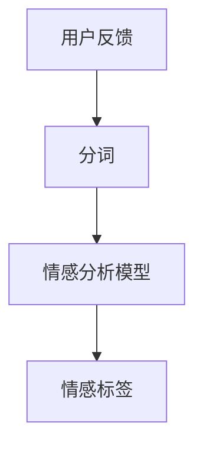
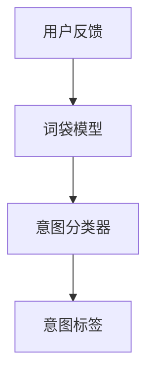
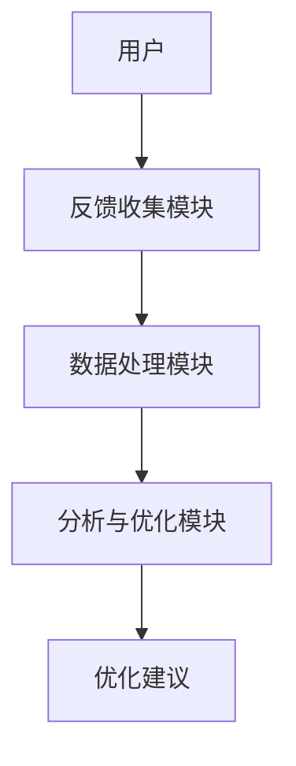

                 


# 用户反馈分析：从用户视角优化AI Agent

## 关键词：用户反馈分析、AI Agent优化、自然语言处理、情感分析、意图识别、系统架构设计

## 摘要：用户反馈分析是优化AI Agent的重要环节。本文从用户视角出发，系统地介绍用户反馈的收集、分析方法，探讨如何通过反馈优化AI Agent的性能和交互体验。结合情感分析和意图识别等技术，本文详细讲解了算法原理和系统架构设计，并通过实战案例展示如何将理论应用于实践。

---

# 目录

1. **用户反馈分析概述**
   - 1.1 AI Agent的基本概念
   - 1.2 用户反馈的重要性
   - 1.3 反馈分析的核心挑战

2. **用户反馈的收集与预处理**
   - 2.1 数据收集渠道
   - 2.2 数据清洗方法
   - 2.3 反馈分类与编码

3. **用户反馈分析的核心算法**
   - 3.1 情感分析算法
     - 3.1.1 情感分析流程图
     - 3.1.2 情感分析的数学模型
   - 3.2 意图识别算法
     - 3.2.1 意图识别流程图
     - 3.2.2 意图识别的数学模型

4. **系统架构与设计**
   - 4.1 系统功能模块
     - 4.1.1 用户反馈收集模块
     - 4.1.2 数据处理模块
     - 4.1.3 分析与优化模块
   - 4.2 系统架构图
     - 使用Mermaid绘制系统架构图
   - 4.3 接口设计与交互流程

5. **项目实战：构建用户反馈分析系统**
   - 5.1 项目环境与工具安装
   - 5.2 系统核心实现
     - 5.2.1 环境配置代码
     - 5.2.2 数据处理代码
     - 5.2.3 分析与优化代码
   - 5.3 实际案例分析
   - 5.4 项目总结与优化建议

6. **总结与展望**
   - 6.1 核心要点总结
   - 6.2 未来发展方向
   - 6.3 最佳实践 tips

---

## 正文

### 第1章：用户反馈分析概述

#### 1.1 AI Agent的基本概念
AI Agent（人工智能代理）是指能够感知环境并采取行动以实现目标的智能系统。AI Agent广泛应用于智能助手、推荐系统、聊天机器人等领域。用户反馈是优化AI Agent的重要数据来源，通过分析用户反馈，可以提升AI Agent的性能和用户体验。

#### 1.2 用户反馈的重要性
用户反馈是用户对AI Agent输出或行为的直接评价，反映了用户的需求、偏好和满意度。有效的反馈分析可以帮助开发者识别问题、优化算法、提升交互体验。

#### 1.3 反馈分析的核心挑战
反馈分析的挑战包括数据的多样性和噪声、情感表达的复杂性、意图识别的准确性等。此外，如何高效处理大规模反馈数据也是关键问题。

### 第2章：用户反馈的收集与预处理

#### 2.1 数据收集渠道
用户反馈可以通过多种渠道收集，如在线表单、聊天记录、社交媒体评论等。选择合适的收集渠道可以提高数据的代表性和准确性。

#### 2.2 数据清洗方法
数据清洗是反馈分析的重要步骤，包括去除噪声、填补缺失值、处理重复数据等。有效的数据清洗可以提高后续分析的准确性。

#### 2.3 反馈分类与编码
将用户反馈进行分类和编码，有助于后续的数据分析和模型训练。常见的分类方法包括情感分类和意图分类。

### 第3章：用户反馈分析的核心算法

#### 3.1 情感分析算法
##### 3.1.1 情感分析流程图


##### 3.1.2 情感分析的数学模型
情感分析通常使用概率模型，如贝叶斯分类器。模型计算每个情感类别（如正面、负面）的概率，并选择概率最大的类别作为结果。数学公式如下：
$$ P(\text{positive} | \text{words}) = \frac{P(\text{words} | \text{positive}) \cdot P(\text{positive})}{P(\text{words})} $$

#### 3.2 意图识别算法
##### 3.2.1 意图识别流程图


##### 3.2.2 意图识别的数学模型
意图识别通常使用分类算法，如支持向量机（SVM）或神经网络。模型通过学习用户反馈的特征，预测其意图。数学公式如下：
$$ f(x) = \text{argmax}_y y \cdot x + b $$

### 第4章：系统架构与设计

#### 4.1 系统功能模块
- **用户反馈收集模块**：负责收集用户反馈数据。
- **数据处理模块**：对反馈数据进行清洗和预处理。
- **分析与优化模块**：使用情感分析和意图识别算法，生成优化建议。

#### 4.2 系统架构图


#### 4.3 接口设计与交互流程
系统需要设计清晰的接口，确保各模块之间的高效交互。例如，反馈收集模块将数据传递给数据处理模块，处理后的数据传递给分析模块，最终生成优化建议。

### 第5章：项目实战：构建用户反馈分析系统

#### 5.1 项目环境与工具安装
- **工具安装**：
  ```bash
  pip install numpy pandas scikit-learn spacy
  ```

#### 5.2 系统核心实现
- **环境配置代码**：
  ```python
  import numpy as np
  import pandas as pd
  from sklearn.feature_extraction.text import TfidfVectorizer
  from sklearn.svm import SVC
  ```

- **数据处理代码**：
  ```python
  def preprocess(text):
      # 分词和预处理
      return text.lower().split()
  ```

- **分析与优化代码**：
  ```python
  vectorizer = TfidfVectorizer(preprocessor=preprocess)
  model = SVC()
  model.fit(vectorizer.fit_transform(train_texts), train_labels)
  ```

#### 5.3 实际案例分析
通过一个实际案例，展示如何从用户反馈中提取情感和意图，并优化AI Agent的性能。例如，分析用户对聊天机器人回复的反馈，调整回复策略以提高用户满意度。

#### 5.4 项目总结与优化建议
总结项目实现的关键步骤，提出优化建议，如使用更先进的算法、增加反馈数据的多样性等。

### 第6章：总结与展望

#### 6.1 核心要点总结
用户反馈分析是优化AI Agent的重要手段，涉及数据处理、算法选择和系统设计等多个方面。

#### 6.2 未来发展方向
未来可以探索更高效的情感分析算法，结合深度学习技术，提升意图识别的准确性。

#### 6.3 最佳实践 tips
- 定期收集和分析用户反馈，及时优化AI Agent。
- 使用可视化工具展示反馈分析结果，帮助团队更好地理解用户需求。

---

通过以上步骤，我们可以系统地优化AI Agent，提升用户体验。希望本文能为读者提供有价值的参考和启发。

