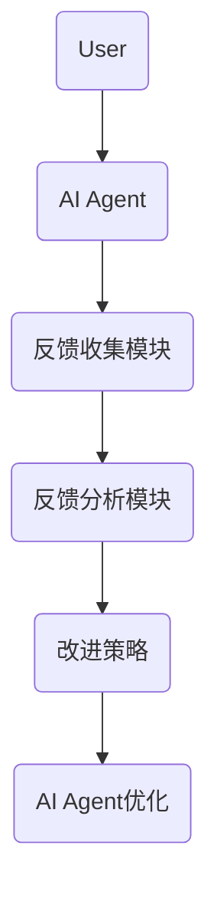
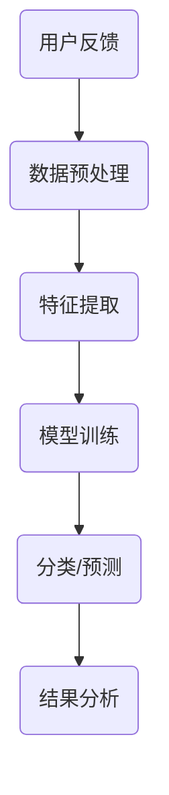
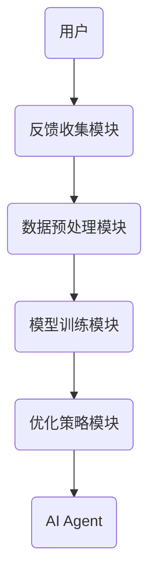

                 


# 用户反馈收集：迭代改进AI Agent

> 关键词：用户反馈、AI Agent、迭代改进、系统设计、算法原理、项目实战

> 摘要：本文详细探讨了用户反馈在AI Agent迭代改进中的重要性、核心概念、算法原理、系统设计以及项目实战。通过系统化的分析和具体案例，展示了如何通过用户反馈优化AI Agent的性能和用户体验。

---

## 第一章: 用户反馈收集与AI Agent概述

### 1.1 用户反馈收集的重要性

#### 1.1.1 问题背景与挑战
随着AI Agent在各个领域的广泛应用，用户与AI Agent的交互日益频繁。然而，AI Agent在实际应用中可能会出现理解错误、响应延迟或不符合用户期望的问题。这些问题的根本原因在于AI Agent无法充分理解用户的真实需求和反馈。因此，如何有效收集和分析用户反馈，成为提升AI Agent性能的关键。

#### 1.1.2 用户反馈在AI Agent中的作用
用户反馈是AI Agent改进的核心输入。通过收集用户的反馈，AI Agent可以不断优化其行为模式、提升响应准确性和改善用户体验。用户反馈可以分为显性反馈（如评分、评价）和隐性反馈（如行为日志）。显性反馈直接表达了用户的主观意见，而隐性反馈则反映了用户的实际需求和偏好。

#### 1.1.3 迭代改进的核心价值
迭代改进是一种通过持续收集反馈、分析问题、实施优化并验证效果的循环过程。AI Agent的迭代改进依赖于用户反馈的实时输入，通过逐步优化模型和算法，使AI Agent更加智能化和人性化。

### 1.2 AI Agent的基本概念

#### 1.2.1 AI Agent的定义与分类
AI Agent是一种能够感知环境并采取行动以实现目标的智能实体。它可以分为简单反射型、基于模型的反射型、目标驱动型和效用驱动型等类型。AI Agent的核心功能包括感知、决策和执行。

#### 1.2.2 用户反馈的类型与特点
用户反馈可以分为以下几类：
- **显性反馈**：用户主动提供的评价、评分或建议。
- **隐性反馈**：通过用户行为（如点击、停留时间）间接反映的反馈。
- **实时反馈**：在用户与AI Agent交互过程中即时收集的反馈。
- **延时反馈**：在用户完成特定任务后收集的反馈。

#### 1.2.3 迭代改进的流程与方法
迭代改进的流程包括：
1. **收集反馈**：通过用户交互或行为日志获取反馈数据。
2. **分析反馈**：使用自然语言处理（NLP）和数据分析技术解析反馈内容。
3. **优化模型**：根据反馈结果调整AI Agent的算法和模型参数。
4. **验证效果**：通过实验或测试验证优化后的AI Agent是否达到预期效果。

### 1.3 用户反馈与AI Agent的关系

#### 1.3.1 用户反馈对AI Agent的影响
用户反馈是AI Agent改进的核心驱动力。通过分析用户反馈，AI Agent可以识别用户需求的变化、发现功能缺陷并优化性能。

#### 1.3.2 迭代改进的必要性
AI Agent的应用场景复杂多变，仅依赖初始设计无法满足所有用户需求。通过迭代改进，AI Agent可以持续适应用户需求的变化，提升用户体验和系统性能。

#### 1.3.3 反馈收集的边界与外延
用户反馈的收集需要在保护用户隐私的前提下进行，同时要避免过度收集和滥用数据。反馈的外延包括用户行为分析、市场调研和竞争对手分析等。

### 1.4 本章小结
本章介绍了用户反馈在AI Agent改进中的重要性，分析了AI Agent的基本概念和用户反馈的类型。通过迭代改进的流程与方法，展示了用户反馈如何推动AI Agent的优化。

---

## 第二章: 用户反馈收集的核心概念与联系

### 2.1 核心概念原理

#### 2.1.1 用户反馈的属性特征对比表

| 属性       | 显性反馈                     | 隐性反馈                     |
|------------|------------------------------|------------------------------|
| 数据来源   | 用户主动提供                 | 用户行为日志                 |
| 数据形式   | 文本、评分                   | 点击、停留时间               |
| 分析难度   | 高                           | 中                           |
| 应用场景   | 用户评价、满意度调查         | 推荐系统、个性化推荐         |

#### 2.1.2 AI Agent改进的实体关系图



#### 2.1.3 反馈循环的数学模型

用户反馈可以表示为一个函数：
$$ f: U \rightarrow R $$
其中，U是用户反馈集合，R是反馈结果（如评分、分类标签）。

### 2.2 反馈分析的流程图



### 2.3 本章小结
本章通过对比分析用户反馈的类型，构建了AI Agent改进的实体关系图，并通过数学模型和流程图展示了反馈分析的核心原理。

---

## 第三章: 用户反馈收集的算法原理

### 3.1 反馈分析的算法选择

#### 3.1.1 机器学习模型的选择
常用的机器学习模型包括：
- 线性回归
- 支持向量机（SVM）
- 随机森林
- 神经网络

#### 3.1.2 自然语言处理技术的应用
自然语言处理（NLP）技术如词嵌入（Word2Vec）、情感分析和句法分析等在用户反馈分析中发挥重要作用。

#### 3.1.3 反馈分类的数学模型
情感分析模型可以表示为：
$$ y = f(x) $$
其中，$x$是输入文本，$y$是情感标签（如正面、负面、中性）。

### 3.2 情感分析算法详解

#### 3.2.1 基于词袋模型的实现
词袋模型将文本表示为词频向量：
$$ x = \{w_1, w_2, \ldots, w_n\} $$

#### 3.2.2 基于深度学习的模型
深度学习模型如LSTM和BERT在情感分析中表现优异：
$$ f(x) = \text{softmax}(Wx + b) $$

### 3.3 反馈分类的实现

#### 3.3.1 数据预处理与特征提取
数据预处理包括分词、去除停用词和词干提取。特征提取可以使用TF-IDF：
$$ \text{TF-IDF}(w, d) = \text{TF}(w, d) \times \text{IDF}(w) $$

#### 3.3.2 分类器的训练与优化
训练过程包括：
1. 数据分割（训练集、验证集、测试集）。
2. 模型训练。
3. 模型调优（如交叉验证）。

### 3.4 本章小结
本章详细讲解了用户反馈分析的算法原理，包括情感分析和分类器的实现。

---

## 第四章: 用户反馈收集的系统分析与架构设计

### 4.1 系统功能设计

#### 4.1.1 用户反馈的收集模块
用户反馈收集模块负责接收用户输入，包括文本、评分和行为数据。

#### 4.1.2 反馈分析的处理模块
处理模块对收集到的反馈进行预处理、特征提取和模型训练。

#### 4.1.3 迭代改进的执行模块
执行模块根据分析结果优化AI Agent的行为模式。

### 4.2 系统架构设计



### 4.3 本章小结
本章通过系统功能设计和架构图展示了用户反馈收集的整体流程和模块关系。

---

## 第五章: 用户反馈收集的项目实战

### 5.1 项目环境安装

#### 5.1.1 开发工具的安装与配置
- Python 3.8+
- Jupyter Notebook
- Scikit-learn、NLTK等库。

#### 5.1.2 数据集的准备与预处理
数据集包括用户评价文本和标签（如正面、负面）。

#### 5.1.3 模型训练环境的配置
使用Jupyter Notebook安装必要的库：
```bash
pip install scikit-learn nltk
```

### 5.2 项目核心实现

#### 5.2.1 数据预处理代码
```python
from sklearn.feature_extraction.text import TfidfVectorizer
from sklearn.model_selection import train_test_split
from sklearn.metrics import accuracy_score
from sklearn.svm import SVC

# 示例数据
texts = ["I love this product!", "It's terrible."]
labels = [1, 0]

# 特征提取
vectorizer = TfidfVectorizer()
X = vectorizer.fit_transform(texts)

# 数据分割
X_train, X_test, y_train, y_test = train_test_split(X, labels, test_size=0.2)

# 模型训练
model = SVC()
model.fit(X_train, y_train)

# 模型验证
y_pred = model.predict(X_test)
print("Accuracy:", accuracy_score(y_test, y_pred))
```

#### 5.2.2 模型训练代码
通过上述代码，读者可以实现一个简单的用户反馈分类模型。

### 5.3 本章小结
本章通过具体案例展示了用户反馈收集的实现过程，包括环境配置、数据预处理和模型训练。

---

## 第六章: 总结与展望

### 6.1 总结
用户反馈是AI Agent迭代改进的核心驱动力。通过有效的反馈收集和分析，AI Agent可以不断提升其性能和用户体验。

### 6.2 展望
未来，随着AI技术的进步，用户反馈的收集和分析将更加智能化和自动化。通过结合边缘计算和联邦学习，AI Agent可以实现更高效、更安全的反馈收集与优化。

### 6.3 最佳实践 tips
- 定期收集用户反馈，保持AI Agent的优化频率。
- 使用多种反馈类型，全面了解用户需求。
- 保护用户隐私，确保数据安全。

---

## 附录: 工具与资源

### 附录A: 开发工具列表
- Python
- Jupyter Notebook
- Scikit-learn
- NLTK

### 附录B: 数据格式与接口
- 数据格式：JSON、CSV
- 接口：RESTful API

### 附录C: 术语表
- AI Agent：人工智能代理
- 用户反馈：用户对AI Agent的评价和行为数据

---

以上是《用户反馈收集：迭代改进AI Agent》的技术博客文章的完整目录和内容框架。通过系统的分析和具体的案例，展示了用户反馈在AI Agent改进中的重要性和实现方法。

