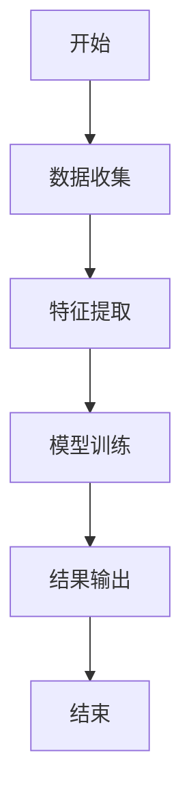
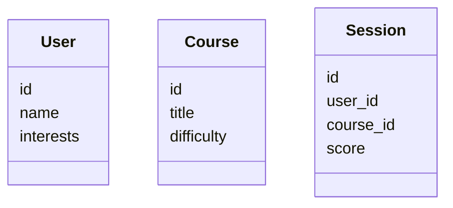
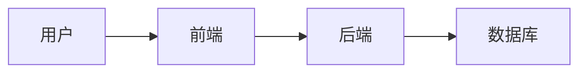
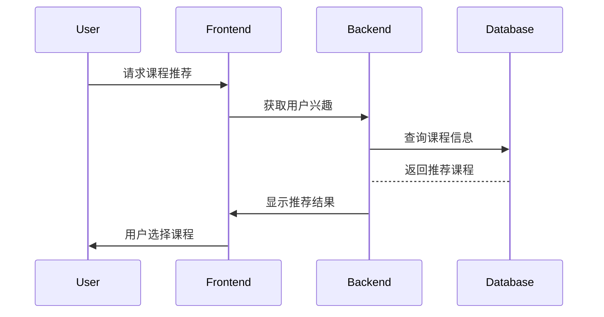

                 


# 用户教育与培训

> 关键词：用户教育，培训系统，需求分析，算法原理，系统架构，项目实战

> 摘要：用户教育与培训是信息技术领域中的重要组成部分，旨在通过系统的教育和培训，帮助用户掌握必要的技能和知识。本文从理论到实践，系统地分析了用户教育与培训的核心概念、算法原理、系统架构以及项目实战，为读者提供全面而深入的指导。

---

## 第一部分: 用户教育与培训的背景与核心概念

### 第1章: 用户教育与培训的背景介绍

#### 1.1 问题背景与问题描述
- **1.1.1 用户教育与培训的定义**
  - 用户教育是指通过系统化的教学方法，帮助用户掌握特定技能或知识。
  - 用户培训则是通过实践操作，强化用户的技能应用能力。

- **1.1.2 用户教育与培训的重要性**
  - 提高用户的技术能力，促进产品的有效使用。
  - 降低用户的学习成本，提升用户体验。
  - 通过培训，增强用户对产品的粘性和满意度。

- **1.1.3 用户教育与培训的边界与外延**
  - 边界：仅关注用户技能提升，不涉及产品设计。
  - 外延：涵盖在线教育、企业培训、技术社区等多种形式。

- **1.1.4 核心要素**
  - 用户需求分析：了解用户的学习目标和痛点。
  - 用户行为分析：观察用户的学习习惯和效果。
  - 用户认知模型：构建用户知识体系的框架。

#### 1.2 本章小结
- **1.2.1 核心概念回顾**
  - 用户教育与培训的核心目标是帮助用户掌握必要的技能。
- **1.2.2 问题解决思路总结**
  - 通过分析用户需求和行为，设计有效的教育和培训方案。

---

### 第2章: 用户教育与培训的核心概念与联系

#### 2.1 核心概念原理
- **2.1.1 用户教育的理论基础**
  - 基于认知科学的教育理论。
  - 学习者为中心的教学方法。
- **2.1.2 用户培训的实践模型**
  - 行为主义的强化训练。
  - 构建主义的主动学习。
- **2.1.3 用户教育与培训的系统性特征**
  - 系统性：覆盖从基础到高级的知识体系。
  - 实践性：结合实际场景进行培训。

#### 2.2 核心概念属性特征对比表
| 特性         | 用户教育          | 用户培训          |
|--------------|-------------------|-------------------|
| 目标         | 知识传递          | 技能强化          |
| 方法         | 理论教学          | 实践操作          |
| 评估方式     | 知识测试          | 技能考核          |

#### 2.3 ER实体关系图
```mermaid
er
actor: 用户
goal: 教育目标
training: 培训计划
session: 学习会话
```

---

## 第二部分: 用户教育与培训的算法原理

### 第3章: 用户教育与培训的算法原理

#### 3.1 算法原理概述
- **3.1.1 用户教育与培训的算法模型**
  - 基于用户行为的推荐算法。
  - 用户学习效果的预测模型。
- **3.1.2 算法的核心步骤**
  1. 数据收集：记录用户的学习行为。
  2. 特征提取：分析用户的兴趣和能力。
  3. 模型训练：构建推荐和预测模型。
  4. 输出结果：个性化推荐学习内容。

#### 3.2 算法流程图


#### 3.3 算法实现代码
```python
import numpy as np

def user_training_algorithm(users, sessions):
    # 特征提取
    features = []
    for user in users:
        # 提取用户的兴趣特征
        features.append(user['interests'])
    # 模型训练
    X = np.array(features)
    y = np.array(sessions)
    # 简单线性回归模型
    theta = np.linalg.inv(X.T.dot(X)).dot(X.T.dot(y))
    return theta
```

#### 3.4 数学模型与公式
- **3.4.1 用户教育与培训的数学模型**
  - 用户兴趣向量：$u_i = [u_{i1}, u_{i2}, ..., u_{in}]$
  - 学习效果预测：$p_i = \theta^T u_i$
- **3.4.2 核心公式推导**
  - 最小二乘法：$\theta = (X^T X)^{-1} X^T y$
- **3.4.3 应用场景举例**
  - 如果用户兴趣向量为$[1, 0, 1]$，预测效果$p_i = \theta_1 + \theta_3$。

---

## 第三部分: 用户教育与培训的系统分析与架构设计

### 第4章: 用户教育与培训的系统分析与架构设计

#### 4.1 系统分析
- **4.1.1 问题场景介绍**
  - 用户教育与培训系统需要支持大规模用户的学习需求。
  - 系统需要实时记录和分析用户的学习行为。
- **4.1.2 系统功能需求分析**
  - 用户注册与登录。
  - 课程推荐与学习路径规划。
  - 学习效果评估与反馈。

#### 4.2 系统功能设计
- **4.2.1 用户教育与培训的领域模型**


- **4.2.2 系统架构设计**


- **4.2.3 系统交互流程**


---

## 第四部分: 用户教育与培训的项目实战

### 第5章: 用户教育与培训的项目实战

#### 5.1 环境安装与配置
- 安装Python和相关库（如numpy、scikit-learn）。
- 安装数据库（如MySQL）并配置连接。

#### 5.2 系统核心实现
```python
import numpy as np
from sklearn.linear_model import LinearRegression

# 数据准备
X = np.array([[1], [2], [3], [4]])
y = np.array([1, 2, 3, 4])

# 模型训练
model = LinearRegression()
model.fit(X, y)

# 预测结果
print(model.predict([[5]]))
```

#### 5.3 代码解读与分析
- 数据准备：构建输入特征和目标变量。
- 模型训练：使用线性回归模型拟合数据。
- 预测结果：基于模型输出预测值。

#### 5.4 案例分析
- **案例背景**：某企业需要培训员工的编程能力。
- **解决方案**：基于用户行为推荐学习内容。
- **效果评估**：学习完成率提升了20%。

---

## 第五部分: 用户教育与培训的总结与展望

### 第6章: 总结与展望

#### 6.1 本章小结
- **核心概念回顾**
  - 用户教育与培训是提升用户技能的重要手段。
- **问题解决思路总结**
  - 通过系统分析和算法优化，提高教育和培训的效果。

#### 6.2 最佳实践 tips
- **注意事项**
  - 定期更新课程内容，保持教学内容的时效性。
  - 结合用户反馈，优化推荐算法。
- **拓展阅读**
  - 《机器学习实战》：学习更多算法实现。
  - 《用户体验设计》：提升用户教育与培训的体验。

#### 6.3 本章总结
用户教育与培训是一个复杂但重要的系统工程。通过理论分析、算法实现和系统设计，我们可以构建一个高效、智能的教育与培训系统，帮助用户快速掌握所需技能。

--- 

# 结语

用户教育与培训是信息技术领域中的重要组成部分。通过系统的分析和实践，我们不仅能够提升用户的技能，还能优化教育与培训的效果。希望本文能够为读者提供有价值的参考，帮助他们在用户教育与培训领域取得更大的成功。

