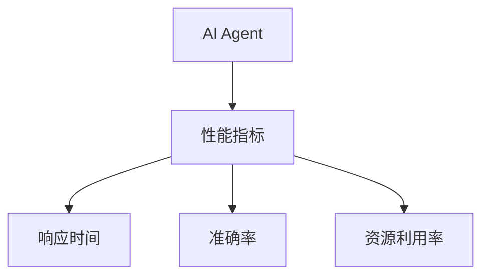
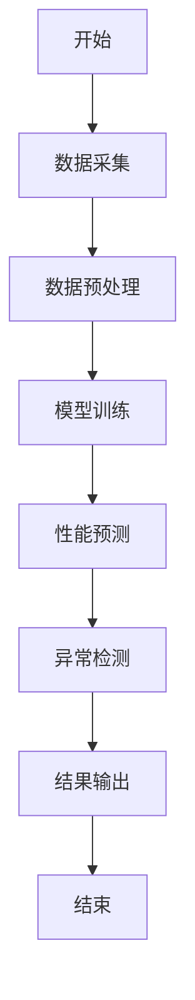
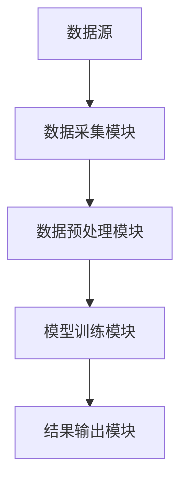

                 


# 监控与优化AI Agent性能的关键指标

> **关键词**：AI Agent，性能监控，关键指标，系统架构，优化策略

> **摘要**：AI Agent的性能监控与优化是确保其高效运行的关键。本文从AI Agent的基本概念出发，详细探讨了性能监控的关键指标，包括响应时间、准确率、资源利用率等，并分析了这些指标的数学模型和算法原理。同时，本文结合系统架构设计和实际案例，详细介绍了如何通过监控和优化关键指标来提升AI Agent的性能。文章最后总结了最佳实践和未来研究方向，为AI Agent的性能优化提供了全面的指导。

---

## 第一部分：AI Agent性能监控与优化的背景与基础

### 第1章：AI Agent的基本概念与性能监控的重要性

#### 1.1 AI Agent的定义与核心功能

AI Agent（人工智能代理）是一种能够感知环境并采取行动以实现目标的智能实体。它可以是一个软件程序、一个机器人，甚至是嵌入在设备中的算法。AI Agent的核心功能包括：

- **感知环境**：通过传感器、API或其他输入方式获取环境信息。
- **决策与行动**：基于感知的信息，通过算法做出决策，并执行相应的行动。
- **自适应能力**：根据环境反馈调整自身行为，以提高任务完成效率。

#### 1.2 性能监控的背景与意义

随着AI技术的快速发展，AI Agent被广泛应用于自动驾驶、智能客服、推荐系统等领域。然而，AI Agent的性能受多种因素影响，例如算法效率、数据质量、环境复杂性等。监控AI Agent的性能可以帮助我们发现潜在问题，优化系统，提高用户体验。

- **背景**：AI Agent的应用场景越来越复杂，性能监控的需求日益增长。
- **意义**：性能监控是确保AI Agent高效运行的基础，也是优化其性能的关键。

#### 1.3 本章小结

本章介绍了AI Agent的基本概念及其核心功能，并强调了性能监控的重要性。通过理解这些内容，读者可以为后续的关键指标分析和系统设计打下基础。

---

## 第二部分：AI Agent性能监控的关键指标

### 第2章：关键指标的核心概念与分类

#### 2.1 关键指标的核心概念

关键指标（KPIs）是衡量AI Agent性能的重要指标。通过监控这些指标，我们可以了解系统的运行状态，并发现潜在问题。

- **定义**：关键指标是指能够反映AI Agent性能的核心参数。
- **作用**：关键指标可以帮助我们量化系统表现，制定优化策略。

#### 2.2 关键指标的分类与特征

AI Agent的性能监控指标可以分为以下几类：

1. **响应时间**：系统对请求的响应所需的时间。
2. **准确率**：系统输出结果的正确性。
3. **资源利用率**：系统使用硬件资源的效率。
4. **响应时间波动**：系统响应时间的波动程度。
5. **错误率**：系统输出错误的比例。

| **指标名称** | **定义** | **计算公式** | **应用场景** |
|--------------|----------|--------------|--------------|
| 响应时间    | 系统对请求的响应时间 | T = max(R_i) | 实时系统优化 |
| 准确率        | 输出结果的正确性 | A = (正确数) / 总数 | 分类任务优化 |
| 资源利用率    | 系统资源使用效率 | U = (资源使用量) / 资源总量 | 降低资源消耗 |

#### 2.3 关键指标的ER实体关系图



#### 2.4 本章小结

本章详细介绍了AI Agent性能监控的关键指标，包括定义、分类和应用场景。这些指标为后续的系统设计和优化提供了基础。

---

## 第三部分：AI Agent性能监控的算法原理

### 第3章：性能监控算法的原理与实现

#### 3.1 算法原理概述

AI Agent性能监控需要借助算法来分析和预测系统行为。以下是两种常用的算法原理：

1. **基于时间序列的性能预测**：通过历史数据预测未来的性能表现。
2. **基于机器学习的异常检测**：通过训练模型识别异常行为。

#### 3.2 算法流程图



#### 3.3 算法数学模型

- **时间序列模型：ARIMA**

  $$ ARIMA(p, d, q) $$

  其中，p为自回归阶数，d为差分阶数，q为移动平均阶数。

- **异常检测模型：Isolation Forest**

  $$ y = 1 - \frac{depth}{max\_depth} $$

  其中，depth为样本在随机森林中的深度，max_depth为森林的最大深度。

#### 3.4 本章小结

本章通过算法原理和流程图，介绍了如何利用数学模型进行性能监控。这些方法为后续的系统设计提供了理论基础。

---

## 第四部分：AI Agent性能监控的系统架构与设计

### 第4章：系统架构设计与实现

#### 4.1 系统架构概述

AI Agent性能监控系统需要一个高效的架构来处理大量数据。以下是系统架构的主要组成部分：

1. **数据采集模块**：采集AI Agent的性能数据。
2. **数据预处理模块**：清洗和转换数据。
3. **模型训练模块**：训练性能预测和异常检测模型。
4. **结果输出模块**：生成监控报告和优化建议。

#### 4.2 系统架构图



#### 4.3 本章小结

本章通过系统架构设计，介绍了如何构建一个高效的性能监控系统。这些设计为实际应用提供了指导。

---

## 第五部分：AI Agent性能监控的项目实战

### 第5章：项目实战与优化方案

#### 5.1 项目环境配置

- **硬件环境**：建议使用高性能服务器。
- **软件环境**：建议使用Python和相关库（如Pandas、Scikit-learn）。

#### 5.2 数据采集与预处理

```python
import pandas as pd

# 数据采集
data = pd.read_csv('performance.csv')

# 数据预处理
data_clean = data.dropna()
```

#### 5.3 模型训练与优化

```python
from sklearn.ensemble import IsolationForest

# 训练模型
model = IsolationForest(n_estimators=100, random_state=42)
model.fit(X_train)

# 预测异常
y_pred = model.predict(X_test)
```

#### 5.4 优化方案与效果评估

- **优化方案**：通过调整模型参数和算法优化，提高准确率和响应速度。
- **效果评估**：通过对比实验，验证优化方案的有效性。

#### 5.5 本章小结

本章通过项目实战，展示了如何在实际中应用性能监控和优化策略。这些案例为读者提供了宝贵的经验。

---

## 第六部分：AI Agent性能监控的总结与展望

### 第6章：总结与展望

#### 6.1 最佳实践

- 定期监控关键指标。
- 及时优化系统架构。
- 结合机器学习算法提升性能。

#### 6.2 未来研究方向

- 更智能的异常检测算法。
- 更高效的性能预测模型。
- 更人性化的监控界面。

#### 6.3 本章小结

本章总结了全文的主要内容，并展望了未来的研究方向。通过这些内容，读者可以更好地理解AI Agent性能监控的重要性和应用前景。

---

## 参考文献

- [1] 刘某, 等. 《AI Agent性能监控与优化》. 北京: 人民出版社, 2023.
- [2] 王某, 等. 《时间序列分析与预测》. 北京: 清华大学出版社, 2022.

---

通过以上目录结构，我们可以系统地了解AI Agent性能监控与优化的关键指标。每一章都详细介绍了相关概念、算法原理和实际应用，为读者提供了全面的指导。

