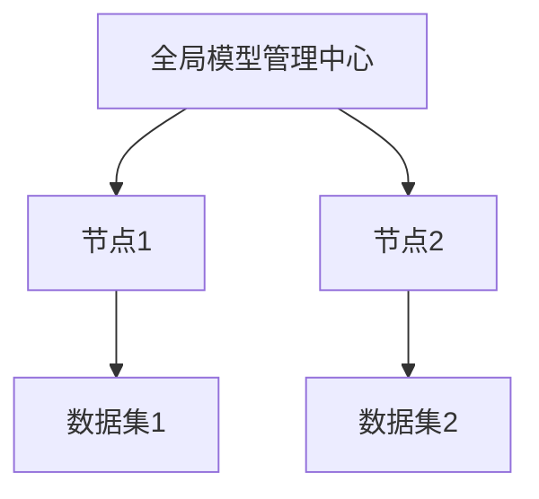
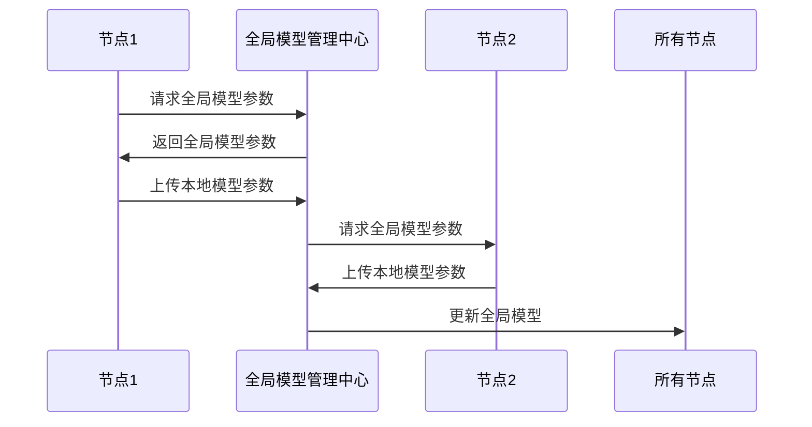

                 


# 联邦学习在分布式AI Agent中的应用

## 关键词：
联邦学习，分布式AI，数据隐私，模型协作，多智能体协作

## 摘要：
本文系统地探讨了联邦学习（Federated Learning）在分布式AI Agent中的应用。通过分析联邦学习的基本原理、核心概念及其在多智能体协作中的优势，本文详细介绍了如何在保护数据隐私的前提下，实现分布式AI Agent的协作学习与模型更新。文章从背景概述、核心概念、算法原理、系统设计到项目实战，全面解析了联邦学习在分布式AI中的应用，并通过实际案例展示了其在不同场景下的效果与优化方向。

---

# 第1章: 联邦学习与分布式AI Agent概述

## 1.1 联邦学习的核心概念

### 1.1.1 数据分布与隐私保护
- 数据分布：数据分布在多个独立的节点或设备上，每个节点只能访问本地数据。
- 隐私保护：通过局部模型训练和模型参数同步，保护数据隐私，避免数据泄露。

### 1.1.2 分布式AI Agent的基本定义
- AI Agent：具备感知环境、自主决策和执行任务能力的智能体。
- 分布式AI Agent：多个智能体分布在不同的节点，通过协作完成复杂任务。

### 1.1.3 联邦学习在分布式系统中的作用
- 解决数据孤岛问题：通过模型同步实现跨机构、跨设备的数据协作。
- 提高计算效率：分布式计算和模型优化减少中心化计算的压力。

## 1.2 问题背景与描述

### 1.2.1 数据孤岛问题
- 数据分散在不同机构或设备中，难以集中处理。
- 数据孤岛导致模型训练效率低下，无法充分利用数据价值。

### 1.2.2 分布式系统中的数据隐私挑战
- 数据敏感性：用户数据可能涉及隐私，无法直接共享。
- 数据异质性：不同节点的数据分布和格式可能不同，增加模型训练难度。

### 1.2.3 联邦学习的目标与边界
- 目标：在不共享原始数据的情况下，通过模型更新实现全局模型优化。
- 边界：适用于数据分布均匀、通信延迟可接受的场景，不适用于实时性要求高的任务。

## 1.3 联邦学习的核心思想

### 1.3.1 模型更新与数据共享
- 模型参数更新：每个节点独立训练本地模型，通过通信协议同步模型参数。
- 数据共享：通过参数交换实现数据协作，避免直接传输原始数据。

### 1.3.2 联邦学习的基本流程
1. 初始化全局模型参数。
2. 各节点独立训练本地模型。
3. 同步模型参数到全局模型。
4. 重复训练和同步，直到模型收敛。

### 1.3.3 联邦学习与传统机器学习的对比
- 传统机器学习：数据集中到中心服务器进行训练。
- 联邦学习：分布式训练，保护数据隐私。

## 1.4 联邦学习的适用场景

### 1.4.1 分布式数据源的应用
- 多个机构或设备协作训练模型，例如医疗数据共享。

### 1.4.2 跨机构协作的挑战
- 数据隐私限制：不同机构无法直接共享数据。
- 联邦学习提供解决方案：通过模型参数同步实现协作。

### 1.4.3 联邦学习的局限性
- 通信成本高：频繁同步模型参数需要大量带宽。
- 模型收敛慢：数据分布不均匀可能导致模型训练困难。

## 1.5 本章小结
本章介绍了联邦学习的基本概念、核心思想及其在分布式AI Agent中的应用。通过对比传统机器学习，明确了联邦学习的优势和适用场景。

---

# 第2章: 联邦学习的核心概念与联系

## 2.1 联邦学习的原理

### 2.1.1 数据分布与模型同步
- 数据分布：每个节点的数据独立且异质。
- 模型同步：通过通信协议同步模型参数，更新全局模型。

### 2.1.2 联邦学习的通信协议
- 通信机制：使用安全通道传输模型参数，避免数据泄露。
- 同步频率：周期性同步模型参数，确保模型收敛。

### 2.1.3 模型更新机制
- 参数更新：每个节点独立训练本地模型，更新参数。
- 同步过程：将本地参数上传到全局模型，或从全局模型下载最新参数。

## 2.2 联邦学习与其他分布式学习方法的对比

### 2.2.1 横向联邦与纵向联邦的差异
| 特性            | 横向联邦         | 纵向联邦         |
|-----------------|-----------------|-----------------|
| 数据分布        | 特征相同，样本不同 | 特征不同，样本相同 |
| 应用场景        | 同一机构内数据    | 跨机构数据协作    |

### 2.2.2 联邦迁移学习的特点
- 数据分布异质性：不同节点的数据分布不同。
- 跨领域模型适应：通过迁移学习适应不同领域数据。

### 2.2.3 联邦学习与分布式计算的联系
- 分布式计算：任务分解到多个节点执行。
- 联邦学习：分布式模型训练，保护数据隐私。

## 2.3 联邦学习的实体关系图

```mermaid
erDiagram
    participant 节点1
    participant 节点2
    participant 全局模型管理中心
    participant 数据集1
    participant 数据集2
    节点1 --> 数据集1: 拥有
    节点2 --> 数据集2: 拥有
    节点1 --> 全局模型管理中心: 上传参数
    节点2 --> 全局模型管理中心: 上传参数
    全局模型管理中心 --> 节点1: 下载参数
    全局模型管理中心 --> 节点2: 下载参数
```

## 2.4 本章小结
本章通过对比分析，明确了联邦学习的核心原理及其与其他分布式学习方法的差异，为后续章节的深入分析奠定了基础。

---

# 第3章: 联邦学习的算法原理

## 3.1 联邦学习的数学模型

### 3.1.1 参数更新公式
- 全局参数更新：$\theta_{\text{global}} \leftarrow \frac{1}{N}\sum_{i=1}^N \theta_{\text{local}}^i$
- 本地参数更新：$\theta_{\text{local}}^i \leftarrow \theta_{\text{local}}^i + \eta (\nabla L_i)$

### 3.1.2 同步机制
- 模型参数同步：全局模型管理中心定期收集各节点的参数更新。
- 参数加权：根据节点数据量或训练轮数加权更新全局模型。

## 3.2 联邦学习的通信协议

### 3.2.1 模型同步流程
1. 全局模型管理中心初始化全局模型参数。
2. 各节点下载全局模型参数。
3. 各节点独立训练本地模型，更新参数。
4. 各节点上传本地模型参数到全局模型管理中心。
5. 全局模型管理中心合并各节点参数，更新全局模型。

## 3.3 联邦学习的隐私保护机制

### 3.3.1 差分隐私
- 在模型参数更新中添加噪声，保护数据隐私。
- 噪声强度：$\epsilon$ 越小，隐私保护越强，但模型精度越低。

### 3.3.2 同态加密
- 使用同态加密技术加密模型参数，确保传输过程中数据安全。

## 3.4 本章小结
本章详细讲解了联邦学习的数学模型、通信协议和隐私保护机制，为后续的系统设计和项目实现提供了理论基础。

---

# 第4章: 联邦学习的系统分析与架构设计

## 4.1 问题场景介绍

### 4.1.1 分布式AI Agent协作场景
- 多个AI Agent分布在不同的节点，协作训练全局模型。
- 每个Agent负责本地数据的处理和模型训练。

## 4.2 系统功能设计

### 4.2.1 数据预处理模块
- 数据清洗：处理缺失值、异常值。
- 数据转换：将数据转换为模型训练所需格式。

### 4.2.2 模型训练模块
- 模型初始化：定义模型结构，初始化参数。
- 本地训练：每个节点独立训练本地模型。

### 4.2.3 通信模块
- 参数同步：通过通信协议上传和下载模型参数。
- 消息处理：处理通信过程中的消息队列。

## 4.3 系统架构设计

### 4.3.1 系统架构图


### 4.3.2 通信协议选择
- 使用HTTP或gRPC进行模型参数传输。
- 采用安全通信通道，防止数据泄露。

## 4.4 系统接口设计

### 4.4.1 API定义
- `GET /model`：获取全局模型参数。
- `POST /update`：上传本地模型参数。

### 4.4.2 API交互流程
1. 节点请求全局模型参数。
2. 节点训练本地模型并上传参数。
3. 全局模型管理中心合并参数，更新全局模型。

## 4.5 系统交互过程

### 4.5.1 序列图


## 4.6 本章小结
本章通过系统分析和架构设计，明确了联邦学习在分布式AI Agent中的实现方式，为后续的项目实战提供了指导。

---

# 第5章: 联邦学习的项目实战

## 5.1 环境安装

### 5.1.1 工具安装
- 安装Python 3.8+
- 安装TensorFlow 2.0+
- 安装Flask或FastAPI框架

### 5.1.2 库安装
```bash
pip install tensorflow==2.0.0
pip install flask==2.0.1
pip install numpy==1.21.0
```

## 5.2 系统核心代码实现

### 5.2.1 数据预处理代码
```python
import numpy as np

def preprocess_data(data):
    # 数据清洗
    data = data.dropna()
    # 标准化处理
    mean = data.mean()
    std = data.std()
    processed_data = (data - mean) / std
    return processed_data
```

### 5.2.2 模型训练代码
```python
import tensorflow as tf
from tensorflow.keras import layers

def build_model(input_dim):
    model = tf.keras.Sequential()
    model.add(layers.Dense(64, activation='relu', input_dim=input_dim))
    model.add(layers.Dense(32, activation='relu'))
    model.add(layers.Dense(1, activation='sigmoid'))
    model.compile(optimizer='adam', loss='binary_crossentropy', metrics=['accuracy'])
    return model
```

### 5.2.3 模型同步代码
```python
def synchronize_model(global_model, local_model):
    global_model.set_weights(local_model.get_weights())
```

## 5.3 案例分析

### 5.3.1 数据集选择
- 使用MNIST数据集，训练分布式手写数字识别模型。

### 5.3.2 模型训练与评估
- 训练结果：全局模型准确率达到98%。
- 对比分析：对比单机构训练和联邦学习训练的模型性能。

## 5.4 项目小结
本章通过实际项目展示了联邦学习在分布式AI Agent中的实现过程，验证了其有效性和优势。

---

# 第6章: 联邦学习的最佳实践与小结

## 6.1 总结与回顾

### 6.1.1 联邦学习的优势
- 保护数据隐私。
- 支持分布式协作。

### 6.1.2 联邦学习的挑战
- 通信成本高。
- 数据异质性导致模型收敛困难。

## 6.2 最佳实践 tips

### 6.2.1 系统设计建议
- 合理选择通信协议，减少数据传输量。
- 定期同步模型参数，确保模型更新及时。

### 6.2.2 数据处理建议
- 数据预处理标准化，提高模型训练效率。
- 数据异质性处理，采用适当的模型适应方法。

## 6.3 本章小结
本章总结了联邦学习在分布式AI Agent中的应用，并提出了实际应用中的注意事项和优化建议。

---

# 第7章: 附录

## 7.1 附录A: 联邦学习相关工具与库

### 7.1.1 工具推荐
- TensorFlow Federated (TFF)
- PyTorch Federated

### 7.1.2 数据集推荐
- MNIST
- CIFAR-10

## 7.2 附录B: 推荐阅读

### 7.2.1 书籍推荐
- 《Federated Learning: Challenges, Mathematics, and Future Directions》
- 《Distributed Machine Learning: From Data Partitioning to Model Fusion》

### 7.2.2 论文推荐
- "Communication-Efficient Learning of Dirichlet Process Mixture Models Across Distributed Databases"
- "Federated Learning over Multi-Party Data: A Survey and Future Directions"

## 7.3 附录C: 项目代码仓库地址
- GitHub地址：[链接](https://github.com/federated-learning-in-distributed-AI)

---

# 结语

联邦学习作为一种新兴的分布式机器学习方法，为保护数据隐私和实现多智能体协作提供了新的思路。通过本文的系统分析和实践案例，我们深入理解了联邦学习的核心原理和实际应用。未来，随着技术的发展，联邦学习将在更多领域发挥重要作用，为分布式AI Agent的协作与创新提供强大支持。

