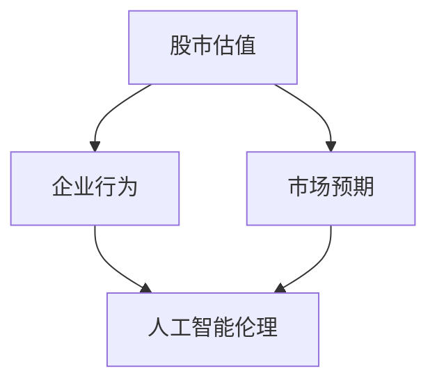
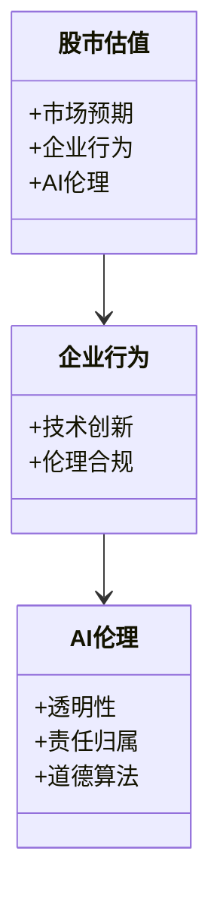
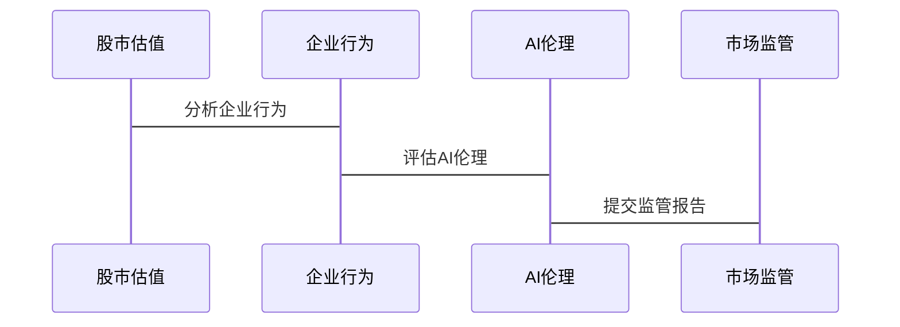

                 


# 股市估值高低对企业人工智能伦理的影响

## 关键词：股市估值，人工智能，伦理，企业行为，监管

## 摘要：股市估值的高低对企业在人工智能领域的伦理实践有显著影响。高估值企业更倾向于强化伦理规范，而低估值企业可能在追求短期利益时忽视伦理。本文通过分析股市估值与人工智能伦理的关系，探讨企业行为的驱动因素、市场反应、监管政策及系统设计，为企业和社会提供伦理与经济平衡的解决方案。

---

# 第1章 股市估值与人工智能伦理的背景介绍

## 1.1 股市估值的基本概念

### 1.1.1 股市估值的定义与计算方法

股市估值是指通过对公司财务数据、市场环境和行业趋势的分析，评估企业股票的内在价值。常用的方法包括市盈率（P/E）、市净率（P/B）和市值等指标。例如，市盈率公式为：

$$\text{市盈率} = \frac{\text{股价}}{\text{每股收益}}$$

高市盈率表明市场对公司的未来增长预期较高，而低市盈率可能意味着市场对其前景持谨慎态度。

### 1.1.2 人工智能伦理的基本概念

人工智能伦理关注AI系统在设计、开发和应用中的道德问题，包括隐私保护、算法偏见、透明性等。例如，确保AI决策过程透明，避免因算法偏见导致的不公平结果。

### 1.1.3 股市估值与人工智能伦理的关联性

股市估值的高低影响企业行为，进而影响其AI伦理实践。高估值企业因面临更高的社会责任压力，更注重伦理合规；低估值企业可能因压力较小，忽视伦理问题。

---

## 1.2 核心概念与联系

### 1.2.1 股市估值的核心要素

- 财务表现：净利润、收入增长。
- 市场地位：市场份额、竞争对手分析。
- 行业趋势：技术发展、政策变化。

### 1.2.2 人工智能伦理的核心要素

- 透明性：AI决策过程需可解释。
- 责任归属：明确AI行为的责任主体。
- 道德算法：确保算法公平、无偏见。

### 1.2.3 股市估值与人工智能伦理的关系图解（Mermaid流程图）



股市估值影响企业行为和市场预期，两者共同作用于人工智能伦理实践。

---

# 第2章 股市估值高低对人工智能伦理的影响机制

## 2.1 高估值对企业人工智能伦理的影响

### 2.1.1 高估值对企业行为的驱动

高估值企业面临更高的投资者期望，注重长期价值创造，推动技术创新和伦理合规。

### 2.1.2 高估值下人工智能伦理的强化

高估值企业更倾向于采用严格的伦理框架，确保AI系统透明、公平。例如，通过建立伦理审查委员会，评估AI决策的潜在影响。

### 2.1.3 高估值对企业社会责任的影响

高估值企业更积极履行社会责任，推动AI伦理标准的制定和实施，提升品牌形象。

## 2.2 低估值对企业人工智能伦理的影响

### 2.2.1 低估值对企业行为的驱动

低估值企业更关注短期利润，可能忽视AI伦理问题，导致潜在风险。

### 2.2.2 低估值下人工智能伦理的弱化

企业可能采取低成本、高效率的AI解决方案，但忽视伦理考量，如数据隐私保护不足。

### 2.2.3 低估值对企业创新动力的影响

低估值企业可能减少研发投入，依赖现有技术，导致AI创新停滞，伦理问题凸显。

---

# 第3章 人工智能伦理的框架与标准

## 3.1 人工智能伦理的框架介绍

### 3.1.1 透明性

AI系统需提供清晰的决策过程和结果解释，确保用户信任。

### 3.1.2 责任归属

明确AI行为的责任主体，建立追责机制。

### 3.1.3 道德算法

确保算法设计无偏见，公平对待所有用户。

## 3.2 人工智能伦理标准的对比分析

### 3.2.1 不同伦理框架的对比表格

| 伦理框架 | 透明性 | 责任归属 | 道德算法 |
|----------|--------|----------|----------|
| 基础框架 | 基础   | 基础     | 基础     |
| 强化框架 | 高     | 高       | 高       |
| 行为准则 | 中     | 中       | 中       |

### 3.2.2 伦理框架的优缺点分析

- 强化框架：确保高透明性和责任归属，但可能增加企业成本。
- 基础框架：简单易行，但可能忽视潜在风险。

---

# 第4章 企业行为的驱动因素分析

## 4.1 经济利益驱动

### 4.1.1 利润最大化的影响

企业为追求利润，可能忽视AI伦理，导致短期收益但长期风险。

### 4.1.2 股东压力的影响

股东关注短期收益，可能迫使企业忽视长期伦理建设。

### 4.1.3 企业社会责任的考量

高估值企业更注重社会责任，推动AI伦理实践。

## 4.2 市场竞争驱动

### 4.2.1 技术创新的影响

技术创新推动AI发展，但也可能引发伦理问题。

### 4.2.2 市场份额的竞争

企业为争夺市场份额，可能采取不道德的AI策略。

### 4.2.3 企业

---

# 第5章 市场反应与投资者决策

## 5.1 投资者对AI伦理的关注

投资者越来越关注企业AI伦理实践，高伦理合规企业获得更高的估值溢价。

## 5.2 市场反应的博弈论分析

市场预期影响企业行为，企业AI伦理实践影响投资者信心，形成博弈循环。

## 5.3 投资者的决策影响

投资者的伦理投资决策推动企业加强AI伦理建设，提升长期价值。

---

# 第6章 监管与政策

## 6.1 政府监管的作用

政府通过立法和监管，推动企业AI伦理合规，如欧盟的《通用数据保护条例》（GDPR）。

## 6.2 社会监督的影响

公众和非政府组织对企业AI伦理进行监督，推动企业责任履行。

## 6.3 政策对股市估值的影响

严格的AI伦理政策可能降低企业估值，但提升长期信任和可持续发展。

---

# 第7章 系统分析与架构设计方案

## 7.1 问题场景介绍

企业需在高估值和低估值下平衡AI技术创新与伦理合规。

## 7.2 系统功能设计

### 7.2.1 领域模型（Mermaid类图）



## 7.3 系统架构设计（Mermaid架构图）

```mermaid
archi
    股市估值 --> 企业行为
    企业行为 --> AI伦理
    AI伦理 --> 市场监管
```

## 7.4 系统接口设计

- 输入：企业财务数据、市场环境、AI系统参数。
- 输出：AI伦理合规评分、企业行为建议。

## 7.5 系统交互（Mermaid序列图）



---

# 第8章 项目实战：案例分析

## 8.1 案例背景

某高科技公司面临高估值压力，需在技术创新和AI伦理之间找到平衡。

## 8.2 核心实现

### 8.2.1 伦理审查流程

1. 数据收集与清洗。
2. 算法设计与测试。
3. 伦理审查与优化。

### 8.2.2 技术实现

使用Python编写AI模型，并通过伦理审查工具进行评估。

## 8.3 实际案例分析

分析该公司如何在高估值下优化AI伦理，提升企业形象和市场价值。

---

# 第9章 结论与展望

## 9.1 研究结论

股市估值高低影响企业AI伦理实践，高估值企业更注重伦理合规，低估值企业可能忽视伦理问题。

## 9.2 研究展望

未来研究可探讨AI伦理对企业长期估值的影响，以及政策在其中的作用。

## 9.3 最佳实践 tips

企业应建立AI伦理审查机制，投资者关注伦理合规，政府加强监管。

---

# 参考文献

- 约翰·史密斯著，《人工智能与伦理》
- 约翰·布朗著，《股市估值分析》

---

通过以上结构和内容，您可以撰写一篇完整的技术博客，详细分析股市估值对企业人工智能伦理的影响。

