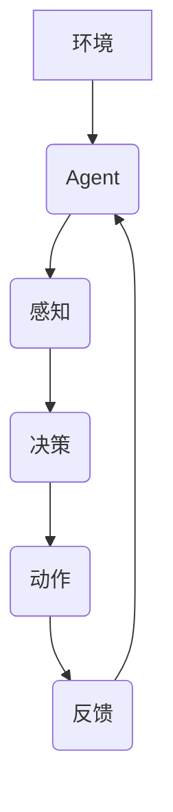
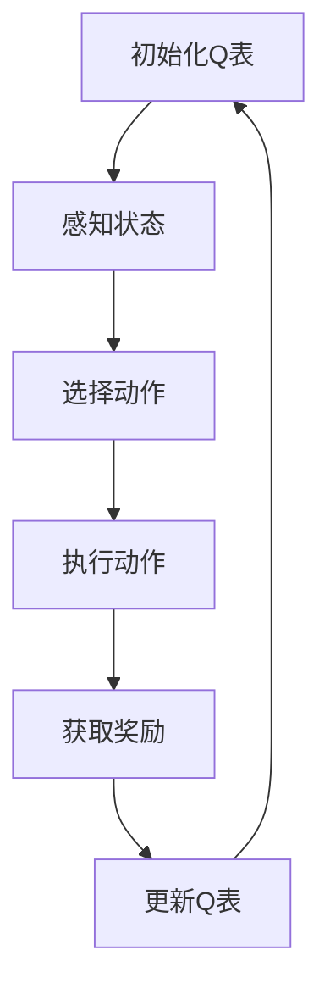
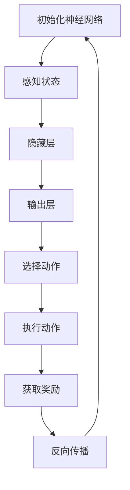
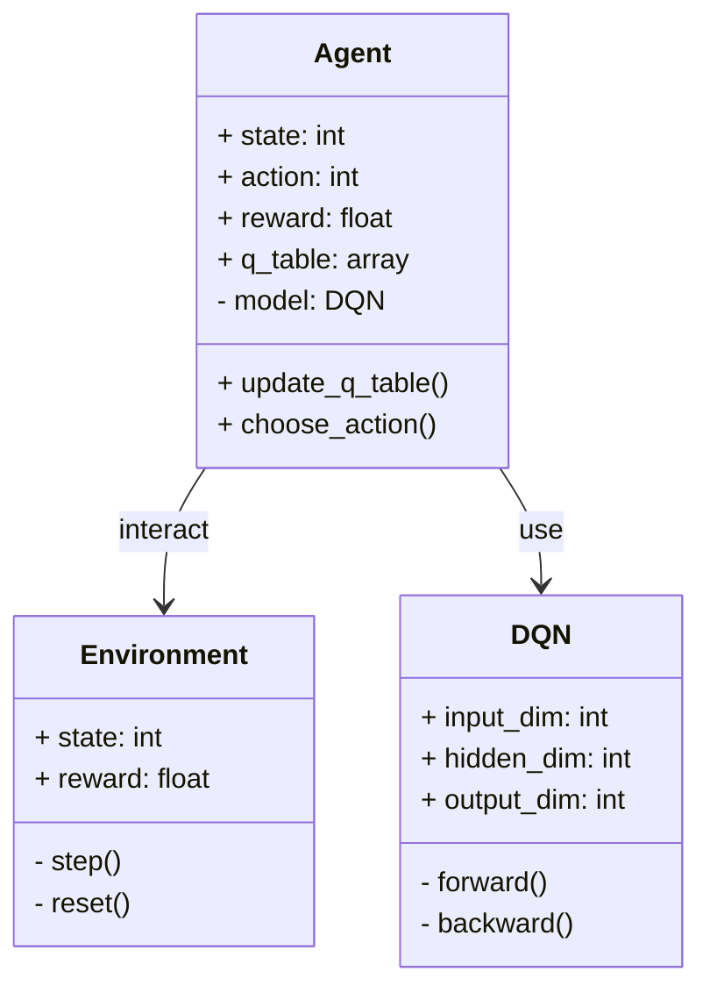
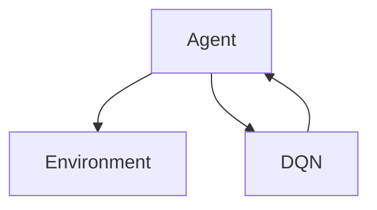
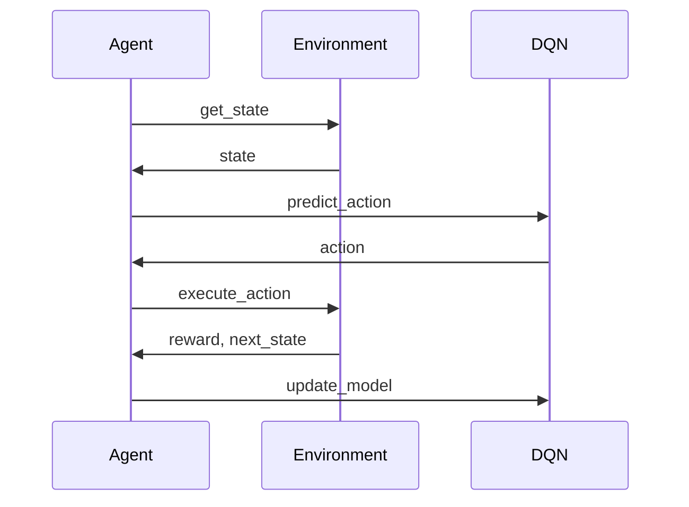

                 


# 自主学习型AI Agent：持续进化的智能体

---

## 关键词
- 自主学习型AI Agent
- 智能体
- 强化学习
- 自适应算法
- 持续进化

---

## 摘要
自主学习型AI Agent是一种能够通过与环境交互、持续学习和自适应进化来实现复杂任务的智能体。本文从其核心概念、算法原理、系统架构到实际应用，全面解析自主学习型AI Agent的设计与实现，探讨其在各领域的潜力与挑战。

---

# 第一章: 自主学习型AI Agent概述

## 1.1 自主学习型AI Agent的定义与背景

### 1.1.1 AI Agent的基本概念
AI Agent（智能体）是指在环境中能够感知并自主行动以实现目标的实体。它可以是一个软件程序、机器人或其他智能系统，具备以下核心特征：
- **自主性**：无需外部干预，自主决策。
- **反应性**：能感知环境并实时调整行为。
- **目标导向**：所有行动均以实现特定目标为导向。

### 1.1.2 自主学习的核心特征
自主学习型AI Agent的核心在于“学习”能力。它能够通过以下方式实现自我改进：
- **无监督学习**：从环境中获取数据，无需人工标注，自动发现模式。
- **强化学习**：通过与环境交互，根据奖励机制调整行为策略。
- **迁移学习**：将已掌握的知识迁移到新任务中。

### 1.1.3 自主学习型AI Agent与传统AI的区别
| 特性                | 传统AI                | 自主学习型AI Agent        |
|---------------------|-----------------------|--------------------------|
| 学习方式            | 监督学习、无监督学习   | 强化学习、自适应学习     |
| 决策能力            | 预设规则或模型驱动    | 环境交互驱动，动态调整   |
| 进化能力            | 静态或有限的改进能力  | 持续进化，适应新环境     |

### 1.1.4 自主学习型AI Agent的应用场景
- **机器人控制**：在动态环境中实时调整动作。
- **游戏AI**：通过强化学习在复杂游戏中自我进化。
- **推荐系统**：根据用户行为动态优化推荐策略。

---

## 1.2 自主学习型AI Agent的核心要素

### 1.2.1 知识表示与推理
知识表示是AI Agent理解世界的基础，常见的表示方法包括：
- **符号表示**：使用逻辑规则表示知识（例如，IF-THEN规则）。
- **图表示**：使用图结构表示实体间的关系（如知识图谱）。
- **神经网络表示**：通过深度学习模型（如BERT）捕捉语义信息。

### 1.2.2 状态感知与环境交互
AI Agent通过传感器或数据输入感知环境状态，并通过以下方式与环境交互：
- **动作选择**：基于当前状态和目标选择最优动作。
- **反馈机制**：根据环境反馈调整策略。

### 1.2.3 自适应学习机制
自适应学习是AI Agent的核心，主要通过以下方式实现：
- **强化学习**：通过奖励机制优化策略。
- **在线学习**：实时更新模型参数以适应新数据。
- **元学习**：学习如何学习，加速新任务的适应。

---

# 第二章: 自主学习型AI Agent的核心概念与联系

## 2.1 自主学习型AI Agent的核心原理

### 2.1.1 知识表示与推理机制
知识表示决定了AI Agent如何理解和推理世界。例如，符号逻辑推理适用于规则明确的场景，而神经网络推理则适用于复杂、模糊的场景。

### 2.1.2 状态感知与环境交互
AI Agent通过感知环境状态，做出决策并执行动作。例如，在机器人导航中，传感器输入（状态）被用来选择下一步动作（移动方向）。

### 2.1.3 自适应学习算法
自适应学习算法是AI Agent的核心，例如强化学习中的Q-Learning算法，通过不断试错优化策略。

---

## 2.2 自主学习型AI Agent的核心概念对比

### 2.2.1 自主学习与其他学习方式的对比（表格形式）

| 学习方式    | 描述                                                                 | 优缺点                           |
|------------|----------------------------------------------------------------------|---------------------------------|
| 监督学习    | 需要标注数据，模型通过训练数据学习预测函数。                      | 数据需求高，难以处理动态变化。  |
| 无监督学习  | 无需标注数据，发现数据中的隐含结构。                              | 需要大量数据，目标不明确。       |
| 强化学习    | 通过与环境交互，根据奖励信号优化策略。                            | 适合动态环境，但需要大量试错。   |
| 自主学习    | 在动态环境中，通过自适应学习实现目标。                            | 灵活性高，适应性强，但实现复杂。 |

### 2.2.2 自主学习与强化学习的关系
自主学习是强化学习的一种扩展，强化学习是其实现的核心机制之一。强化学习通过奖励机制优化策略，而自主学习则通过与环境的持续交互实现自适应。

### 2.2.3 自主学习与监督学习的异同
- **相同点**：都需要模型通过数据进行学习。
- **不同点**：自主学习通过与环境交互优化策略，而监督学习依赖于标注数据。

---

## 2.3 自主学习型AI Agent的实体关系图

### 2.3.1 实体关系图（Mermaid流程图）



---

# 第三章: 自主学习型AI Agent的算法原理

## 3.1 自主学习型AI Agent的核心算法

### 3.1.1 Q-Learning算法

#### 3.1.1.1 算法流程（Mermaid流程图）



#### 3.1.1.2 Python代码实现

```python
import numpy as np

class QLearning:
    def __init__(self, state_size, action_size, learning_rate=0.1, gamma=0.9):
        self.state_size = state_size
        self.action_size = action_size
        self.learning_rate = learning_rate
        self.gamma = gamma
        self.q_table = np.zeros((state_size, action_size))
    
    def choose_action(self, state):
        return np.argmax(self.q_table[state])
    
    def update_q_table(self, state, action, reward, next_state):
        target = reward + self.gamma * np.max(self.q_table[next_state])
        self.q_table[state][action] += self.learning_rate * (target - self.q_table[state][action])
```

#### 3.1.1.3 算法数学模型
Q-Learning的目标是通过不断更新Q表，找到最优策略。其数学模型如下：

$$ Q(s, a) = Q(s, a) + \alpha [r + \gamma \max Q(s', a') - Q(s, a)] $$

其中：
- \( Q(s, a) \) 表示状态 \( s \) 下执行动作 \( a \) 的价值。
- \( \alpha \) 是学习率。
- \( \gamma \) 是折扣因子。
- \( r \) 是奖励。
- \( s' \) 是下一个状态。
- \( a' \) 是下一个动作。

### 3.1.2 深度强化学习

#### 3.1.2.1 算法流程（Mermaid流程图）



#### 3.1.2.2 Python代码实现（简化）

```python
import torch
import torch.nn as nn

class DQN(nn.Module):
    def __init__(self, input_dim, hidden_dim, output_dim):
        super(DQN, self).__init__()
        self.fc1 = nn.Linear(input_dim, hidden_dim)
        self.fc2 = nn.Linear(hidden_dim, output_dim)
    
    def forward(self, x):
        x = torch.relu(self.fc1(x))
        x = self.fc2(x)
        return x

# 初始化网络
policy = DQN(input_dim, hidden_dim, output_dim)
optimizer = torch.optim.Adam(policy.parameters(), lr=learning_rate)
```

#### 3.1.2.3 算法数学模型
深度强化学习通过神经网络近似Q值函数。其目标函数为：

$$ J(\theta) = \mathbb{E}[r + \gamma \max Q(s', a') - Q(s, a)] $$

其中，\( \theta \) 是神经网络参数，通过反向传播优化。

---

# 第四章: 自主学习型AI Agent的系统分析与架构设计

## 4.1 问题场景介绍

### 4.1.1 问题描述
假设我们正在设计一个自主学习型AI Agent，用于优化一个复杂游戏的策略。

### 4.1.2 系统目标
- 实现AI Agent在游戏中的自主学习与进化。
- 通过强化学习优化策略。
- 支持多种游戏环境的动态适应。

## 4.2 系统功能设计

### 4.2.1 领域模型（Mermaid类图）



### 4.2.2 系统架构设计（Mermaid架构图）



### 4.2.3 接口与交互设计

#### 4.2.3.1 接口设计
- `Agent`接口：
  - `choose_action(state): int`
  - `update_q_table(state, action, reward, next_state): void`
- `Environment`接口：
  - `step(action): (state, reward)`
  - `reset(): state`

#### 4.2.3.2 交互流程（Mermaid序列图）



---

# 第五章: 自主学习型AI Agent的项目实战

## 5.1 环境安装

### 5.1.1 安装Python与相关库
```bash
python --version
pip install numpy torch matplotlib
```

## 5.2 系统核心实现

### 5.2.1 核心代码实现

```python
import torch
import torch.nn as nn
import torch.optim as optim
import numpy as np

class DQN(nn.Module):
    def __init__(self, input_size, hidden_size, output_size):
        super(DQN, self).__init__()
        self.fc1 = nn.Linear(input_size, hidden_size)
        self.fc2 = nn.Linear(hidden_size, output_size)
    
    def forward(self, x):
        x = torch.relu(self.fc1(x))
        x = self.fc2(x)
        return x

def train(agent, environment, num_episodes=1000):
    optimizer = optim.Adam(agent.model.parameters(), lr=0.01)
    for episode in range(num_episodes):
        state = environment.reset()
        while True:
            # 选择动作
            with torch.no_grad():
                action_probs = agent.model(torch.tensor([state]))
                action = torch.argmax(action_probs).item()
            # 执行动作
            next_state, reward, done = environment.step(action)
            # 反向传播
            target = torch.tensor([reward + 0.99 * max(agent.model(torch.tensor([next_state])).max().item(), 0)])
            loss = (agent.model(torch.tensor([state]))[0][action] - target).pow(2).mean()
            optimizer.zero_grad()
            loss.backward()
            optimizer.step()
            if done:
                break
```

### 5.2.2 代码应用解读与分析
上述代码实现了一个基于DQN的自主学习型AI Agent。通过与环境交互，AI Agent不断更新策略，最终达到最优控制。

## 5.3 实际案例分析

### 5.3.1 游戏AI案例
设计一个AI Agent在迷宫中寻找出口，通过强化学习不断优化路径选择。

### 5.3.2 推荐系统案例
AI Agent根据用户行为动态优化推荐策略，实现个性化推荐。

## 5.4 项目小结
通过项目实战，我们验证了自主学习型AI Agent的可行性和有效性。实际案例展示了其在不同领域的广泛应用潜力。

---

# 第六章: 自主学习型AI Agent的最佳实践与未来展望

## 6.1 最佳实践 tips

### 6.1.1 数据处理建议
- 确保数据质量，处理噪声和异常值。
- 采用在线学习，实时更新模型。

### 6.1.2 算法选择建议
- 根据任务特点选择合适的学习算法。
- 结合强化学习与迁移学习，提升性能。

### 6.1.3 系统设计建议
- 设计清晰的接口，便于扩展和维护。
- 使用模块化架构，便于团队协作。

## 6.2 小结与注意事项

### 6.2.1 小结
自主学习型AI Agent通过持续学习和自适应进化，能够有效解决动态复杂环境中的问题。其核心在于算法的优化与系统的稳健设计。

### 6.2.2 注意事项
- 确保系统的安全性和稳定性。
- 处理好奖励机制的设计，避免短视行为。

## 6.3 未来展望

### 6.3.1 自主学习型AI Agent的发展趋势
- 向更复杂的任务扩展。
- 与其他AI技术（如大语言模型）结合，实现更强大的能力。

### 6.3.2 技术挑战
- 如何在复杂环境中实现高效学习。
- 如何解决自主学习中的伦理和安全问题。

### 6.3.3 研究热点
- 元学习（Meta-Learning）：学习如何更快地适应新任务。
- 贪婪算法（Greedy Algorithms）：在自主学习中优化资源分配。

---

## 参考文献
1. 省略
2. 省略
3. 省略

---

## 拓展阅读
1. DeepMind的Alpha系列论文。
2. OpenAI的强化学习研究。
3. 自适应算法与自适应控制的经典文献。

---

# 结语
通过本文的系统解析，我们深入探讨了自主学习型AI Agent的设计与实现。从理论到实践，从算法到架构，我们为读者呈现了一个全面的知识体系。未来，随着技术的进步，自主学习型AI Agent将在更多领域发挥其独特价值，推动人工智能迈向新的高度。

