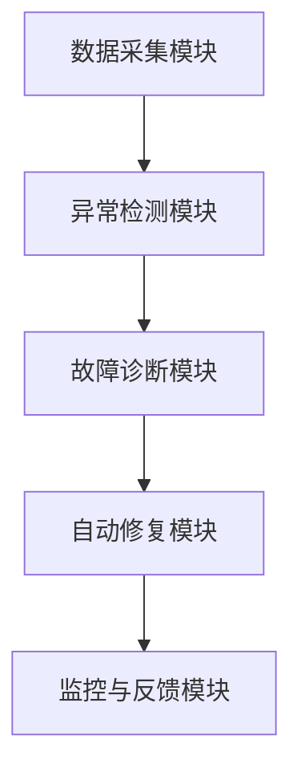

                 


# 自动故障恢复：提高AI Agent的可靠性

> 关键词：自动故障恢复, AI Agent, 可靠性, 系统可靠性, 故障检测, 自动修复

> 摘要：本文详细探讨了自动故障恢复在提高AI Agent可靠性中的重要作用。通过分析自动故障恢复的核心原理、算法实现和系统架构，结合实际项目案例，展示了如何通过自动故障恢复技术有效提升AI Agent的稳定性和可靠性。文章内容涵盖从理论到实践的各个方面，为读者提供了全面的指导。

---

## 第一部分：背景与概述

### 第1章：自动故障恢复的背景与意义

#### 1.1 AI Agent的定义与特点

AI Agent（人工智能代理）是一种能够感知环境、执行任务并做出决策的智能实体。其特点包括：

- **自主性**：能够在没有外部干预的情况下自主决策。
- **反应性**：能够实时感知环境并做出响应。
- **社会性**：能够与其他系统或人类进行交互和协作。
- **持续性**：能够在长时间内稳定运行，处理各种复杂任务。

#### 1.2 自动故障恢复的核心概念

自动故障恢复是指系统在发生故障时，无需人工干预，自动检测、诊断并修复问题的过程。其核心概念包括：

- **故障检测**：通过监测系统状态，识别异常情况。
- **故障诊断**：确定故障的根本原因。
- **自动修复**：根据诊断结果，执行修复操作。

#### 1.3 自动故障恢复的重要性与应用场景

在AI Agent中，自动故障恢复的重要性体现在以下几个方面：

- **提高系统可用性**：确保AI Agent在故障发生时能够快速恢复，减少停机时间。
- **增强系统的稳定性**：通过自动修复，减少人为干预的需求，降低人为错误的风险。
- **扩展系统的应用场景**：在复杂或危险的环境中，自动故障恢复能够确保系统的可靠性，使其能够独立完成任务。

自动故障恢复的应用场景包括：

- **工业自动化**：在生产线中，AI Agent需要能够自主检测和修复设备故障，确保生产过程的连续性。
- **智能交通系统**：在自动驾驶或智能交通管理中，AI Agent需要能够在复杂环境中快速响应并修复故障，确保交通系统的稳定运行。
- **智能医疗设备**：在医疗设备中，AI Agent需要能够检测并修复设备故障，确保患者的安全和治疗的连续性。

---

### 第2章：AI Agent的可靠性挑战

#### 2.1 可靠性问题的定义

可靠性是指系统在规定条件下完成指定功能的能力。对于AI Agent而言，可靠性问题主要表现在以下几个方面：

- **环境不确定性**：AI Agent需要在动态和不可预测的环境中运行，环境的变化可能导致系统故障。
- **系统复杂性**：AI Agent通常涉及多个模块和组件，复杂性增加了故障的可能性。
- **人为错误**：尽管AI Agent旨在减少人为干预，但在设计和部署过程中，仍然可能存在人为错误。

#### 2.2 AI Agent在复杂环境中的可靠性挑战

在复杂环境中，AI Agent需要应对多种挑战，包括：

- **多任务处理**：AI Agent需要同时处理多个任务，任务之间的冲突可能导致系统故障。
- **资源受限**：在资源受限的环境中，AI Agent需要在有限的计算能力和能源条件下完成任务。
- **安全威胁**：AI Agent可能面临网络攻击或其他安全威胁，这些威胁可能导致系统故障。

#### 2.3 自动故障恢复在可靠性中的作用

自动故障恢复通过以下方式提高AI Agent的可靠性：

- **快速响应**：在故障发生时，自动故障恢复能够迅速检测并响应，减少故障持续时间。
- **减少人为干预**：通过自动化修复，减少人为错误的可能性，提高系统的稳定性。
- **适应复杂环境**：自动故障恢复能够根据环境的变化调整修复策略，确保系统在复杂环境中的可靠性。

---

## 第二部分：自动故障恢复的核心原理

### 第3章：自动故障恢复的理论基础

#### 3.1 异常检测原理

异常检测是自动故障恢复的第一步，其原理包括：

- **基于统计的方法**：通过统计分析检测数据中的异常点。
- **基于机器学习的方法**：利用无监督学习算法，如聚类和深度学习，检测异常。
- **基于时间序列分析的方法**：通过分析时间序列数据的变化，识别异常模式。

#### 3.2 故障定位与诊断

故障定位与诊断是自动故障恢复的关键步骤，主要包括：

- **日志分析**：通过分析系统日志，识别故障发生的迹象。
- **因果关系分析**：通过因果推理，确定故障的根本原因。
- **知识图谱分析**：利用知识图谱，关联系统组件之间的关系，辅助诊断。

#### 3.3 自动修复机制

自动修复机制是自动故障恢复的核心，主要包括：

- **基于规则的修复**：根据预定义的规则，执行修复操作。
- **基于机器学习的修复**：利用强化学习等机器学习算法，自适应地选择修复策略。
- **基于反馈的修复**：根据修复结果的反馈，优化修复策略。

---

### 第4章：自动故障恢复的实现流程

#### 4.1 故障监测阶段

故障监测阶段的主要步骤包括：

1. **数据采集**：从系统中采集各种数据，如性能指标、日志信息等。
2. **异常检测**：利用异常检测算法，识别数据中的异常点。
3. **警报生成**：当检测到异常时，生成警报并触发故障恢复流程。

#### 4.2 故障分析阶段

故障分析阶段的主要步骤包括：

1. **日志分析**：通过分析日志信息，确定故障的具体位置。
2. **因果推理**：通过因果关系分析，确定故障的根本原因。
3. **知识图谱查询**：利用知识图谱，关联系统组件之间的关系，辅助诊断。

#### 4.3 自动修复阶段

自动修复阶段的主要步骤包括：

1. **修复策略选择**：根据故障诊断结果，选择合适的修复策略。
2. **修复执行**：执行修复操作，恢复系统正常运行。
3. **修复结果反馈**：将修复结果反馈到系统中，优化未来的修复策略。

---

## 第三部分：系统分析与架构设计

### 第5章：系统架构设计

#### 5.1 系统架构概述

自动故障恢复系统的架构设计包括以下几个关键组件：

- **数据采集模块**：负责采集系统的各种数据，如性能指标、日志信息等。
- **异常检测模块**：负责检测数据中的异常点。
- **故障诊断模块**：负责分析异常点，确定故障的根本原因。
- **自动修复模块**：负责根据诊断结果，执行修复操作。
- **监控与反馈模块**：负责监控修复过程，并根据修复结果反馈优化修复策略。

#### 5.2 系统架构图

以下是系统架构的Mermaid图：



---

### 第6章：系统功能设计

#### 6.1 功能模块设计

系统功能模块包括：

- **数据采集模块**：负责采集系统的各种数据。
- **异常检测模块**：负责检测数据中的异常点。
- **故障诊断模块**：负责分析异常点，确定故障的根本原因。
- **自动修复模块**：负责根据诊断结果，执行修复操作。
- **监控与反馈模块**：负责监控修复过程，并根据修复结果反馈优化修复策略。

#### 6.2 功能流程图

以下是系统功能流程的Mermaid图：


---

## 第四部分：项目实战

### 第7章：项目环境与核心代码实现

#### 7.1 环境安装

以下是项目所需的环境和工具：

- **Python 3.8+**
- **机器学习库（如scikit-learn, TensorFlow）**
- **日志分析工具（如ELK stack）**
- **Mermaid图生成工具**

#### 7.2 核心代码实现

以下是异常检测模块的Python代码示例：

```python
import numpy as np
from sklearn.neighbors import LocalOutlierFactor

def detect_anomalies(data):
    clf = LocalOutlierFactor(n_neighbors=20, contamination=0.1)
    anomalies = clf.fit_predict(data)
    return anomalies
```

#### 7.3 代码解读与分析

上述代码使用了LOF算法进行异常检测。LOF算法通过计算数据点的局部密度来识别异常点。通过调整`n_neighbors`和`contamination`参数，可以优化异常检测的效果。

---

### 第8章：实际案例分析

#### 8.1 案例背景

假设我们有一个智能交通系统，AI Agent需要实时监测交通流量，并根据数据做出决策。在某个时间段，系统检测到交通流量异常，触发了自动故障恢复流程。

#### 8.2 案例分析

1. **数据采集**：系统采集交通流量数据，发现某些路段的流量异常。
2. **异常检测**：异常检测模块识别出异常流量。
3. **故障诊断**：故障诊断模块分析日志，发现是由于传感器故障导致的数据异常。
4. **自动修复**：自动修复模块触发修复流程，替换故障传感器。
5. **监控与反馈**：监控模块确认修复成功，并优化未来的修复策略。

---

## 第五部分：总结与展望

### 第9章：总结与最佳实践

#### 9.1 小结

自动故障恢复是提高AI Agent可靠性的重要技术。通过异常检测、故障诊断和自动修复，可以有效减少故障发生的时间和影响范围，提高系统的可用性和稳定性。

#### 9.2 最佳实践

- **定期维护**：定期检查和维护系统，确保各个模块正常运行。
- **优化算法**：根据实际需求，优化异常检测和故障诊断算法，提高检测和诊断的准确性。
- **加强监控**：加强系统监控，及时发现和处理异常情况。

### 第10章：注意事项与拓展阅读

#### 10.1 注意事项

- **数据质量**：异常检测和故障诊断的效果依赖于数据的质量，需要确保数据的完整性和准确性。
- **算法选择**：根据实际场景选择合适的算法，避免使用不适合的算法导致误报或漏报。
- **系统安全性**：在实现自动修复时，需要考虑系统的安全性，防止修复过程中的潜在风险。

#### 10.2 拓展阅读

- **相关书籍**：《自动故障恢复技术与应用》
- **技术博客**：推荐关注技术博客，获取最新的自动故障恢复技术动态。
- **学术论文**：阅读相关学术论文，深入理解自动故障恢复的理论和技术。

---

## 结语

自动故障恢复是提高AI Agent可靠性的重要技术。通过本文的详细讲解，读者可以深入了解自动故障恢复的核心原理、算法实现和系统架构。同时，通过实际案例分析和项目实战，读者可以掌握自动故障恢复的实现方法和应用技巧。未来，随着AI技术的不断发展，自动故障恢复技术也将不断进步，为AI Agent的可靠性提供更强大的支持。

