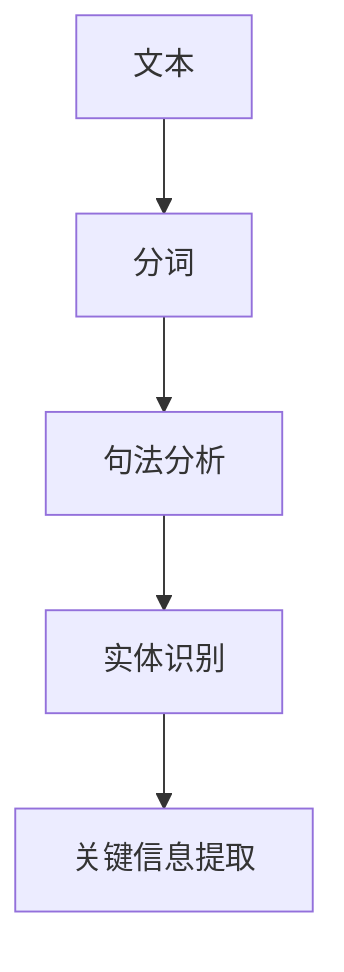
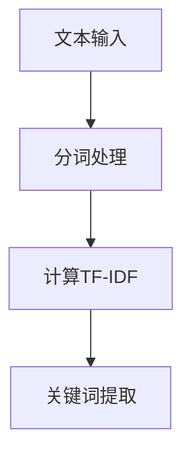
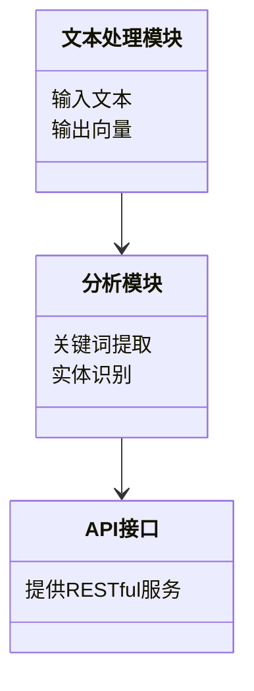
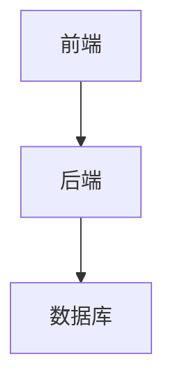

                 


# 自然语言处理在监管文件分析中的应用

> 关键词：自然语言处理，监管文件分析，文本挖掘，机器学习，信息抽取

> 摘要：本文探讨自然语言处理技术在监管文件分析中的应用，涵盖背景介绍、核心概念、算法原理、系统架构、项目实战以及最佳实践等内容。通过详细分析，展示如何利用NLP技术提高监管效率、降低成本，并为实际应用提供指导。

---

## 第1章: 自然语言处理与监管文件分析的背景

### 1.1 自然语言处理的基本概念
自然语言处理（NLP）是研究如何让计算机理解和生成人类语言的科学，核心技术包括分词、句法分析、实体识别、情感分析等。这些技术广泛应用于机器翻译、智能客服、信息抽取等领域。

### 1.2 监管文件分析的定义与特点
监管文件分析是对法律法规、公司报告等文本进行分析，提取关键信息。其特点是文本量大、格式多样、信息密度高。监管文件分析的重要性在于帮助企业合规运营，降低法律风险。

### 1.3 自然语言处理在监管文件分析中的作用
- **提高效率**：自动提取关键信息，减少人工审查时间。
- **降低成本**：通过自动化处理降低合规成本。
- **增强预警**：及时发现潜在风险，提前采取措施。

---

## 第2章：核心概念与联系

### 2.1 核心概念与原理
- **分词**：将连续文本分割成词语，常用工具如jieba。
- **句法分析**：分析句子结构，确定语法关系。
- **实体识别**：识别文本中的命名实体，如人名、地名等。

### 2.2 核心概念的联系与对比
- **对比表格**：列出分词、句法分析、实体识别的区别与联系。
- **Mermaid图**：展示实体识别在监管文件中的应用流程。



---

## 第3章：算法原理与数学模型

### 3.1 常用算法原理
- **TF-IDF**：衡量词语在文本中的重要性，常用于关键词提取。
- **Word2Vec**：将词语映射为向量，捕捉语义信息。
- **BERT**：基于Transformer的预训练模型，效果优异。

### 3.2 算法流程图


### 3.3 数学模型与公式
- **TF-IDF公式**：$$ TF-IDF = \frac{TF \times ID}{F} $$
- **Word2Vec概率模型**：$$ P(w_i|w_{i-1}) = \text{softmax}(W w_{i-1}^T) $$

---

## 第4章：系统架构设计

### 4.1 系统功能设计
- **领域模型**：用Mermaid类图展示系统各模块及其交互。



### 4.2 系统架构设计
- **分层架构**：展示前端、后端、数据库的分层结构。



### 4.3 系统接口设计
- **API接口定义**：如RESTful API的输入输出格式。

---

## 第5章：项目实战

### 5.1 项目环境安装
- **Python环境配置**：安装必要的库如jieba、spaCy。

```python
import jieba
from spacy.lang.zh import Chinese
```

### 5.2 系统核心实现
- **数据预处理**：文本清洗、分词。
- **模型训练**：使用TF-IDF或BERT进行特征提取。
- **接口开发**：构建RESTful API，提供文本分析服务。

### 5.3 功能测试
- **测试用例**：如关键词提取、实体识别的准确性。

---

## 第6章：最佳实践与小结

### 6.1 最佳实践
- **数据预处理**：选择合适的分词工具，处理停用词。
- **模型选择**：根据任务需求选择合适模型，如BERT适合复杂任务。
- **性能优化**：使用缓存机制，优化API响应时间。

### 6.2 小结
总结文章内容，强调NLP在监管文件分析中的价值。

### 6.3 注意事项
- **数据隐私**：处理敏感信息时需遵守相关法律法规。
- **模型调优**：持续优化模型以适应新的监管要求。

### 6.4 拓展阅读
推荐相关书籍和论文，鼓励读者深入学习。

---

通过以上步骤，我们系统地完成了《自然语言处理在监管文件分析中的应用》的技术博客文章。希望本文能为读者提供有价值的信息和指导，帮助他们在实际应用中更好地利用NLP技术。

