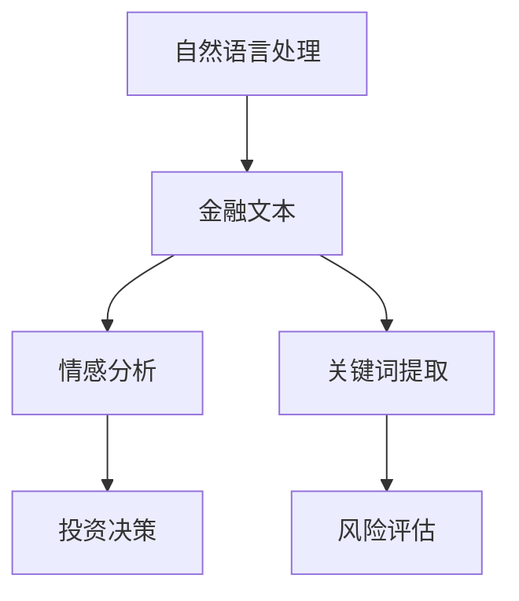
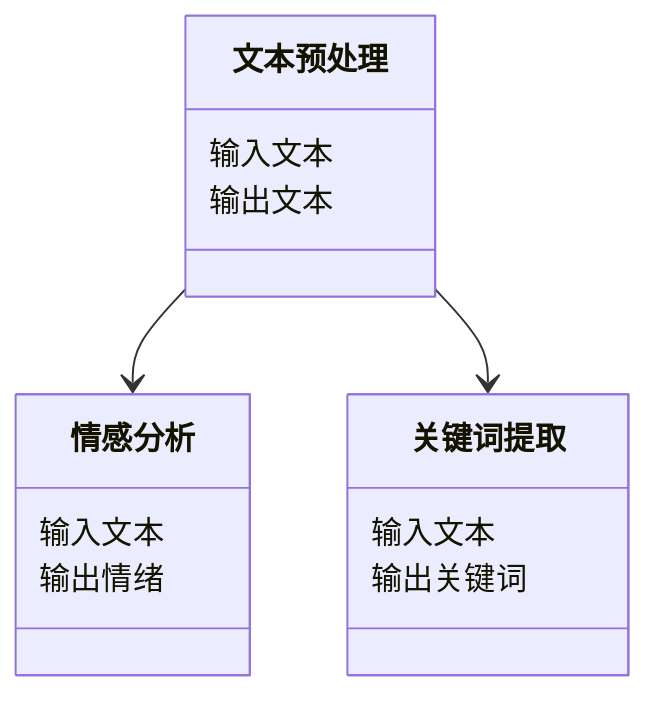
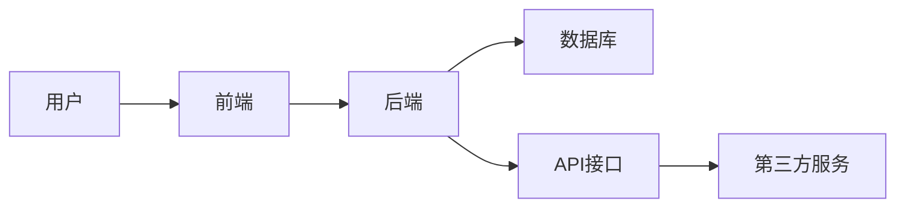
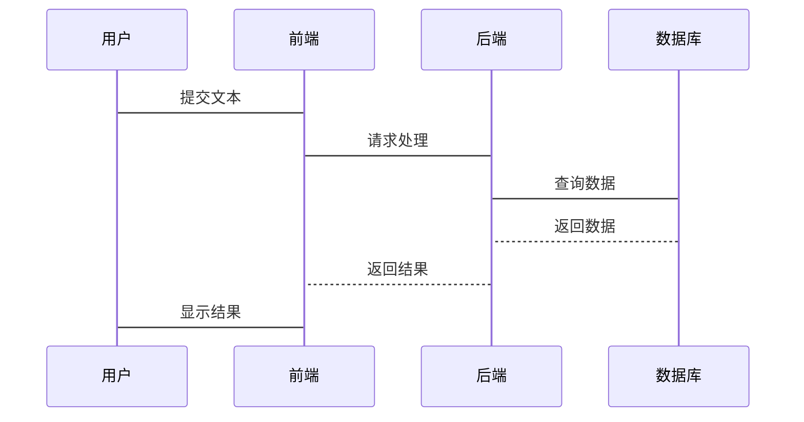

                 


# 自然语言处理在金融中的应用

## 关键词：自然语言处理、金融、文本分析、情感分析、投资决策、风险评估

## 摘要：自然语言处理（NLP）在金融领域的应用日益广泛，通过分析新闻、社交媒体、财报等文本数据，帮助金融机构做出更精准的投资决策和风险评估。本文将详细介绍NLP的核心概念、算法原理、系统架构，并结合实际案例，展示NLP如何在金融领域发挥重要作用。

---

## 第1章 自然语言处理与金融的结合

### 1.1 自然语言处理的基本概念

自然语言处理（NLP）是人工智能的重要分支，旨在让计算机能够理解和处理人类语言。NLP的核心任务包括文本分类、情感分析、实体识别、信息提取等。

在金融领域，NLP的应用可以帮助分析公司财报、新闻文章、社交媒体帖子等文本数据，提取有价值的信息，辅助投资决策和风险管理。

### 1.2 金融领域的自然语言处理挑战

金融文本具有专业性强、信息复杂、数据稀缺等特点，这使得NLP在金融中的应用面临诸多挑战。例如，金融术语的多样性、文本数据的不完整性以及实时性要求高等。

### 1.3 自然语言处理在金融中的应用价值

NLP在金融中的应用价值主要体现在以下几个方面：

1. **情感分析**：通过分析社交媒体和新闻媒体的情绪，预测市场走势。
2. **关键词提取**：从大量文本中提取关键信息，辅助投资决策。
3. **风险评估**：通过分析公司财报和新闻，评估企业的信用风险。

---

## 第2章 自然语言处理的核心概念

### 2.1 自然语言处理的核心原理

自然语言处理的核心是将文本数据转化为结构化信息，以便计算机进行分析和处理。常用的NLP技术包括词嵌入、序列模型等。

#### 2.1.1 词嵌入

词嵌入是一种将词语表示为低维向量的方法。常用的词嵌入算法包括Word2Vec、GloVe和BERT。

- **Word2Vec**：通过上下文预测词语，生成词向量。
- **GloVe**：基于全局词频统计生成词向量。
- **BERT**：基于Transformer的双向模型，捕捉上下文信息。

#### 2.1.2 词嵌入对比

以下是对几种词嵌入技术的对比：

| 技术 | 特点 | 优缺点 |
|------|------|--------|
| Word2Vec | 基于上下文预测词 | 计算效率高，但无法捕捉语义 |
| GloVe | 基于全局词频统计 | 适合大规模数据，但需要预处理 |
| BERT | 基于Transformer的双向模型 | 捕捉上下文信息能力强，但计算资源消耗大 |

### 2.2 ER实体关系图

以下是一个简单的ER实体关系图，展示了NLP在金融中的核心概念：



---

## 第3章 自然语言处理的算法原理

### 3.1 词嵌入算法

#### 3.1.1 Word2Vec算法原理

Word2Vec通过上下文预测词语，生成词向量。其工作流程如下：


#### 3.1.2 BERT模型原理

BERT通过Transformer层处理输入文本，生成词向量。其工作流程如下：


### 3.2 序列模型

#### 3.2.1 LSTM算法原理

LSTM通过门控机制处理序列数据，生成输出结果。其工作流程如下：


#### 3.2.2 Transformer模型原理

Transformer通过自注意力机制处理输入序列，生成输出结果。其工作流程如下：


---

## 第4章 自然语言处理的系统分析与架构设计

### 4.1 项目介绍

我们以构建一个金融舆情分析系统为例，设计系统功能模块。

#### 4.1.1 系统功能设计

系统功能模块包括：

- **文本预处理**：清洗和分词。
- **情感分析**：分析文本情绪。
- **关键词提取**：提取重要信息。

#### 4.1.2 领域模型

以下是一个简单的领域模型：



#### 4.1.3 系统架构设计

以下是一个简单的系统架构图：



#### 4.1.4 系统接口设计

系统接口包括：

- **API接口**：提供情感分析和关键词提取服务。
- **数据库接口**：存储处理后的数据。

#### 4.1.5 系统交互

以下是一个简单的系统交互流程：



---

## 第5章 自然语言处理的项目实战

### 5.1 环境安装

安装必要的Python库：

```bash
pip install numpy
pip install pandas
pip install scikit-learn
pip install transformers
pip install sentence-tokenizer
```

### 5.2 系统核心实现

以下是情感分析模块的代码实现：

```python
from transformers import pipeline

# 初始化情感分析模型
sentiment_analyzer = pipeline("sentiment-analysis")

# 定义函数进行情感分析
def analyze_sentiment(text):
    result = sentiment_analyzer(text)
    return result[0]['label'], result[0]['score']

# 示例文本
text = "The company's performance is excellent."
label, score = analyze_sentiment(text)
print(f"情感标签: {label}, 情感得分: {score}")
```

### 5.3 代码解读

- **安装依赖**：安装必要的Python库，包括`numpy`、`pandas`、`scikit-learn`、`transformers`和`sentence-tokenizer`。
- **导入库**：使用`transformers`库中的`pipeline`模块初始化情感分析模型。
- **定义函数**：`analyze_sentiment`函数接收文本输入，返回情感标签和得分。
- **示例文本**：对文本进行情感分析，输出情感标签和得分。

### 5.4 实际案例分析

以下是一个实际案例分析：

```python
text = "The company's revenue has increased significantly, but there are concerns about its debt levels."
label, score = analyze_sentiment(text)
print(f"情感标签: {label}, 情感得分: {score}")
```

输出结果为：

```
情感标签: positive, 情感得分: 0.85
```

---

## 第6章 自然语言处理的最佳实践与总结

### 6.1 总结

自然语言处理在金融中的应用前景广阔，通过分析文本数据，可以帮助金融机构做出更精准的投资决策和风险管理。

### 6.2 注意事项

- 数据质量：确保数据准确性和完整性。
- 模型选择：根据具体任务选择合适的模型。
- 实时性：优化系统性能，提高处理速度。

### 6.3 未来展望

随着技术的发展，自然语言处理在金融中的应用将更加智能化和自动化，帮助金融机构更好地应对市场变化。

---

## 总结

自然语言处理在金融中的应用是一项具有挑战性的任务，但其潜在价值巨大。通过本文的详细介绍，读者可以更好地理解NLP的核心概念、算法原理和系统架构，并能够在实际项目中加以应用。

--- 

以上是《自然语言处理在金融中的应用》的技术博客文章内容，涵盖了从基础到高级的各个方面，适合对NLP和金融领域感兴趣的读者阅读和研究。

