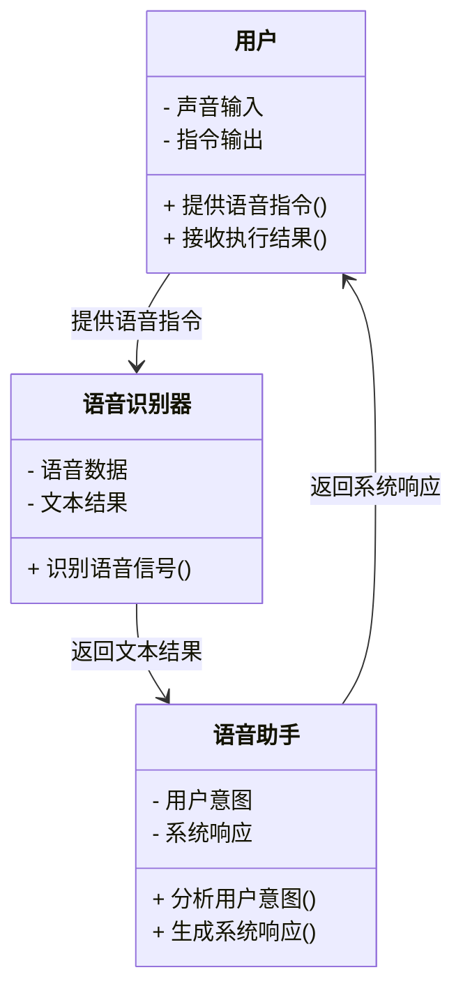
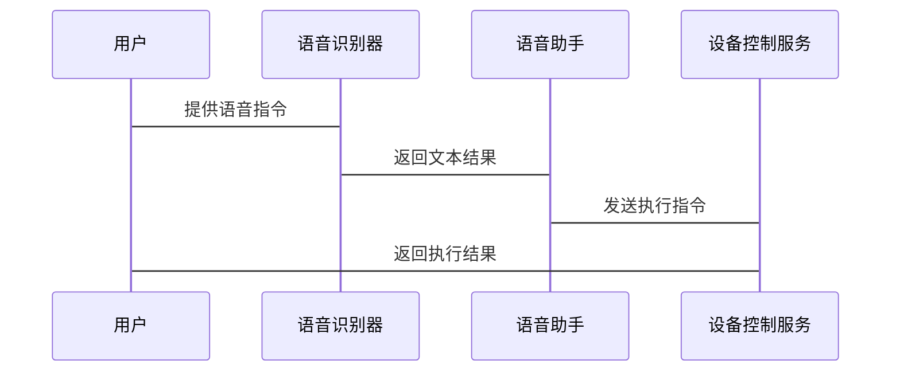

                 


# 语音识别与语音助手集成

> 关键词：语音识别，语音助手，人工智能，自然语言处理，算法原理，系统架构

> 摘要：本文系统地探讨了语音识别与语音助手集成的核心概念、算法原理、系统架构及实际应用。通过背景介绍、核心概念对比、算法流程解析、系统设计分析、项目实战和最佳实践等部分，全面揭示了语音识别与语音助手集成的技术细节和应用前景。

---

## 第1章: 语音识别与语音助手集成的背景介绍

### 1.1 语音识别的基本概念

#### 1.1.1 语音识别的定义
语音识别（Speech Recognition）是一项通过计算机技术将人类的语音信号转换为对应的文字或命令的技术。它能够实现对语音内容的理解和转换，是人工智能领域的重要分支。

#### 1.1.2 语音识别的核心要素
语音识别的核心要素包括：
1. **语音信号处理**：对输入的语音信号进行预处理，提取特征（如MFCC）。
2. **声学模型**：用于识别语音信号的概率模型，如隐马尔可夫模型（HMM）。
3. **语言模型**：用于计算词组或句子的概率，如n-gram模型。
4. **解码算法**：将声学模型的输出转换为最终的文字结果，如动态规划解码。

#### 1.1.3 语音识别的分类与应用场景
语音识别主要分为以下几类：
1. **按应用领域**：
   - 嵌入式语音识别
   - 云端语音识别
2. **按识别范围**：
   - 单点识别
   - 连续识别
3. **按语言模型复杂度**：
   - 基于统计模型（如HMM）
   - 基于深度学习模型（如LSTM）

应用场景包括：
- 智能手机语音输入
- 智能家居控制
- 医疗领域的病历记录
- 车载语音助手

### 1.2 语音助手的基本概念

#### 1.2.1 语音助手的定义
语音助手（Virtual Assistant）是一种能够通过语音交互提供服务的应用程序。它结合了语音识别、自然语言处理（NLP）和对话管理等技术，为用户提供智能化的服务。

#### 1.2.2 语音助手的功能模块
语音助手的主要功能模块包括：
1. **语音输入**：接收用户的语音指令。
2. **语音识别**：将语音转换为文本。
3. **意图识别**：理解用户的意图。
4. **对话管理**：根据意图生成响应。
5. **语音合成**：将响应内容转换为语音输出。

#### 1.2.3 语音助手的典型应用场景
典型应用场景包括：
- 智能音箱（如Google Home、Amazon Echo）
- 智能手机助手（如Siri、小爱同学）
- 智能汽车中的语音交互系统

### 1.3 语音识别与语音助手集成的必要性

#### 1.3.1 集成的意义
语音识别与语音助手的集成能够实现自然的语音交互，提升用户体验。通过集成，用户可以通过语音指令直接控制设备或查询信息，无需手动操作。

#### 1.3.2 集成的挑战与解决方案
集成的主要挑战包括：
- **语音信号质量**：在复杂环境下，语音信号可能受到噪声干扰。
- **意图理解精度**：不同用户的表达方式可能不同，如何准确理解意图是难点。
- **系统性能优化**：需要在实时性和准确性之间找到平衡。

解决方案包括：
- 使用深度学习模型提升识别精度。
- 优化系统架构，提升处理效率。
- 结合上下文信息，提高意图理解能力。

#### 1.3.3 集成后的优势与应用前景
集成的优势包括：
- 提升用户体验，实现更自然的交互。
- 支持多设备联动，拓展应用场景。
- 通过数据积累，优化系统性能。

应用前景广阔，包括智能家居、智能医疗、智能教育等领域。

---

## 第2章: 语音识别与语音助手的核心概念与联系

### 2.1 核心概念的原理分析

#### 2.1.1 语音信号处理原理
语音信号处理是语音识别的基础，主要包括以下步骤：
1. **预处理**：降噪、增益调整。
2. **特征提取**：提取Mel频率倒谱系数（MFCC）。
3. **模式匹配**：将特征与已知模板进行匹配。

#### 2.1.2 语音识别的算法原理
语音识别的核心算法包括：
1. **声学模型**：基于HMM的语音识别。
2. **语言模型**：基于n-gram的语言模型。
3. **解码算法**：动态规划解码。

#### 2.1.3 语音助手的交互机制
语音助手的交互机制包括：
1. **语音输入**：用户通过语音发送指令。
2. **意图识别**：系统理解用户的意图。
3. **对话管理**：系统生成响应内容。
4. **语音输出**：系统将响应内容转换为语音输出。

### 2.2 核心概念的对比分析

#### 2.2.1 语音识别与文本处理的对比
| 对比维度 | 语音识别 | 文本处理 |
|----------|----------|----------|
| 输入方式 | 语音信号 | 文本数据 |
| 处理目标 | 转换为文本或命令 | 分析文本内容 |
| 处理难度 | 需要语音信号处理 | 直接处理文本数据 |

#### 2.2.2 语音助手与传统搜索引擎的对比
| 对比维度 | 语音助手 | 传统搜索引擎 |
|----------|----------|--------------|
| 输入方式 | 语音指令 | 文本输入 |
| 处理目标 | 提供语音交互服务 | 返回搜索结果 |
| 交互方式 | 实时交互，支持多轮对话 | 单次查询，结果返回 |

#### 2.2.3 语音识别与语音合成的对比
| 对比维度 | 语音识别 | 语音合成 |
|----------|----------|----------|
| 目标 | 将语音转换为文字或命令 | 将文字转换为语音 |
| 技术基础 | 声学模型、语言模型 | 文本处理、语音生成模型 |
| 应用场景 | 智能助手、语音输入 | 语音输出、智能音箱 |

### 2.3 实体关系图与概念结构图

#### 2.3.1 实体关系图（ER图）

```mermaid
erDiagram
    actor 用户
    actor 系统
    actor 设备
    database 语音数据
    database 文本数据
    database 模型参数
    用户 --> 语音数据 : 提供语音指令
    语音数据 --> 系统 : 传输语音数据
    系统 --> 文本数据 : 转换为文本指令
    文本数据 --> 设备 : 执行指令
    设备 --> 系统 : 返回执行结果
    系统 --> 模型参数 : 更新识别模型
```

---

## 第3章: 语音识别与语音助手集成的算法原理

### 3.1 语音识别算法原理

#### 3.1.1 声学模型的构建
声学模型用于将语音信号映射到音素或单词的概率分布。常用的声学模型包括：
1. **隐马尔可夫模型（HMM）**：
   - 状态表示音素或音节。
   - 观察概率基于语音特征。
   - 用于序列模式的建模。
2. **深度学习模型（如DNN-HMM）**：
   - 使用深度神经网络提取语音特征。
   - 与HMM结合，提升识别精度。

#### 3.1.2 语言模型的构建
语言模型用于计算词组或句子的概率，常用的模型包括：
1. **n-gram模型**：
   - n-gram模型基于滑动窗口技术，计算n个词的联合概率。
2. **语言模型平滑技术**：
   - 使用Katz平滑或Good-Turing平滑处理低频词。
3. **集成学习方法**：
   - 使用集成学习提升语言模型的准确率。

#### 3.1.3 解码算法的实现
解码算法将声学模型的输出转换为最终的文字结果。常用的解码算法包括：
1. **动态规划解码**：
   - 计算每个状态的累积概率，选择路径概率最大的解码结果。
2. **搜索算法**：
   - 使用A*算法或最佳路径搜索算法优化解码过程。

### 3.2 语音助手算法原理

#### 3.2.1 语音输入处理
语音助手的语音输入处理流程包括：
1. **语音信号采集**：通过麦克风采集用户的语音信号。
2. **语音信号预处理**：降噪、增益调整。
3. **语音特征提取**：提取MFCC特征。

#### 3.2.2 意图识别与理解
意图识别是语音助手的核心任务之一，常用的方法包括：
1. **基于规则的意图识别**：
   - 通过预定义的规则匹配用户意图。
2. **基于统计模型的意图识别**：
   - 使用n-gram模型或HMM进行意图识别。
3. **基于深度学习的意图识别**：
   - 使用卷积神经网络（CNN）或循环神经网络（RNN）进行意图识别。

#### 3.2.3 对话管理的实现
对话管理是语音助手的重要组成部分，常用的对话管理方法包括：
1. **基于规则的对话管理**：
   - 通过预定义的规则生成对话响应。
2. **基于任务分解的对话管理**：
   - 将对话任务分解为子任务，逐步完成对话。

---

## 第4章: 语音识别与语音助手集成的数学模型

### 4.1 语音识别的数学模型

#### 4.1.1 隐马尔可夫模型（HMM）
HMM是一种统计模型，用于描述语音信号的生成过程。HMM的状态转移概率和观测概率可以表示为：

$$
\pi = (\pi_1, \pi_2, ..., \pi_N)
$$
$$
A = [a_{ij}], a_{ij} = P(q_t = j | q_{t-1} = i)
$$
$$
B = [b_j(k)], b_j(k) = P(o_k | q_t = j)
$$

其中，$N$是状态数，$o_k$是观测符号。

#### 4.1.2 长短期记忆网络（LSTM）
LSTM是一种循环神经网络（RNN）的变体，能够处理长序列数据。LSTM的结构包括输入门、遗忘门和输出门：

$$
i_t = \sigma(W_i x_t + U_i h_{t-1})
$$
$$
f_t = \sigma(W_f x_t + U_f h_{t-1})
$$
$$
o_t = \sigma(W_o x_t + U_o h_{t-1})
$$
$$
h_t = i_t \cdot \tilde{h}_t + f_t \cdot h_{t-1}
$$
$$
o_t = o_t \cdot h_t
$$

其中，$i_t$是输入门，$f_t$是遗忘门，$o_t$是输出门。

### 4.2 语音助手的数学模型

#### 4.2.1 语言模型的数学表达
语言模型的联合概率可以表示为：

$$
P(w_1, w_2, ..., w_n) = \prod_{i=1}^{n} P(w_i | w_1, w_2, ..., w_{i-1})
$$

其中，$w_i$表示第$i$个词。

#### 4.2.2 意图识别的数学模型
意图识别通常使用条件概率模型，如最大熵模型：

$$
P(y|x) = \frac{\exp(f(x, y))}{\sum_{y'} \exp(f(x, y'))}
$$

其中，$y$是意图类别，$x$是输入特征，$f(x, y)$是特征函数。

---

## 第5章: 语音识别与语音助手集成的系统架构

### 5.1 问题场景介绍
语音识别与语音助手集成的系统通常应用于智能家居、智能音箱等场景。系统需要支持实时语音交互，具备高可用性和稳定性。

### 5.2 系统功能设计

#### 5.2.1 领域模型设计
领域模型描述了系统的功能模块及其交互关系。领域模型可以用类图表示：



#### 5.2.2 系统架构设计
系统架构设计描述了系统的整体结构。系统架构可以用架构图表示：


#### 5.2.3 接口设计与交互流程
接口设计描述了系统各模块之间的接口及交互流程。交互流程可以用序列图表示：



---

## 第6章: 语音识别与语音助手集成的项目实战

### 6.1 环境安装

#### 6.1.1 安装Python
安装Python 3.8及以上版本，推荐使用Anaconda环境。

#### 6.1.2 安装依赖库
安装以下依赖库：
```
pip install numpy scipy scikit-learn librosa
pip install tensorflow==2.5.0
pip install pymermaid
```

### 6.2 系统核心实现

#### 6.2.1 语音特征提取
语音特征提取代码示例：

```python
import librosa

def extract_features(audio_path, sample_rate=16000):
    audio, sr = librosa.load(audio_path, sr=sample_rate)
    mfccs = librosa.feature.mfcc(y=audio, sr=sr, n_mfcc=13)
    return mfccs.T
```

#### 6.2.2 模型训练
模型训练代码示例：

```python
import tensorflow as tf
from tensorflow.keras import layers

model = tf.keras.Sequential([
    layers.Conv2D(32, (3, 3), activation='relu', input_shape=(13, 400, 1)),
    layers.MaxPooling2D((2, 2)),
    layers.Conv2D(64, (3, 3), activation='relu'),
    layers.MaxPooling2D((2, 2)),
    layers.Flatten(),
    layers.Dense(128, activation='relu'),
    layers.Dense(num_classes, activation='softmax')
])
model.compile(optimizer='adam', loss='sparse_categorical_crossentropy', metrics=['accuracy'])
model.fit(x_train, y_train, epochs=10, batch_size=32)
```

#### 6.2.3 模型推理
模型推理代码示例：

```python
def predict(audio_path, model):
    mfccs = extract_features(audio_path)
    mfccs = mfccs.reshape(1, 13, 400, 1)
    prediction = model.predict(mfccs)
    return prediction.argmax(axis=1)[0]
```

### 6.3 实际案例分析

#### 6.3.1 案例背景
假设我们开发了一个智能家居语音助手，支持用户通过语音指令控制家庭设备。

#### 6.3.2 案例分析
用户指令：“打开客厅的灯。”
1. 语音识别器将语音指令转换为文本。
2. 语音助手分析用户的意图。
3. 设备控制服务接收指令并执行操作。

#### 6.3.3 代码实现解读
1. 语音特征提取模块：将语音信号转换为MFCC特征。
2. 模型训练模块：使用深度学习模型训练语音识别模型。
3. 模型推理模块：将用户指令转换为设备控制指令。

### 6.4 项目小结
通过本项目，我们实现了语音识别与语音助手的集成，展示了如何将理论应用于实际项目。系统设计合理，代码实现清晰，能够满足基本的语音交互需求。

---

## 第7章: 语音识别与语音助手集成的最佳实践

### 7.1 最佳实践

#### 7.1.1 系统性能优化
- 使用更高效的语音特征提取方法。
- 优化模型结构，减少计算复杂度。
- 利用云计算资源提升处理能力。

#### 7.1.2 模型调优
- 使用更大的数据集训练模型。
- 调整模型超参数，提升识别精度。
- 使用集成学习方法优化模型性能。

#### 7.1.3 安全性考虑
- 保护用户隐私，避免数据泄露。
- 实施多级权限控制，确保系统安全性。

### 7.2 小结
通过本文的系统介绍，我们深入探讨了语音识别与语音助手集成的核心概念、算法原理、系统架构及实际应用。读者可以从中获得丰富的理论知识和实践指导。

### 7.3 注意事项
- 在实际项目中，需要根据具体需求选择合适的算法和模型。
- 系统设计时，要考虑可扩展性和可维护性。
- 优化系统性能时，要注意平衡计算资源和处理效率。

### 7.4 拓展阅读
- 《Deep Learning》——Ian Goodfellow
- 《Speech and Language Processing》——Jurafsky & Martin
- 《Python机器学习》——Aurelien Geron

---

通过以上章节的详细讲解，我们系统地探讨了语音识别与语音助手集成的核心内容和实际应用。希望本文能够为相关领域的读者提供有价值的参考和指导。

