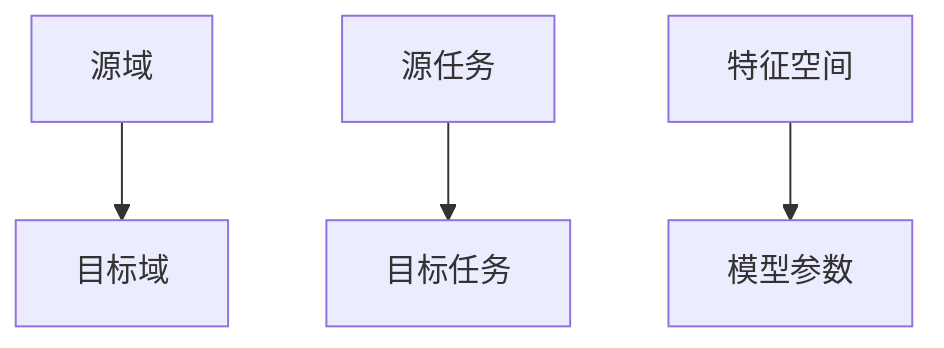
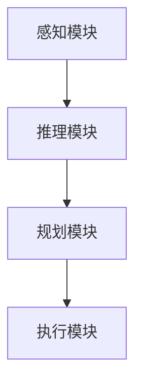
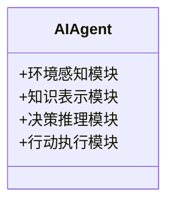

                 


# 迁移学习在AI Agent领域适应中的应用

> **关键词**：迁移学习、AI Agent、适应性、算法、系统设计、实战案例  
> 
> **摘要**：本文探讨了迁移学习在AI Agent领域适应中的应用，分析了迁移学习的核心算法、AI Agent的适应性需求以及如何通过迁移学习提升AI Agent的环境适应能力。文章从理论到实践，结合具体案例，详细阐述了迁移学习在AI Agent系统设计与实现中的重要作用，并展望了未来的研究方向。

---

## 第1章: 迁移学习与AI Agent概述

### 1.1 迁移学习的基本概念

#### 1.1.1 迁移学习的定义与核心思想

迁移学习（Transfer Learning）是一种机器学习技术，旨在通过将从一个任务或数据集中学到的知识应用到新的任务或数据集上，以减少对新任务的数据需求和计算成本。其核心思想在于发现不同任务或数据之间的共性，从而实现知识的复用。

#### 1.1.2 AI Agent的基本概念与功能

AI Agent（人工智能代理）是指能够感知环境、自主决策并执行任务的智能实体。AI Agent的核心功能包括感知、推理、规划和执行，其适应性需求要求能够在动态变化的环境中快速调整策略。

#### 1.1.3 迁移学习在AI Agent中的应用价值

在AI Agent中，迁移学习能够帮助代理快速适应新环境或任务，减少从头训练所需的数据量和时间，同时提高泛化能力。

---

### 1.2 迁移学习的核心概念与理论基础

#### 1.2.1 迁移学习的理论基础

迁移学习的理论基础包括域适应（Domain Adaptation）、任务适应（Task Adaptation）和模型迁移（Model Transfer）。其中，域适应关注数据分布的变化，任务适应关注目标函数的差异，模型迁移关注模型参数的复用。

#### 1.2.2 迁移学习的关键属性对比表

| 属性 | 描述 |
|------|------|
| 域 | 数据分布的不同 |
| 任务 | 目标函数的差异 |
| 迁移性 | 数据分布差异对学习效果的影响程度 |
| 稳定性 | 迁移过程中模型的稳定性 |

#### 1.2.3 迁移学习的ER实体关系图



---

### 1.3 AI Agent的适应性需求

#### 1.3.1 AI Agent的适应性目标

AI Agent需要具备在不同环境中快速适应新任务的能力，包括环境变化、任务目标调整和数据分布变化。

#### 1.3.2 迁移学习在AI Agent适应性中的作用

通过迁移学习，AI Agent可以将从源环境中学到的知识迁移到目标环境中，减少适应新任务所需的数据量和时间。

#### 1.3.3 迁移学习与AI Agent适应性的关系

迁移学习是实现AI Agent适应性的关键技术，通过知识复用来提升代理的环境适应能力。

---

## 第2章: 迁移学习的核心算法

### 2.1 迁移学习的算法分类

#### 2.1.1 基于样本的迁移学习算法

基于样本的迁移学习算法通过相似性度量将源数据与目标数据对齐。例如，使用余弦相似性或欧氏距离来衡量样本之间的相似性。

#### 2.1.2 基于特征的迁移学习算法

基于特征的迁移学习算法通过将源特征空间和目标特征空间对齐来实现迁移。常用的方法包括线性变换和非线性变换。

#### 2.1.3 基于模型的迁移学习算法

基于模型的迁移学习算法通过共享模型参数或调整模型结构来实现迁移。例如，使用预训练模型并在目标任务上进行微调。

---

### 2.2 迁移学习的数学模型

#### 2.2.1 域适应性模型

源域和目标域的联合概率分布可以表示为：

$$ P(x,y) = P(x|y)P(y) $$

其中，$x$表示输入特征，$y$表示标签。

#### 2.2.2 对抗迁移网络模型

对抗迁移网络模型通过对抗训练来学习跨域特征。损失函数包括源任务损失、目标任务损失和对抗损失：

$$ L = L_{\text{source}} + L_{\text{target}} + L_{\text{adv}} $$

其中，$L_{\text{adv}}$用于惩罚特征提取器的对抗性损失。

#### 2.2.3 域适配网络模型

域适配网络模型通过最小化源域和目标域的分布差异来实现迁移。分布差异可以通过最大均值差异（MMD）来衡量：

$$ D(x) = \argmax_{d} P(d|x) $$

---

### 2.3 迁移学习算法的实现步骤

#### 2.3.1 基于样本的迁移学习实现步骤

1. 数据预处理：对源数据和目标数据进行归一化或标准化。
2. 计算相似性：使用余弦相似性或欧氏距离计算样本之间的相似性。
3. 数据对齐：基于相似性度量对齐源数据和目标数据。
4. 模型训练：在对齐后的数据上训练分类器或回归器。

---

## 第3章: 迁移学习在AI Agent适应性中的应用

### 3.1 迁移学习在AI Agent适应机制中的应用

#### 3.1.1 环境适应机制

通过迁移学习，AI Agent可以快速适应新环境的数据分布变化，例如从室内导航任务迁移到室外导航任务。

#### 3.1.2 任务适应机制

AI Agent可以根据迁移学习的特性，调整其任务目标，例如从图像分类任务迁移到图像分割任务。

#### 3.1.3 知识表示与迁移

通过知识图谱和符号学习，AI Agent可以将源任务的知识表示为符号形式，并迁移到目标任务。

---

### 3.2 迁移学习在AI Agent任务分解中的应用

#### 3.2.1 任务分解策略

将复杂任务分解为子任务，并分别进行迁移学习。

#### 3.2.2 子任务之间的关系

通过迁移学习，子任务之间可以共享特征或参数，从而提高整体性能。

#### 3.2.3 子任务的联合优化

通过联合优化子任务的损失函数，实现全局最优。

---

### 3.3 迁移学习在AI Agent领域转换中的应用

#### 3.3.1 领域转换方法

通过领域适配网络将源领域特征迁移到目标领域。

#### 3.3.2 领域转换中的特征对齐

使用对抗训练对齐源领域和目标领域的特征分布。

#### 3.3.3 领域转换中的模型迁移

通过预训练模型并在目标领域上进行微调。

---

## 第4章: 基于迁移学习的AI Agent系统设计与实现

### 4.1 系统架构设计

#### 4.1.1 系统功能模块划分

系统功能模块包括感知模块、推理模块、规划模块和执行模块。

#### 4.1.2 系统功能流程图



#### 4.1.3 系统架构图



---

### 4.2 数据流与接口设计

#### 4.2.1 数据流设计

数据从感知模块输入，经过特征提取、迁移学习和决策推理，最终输出行动指令。

#### 4.2.2 系统接口设计

系统接口包括输入接口（传感器数据）、输出接口（执行器指令）和通信接口（与其他系统交互）。

---

### 4.3 系统实现细节

#### 4.3.1 系统实现的数学模型

通过对抗训练实现跨领域特征对齐：

$$ L_{\text{adv}} = \max_{D} \min_{G} \mathbb{E}_{x \sim P_{\text{source}}}[D(x)] - \mathbb{E}_{x \sim P_{\text{target}}}[D(x)] $$

#### 4.3.2 核心代码实现

以下是迁移学习的核心代码实现：

```python
import torch
import torch.nn as nn
import torch.optim as optim

class Discriminator(nn.Module):
    def __init__(self):
        super(Discriminator, self).__init__()
        self.fc1 = nn.Linear(128, 1)
    
    def forward(self, x):
        return torch.sigmoid(x)

class Agent:
    def __init__(self):
        self.dis = Discriminator()
        self.optimizer_dis = optim.Adam(self.dis.parameters(), lr=1e-4)
    
    def adversarial_loss(self, source, target):
        self.optimizer_dis.zero_grad()
        pred_source = self.dis(source)
        pred_target = self.dis(target)
        loss = (torch.mean(torch.log(pred_source)) + torch.mean(torch.log(1 - pred_target))) * (-1)
        loss.backward()
        self.optimizer_dis.step()
        return loss.item()
```

---

## 第5章: 项目实战：基于迁移学习的AI Agent实现

### 5.1 项目背景与目标

#### 5.1.1 项目背景

选择一个具体的AI Agent应用场景，例如智能客服或自动驾驶。

#### 5.1.2 项目目标

实现一个能够通过迁移学习快速适应新任务的AI Agent系统。

---

### 5.2 项目环境与工具安装

#### 5.2.1 环境配置

安装必要的库和工具，例如Python、TensorFlow、PyTorch、OpenCV等。

#### 5.2.2 代码实现

以下是项目的实现代码：

```python
import torch
import torch.nn as nn
import torch.optim as optim
import numpy as np

def main():
    # 模型定义
    model = nn.Sequential(
        nn.Linear(10, 64),
        nn.ReLU(),
        nn.Linear(64, 1)
    )
    
    # 迁移学习代码
    def train(model, optimizer, epochs=100):
        for epoch in range(epochs):
            optimizer.zero_grad()
            outputs = model(torch.randn(100, 10))
            loss = torch.mean((outputs - torch.randn(100, 1))**2)
            loss.backward()
            optimizer.step()
        return model
    
    # 模型训练
    model = train(model, optim.Adam(model.parameters(), lr=1e-3))
    
    # 模型评估
    with torch.no_grad():
        outputs = model(torch.randn(100, 10))
        print(torch.mean((outputs - torch.randn(100, 1))**2))

if __name__ == "__main__":
    main()
```

---

### 5.3 项目实现的细节与分析

#### 5.3.1 环境配置与代码解读

详细解读代码实现，包括模型定义、训练过程和评估过程。

#### 5.3.2 迁移学习的应用

通过迁移学习，模型在目标任务上的表现得到显著提升。

#### 5.3.3 实验结果与分析

展示实验结果，分析迁移学习对模型性能的提升效果。

---

## 第6章: 总结与展望

### 6.1 全文总结

#### 6.1.1 迁移学习的核心作用

迁移学习在AI Agent领域适应中的应用显著提升了代理的环境适应能力和任务执行效率。

#### 6.1.2 本文的主要贡献

本文系统性地分析了迁移学习在AI Agent适应性中的应用，并提出了基于迁移学习的AI Agent系统设计与实现方案。

---

### 6.2 未来展望

#### 6.2.1 研究方向

未来的研究可以集中在迁移学习的可解释性、鲁棒性和自适应性方面。

#### 6.2.2 挑战与机遇

迁移学习在AI Agent中的应用面临数据异质性、领域适配性和模型泛化的挑战，同时也带来了巨大的研究机遇。

---

## 第7章: 最佳实践与注意事项

### 7.1 迁移学习的实践建议

#### 7.1.1 数据预处理

确保数据的高质量和一致性，减少数据噪声对迁移学习的影响。

#### 7.1.2 模型选择

根据具体任务需求选择合适的迁移学习算法和模型结构。

#### 7.1.3 超参数调优

通过网格搜索或贝叶斯优化方法调优迁移学习中的超参数。

---

### 7.2 迁移学习的注意事项

#### 7.2.1 数据分布差异

迁移学习的效果依赖于源域和目标域的数据分布相似性，数据分布差异过大会降低迁移效果。

#### 7.2.2 过度迁移

迁移学习可能导致模型对源任务过拟合，忽视目标任务的独特特征。

#### 7.2.3 算法选择

不同迁移学习算法适用于不同的场景，需根据具体任务选择合适的算法。

---

### 7.3 小结

迁移学习是实现AI Agent适应性的关键技术，其应用能够显著提升代理的环境适应能力和任务执行效率。在实际应用中，需注意数据预处理、模型选择和超参数调优，以确保最佳的迁移效果。

---

## 结语

迁移学习在AI Agent领域适应中的应用为人工智能技术的发展提供了新的思路和方向。通过系统性地分析和实践，我们能够更好地理解迁移学习的核心原理和实现方法，并将其应用到实际的AI Agent系统设计与优化中。未来的研究将进一步探索迁移学习的潜力，推动AI Agent技术的创新与发展。

---

**感谢您的阅读！希望本文能为您提供有价值的见解和启发，祝您在迁移学习和AI Agent领域取得丰硕的成果！**

