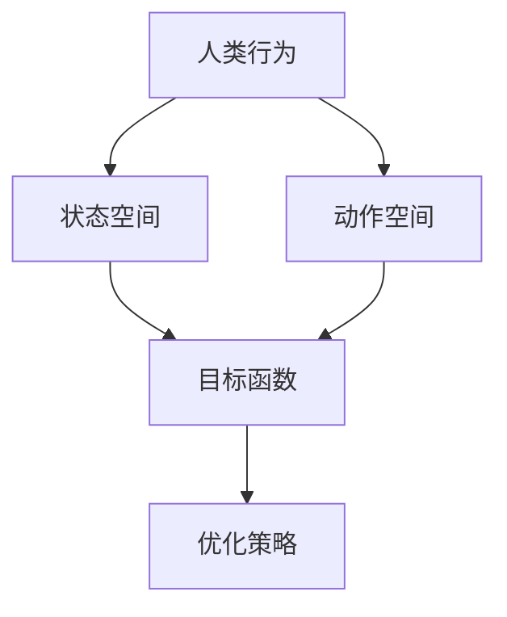
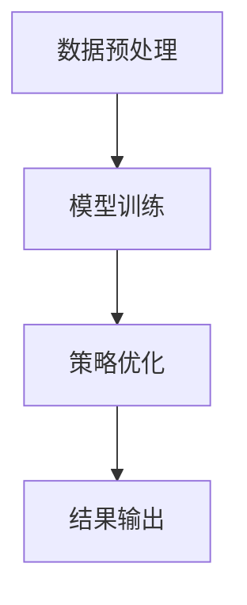
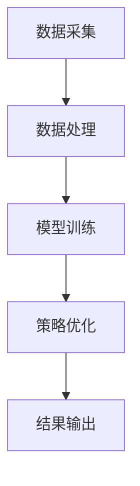

                 


# 逆强化学习：理解人类偏好的AI Agent

## 关键词
逆强化学习，偏好建模，人工智能，强化学习，AI Agent

## 摘要
逆强化学习（Inverse Reinforcement Learning, IRL）是一种通过观察人类行为来推断其偏好并构建优化目标函数的方法。本文将详细探讨逆强化学习的核心概念、算法原理、系统架构以及实际应用，帮助读者理解如何通过逆强化学习让AI Agent更好地理解和模仿人类偏好，从而实现更智能、更自然的人机交互。

---

# 第一部分：逆强化学习的背景与概念

## 第1章：逆强化学习的背景介绍

### 1.1 问题背景
#### 1.1.1 传统强化学习的局限性
- 强化学习通过试错优化目标函数，但在实际应用中缺乏对人类偏好的理解。
- 需要大量试错，效率低下且难以解释。
- 在复杂环境中，目标函数的设计往往不够准确。

#### 1.1.2 逆强化学习的提出动机
- 理解和模仿人类决策过程，降低试错成本。
- 提高AI Agent的可解释性和人机协作能力。
- 实现更自然的人机交互和更高效的决策优化。

#### 1.1.3 逆强化学习的应用场景
- 机器人控制：通过学习人类操作行为优化任务执行。
- 游戏AI：模仿人类玩家策略，提升游戏体验。
- 推荐系统：根据用户行为推断偏好，提供个性化推荐。

### 1.2 逆强化学习的定义与特点
#### 1.2.1 逆强化学习的核心概念
- **逆向目标建模**：通过观察人类行为推断其目标函数。
- **偏好建模**：构建人类偏好的数学模型，用于指导AI决策。
- **优化与模仿**：在理解偏好后，优化或模仿人类决策过程。

#### 1.2.2 与传统强化学习的对比
- **输入与输出的差异**：IRL通过人类行为推断目标函数，而强化学习通过目标函数优化行为。
- **学习目标的不同**：IRL的目标是学习人类偏好，而强化学习的目标是优化策略。
- **应用场景的互补性**：IRL适用于复杂环境中的偏好建模，强化学习适用于明确目标的策略优化。

#### 1.2.3 逆强化学习的优势与挑战
- **优势**：
  - 降低目标函数设计的难度。
  - 提高AI决策的可解释性。
  - 实现更自然的人机协作。
- **挑战**：
  - 数据获取的难度：需要大量高质量的人类行为数据。
  - 偏好建模的复杂性：如何准确建模人类偏好是一个难题。
  - 计算资源的需求：逆强化学习通常需要大量的计算资源。

### 1.3 相关概念与联系
#### 1.3.1 逆强化学习与博弈论的关系
- 博弈论研究的是策略选择和互动，逆强化学习可以看作是一种博弈中的策略建模方法。

#### 1.3.2 逆强化学习与偏好学习的联系
- 逆强化学习的核心是建模人类偏好，偏好学习是其基础理论。

#### 1.3.3 逆强化学习与其他机器学习方法的对比
- **监督学习**：监督学习基于标签数据进行分类或回归，而逆强化学习基于行为数据建模偏好。
- **无监督学习**：无监督学习发现数据中的隐含结构，而逆强化学习发现数据中的优化目标。
- **强化学习**：强化学习通过试错优化策略，而逆强化学习通过推断优化策略。

### 1.4 逆强化学习的应用领域
#### 1.4.1 在机器人控制中的应用
- 机器人通过观察人类操作行为学习任务目标，提高任务执行效率。
- 应用于工业机器人、服务机器人等领域。

#### 1.4.2 在游戏AI中的应用
- 游戏AI通过学习人类玩家的策略，提升游戏水平和用户体验。
- 应用于自动驾驶、策略游戏等领域。

#### 1.4.3 在推荐系统中的应用
- 推荐系统通过分析用户行为推断用户偏好，提供更个性化的推荐。
- 应用于电商推荐、内容推荐等领域。

---

## 第2章：逆强化学习的核心概念与联系

### 2.1 核心概念原理
#### 2.1.1 逆强化学习的基本假设
- 人类行为可以通过优化某个潜在的目标函数来解释。
- 人类行为数据中隐含了目标函数的信息。

#### 2.1.2 偏好函数的定义与表示
- **偏好函数**：定义为一个将状态空间映射到实数的函数，表示状态的偏好程度。
- **数学表达**：$r(s) = f(s)$，其中$f$是一个函数，$s$是状态。

#### 2.1.3 状态空间与动作空间的建模
- **状态空间**：所有可能的状态的集合。
- **动作空间**：所有可能的动作的集合。

### 2.2 核心概念对比表
| 对比项               | 逆强化学习                     | 传统强化学习                     |
|----------------------|-------------------------------|-----------------------------------|
| 输入数据             | 人类行为数据                   | 环境反馈数据                     |
| 输出目标             | 推断目标函数                   | 优化策略                        |
| 学习目标             | 建模人类偏好                   | 优化策略                        |
| 应用场景             | 机器人控制、游戏AI、推荐系统    | 自动控制、游戏AI、机器人控制     |

### 2.3 ER实体关系图


---

## 第3章：逆强化学习的算法原理

### 3.1 算法原理概述
#### 3.1.1 逆强化学习的核心流程
1. 数据收集：收集人类行为数据。
2. 偏好建模：根据数据推断目标函数。
3. 策略优化：基于推断的目标函数优化策略。

#### 3.1.2 逆强化学习的关键步骤
- 数据预处理：清洗和标注数据。
- 模型训练：训练偏好函数模型。
- 策略优化：优化策略以最大化目标函数。

### 3.2 逆强化学习的数学模型
#### 3.2.1 逆强化学习的数学表达
- **状态空间**：$S$，表示所有可能的状态。
- **动作空间**：$A$，表示所有可能的动作。
- **目标函数**：$r(s)$，表示状态$s$的目标函数。
- **策略**：$\pi(a|s)$，表示在状态$s$下选择动作$a$的概率。

#### 3.2.2 逆强化学习的数学推导
- 假设人类行为是通过最大化期望目标函数获得的：
$$ \pi(a|s) \propto \exp(r(s)) $$
- 推断目标函数$r(s)$，使得：
$$ \arg\max_{r} \sum_{s,a} \gamma(s,a) \log \pi(a|s) $$

### 3.3 逆强化学习的算法实现
#### 3.3.1 算法流程图


#### 3.3.2 代码实现
```python
import numpy as np

# 示例代码：逆强化学习算法实现
def inverse_reinforcement_learning(data):
    # 数据预处理
    processed_data = preprocess(data)
    # 模型训练
    model = train_model(processed_data)
    # 策略优化
    optimal_policy = optimize_policy(model)
    return optimal_policy

# 数据预处理函数
def preprocess(data):
    # 示例：提取状态和动作
    states = [d['state'] for d in data]
    actions = [d['action'] for d in data]
    return (states, actions)

# 模型训练函数
def train_model(processed_data):
    # 示例：训练一个简单的偏好模型
    states, actions = processed_data
    # 假设模型是一个简单的线性回归模型
    model = np.polyfit(states, actions, 1)
    return model

# 策略优化函数
def optimize_policy(model):
    # 示例：基于模型优化策略
    # 假设策略是选择使模型输出最大的动作
    optimal_actions = [np.argmax(model.predict(s)) for s in states]
    return optimal_actions
```

### 3.4 算法流程与优化
#### 3.4.1 算法流程的详细步骤
1. 数据预处理：清洗数据，提取有用特征。
2. 模型训练：训练偏好函数模型，通常使用监督学习方法。
3. 策略优化：基于推断的目标函数优化策略，使用强化学习方法。

#### 3.4.2 算法优化技巧
- 数据增强：通过数据增强技术提高模型的泛化能力。
- 模型优化：使用更复杂的模型结构，如深度神经网络。
- 策略优化：结合多种优化方法，提高策略优化的效率。

---

## 第4章：逆强化学习的系统架构设计

### 4.1 系统功能设计
#### 4.1.1 系统功能模块
- 数据采集模块：负责收集人类行为数据。
- 数据处理模块：对数据进行清洗和预处理。
- 模型训练模块：训练偏好函数模型。
- 策略优化模块：基于模型优化策略。
- 结果输出模块：输出优化后的策略。

#### 4.1.2 系统功能流程
1. 数据采集：收集人类行为数据。
2. 数据处理：清洗和预处理数据。
3. 模型训练：训练偏好函数模型。
4. 策略优化：优化策略。
5. 结果输出：输出优化后的策略。

### 4.2 系统架构设计
#### 4.2.1 系统架构图


#### 4.2.2 系统模块的交互流程
1. 数据采集模块采集数据并传递给数据处理模块。
2. 数据处理模块处理数据并传递给模型训练模块。
3. 模型训练模块训练模型并传递给策略优化模块。
4. 策略优化模块优化策略并传递给结果输出模块。
5. 结果输出模块输出优化后的策略。

### 4.3 系统接口设计
#### 4.3.1 系统接口说明
- 数据采集接口：负责数据的输入和输出。
- 数据处理接口：负责数据的清洗和预处理。
- 模型训练接口：负责模型的训练和保存。
- 策略优化接口：负责策略的优化和保存。
- 结果输出接口：负责结果的输出和展示。

#### 4.3.2 接口交互流程图


---

## 第5章：逆强化学习的项目实战

### 5.1 项目背景介绍
#### 5.1.1 项目目标
- 实现一个基于逆强化学习的推荐系统。
- 通过学习用户行为数据，推断用户的偏好，并优化推荐策略。

#### 5.1.2 项目需求
- 收集用户行为数据。
- 建立用户偏好模型。
- 优化推荐策略。

### 5.2 系统核心实现
#### 5.2.1 环境安装与配置
- 安装Python和相关库：numpy、scipy、sklearn等。

#### 5.2.2 核心代码实现
```python
import numpy as np
from sklearn.linear_model import LinearRegression

# 数据预处理函数
def preprocess(data):
    # 提取状态和动作
    states = [d['state'] for d in data]
    actions = [d['action'] for d in data]
    return (states, actions)

# 模型训练函数
def train_model(processed_data):
    # 使用线性回归模型训练偏好函数
    states, actions = processed_data
    model = LinearRegression()
    model.fit(np.array(states).reshape(-1, 1), np.array(actions))
    return model

# 策略优化函数
def optimize_policy(model, states):
    # 基于模型预测的目标函数优化策略
    predicted_rewards = model.predict(np.array(states).reshape(-1, 1))
    optimal_actions = np.argmax(predicted_rewards, axis=1)
    return optimal_actions
```

#### 5.2.3 代码实现说明
- **数据预处理**：将数据中的状态和动作提取出来，为后续模型训练做准备。
- **模型训练**：使用线性回归模型训练偏好函数，将状态映射到动作。
- **策略优化**：基于训练好的模型，预测目标函数，并选择使目标函数最大的动作作为策略。

### 5.3 案例分析与实现解读
#### 5.3.1 案例分析
- **案例背景**：假设我们有一个推荐系统，用户通过点击行为表现出偏好。
- **数据收集**：收集用户的点击行为数据。
- **模型训练**：训练一个偏好函数模型，将用户点击行为映射到推荐策略。
- **策略优化**：基于模型优化推荐策略，提高推荐的准确性和用户体验。

#### 5.3.2 代码实现解读
- **数据预处理**：将用户行为数据中的状态和动作提取出来，为后续模型训练做准备。
- **模型训练**：使用线性回归模型训练偏好函数，将状态映射到动作。
- **策略优化**：基于训练好的模型，预测目标函数，并选择使目标函数最大的动作作为策略。

### 5.4 项目总结
#### 5.4.1 项目成果
- 成功实现了基于逆强化学习的推荐系统。
- 提高了推荐系统的准确性和用户体验。

#### 5.4.2 项目经验总结
- 数据质量对模型性能影响重大，需要确保数据的准确性和完整性。
- 模型选择和优化是关键，需要根据具体场景选择合适的模型和优化方法。
- 系统设计需要考虑模块化和可扩展性，便于后续优化和维护。

---

## 第6章：逆强化学习的最佳实践

### 6.1 小结
- 逆强化学习是一种通过观察人类行为推断其偏好并优化策略的方法。
- 通过逆强化学习，可以实现更智能、更自然的人机交互。

### 6.2 注意事项
- **数据获取**：逆强化学习需要大量的高质量数据，数据获取是关键。
- **模型选择**：选择合适的模型和优化方法，提高模型的准确性和效率。
- **计算资源**：逆强化学习通常需要大量的计算资源，需要合理配置硬件和计算资源。

### 6.3 拓展阅读
- 建议阅读相关论文和书籍，深入了解逆强化学习的理论和应用。
- 关注最新的研究进展，了解逆强化学习的发展趋势。

---

## 总结
逆强化学习通过观察人类行为推断其偏好，优化策略，实现更智能、更自然的人机交互。本文从背景、核心概念、算法原理、系统架构、项目实战和最佳实践等多个方面详细介绍了逆强化学习，帮助读者全面理解其理论和应用。未来，随着技术的发展，逆强化学习将在更多领域发挥重要作用，为人类带来更智能、更便捷的体验。

