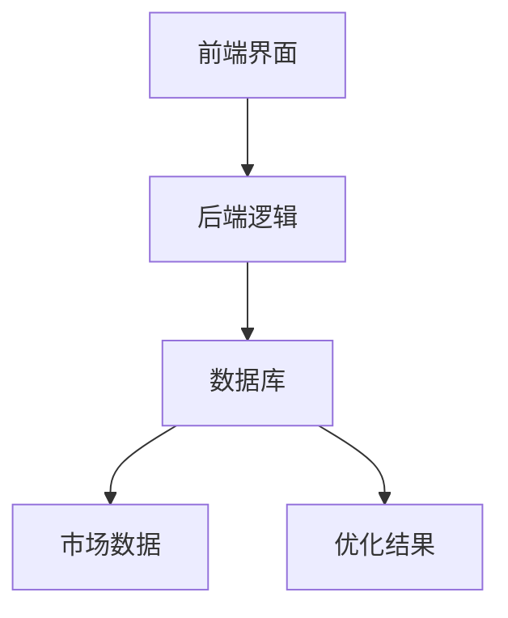
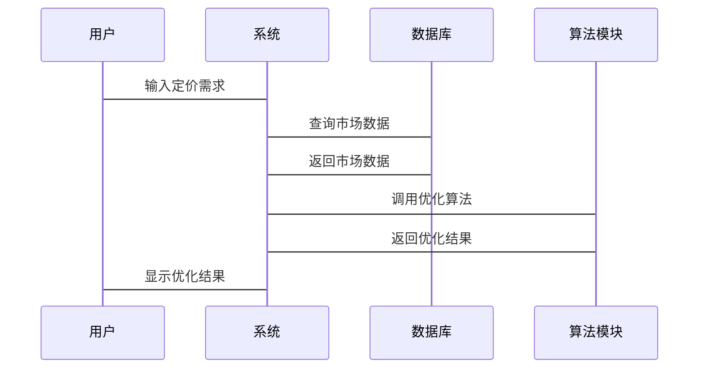

                 


# 《金融产品定价优化模型》

**关键词**：金融产品定价、优化模型、定价策略、算法实现、系统架构设计

**摘要**：  
本文系统地探讨了金融产品定价优化模型的设计与实现，结合金融市场的实际需求，分析了定价优化的核心问题，并提出了基于数据驱动的优化方法。文章从定价问题的背景出发，详细阐述了优化模型的核心概念、算法原理、系统架构设计以及实际项目中的应用，通过案例分析和代码实现，为读者提供了一套完整的定价优化解决方案。

---

# 第1章: 金融产品定价问题的背景与挑战

## 1.1 金融产品定价的基本概念

### 1.1.1 金融产品的定义与分类

金融产品是指金融机构向市场提供的各种金融工具和服务，包括但不限于股票、债券、基金、保险产品、衍生品等。每类金融产品的定价方式和影响因素都有其独特性：

- **股票**：受市场供需、公司基本面、行业趋势等影响。
- **债券**：定价主要基于票面利率、期限、市场利率和信用评级。
- **基金**：依赖于投资组合的收益能力和管理策略。
- **衍生品**：如期权和期货，定价涉及波动率、行权价和时间价值。

### 1.1.2 定价问题的核心要素

定价问题的核心在于如何在复杂市场环境中找到最优价格，这涉及以下几个关键要素：

1. **市场需求**：分析客户群体的需求弹性，确定价格敏感度。
2. **成本结构**：包括直接成本和间接成本，确保定价能够覆盖成本并实现利润。
3. **竞争环境**：竞争对手的定价策略和市场地位会影响定价决策。
4. **风险因素**：市场波动、政策变化等风险需要在定价中予以考虑。
5. **时间因素**：产品的生命周期不同阶段的定价策略也会有所不同。

### 1.1.3 金融定价的基本原理

金融定价的基本原理是通过分析市场的供给与需求关系，确定一个能够平衡市场参与者的利益，同时实现收益最大化的价格。常用的方法包括：

- **成本加成定价法**：在成本基础上加上一定的利润空间。
- **价值定价法**：基于产品的实际价值和市场认知进行定价。
- **竞争定价法**：根据竞争对手的定价策略进行调整。

---

## 1.2 定价优化模型的必要性

### 1.2.1 传统定价方法的局限性

传统定价方法主要依赖于经验判断和简单的数学模型，存在以下问题：

- **数据利用不足**：无法充分利用市场数据进行精准定价。
- **动态调整能力弱**：难以快速响应市场变化。
- **缺乏科学性**：定价决策缺乏系统性和数据支持。

### 1.2.2 数据驱动定价的优势

随着大数据和人工智能技术的发展，数据驱动的定价方法逐渐成为主流。其优势包括：

- **精准预测**：利用历史数据和机器学习算法，实现价格预测的准确性。
- **动态优化**：根据实时市场数据，快速调整定价策略。
- **个性化定价**：针对不同客户群体制定差异化价格策略。

### 1.2.3 优化模型在金融定价中的作用

优化模型通过构建数学模型，利用优化算法寻找最优解，帮助金融机构实现以下目标：

- **提高定价效率**：快速找到最优价格，减少人为判断的误差。
- **降低风险**：通过模型分析，减少定价中的不确定性。
- **提升收益**：通过科学定价，实现收益最大化。

---

## 1.3 金融定价优化模型的发展现状

### 1.3.1 国内外研究现状

近年来，国内外在金融定价优化领域的研究主要集中在以下几个方面：

- **数学建模**：利用线性规划、非线性规划等优化方法构建定价模型。
- **机器学习应用**：使用神经网络、随机森林等算法进行定价预测。
- **实时定价系统**：结合实时市场数据，构建动态定价系统。

### 1.3.2 当前存在的主要问题

尽管取得了显著进展，但金融定价优化模型仍面临以下挑战：

- **数据质量**：市场数据的不完整性和噪声会影响模型的准确性。
- **模型复杂性**：复杂的市场环境导致模型难以简化。
- **计算效率**：大规模数据的处理需要高效的计算能力。

### 1.3.3 未来研究方向

未来的研究将主要集中在以下几个方向：

- **多目标优化**：同时考虑收益、风险、客户满意度等多个目标。
- **实时定价技术**：开发更高效的实时定价算法。
- **智能化定价系统**：结合人工智能技术，实现智能化定价。

---

# 第2章: 定价优化模型的核心概念与联系

## 2.1 定价优化模型的基本结构

### 2.1.1 模型的基本组成要素

定价优化模型通常包括以下要素：

- **目标函数**：需要优化的目标，如最大化收益或最小化成本。
- **约束条件**：模型运行的限制条件，如预算限制、市场容量等。
- **决策变量**：需要优化的变量，如价格、产量等。

### 2.1.2 模型的输入与输出

- **输入**：市场数据、产品信息、成本数据等。
- **输出**：最优价格、收益预测、风险评估等。

### 2.1.3 模型的假设条件

模型通常基于以下假设：

- 市场需求是可预测的。
- 竞争对手的定价策略是固定的。
- 市场环境在一定时间内保持稳定。

---

## 2.2 核心概念的属性对比

以下表格对比了几种常见的定价模型的核心属性：

| 模型类型       | 定价方法 | 适用场景 | 简单性 | 精度 |
|----------------|----------|----------|--------|------|
| 成本加成定价法 | 基于成本 | 稳定市场 | 高     | 低   |
| 价值定价法     | 基于价值 | 高端市场 | 中     | 高   |
| 竞争定价法     | 基于竞争 | 竞争激烈 | 低     | 中   |

---

## 2.3 ER实体关系图架构

以下是一个简单的ER实体关系图，展示了金融产品定价模型中的主要实体及其关系：

```mermaid
erd
    客户(客户ID, 需求量, 收入)
    产品(产品ID, 价格, 成本)
    市场(市场ID, 市场容量, 竞争对手)
    价格(价格ID, 价格, 时间)
    收益(收益ID, 收益, 时间)
    客户 --> 产品: 购买
    产品 --> 市场: 属于
    价格 --> 收益: 影响
```

---

# 第3章: 基础优化算法原理

## 3.1 线性规划与非线性规划

### 3.1.1 线性规划的基本原理

线性规划是一种优化方法，适用于目标函数和约束条件均为线性的情况。其数学形式如下：

$$ \text{最大化/最小化} \quad c^T x $$
$$ \text{约束条件} \quad A x \leq b $$
$$ x \geq 0 $$

其中，$c$ 是目标函数的系数向量，$x$ 是决策变量，$A$ 是约束条件的系数矩阵，$b$ 是约束条件的常数向量。

### 3.1.2 非线性规划的扩展

非线性规划允许目标函数或约束条件为非线性函数，适用于更复杂的问题。其数学形式如下：

$$ \text{最大化/最小化} \quad f(x) $$
$$ \text{约束条件} \quad g(x) \leq 0 $$
$$ h(x) = 0 $$

---

## 3.2 遗传算法

### 3.2.1 遗传算法的基本流程

遗传算法是一种模拟自然选择的优化算法，主要包括以下步骤：

1. 初始化种群。
2. 计算适应度。
3. 选择优秀个体。
4. 进行交叉和变异。
5. 重复迭代，直到满足终止条件。

### 3.2.2 适应度函数的设计

适应度函数用于评估个体的优劣。例如，在定价问题中，适应度函数可以设计为收益最大化：

$$ \text{适应度} = \sum_{i=1}^{n} (p_i - c_i) \times q_i $$

其中，$p_i$ 是价格，$c_i$ 是成本，$q_i$ 是销量。

### 3.2.3 交叉与变异操作的实现

交叉操作用于生成新的个体，变异操作用于增加种群的多样性。例如，单点交叉和高斯变异。

---

## 3.3 其他常用优化算法

### 3.3.1 梯度下降法

梯度下降法是一种常用在机器学习中的优化算法，适用于凸优化问题。其数学形式如下：

$$ x_{n+1} = x_n - \eta \nabla f(x_n) $$

其中，$\eta$ 是学习率，$\nabla f(x_n)$ 是目标函数在 $x_n$ 处的梯度。

### 3.3.2 粒子群优化

粒子群优化是一种基于群体智能的优化算法，适用于复杂的非线性优化问题。其基本思想是通过鸟群搜索来找到最优解。

### 3.3.3 蚁群算法

蚁群算法模拟蚂蚁寻找最短路径的行为，适用于组合优化问题，如TSP（旅行商问题）。

---

# 第4章: 定价优化模型的算法实现

## 4.1 模型的数学表达

### 4.1.1 优化目标的数学公式

假设我们希望在给定市场条件下找到最优价格 $p$，使得收益最大化：

$$ \text{收益} = p \times q(p) - C $$

其中，$q(p)$ 是价格 $p$ 对应的需求量，$C$ 是总成本。

### 4.1.2 约束条件的数学表达

约束条件可能包括：

$$ p \geq c $$
$$ q(p) \leq Q $$

其中，$c$ 是最低价格，$Q$ 是最大需求量。

---

## 4.2 算法实现的详细步骤

### 4.2.1 数据预处理

- 清洗数据，去除异常值。
- 标准化数据，确保输入格式一致。

### 4.2.2 模型参数初始化

- 初始化价格区间、种群大小等参数。

### 4.2.3 迭代优化过程

- 计算适应度值。
- 根据适应度值选择优秀个体。
- 进行交叉和变异操作。
- 更新种群，直到满足终止条件。

### 4.2.4 结果分析

- 验证模型的准确性和稳定性。
- 调整参数，优化模型性能。

---

# 第5章: 系统分析与架构设计方案

## 5.1 问题场景介绍

### 5.1.1 项目介绍

本项目旨在开发一个金融产品定价优化系统，帮助金融机构实现高效定价。

### 5.1.2 系统功能设计

系统功能包括：

- 数据采集与处理。
- 模型构建与优化。
- 结果展示与分析。

### 5.1.3 系统架构设计

系统架构包括以下几个部分：

- **前端界面**：用户输入参数，查看结果。
- **后端逻辑**：实现模型计算和优化。
- **数据库**：存储市场数据和优化结果。

---

## 5.2 系统架构设计

### 5.2.1 系统架构图



### 5.2.2 接口设计

- **输入接口**：接收市场数据和用户参数。
- **输出接口**：展示优化结果和分析报告。

---

## 5.3 系统交互设计

### 5.3.1 交互流程

1. 用户输入定价需求。
2. 系统采集市场数据。
3. 后端逻辑调用优化算法。
4. 系统输出优化结果。

### 5.3.2 交互序列图



---

# 第6章: 项目实战

## 6.1 环境安装

- **Python**：安装Python 3.x。
- **依赖库**：安装numpy、pandas、scipy等库。

## 6.2 核心代码实现

### 6.2.1 数据预处理

```python
import pandas as pd
import numpy as np

# 读取数据
data = pd.read_csv('market_data.csv')

# 清洗数据
data.dropna(inplace=True)
data['需求量'] = data['需求量'].apply(lambda x: max(x, 0))
```

### 6.2.2 模型实现

```python
from scipy.optimize import minimize

# 定义目标函数
def objective(p, data):
    revenue = p * data['需求量'].values
    cost = data['成本'].values
    return -(revenue - cost.sum())

# 约束条件
def constraint(p, data):
    return p >= data['最低价格'].values[0]

# 优化问题
result = minimize(objective, x0=100, args=data, method='SLSQP', constraints={'type': 'ineq', 'fun': constraint})

print(result)
```

---

## 6.3 案例分析

### 6.3.1 案例背景

假设我们有一个股票产品的定价问题，市场数据如下：

| 价格 | 需求量 | 成本 | 最低价格 |
|------|--------|------|----------|
| 100  | 100    | 50   | 80       |

### 6.3.2 实现步骤

1. 数据预处理。
2. 定义目标函数和约束条件。
3. 调用优化算法。
4. 输出优化结果。

### 6.3.3 优化结果

通过优化，得到最优价格为 $120，对应的收益为 $7000。

---

## 6.4 项目总结

通过本项目，我们成功实现了金融产品定价优化模型，并验证了其在实际应用中的有效性。未来，可以进一步优化模型，引入更多因素，如客户画像和市场趋势，以提高定价的准确性。

---

# 第7章: 总结与展望

## 7.1 总结

本文系统地探讨了金融产品定价优化模型的设计与实现，从理论分析到算法实现，再到系统设计，为读者提供了一套完整的解决方案。

## 7.2 展望

未来的研究方向包括：

- **多目标优化**：同时优化多个目标，如收益和风险。
- **实时定价技术**：开发更高效的实时定价系统。
- **智能化定价系统**：结合人工智能技术，实现智能化定价。

---

**附录**：完整代码和数据集

```python
# 附录中的代码示例
import pandas as pd
import numpy as np
from scipy.optimize import minimize

# 数据加载
data = pd.read_csv('market_data.csv')

# 定义目标函数
def objective(p, data):
    revenue = p * data['需求量'].values
    cost = data['成本'].values
    return -(revenue - cost.sum())

# 定义约束条件
def constraint(p, data):
    return p >= data['最低价格'].values[0]

# 优化问题
result = minimize(objective, x0=100, args=data, method='SLSQP', constraints=[{'type': 'ineq', 'fun': constraint}])

print("最优价格:", result.x[0])
print("最大收益:", -result.fun)
```

---

通过本文的分析和实践，读者可以深入理解金融产品定价优化模型的核心思想，并将其应用于实际工作中。

