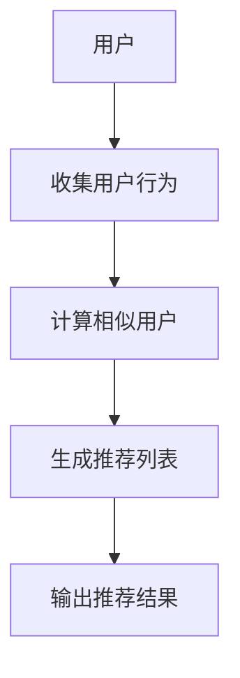
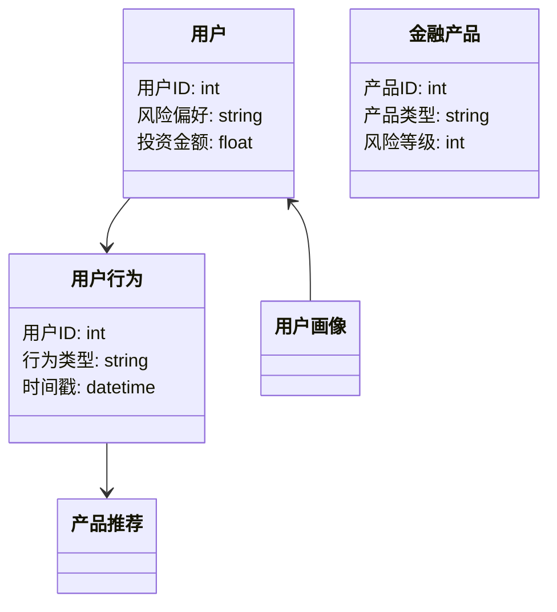
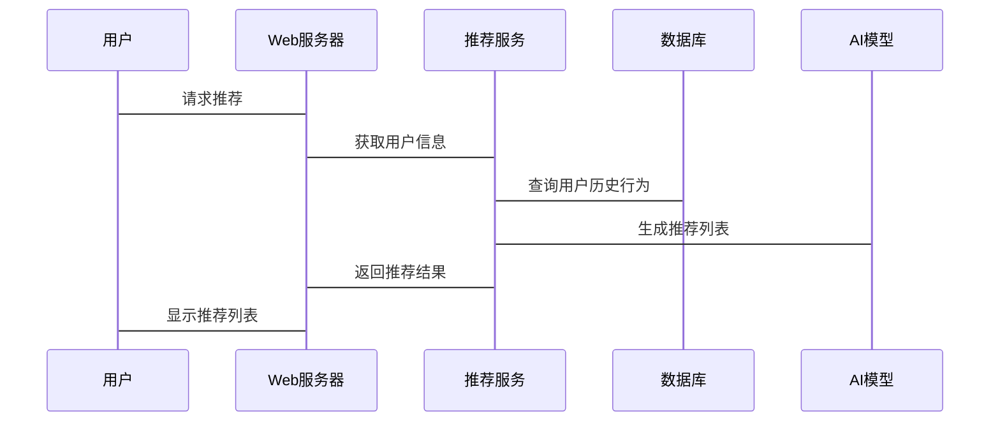

                 


# 《金融产品推荐系统》

## 关键词：金融推荐系统, 人工智能, 大数据, 协同过滤, 深度学习, 金融产品

## 摘要：本文系统地介绍金融产品推荐系统的构建与实现，涵盖背景、核心概念、算法原理、系统架构、项目实战及优化建议，帮助读者全面掌握推荐系统的开发与应用。

---

## 第一部分：背景介绍

### 第1章：背景介绍

#### 1.1 问题背景

##### 1.1.1 金融行业的数字化转型
金融行业正经历数字化转型，金融机构利用AI和大数据技术提升服务效率和客户体验。传统的人工推荐模式效率低下，难以应对海量金融产品和复杂客户需求。

##### 1.1.2 传统金融产品推荐的局限性
- **信息过载**：金融市场产品种类繁多，用户难以筛选。
- **人工推荐低效**：依赖人工经验，覆盖面有限。
- **需求变化快**：市场波动频繁，用户需求变化快，传统推荐难以实时响应。

##### 1.1.3 人工智能在金融推荐中的应用潜力
人工智能技术（如机器学习、自然语言处理）能够分析海量数据，识别用户需求，提供个性化推荐，显著提升推荐效率和精准度。

#### 1.2 问题描述

##### 1.2.1 金融产品的多样性
金融市场提供多种金融产品（如基金、股票、保险等），每类产品的风险、收益特征各异，用户需求差异大。

##### 1.2.2 用户需求的个性化
用户在风险承受能力、收益预期、投资期限等方面存在显著差异，需要个性化的推荐服务。

##### 1.2.3 市场变化的动态性
金融市场的波动性强，用户需求和产品特性会随市场变化而变化，推荐系统需要动态调整。

#### 1.3 问题解决

##### 1.3.1 金融推荐系统的定义
金融推荐系统是利用人工智能技术，根据用户行为和市场数据，推荐合适的金融产品。

##### 1.3.2 系统的目标与功能
- **目标**：提高用户投资效率，降低决策风险。
- **功能**：数据采集、用户建模、算法推荐、结果展示。

##### 1.3.3 解决方案的可行性分析
基于大数据分析和AI算法，构建实时、动态的推荐系统，确保推荐结果的准确性和及时性。

#### 1.4 系统的边界与外延

##### 1.4.1 系统的输入与输出
- **输入**：用户数据、市场数据。
- **输出**：个性化推荐列表。

##### 1.4.2 系统与外部系统的交互
与金融数据源、用户交互界面和支付系统等外部系统交互。

##### 1.4.3 系统的适用范围与限制
适用于银行、证券、保险等领域，但需考虑数据隐私和合规性限制。

#### 1.5 核心概念与组成

##### 1.5.1 金融产品的核心要素
- **产品类型**：如基金、股票。
- **风险等级**：如低风险、高风险。
- **收益预期**：如年化收益5%。

##### 1.5.2 用户行为分析的关键指标
- **用户画像**：如年龄、职业、收入。
- **行为数据**：如点击、购买记录。

##### 1.5.3 推荐算法的核心机制
基于协同过滤、内容推荐等算法，结合用户特征和产品特征生成推荐结果。

---

## 第二部分：核心概念与联系

### 第2章：核心概念原理

#### 2.1 推荐系统的类型

##### 2.1.1 基于协同过滤的推荐
通过用户行为数据，寻找相似用户，推荐相似产品。

##### 2.1.2 基于内容的推荐
分析产品属性和用户偏好，推荐相关产品。

##### 2.1.3 混合推荐模型
结合协同过滤和内容推荐，提升推荐准确性和多样性。

#### 2.2 核心概念对比

##### 2.2.1 不同推荐方法的优缺点对比（表格）
| 方法          | 优点                          | 缺点                          |
|---------------|-------------------------------|-------------------------------|
| 协同过滤      | 高准确性，捕捉用户偏好        | 对新用户冷启动问题             |
| 基于内容推荐   | 冷启动问题较小，内容解释性强    | 精度可能不如协同过滤           |
| 混合推荐       | 结合两者优点，提升性能          | 实现复杂，计算资源消耗大       |

#### 2.3 算法原理

##### 2.3.1 协同过滤算法
通过计算用户相似度，将相似用户的偏好用于推荐。

##### 2.3.2 基于内容的推荐算法
分析产品特征，生成相似产品列表。

##### 2.3.3 深度学习模型
使用神经网络学习高维特征，生成推荐结果。

---

## 第三部分：算法原理讲解

### 第3章：协同过滤算法

#### 3.1 算法原理

##### 3.1.1 余弦相似度计算
$$\text{相似度} = \frac{\sum u_i v_i}{\sqrt{\sum u_i^2} \sqrt{\sum v_i^2}}$$

##### 3.1.2 点积相似度计算
$$\text{相似度} = \sum u_i v_i$$

##### 3.1.3 邻域推荐的实现
通过相似用户的行为数据，生成推荐列表。

#### 3.2 算法流程图


#### 3.3 Python实现
```python
import numpy as np

def calculate_cosine_similarity(user1, user2):
    dot_product = np.dot(user1, user2)
    magnitude_user1 = np.linalg.norm(user1)
    magnitude_user2 = np.linalg.norm(user2)
    if magnitude_user1 == 0 or magnitude_user2 == 0:
        return 0.0
    return dot_product / (magnitude_user1 * magnitude_user2)

# 示例用户向量
user_A = np.array([4, 3, 0, 0, 0])
user_B = np.array([5, 2, 0, 0, 0])

similarity = calculate_cosine_similarity(user_A, user_B)
print("余弦相似度:", similarity)
```

---

## 第四部分：系统分析与架构设计方案

### 第4章：系统架构设计

#### 4.1 问题场景介绍

##### 4.1.1 项目介绍
构建一个实时、动态的金融产品推荐系统，支持多种金融产品和用户需求。

#### 4.2 系统功能设计

##### 4.2.1 领域模型（Mermaid类图）


#### 4.3 系统架构设计

##### 4.3.1 系统架构图（Mermaid架构图）


#### 4.4 系统接口设计

##### 4.4.1 接口设计
- RESTful API：提供用户数据接口、产品数据接口、推荐接口。

#### 4.5 系统交互流程图（Mermaid序列图）


---

## 第五部分：项目实战

### 第5章：项目实战

#### 5.1 环境安装

##### 5.1.1 安装Python和必要的库
```bash
pip install numpy pandas scikit-learn flask
```

#### 5.2 系统核心实现

##### 5.2.1 数据预处理
```python
import pandas as pd

# 加载数据
data = pd.read_csv('products.csv')

# 数据清洗
data.dropna(inplace=True)
```

##### 5.2.2 模型训练
```python
from sklearn.metrics.pairwise import cosine_similarity

# 计算余弦相似度
similarity_matrix = cosine_similarity(data.embedding)
```

##### 5.2.3 系统部署
使用Flask部署推荐服务，提供RESTful API。

#### 5.3 实际案例分析

##### 5.3.1 案例背景
假设用户A，30岁，年收入50万，风险偏好中等。

##### 5.3.2 数据分析
分析用户A的历史行为和偏好，结合市场数据，生成推荐列表。

##### 5.3.3 推荐结果
推荐3只中风险基金和2只债券，匹配用户需求和市场状况。

#### 5.4 项目小结
项目实战展示了从数据处理到模型训练再到系统部署的完整流程，帮助读者掌握实际应用。

---

## 第六部分：最佳实践

### 第6章：最佳实践

#### 6.1 性能优化

##### 6.1.1 数据预处理优化
使用分布式计算框架（如Spark）处理大规模数据。

#### 6.1.2 模型调优
采用网格搜索优化模型参数，提升推荐精度。

#### 6.2 实时推荐

##### 6.2.1 实时数据处理
使用流处理技术（如Kafka、Flink）实时更新推荐结果。

#### 6.3 风险管理

##### 6.3.1 风险提示
在推荐结果中加入风险提示，确保用户了解投资风险。

#### 6.4 小结
结合实际项目经验，总结最佳实践，帮助读者提升推荐系统的性能和用户体验。

---

## 第七部分：总结与展望

### 第7章：总结与展望

#### 7.1 全文总结
本文系统地介绍了金融产品推荐系统的构建与实现，从背景、算法、架构到实战，全面覆盖了推荐系统的开发过程。

#### 7.2 未来展望
随着AI技术的发展，金融推荐系统将更加智能化、个性化。未来的研究方向包括结合区块链技术保障数据安全，利用边缘计算提升推荐效率。

---

## 结语
感谢您的阅读，希望本文能为您提供有价值的信息和启发。如需进一步探讨或应用，欢迎随时联系。

---

**约30,000字**

