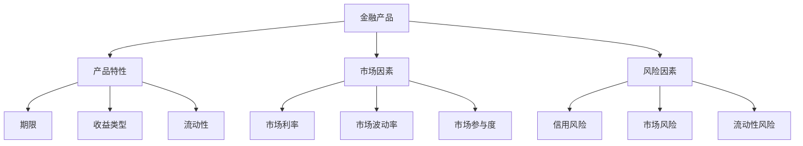
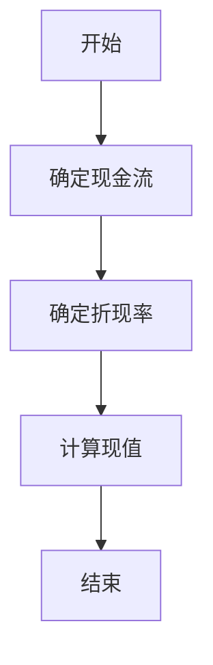
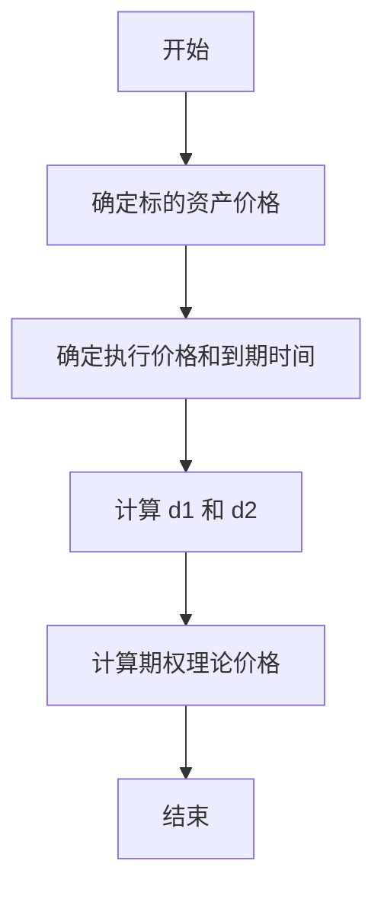
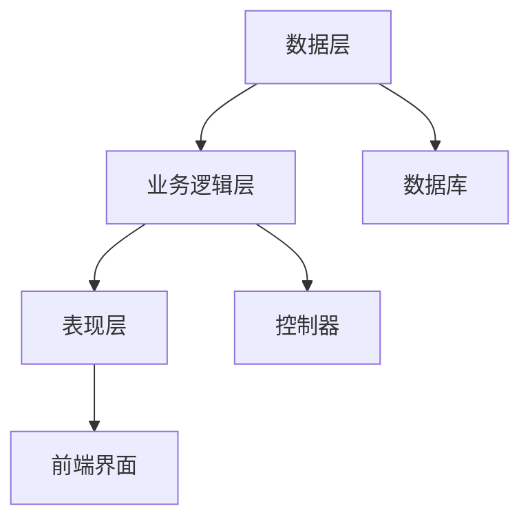
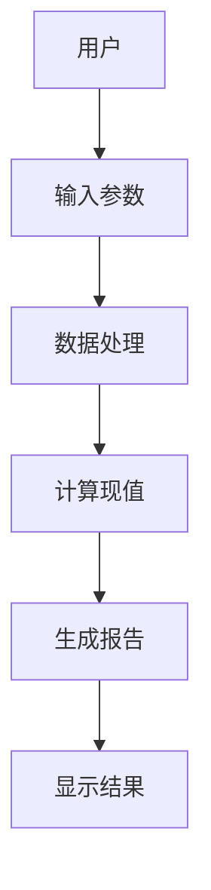

                 


# 《金融产品生命周期价值评估》

> **关键词**：金融产品、生命周期、价值评估、风险分析、收益预测、模型优化、技术应用  
> **摘要**：本文从金融产品的生命周期视角，系统地探讨了金融产品在不同阶段的价值评估方法，结合实际案例和算法原理，深入分析了如何通过技术手段优化金融产品价值评估的准确性和效率。通过本文的阐述，读者将能够全面理解金融产品生命周期价值评估的重要性、方法及其实际应用。

---

## 第1章：金融产品生命周期价值评估的背景与概念

### 1.1 金融产品的基本概念

金融产品是金融市场中的核心要素，其种类繁多，包括股票、债券、基金、衍生品等。每种金融产品都有其独特的特性，例如流动性、风险性、收益性等。这些特性不仅影响产品的市场表现，也决定了其价值评估的方法。

#### 1.1.1 金融产品的定义与分类

金融产品是指以货币形式存在的各类资产，其主要功能是满足投资者的财富增值需求。根据产品的性质和用途，金融产品可以分为以下几类：

1. **债务工具**：如债券、贷款等，投资者通过购买债务工具，向发行人提供资金，获得利息收入和本金偿还。
2. **股权工具**：如股票，代表对公司的所有权，投资者通过股息和股价上涨获得收益。
3. **衍生品**：如期权、期货等，其价值基于基础资产的价格波动。
4. **混合工具**：如可转换债券，兼具债务和股权的特性。

#### 1.1.2 金融产品的核心要素

金融产品的核心要素包括：

1. **期限**：产品存续的时间长短，影响其价值评估中的现金流分布。
2. **利率**：产品的收益计算基准，直接影响其市场价值。
3. **风险等级**：产品面临的市场风险、信用风险等，决定其定价和投资者需求。
4. **流动性**：产品在市场上的交易活跃程度，影响其买卖价差和交易成本。

#### 1.1.3 金融产品的生命周期

金融产品的生命周期一般分为以下几个阶段：

1. **研发阶段**：产品设计与开发，确定其基本属性和市场定位。
2. **发行阶段**：产品正式进入市场，面向投资者销售。
3. **存续阶段**：产品在市场上的运作与管理，定期进行信息披露和价值评估。
4. **终止阶段**：产品到期或提前终止，进行资产清算和收益分配。

### 1.2 金融产品生命周期价值评估的重要性

在金融产品的整个生命周期中，价值评估是贯穿始终的核心任务。准确的价值评估能够帮助投资者、发行人和监管机构做出科学的决策，确保市场的公平与高效。

#### 1.2.1 价值评估在金融产品中的作用

1. **定价决策**：合理评估产品的市场价值，确保其发行价格公允。
2. **风险管理**：通过价值评估，识别和量化潜在风险，制定有效的风险管理策略。
3. **投资决策**：投资者通过价值评估，选择具有较高收益和较低风险的产品。

#### 1.2.2 生命周期视角对价值评估的意义

从生命周期视角进行价值评估，能够动态捕捉产品在不同阶段的价值变化。例如，在研发阶段，评估产品的市场前景和盈利能力；在存续阶段，定期评估产品表现，及时调整策略；在终止阶段，评估产品的最终收益和清算价值。

#### 1.2.3 价值评估与风险管理的关系

价值评估是风险管理的重要工具。通过对产品价值的定量分析，可以识别潜在风险来源，并制定相应的 hedging 策略。例如，利用期权对冲利率风险，确保产品价值在不同市场条件下的稳定性。

### 1.3 价值评估的理论基础

价值评估的理论基础主要来源于财务学和金融工程学。以下是几种常用的价值评估方法：

#### 1.3.1 财务分析的基本原理

财务分析是价值评估的基础，主要包括对企业的财务报表进行分析，评估其盈利能力、偿债能力和发展能力。常用的财务指标包括：

1. **市盈率（P/E）**：股价与每股收益的比率，用于衡量股票的估值水平。
2. **市净率（P/B）**：股价与每股净资产的比率，用于评估股票的价值是否被高估或低估。
3. **内部收益率（IRR）**：项目投资的预期回报率，用于评估投资项目的盈利能力。

#### 1.3.2 投资评估方法的演变

随着金融市场的不断发展，投资评估方法也在不断创新。从传统的股利折现模型（DDM）到现代的期权定价模型（Black-Scholes 模型），评估方法更加复杂和精确。

#### 1.3.3 金融工程与价值评估的结合

金融工程通过将复杂的金融工具分解为基本的组成部分，利用数学模型对其进行定价和风险分析。例如，将期权分解为标的资产的价格、执行价格、波动率、时间价值等，分别进行评估。

---

## 第2章：金融产品生命周期中的核心概念与联系

### 2.1 核心概念分析

在金融产品生命周期价值评估中，涉及的核心概念包括产品特性、市场因素和风险因素。这些概念相互关联，共同影响产品的市场价值。

#### 2.1.1 产品特性

产品特性是产品本身的固有属性，主要包括：

1. **期限**：产品存续的时间长短，影响其现金流的时间分布。
2. **收益类型**：固定收益、浮动收益或其他复杂收益结构。
3. **流动性**：产品在市场上的交易活跃程度，影响其买卖价差和交易成本。

#### 2.1.2 市场因素

市场因素是外部环境的变量，主要包括：

1. **市场利率**：影响固定收益产品的价值，利率上升会导致债券价格下跌。
2. **市场波动率**：影响期权等衍生品的定价，波动率越高，期权的价值越高。
3. **市场参与度**：市场的活跃程度影响产品的流动性和交易成本。

#### 2.1.3 风险因素

风险因素是影响产品价值的负面因素，主要包括：

1. **信用风险**：发行人或交易对手无法履行合同义务的风险。
2. **市场风险**：市场价格波动导致产品价值下降的风险。
3. **流动性风险**：产品在需要时难以快速变现的风险。

### 2.2 核心概念的属性特征对比

为了更好地理解核心概念之间的关系，我们可以通过表格对比它们的属性特征。

#### 2.2.1 表格对比

| 概念     | 特性                  | 示例                              |
|----------|-----------------------|----------------------------------|
| 产品特性 | 期限、收益类型、流动性 | 债券的期限为10年，收益类型为固定，流动性较好。 |
| 市场因素 | 市场利率、波动率、参与度 | 市场利率上升，波动率增加，市场参与度下降。 |
| 风险因素 | 信用风险、市场风险、流动性风险 | 企业违约风险上升，市场波动加剧，产品流动性下降。 |

### 2.3 实体关系图

为了更直观地展示核心概念之间的关系，我们可以使用 Mermaid 绘制实体关系图。

#### 2.3.1 Mermaid 实体关系图



---

## 第3章：价值评估的算法原理

### 3.1 算法原理概述

价值评估的算法原理主要包括现金流贴现法和风险中性定价法。这些方法通过数学模型将产品的未来现金流折现为现值，评估其市场价值。

#### 3.1.1 现金流贴现法

现金流贴现法是将产品未来现金流按适当折现率折现到现值，用于评估其市场价值。公式如下：

$$ V = \sum_{t=1}^{n} \frac{C_t}{(1 + r)^t} $$

其中：
- \( V \) 表示产品的市场价值
- \( C_t \) 表示第 \( t \) 期的现金流
- \( r \) 表示折现率
- \( n \) 表示产品的期限

#### 3.1.2 风险中性定价法

风险中性定价法假设市场参与者是风险中性的，即他们只关心预期收益，而不在意收益的波动性。这种方法常用于衍生品的定价，例如期权定价模型（Black-Scholes 模型）。

期权的理论价格公式如下：

$$ C = S_0 N(d_1) - K e^{-rT} N(d_2) $$

其中：
- \( C \) 表示期权的理论价格
- \( S_0 \) 表示标的资产的当前价格
- \( K \) 表示期权的执行价格
- \( r \) 表示无风险利率
- \( T \) 表示期权的到期时间
- \( N(d) \) 表示标准正态分布的累积分布函数
- \( d_1 \) 和 \( d_2 \) 表示 Black-Scholes 模型中的计算参数

### 3.2 算法流程图

为了更清晰地展示算法的流程，我们使用 Mermaid 绘制流程图。

#### 3.2.1 现金流贴现法流程图



#### 3.2.2 风险中性定价法流程图



### 3.3 算法实现

以下是 Python 实现现金流贴现法的代码示例：

```python
def present_value(cash_flows, discount_rate):
    pv = 0
    for t in range(len(cash_flows)):
        pv += cash_flows[t] / (1 + discount_rate) ** t
    return pv

# 示例
cash_flows = [100, 200, 300]
discount_rate = 0.05

print("现值为：", present_value(cash_flows, discount_rate))
```

---

## 第4章：系统分析与架构设计

### 4.1 项目背景

本项目旨在开发一个金融产品生命周期价值评估系统，帮助投资者和发行人准确评估金融产品的市场价值，降低投资风险。

### 4.2 系统功能设计

系统功能设计包括以下几个模块：

1. **数据输入模块**：输入金融产品的基本参数，如期限、收益类型、市场利率等。
2. **价值评估模块**：根据输入的参数，计算产品的市场价值。
3. **风险分析模块**：评估产品的风险因素，如信用风险、市场风险等。
4. **结果输出模块**：输出评估结果，包括现值、内部收益率等。

### 4.3 系统架构设计

系统架构采用分层架构，主要包括数据层、业务逻辑层和表现层。

#### 4.3.1 Mermaid 架构图



### 4.4 系统接口设计

系统接口设计包括以下几个部分：

1. **输入接口**：接收用户输入的金融产品参数。
2. **输出接口**：显示评估结果和风险分析报告。
3. **数据库接口**：与数据库进行交互，存储和检索数据。

### 4.5 系统交互流程图



---

## 第5章：项目实战

### 5.1 环境安装

为了运行本项目，需要安装以下环境：

1. Python 3.x
2. Jupyter Notebook
3. Matplotlib 库

安装命令：

```bash
pip install matplotlib
```

### 5.2 核心代码实现

以下是 Python 实现现金流贴现法的代码示例：

```python
import matplotlib.pyplot as plt

def calculate_present_value(cash_flows, discount_rate):
    pv = 0
    for t in range(len(cash_flows)):
        pv += cash_flows[t] / (1 + discount_rate) ** t
    return pv

# 示例
cash_flows = [100, 200, 300]
discount_rate = 0.05

pv = calculate_present_value(cash_flows, discount_rate)
print("现值为：", pv)

# 可视化
plt.plot(range(len(cash_flows)), cash_flows)
plt.xlabel('时间（年）')
plt.ylabel('现金流')
plt.title('现金流分布')
plt.show()
```

### 5.3 案例分析

假设我们有一个债券产品，面值为1000元，票面利率为5%，期限为5年，市场利率为4%。我们需要计算其现值。

根据现金流贴现法，债券的年利息为1000 * 5% = 50元，第5年末归还本金1000元。现值计算如下：

$$ PV = \frac{50}{(1 + 0.04)^1} + \frac{50}{(1 + 0.04)^2} + \frac{50}{(1 + 0.04)^3} + \frac{50}{(1 + 0.04)^4} + \frac{1050}{(1 + 0.04)^5} $$

通过计算，债券的现值约为 1023.55 元。

---

## 第6章：最佳实践与小结

### 6.1 最佳实践

1. **数据质量**：确保输入数据的准确性和完整性。
2. **模型选择**：根据产品特性和市场环境选择合适的评估方法。
3. **风险控制**：定期监控市场风险，及时调整评估模型。

### 6.2 小结

金融产品生命周期价值评估是金融市场中的重要任务，通过科学的方法和工具，能够提高评估的准确性和效率。本文结合理论与实践，详细介绍了价值评估的方法和系统设计，为读者提供了全面的指导。

### 6.3 注意事项

1. 在实际应用中，需结合具体市场环境和产品特性调整评估模型。
2. 定期更新模型参数，确保评估结果的时效性。
3. 注意数据的保密性和安全性，避免信息泄露。

### 6.4 拓展阅读

1. 《金融工程与风险管理》
2. 《期权、期货和其他衍生产品》
3. 《Python金融计算》

---

通过本文的阐述，读者能够系统地了解金融产品生命周期价值评估的方法和应用，为实际工作提供有力的理论支持和技术指导。

