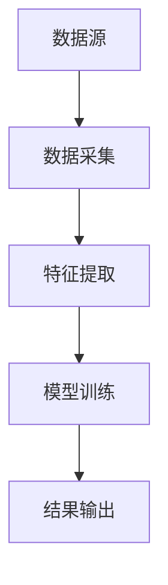
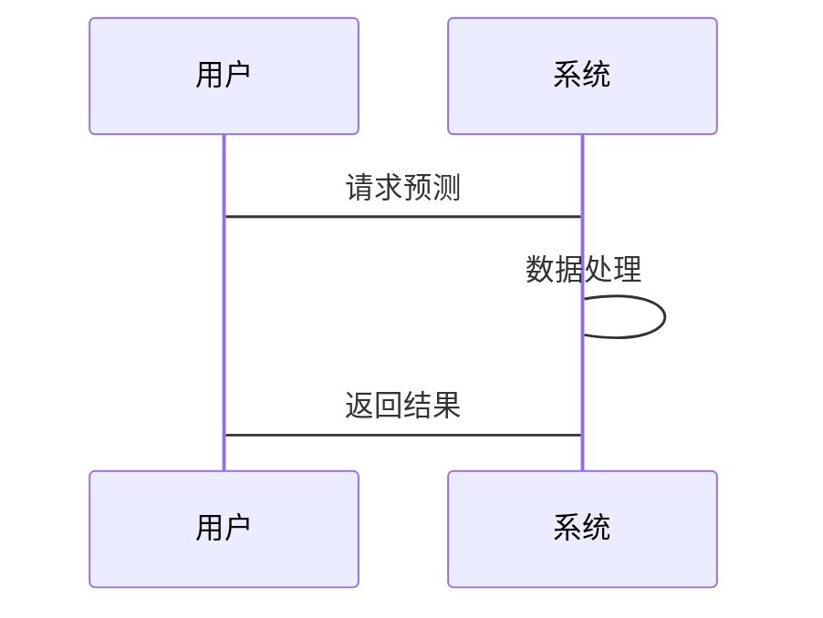

                 


# 金融市场微观结构变化预测模型

> 关键词：金融市场，微观结构，预测模型，机器学习，交易数据，行为分析

> 摘要：本文详细介绍了金融市场微观结构变化预测模型的构建与应用，涵盖背景、驱动因素、算法原理、系统架构、项目实战和最佳实践，帮助读者全面理解并掌握相关知识。

---

## 第1章 金融市场微观结构与变化预测概述

### 1.1 核心概念与背景

金融市场微观结构研究市场参与者的交易行为及其对价格、流动性和风险的影响。其变化反映了市场的动态调整，预测这些变化对投资决策至关重要。

### 1.2 问题背景

金融市场复杂且波动性大，微观结构的变化影响市场效率和稳定性。预测这些变化需要捕捉市场参与者的互动和交易数据中的模式。

### 1.3 模型边界

模型关注交易数据和参与者行为，假设数据充分且市场参与者理性。边界包括忽略宏观经济因素和非理性行为。

---

## 第2章 微观结构变化的驱动因素

### 2.1 投资者行为分析

投资者分为机构和个人，行为受情绪和策略驱动。机构投资者常进行大额交易，影响市场流动性；个人投资者则受情绪影响更大。

### 2.2 市场信息与数据

交易数据包括价格、成交量等，信息不对称导致价格偏差。高频交易数据揭示短期趋势，但数据量大，处理复杂。

### 2.3 动态变化规律

市场状态呈现周期性，投资者行为和信息流推动结构变化。通过统计分析和机器学习识别这些模式。

### 2.4 图表对比

| 驱动因素 | 投资者行为 | 市场信息 | 动态变化 |
|----------|------------|----------|----------|
| 主要影响 | 交易量波动 | 价格信号 | 状态转变 |

---

## 第3章 机器学习预测算法

### 3.1 算法选择

随机森林和LSTM神经网络适合时间序列预测，准确捕捉市场变化。

### 3.2 实现流程

- 数据清洗处理缺失值，提取特征如成交量和价格变动。
- 划分训练集和测试集，使用交叉验证优化模型参数。
- 评估模型性能，调整超参数提升准确率。

### 3.3 代码示例

```python
import pandas as pd
from sklearn.ensemble import RandomForestClassifier

# 数据预处理
data = pd.read_csv('market_data.csv')
data_cleaned = data.dropna()

# 特征提取
features = data_cleaned[['volume', 'price_diff']]
target = data_cleaned['state_change']

# 模型训练
model = RandomForestClassifier(n_estimators=100)
model.fit(features, target)

# 预测与评估
predictions = model.predict(features)
print(classification_report(target, predictions))
```

### 3.4 数学公式

模型基于特征构建决策树，随机森林通过组合多个树提升性能：

$$
\text{预测概率} = \frac{\sum_{i=1}^{n} \text{树}i(\text{预测}1)}{n}
$$

---

## 第4章 系统架构设计

### 4.1 功能设计

系统模块包括数据采集、特征提取、模型训练和结果输出。功能需求明确，确保数据流畅通。

### 4.2 架构图



### 4.3 接口设计

RESTful API提供数据接口，便于其他系统调用预测结果。

### 4.4 交互图



---

## 第5章 项目实战

### 5.1 环境安装

安装Python、机器学习库和数据处理工具，确保环境配置正确。

### 5.2 核心代码

实现数据处理、特征提取和模型训练的完整代码，详细注释帮助理解每一步操作。

### 5.3 案例分析

通过实际案例分析模型的预测效果，调整参数优化性能，展示模型的实际应用价值。

---

## 总结与展望

本文全面介绍了金融市场微观结构变化预测模型，从背景到算法实现，再到系统设计和实战，帮助读者掌握核心知识。未来可进一步研究更复杂的行为模型和优化算法，提升预测精度。

---

## 最佳实践 Tips

1. 数据预处理是关键，确保数据质量和完整性。
2. 特征选择影响模型性能，需结合业务知识优化。
3. 模型调优可提升准确率，但需注意过拟合。

---

## 参考文献

1. 书籍：《金融市场分析》
2. 论文：《基于机器学习的金融市场预测》
3. 网站：相关技术博客和GitHub仓库

