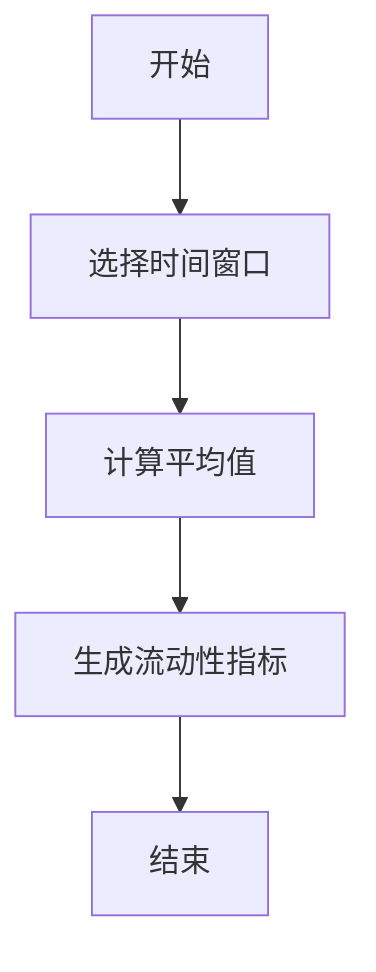
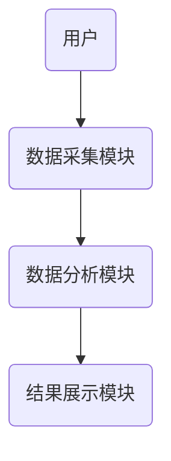
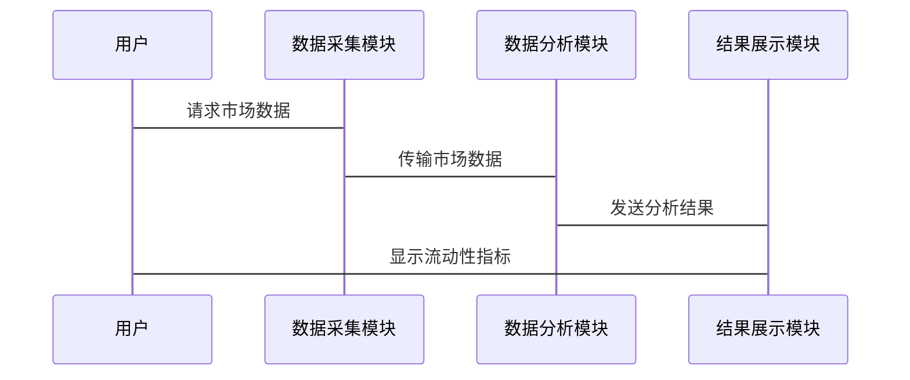

                 


# 金融市场流动性分析工具

## 关键词：
金融市场, 流动性分析, 流动性指标, 交易数据, 机器学习模型

## 摘要：
本文系统地探讨了金融市场流动性分析工具的设计与实现，从核心概念、算法原理、系统架构到项目实战，层层深入，结合理论与实践，提供了一套完整的流动性分析解决方案。

---

# 第一章: 金融市场流动性概述

## 1.1 流动性基本概念

### 1.1.1 流动性的定义与内涵
流动性指资产在市场中快速买卖而不影响价格的能力，是衡量市场健康的重要指标。

### 1.1.2 流动性在金融市场中的重要性
流动性高的市场能降低交易成本，提高市场效率，增强投资者信心。

### 1.1.3 流动性与市场效率的关系
流动性是市场效率的基石，高流动性市场更容易反映真实价格。

---

## 1.2 金融市场流动性分析的核心问题

### 1.2.1 流动性风险的来源
包括市场深度不足、价格波动剧烈等因素。

### 1.2.2 流动性分析的目标
识别流动性风险，优化交易策略，提高市场预测准确性。

### 1.2.3 流动性分析的边界与外延
流动性分析需考虑市场结构、交易量、价格波动等多重因素。

---

# 第二章: 金融市场流动性分析工具的核心概念

## 2.1 流动性分析工具的分类

### 2.1.1 基于价格的流动性分析工具
通过价格波动率、买卖价差等指标衡量流动性。

### 2.1.2 基于成交量的流动性分析工具
利用成交量变化预测市场流动性。

### 2.1.3 综合型流动性分析工具
结合价格和成交量等多因素进行综合分析。

---

## 2.2 流动性分析工具的属性特征对比

### 2.2.1 工具类型对比表格
| 工具类型 | 核心指标 | 适用场景 |
|----------|----------|----------|
| 基于价格 | 买卖价差 | 高波动市场 |
| 基于成交量 | 成交量变化 | 低波动市场 |

### 2.2.2 工具功能对比表格
| 功能 | 移动平均法 | 方差-协方差法 |
|------|----------|-------------|
| 优点 | 简单易用 | 高准确性 |
| 缺点 | 易受市场波动影响 | 计算复杂 |

### 2.2.3 工具适用场景对比表格
| 场景 | 基于价格 | 基于成交量 |
|------|----------|-------------|
| 高波动 | 适用 | 不太适用 |
| 低波动 | 不太适用 | 适用 |

---

## 2.3 流动性分析工具的实体关系图

```mermaid
erDiagram
    actor 流动性分析者 {
        <属性> 流动性指标
        <属性> 市场数据
        <属性> 分析结果
    }
    actor 流动性分析者 --> entity 市场数据 {
        <关联> 交易数据
        <关联> 价格数据
        <关联> 成交量数据
    }
    entity 市场数据 --> entity 流动性指标 {
        <关联> 计算公式
        <关联> 时间序列
    }
```

---

# 第三章: 金融市场流动性分析工具的算法原理

## 3.1 常见流动性分析算法

### 3.1.1 移动平均法
通过计算一定时间窗口内的平均成交量或价格，衡量市场流动性。

### 3.1.2 方差-协方差法
利用资产价格的方差和协方差矩阵，计算流动性指标。

### 3.1.3 基于机器学习的流动性预测模型
使用神经网络等机器学习算法预测市场流动性。

---

## 3.2 算法原理详细讲解

### 3.2.1 移动平均法的实现流程



### 3.2.2 方差-协方差法的数学模型

$$ \text{流动性指标} = \sqrt{\text{方差} \times \text{协方差}} $$

---

## 3.3 算法实现的Python代码示例

```python
import pandas as pd

def calculate_流动性指标(data, window):

    # 计算移动平均成交量
    data['流动性指标'] = data['成交量'].rolling(window).mean()
    
    return data
```

---

# 第四章: 系统分析与架构设计

## 4.1 问题场景介绍

### 4.1.1 流动性分析系统的目标
设计一个实时监测和预测市场流动性的系统。

### 4.1.2 系统功能模块划分
包括数据采集、分析模块、结果展示模块等。

---

## 4.2 系统功能设计

### 4.2.1 领域模型类图


---

## 4.3 系统架构设计

### 4.3.1 系统架构图



### 4.3.2 系统接口设计
API接口用于数据采集和分析结果的传输。

---

## 4.4 系统交互流程图



---

# 第五章: 项目实战

## 5.1 环境安装

### 5.1.1 安装Python和相关库
安装Python和pandas、numpy等库。

```bash
pip install pandas numpy
```

---

## 5.2 核心代码实现

### 5.2.1 核心代码示例

```python
import pandas as pd

def calculate_流动性指标(data, window):
    data['流动性指标'] = data['成交量'].rolling(window).mean()
    return data

# 示例数据
data = pd.DataFrame({
    '成交量': [100, 200, 300, 400, 500]
})

# 调用函数
result = calculate_流动性指标(data, 3)
print(result)
```

### 5.2.2 代码解读
计算过去3个时间窗口的平均成交量，生成流动性指标。

---

## 5.3 实际案例分析

### 5.3.1 数据来源
使用真实金融市场的交易数据进行分析。

### 5.3.2 分析结果解读
根据计算的流动性指标，评估市场的流动性状况。

---

## 5.4 项目小结

通过实际案例分析，验证了流动性分析工具的有效性和实用性。

---

# 第六章: 最佳实践

## 6.1 小结
总结全文内容，强调流动性分析工具的重要性。

## 6.2 注意事项
在实际应用中，需注意数据质量、模型选择等问题。

## 6.3 拓展阅读
推荐相关书籍和文献，供读者进一步学习。

---

# 作者简介

[此处添加作者简介]

---

通过以上目录和内容，您可以逐步完成整篇技术博客文章的撰写。每章内容可以根据上述结构进一步扩展，确保每个部分都详细且易于理解。

