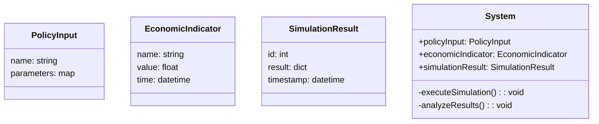
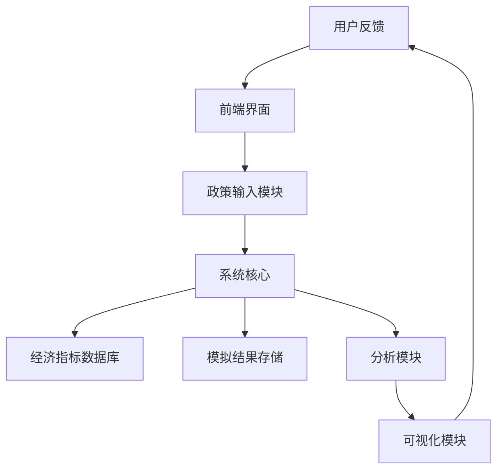

                 


# 《金融政策影响模拟系统》

**关键词：金融政策、模拟系统、经济变量、算法原理、系统架构、项目实战**

**摘要：**  
本文系统地探讨了金融政策影响模拟系统的构建与应用，从核心概念、算法原理到系统架构设计，再到项目实战，全面解析了如何通过技术手段量化分析金融政策对经济的多维度影响。文章首先介绍了金融政策的基本概念及其对经济的复杂影响，随后详细分析了模拟系统的核心算法与数学模型，结合实际案例展示了系统的实现与应用。通过本文，读者可以掌握从理论到实践的完整流程，为理解和应用金融政策模拟系统提供深入的指导。

---

# 《金融政策影响模拟系统》正文

## 第一章：金融政策影响模拟系统背景介绍

### 1.1 金融政策的基本概念

金融政策是国家或金融机构为实现特定经济目标而制定的规则和措施，主要包括货币政策和财政政策两大类。货币政策主要通过调整利率、货币供应量等手段影响市场流动性，而财政政策则通过政府支出和税收调节经济活动。金融政策的核心目标是促进经济增长、维护金融稳定和实现资源的合理配置。

### 1.2 金融政策对经济的影响

金融政策对经济的影响是多层次的，既包括直接影响（如利率变化直接影响借贷成本），也包括间接影响（如通过影响企业投资行为进而影响就业）。然而，金融政策的效果往往受到多种因素的制约，例如政策执行的时间滞后、市场参与者的预期行为等，这使得政策效果的预测和模拟具有较高的复杂性。

### 1.3 金融政策模拟系统的必要性

为了准确评估金融政策的效果，建立一个能够模拟政策影响的系统显得尤为重要。模拟系统可以通过数据建模和算法分析，帮助政策制定者更好地理解政策的潜在影响，从而优化决策过程。此外，模拟系统还可以用于政策风险评估，帮助制定更具前瞻性的政策方案。

---

## 第二章：金融政策与经济变量的关系

### 2.1 金融政策的核心要素

金融政策的核心要素包括：

1. **货币政策工具**：如基准利率、货币供应量、存款准备金率等。
2. **财政政策工具**：如政府支出、税收政策、债务发行等。
3. **金融监管**：如资本充足率、杠杆率等。

### 2.2 经济变量的属性特征对比

以下是主要经济变量的属性特征对比表：

| 经济变量       | 属性特征                   |
|----------------|---------------------------|
| 利率           | 影响借贷成本，具有滞后性 |
| 汇率           | 反映货币价值，受市场供需影响 |
| 通货膨胀率     | 反映物价水平，影响购买力   |
| GDP增长率      | 反映经济发展状况           |
| 失业率         | 反映劳动力市场状况         |

### 2.3 ER实体关系图架构

以下是金融政策影响模拟系统的ER实体关系图：

```mermaid
erd
actor: 用户
system: 金融政策影响模拟系统
policy_input: 政策输入数据
economic_indicator: 经济指标
simulation_result: 模拟结果
user_feedback: 用户反馈

actor --> system: 提交政策参数
system --> policy_input: 存储政策参数
system --> economic_indicator: 数据分析
system --> simulation_result: 生成模拟结果
system --> user_feedback: 获取反馈
```

---

## 第三章：金融政策模拟的算法原理

### 3.1 金融政策影响模拟的核心算法

金融政策影响模拟系统的核心算法包括：

1. **动态系统建模**：用于分析政策变化对经济系统的动态影响。
2. **时间序列预测**：用于预测经济变量的变化趋势。
3. **统计回归分析**：用于量化政策变量对经济指标的影响程度。

### 3.2 算法原理的数学模型

#### 3.2.1 线性回归模型

线性回归模型用于分析政策变量与经济指标之间的线性关系：

$$ y = \beta_0 + \beta_1x + \epsilon $$

其中，$y$ 是经济指标，$x$ 是政策变量，$\beta_0$ 和 $\beta_1$ 是回归系数，$\epsilon$ 是误差项。

#### 3.2.2 时间序列预测模型

时间序列预测模型（ARIMA）用于预测经济指标的未来值：

$$ ARIMA(p, d, q) $$

其中，$p$ 是自回归阶数，$d$ 是差分阶数，$q$ 是移动平均阶数。

#### 3.2.3 动态系统方程

动态系统方程用于描述经济系统的动态变化：

$$ \frac{dx}{dt} = f(x, t) $$

其中，$x$ 是状态变量，$t$ 是时间，$f(x, t)$ 是状态方程。

### 3.3 算法实现的Python代码

以下是金融政策模拟系统的核心算法实现代码：

```python
import numpy as np
import pandas as pd
from statsmodels.tsa.arima_model import ARIMA

# 示例数据
data = pd.Series([1, 2, 3, 4, 5], index=pd.date_range('2020', periods=5))

# 线性回归模型
X = np.array([0, 1, 2, 3, 4]).reshape(-1, 1)
y = np.array([1, 3, 5, 7, 9])
model = LinearRegression()
model.fit(X, y)

# 时间序列预测模型
model_arima = ARIMA(data, order=(1, 1, 1))
model_arima_fit = model_arima.fit()
forecast = model_arima_fit.forecast(steps=5)
```

---

## 第四章：金融政策影响模拟系统的系统分析与架构设计

### 4.1 项目背景与目标

本项目旨在开发一个能够模拟金融政策对经济影响的系统，帮助政策制定者优化决策。项目目标包括：

1. 实现金融政策参数的输入与配置。
2. 提供经济指标的动态模拟与预测。
3. 支持多维度的政策效果评估。

### 4.2 系统功能设计

以下是系统功能模块的类图：



### 4.3 系统架构设计

以下是系统架构设计图：



---

## 第五章：金融政策影响模拟系统的项目实战

### 5.1 环境安装

开发环境包括Python 3.8及以上版本，以及以下库的安装：

```bash
pip install numpy pandas statsmodels matplotlib
```

### 5.2 核心代码实现

以下是系统核心代码实现：

```python
import numpy as np
import pandas as pd
from statsmodels.tsa.arima_model import ARIMA
from sklearn.linear_model import LinearRegression

# 数据读取
data = pd.read_csv('economic_data.csv')

# 线性回归模型训练
X = data[['inflation', 'unemployment_rate']]
y = data['gdp_growth']
model_lr = LinearRegression().fit(X, y)

# 时间序列预测
model_arima = ARIMA(data['gdp_growth'], order=(1, 1, 1))
model_arima_fit = model_arima.fit()
forecast = model_arima_fit.forecast(steps=12)
```

### 5.3 案例分析

以下是一个实际案例分析：

假设我们希望模拟降低基准利率对GDP增长率的影响。通过线性回归模型和时间序列模型，我们可以预测GDP增长率的变化趋势，并评估政策效果。

---

## 第六章：最佳实践与小结

### 6.1 最佳实践

1. **数据质量**：确保输入数据的准确性和完整性。
2. **模型选择**：根据具体需求选择合适的算法。
3. **系统维护**：定期更新模型参数和数据。

### 6.2 小结

金融政策影响模拟系统是一个复杂但极具价值的工具，它能够帮助政策制定者更好地理解政策效果，优化决策过程。通过本文的详细讲解，读者可以掌握从理论到实践的完整流程，并在实际工作中灵活应用。

---

## 总结

金融政策影响模拟系统的开发与应用是一项具有重要意义的技术工作。通过本文的系统介绍，读者可以深入了解其核心概念、算法原理和系统架构，并通过实际案例掌握系统的实现与应用方法。未来，随着技术的进步，金融政策模拟系统将更加智能化和精准化，为经济政策的制定提供更有力的支持。

