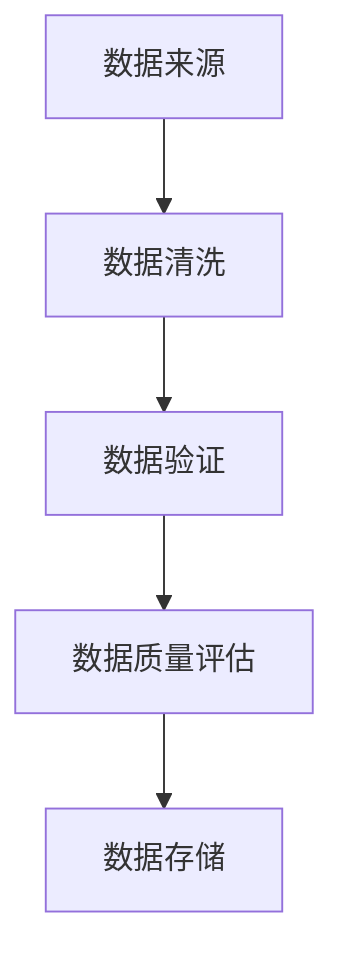
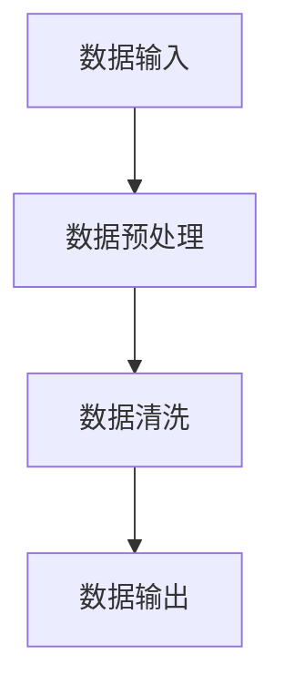
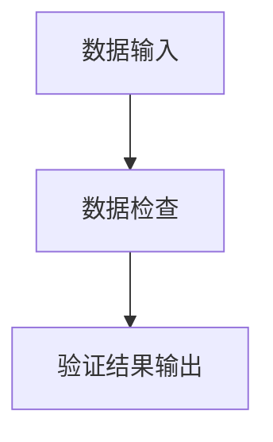
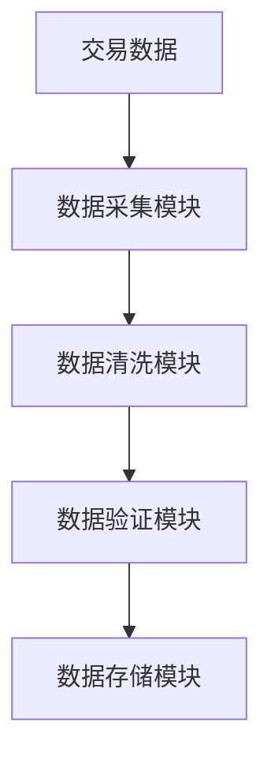
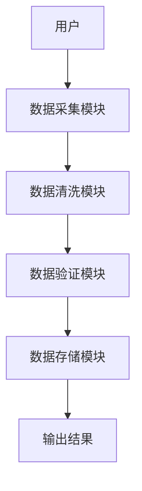

                 


# 《金融数据质量控制系统》

## 关键词：金融数据，数据质量管理，数据清洗，数据验证，数据安全，系统架构

## 摘要：  
金融数据质量控制系统是一种结合金融数据分析与数据质量管理的技术解决方案，旨在确保金融数据的准确性、完整性和一致性。本文从问题背景、核心概念、算法原理、系统架构到项目实战，全面剖析金融数据质量控制系统的构建过程，帮助读者理解如何通过技术手段解决金融数据质量问题。

---

# 第一部分: 金融数据质量控制的背景与挑战

## 第1章: 金融数据质量控制的背景与挑战

### 1.1 问题背景

#### 1.1.1 金融数据的重要性  
金融数据是金融机构进行交易、投资、风险管理等核心业务的基础。数据的准确性、完整性和一致性直接关系到金融机构的决策质量和业务风险。

#### 1.1.2 数据质量问题的现状  
在金融行业，数据质量问题普遍存在，主要表现为：  
- 数据缺失（Missing Data）：部分字段或记录未被完整记录。  
- 数据错误（Inconsistent Data）：数据格式、值域或关系不符合预期。  
- 数据重复（Duplicate Data）：同一数据多次出现，导致冗余。  
- 数据不完整（Incomplete Data）：数据记录不完整，影响分析结果。  

#### 1.1.3 数据质量问题带来的风险  
数据质量问题可能导致严重的经济损失和声誉损害。例如，错误的数据可能导致错误的交易决策，引发金融损失；数据不完整可能导致监管合规失败，面临法律风险。

### 1.2 问题描述

#### 1.2.1 数据完整性问题  
数据完整性是指数据是否完整、无遗漏。例如，交易记录中缺少关键字段（如交易时间、交易金额）。

#### 1.2.2 数据准确性问题  
数据准确性是指数据是否真实、无误。例如，客户信息中姓名或地址错误。

#### 1.2.3 数据一致性问题  
数据一致性是指数据在不同系统或不同记录中的表现是否一致。例如，同一客户的姓名在系统中出现不一致的拼写。

### 1.3 问题解决

#### 1.3.1 数据清洗的必要性  
数据清洗是通过技术手段对数据进行处理，消除数据中的错误、重复或不完整部分，以提高数据质量。

#### 1.3.2 数据验证的流程  
数据验证是对数据进行检查，确保数据符合预定义的规则和标准。例如，验证交易金额是否为正数，交易时间是否在合理范围内。

#### 1.3.3 数据质量管理的目标  
数据质量管理的目标是通过数据清洗和数据验证，确保数据的准确性、完整性和一致性，为后续数据分析和决策提供高质量的数据支持。

### 1.4 边界与外延

#### 1.4.1 数据质量管理的范围  
数据质量管理的范围包括数据采集、数据清洗、数据验证、数据存储和数据使用等环节。

#### 1.4.2 数据质量管理与数据治理的关系  
数据质量管理是数据治理的一部分，数据治理还包括数据安全、数据访问控制等更广泛的内容。

#### 1.4.3 数据质量管理的外延领域  
数据质量管理的外延领域包括数据可视化、数据分析、数据挖掘等。

### 1.5 核心要素组成

#### 1.5.1 数据来源  
数据来源包括内部系统（如交易系统、客户管理系统）和外部系统（如第三方数据供应商）。

#### 1.5.2 数据处理流程  
数据处理流程包括数据采集、数据清洗、数据验证、数据存储和数据使用。

#### 1.5.3 数据质量评估指标  
数据质量评估指标包括完整性、准确性、一致性、唯一性和及时性。

---

## 第2章: 数据质量管理的核心概念与联系

### 2.1 数据清洗原理

#### 2.1.1 数据清洗的基本步骤  
1. 数据采集：从多个数据源获取数据。  
2. 数据预处理：对数据进行初步清洗，例如删除重复数据、处理缺失值。  
3. 数据清洗：根据预定义的规则，对数据进行进一步清洗，例如修正错误字段、标准化数据格式。  

#### 2.1.2 数据清洗的数学模型  
数据清洗可以通过以下数学模型实现：  
$$
\text{清洗后数据} = \text{清洗规则}(\text{原始数据})
$$  
其中，清洗规则可以是数据过滤、数据转换、数据补充等操作。

#### 2.1.3 数据清洗的算法实现  
数据清洗的算法包括：  
- 数据过滤算法：根据预定义规则过滤不符合条件的数据。  
- 数据插值算法：处理缺失值，例如均值插值、中位数插值。  
- 数据标准化算法：将数据转换为统一的格式或单位。  

### 2.2 数据验证原理

#### 2.2.1 数据验证的规则  
数据验证规则包括：  
- 有效性检查：检查数据是否符合预期的格式和范围。  
- 唯一性检查：检查数据是否唯一。  
- 一致性检查：检查数据在不同系统或记录中的表现是否一致。  

#### 2.2.2 数据验证的逻辑  
数据验证的逻辑可以通过以下步骤实现：  
1. 数据输入：获取需要验证的数据。  
2. 数据检查：根据预定义的规则，对数据进行检查。  
3. 数据输出：输出验证结果，包括验证通过或验证失败。  

#### 2.2.3 数据验证的实现  
数据验证可以通过以下算法实现：  
$$
\text{验证结果} = \text{验证规则}(\text{输入数据})
$$  
其中，验证规则可以是正则表达式、条件判断等。

### 2.3 数据质量管理的流程

#### 2.3.1 数据采集  
数据采集是从多个数据源获取数据，例如从数据库、文件、API等。

#### 2.3.2 数据预处理  
数据预处理是对数据进行初步清洗，例如删除重复数据、处理缺失值。

#### 2.3.3 数据质量评估  
数据质量评估是对数据进行检查，确保数据符合预定义的质量标准。

---

## 第3章: 核心概念的对比与联系

### 3.1 数据清洗与数据验证的对比

| 对比维度 | 数据清洗 | 数据验证 |
|----------|----------|----------|
| 目标     | 修正数据错误 | 验证数据是否符合规则 |
| 方法     | 数据插值、数据标准化 | 数据过滤、正则表达式匹配 |
| 输入     | 原始数据 | 数据 |
| 输出     | 清洗后的数据 | 验证结果 |

### 3.2 数据质量管理的ER实体关系图



---

## 第4章: 数据清洗算法

### 4.1 数据清洗的流程



---

## 第5章: 数据验证的流程

### 5.1 数据验证的流程



---

## 第6章: 系统分析与架构设计

### 6.1 问题场景介绍

#### 6.1.1 需求分析  
需求分析包括：  
- 数据来源：银行交易数据。  
- 数据处理目标：清洗和验证交易数据，确保数据的完整性和准确性。  

#### 6.1.2 系统功能设计  
系统功能设计包括：  
- 数据采集模块：从数据库中读取交易数据。  
- 数据清洗模块：对交易数据进行清洗，处理缺失值、重复值。  
- 数据验证模块：对清洗后的数据进行验证，确保数据符合预期的格式和范围。  
- 数据存储模块：将清洗和验证后的数据存储到目标数据库中。  

### 6.2 系统架构设计



### 6.3 系统接口设计

#### 6.3.1 数据采集模块接口  
- 输入：数据库连接信息。  
- 输出：原始交易数据。  

#### 6.3.2 数据清洗模块接口  
- 输入：原始交易数据。  
- 输出：清洗后的交易数据。  

#### 6.3.3 数据验证模块接口  
- 输入：清洗后的交易数据。  
- 输出：验证结果。  

### 6.4 系统交互流程图



---

## 第7章: 项目实战

### 7.1 项目介绍

#### 7.1.1 项目目标  
项目目标是设计并实现一个金融数据质量控制系统，用于清洗和验证银行交易数据。

#### 7.1.2 项目需求  
项目需求包括：  
- 数据采集：从数据库中读取交易数据。  
- 数据清洗：处理缺失值、重复值。  
- 数据验证：验证交易金额是否为正数，交易时间是否在合理范围内。  
- 数据存储：将清洗和验证后的数据存储到目标数据库中。  

### 7.2 核心代码实现

#### 7.2.1 数据采集模块

```python
import pymysql

def extract_data():
    # 连接数据库
    conn = pymysql.connect(host='localhost', user='root', password='password', db='transaction_data')
    cursor = conn.cursor()
    # 查询数据
    cursor.execute('SELECT * FROM transactions')
    data = cursor.fetchall()
    conn.close()
    return data
```

#### 7.2.2 数据清洗模块

```python
def clean_data(data):
    # 处理缺失值
    cleaned_data = []
    for row in data:
        if row[1] is None:
            # 处理交易时间缺失值
            cleaned_row = (row[0], '1970-01-01', row[2], row[3])
        else:
            cleaned_row = row
        cleaned_data.append(cleaned_row)
    return cleaned_data
```

#### 7.2.3 数据验证模块

```python
def validate_data(data):
    valid_data = []
    for row in data:
        # 验证交易金额是否为正数
        if row[3] <= 0:
            continue
        # 验证交易时间是否在合理范围内
        if row[1] < '2020-01-01':
            continue
        valid_data.append(row)
    return valid_data
```

#### 7.2.4 数据存储模块

```python
def store_data(data):
    import pymysql
    conn = pymysql.connect(host='localhost', user='root', password='password', db='cleaned_data')
    cursor = conn.cursor()
    # 插入数据
    for row in data:
        cursor.execute('INSERT INTO transactions VALUES (%s, %s, %s, %s)', row)
    conn.commit()
    conn.close()
```

### 7.3 案例分析与代码解读

#### 7.3.1 数据采集模块  
数据采集模块从数据库中读取交易数据，返回原始数据。

#### 7.3.2 数据清洗模块  
数据清洗模块处理交易时间的缺失值，将缺失值设置为默认值'1970-01-01'。

#### 7.3.3 数据验证模块  
数据验证模块验证交易金额是否为正数，交易时间是否在合理范围内（例如，大于等于'2020-01-01'）。

#### 7.3.4 数据存储模块  
数据存储模块将清洗和验证后的数据存储到目标数据库中。

### 7.4 项目小结

#### 7.4.1 项目成果  
通过本项目，我们实现了金融数据质量控制系统的部分功能，包括数据采集、数据清洗、数据验证和数据存储。

#### 7.4.2 经验总结  
数据质量管理需要结合具体业务场景，制定合理的数据清洗和验证规则。同时，数据安全和数据隐私保护也是需要重点关注的内容。

---

## 第8章: 最佳实践与注意事项

### 8.1 最佳实践

#### 8.1.1 数据质量管理的注意事项  
- 数据质量管理需要结合业务场景，制定合理的数据清洗和验证规则。  
- 数据质量管理需要考虑数据安全和数据隐私保护。  

#### 8.1.2 数据质量管理的性能优化  
- 使用并行处理技术，提高数据清洗和验证的效率。  
- 使用分布式计算框架，处理大规模数据。  

### 8.2 小结

#### 8.2.1 核心思想回顾  
数据质量管理是金融数据分析的重要基础，通过数据清洗和数据验证，可以确保数据的准确性和一致性。

#### 8.2.2 拓展阅读  
- 数据质量管理的相关书籍：  
  - 《Data Quality: The Ultimate Step-by-Step Guide》  
  - 《Data Cleaning in Python: A Step-by-Step Guide》  

---

## 第9章: 附录

### 9.1 术语表

| 术语       | 定义                                   |
|------------|--------------------------------------|
| 数据清洗    | 对数据进行处理，消除数据中的错误、重复或不完整部分。 |
| 数据验证    | 对数据进行检查，确保数据符合预定义的规则和标准。 |
| 数据质量    | 数据的准确性、完整性和一致性。       |

### 9.2 参考文献

- [1] 数据质量管理相关文献  
- [2] 数据清洗和验证的算法实现  
- [3] 数据质量管理的系统架构设计  

---

# 结语

金融数据质量控制系统是金融数据分析的重要基础，通过数据清洗和数据验证，可以确保数据的准确性和一致性。本文从问题背景、核心概念、算法原理、系统架构到项目实战，全面剖析了金融数据质量控制系统的构建过程。希望读者通过本文能够理解如何通过技术手段解决金融数据质量问题，并在实际应用中取得良好的效果。

