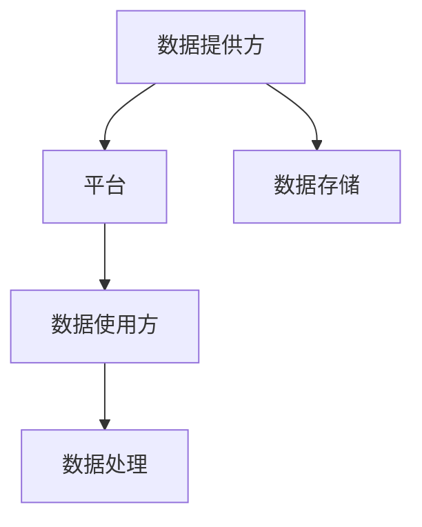
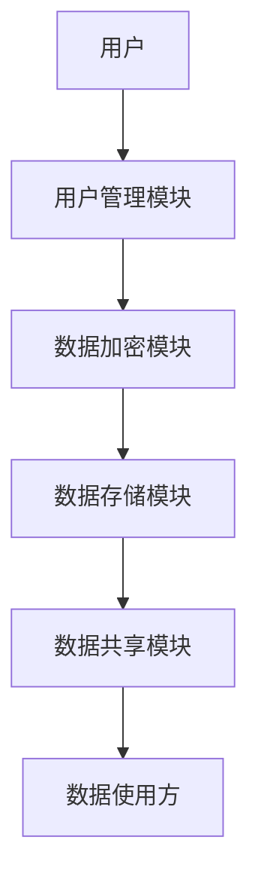

                 


# 《金融数据隐私保护与共享平台设计》

---

## 关键词
- 金融数据隐私保护
- 数据共享平台
- 数据加密技术
- 同态加密
- 安多方计

---

## 摘要
在金融行业，数据隐私保护是一个关乎国家安全、企业利益和用户信任的核心问题。随着数字化转型的加速，金融机构在数据共享与利用的同时，必须确保数据的安全性和隐私性。本文将系统性地探讨金融数据隐私保护与共享平台的设计，从背景分析、核心概念、技术实现到系统架构、项目实战，再到最佳实践，全面解析如何在保障数据隐私的前提下实现高效共享。通过本文，读者将能够理解金融数据隐私保护的重要性，掌握相关技术原理，设计并实现一个安全、合规的金融数据共享平台。

---

# 第一部分: 金融数据隐私保护与共享平台背景与概述

---

## 第1章: 金融数据隐私保护与共享平台概述

### 1.1 金融数据隐私保护的背景与问题背景
#### 1.1.1 金融数据的重要性与敏感性
金融数据是金融机构的核心资产，涉及用户隐私和商业机密。一旦泄露，可能导致严重的经济损失和声誉损害。例如，用户的账户信息、交易记录等数据，若被恶意利用，可能引发金融诈骗、身份盗用等问题。

#### 1.1.2 数据隐私保护的必要性
随着数据价值的凸显，数据泄露事件频发。金融机构在数据共享时，必须确保数据的安全性和隐私性。例如，某银行因数据泄露事件导致用户信息被滥用，最终面临巨额罚款和用户信任危机。

#### 1.1.3 共享平台的定义与目标
金融数据共享平台是一个支持金融机构之间高效、安全共享数据的平台。其目标是通过技术手段，在保障数据隐私的前提下，实现数据的共享和利用。例如，通过数据共享平台，银行可以与其他金融机构共享客户信用信息，降低金融风险。

---

### 1.2 金融数据隐私保护的核心问题
#### 1.2.1 数据泄露的风险
数据泄露是金融数据隐私保护的核心问题。攻击者可能通过钓鱼攻击、恶意软件等方式窃取数据。例如，2017年Equifax数据泄露事件导致数百万用户的个人信息被泄露。

#### 1.2.2 数据共享的挑战
数据共享需要在多个机构之间进行，但如何在共享数据的同时保护隐私是一个难题。例如，如何在共享客户交易记录的同时，避免暴露客户的隐私信息。

#### 1.2.3 平台设计的边界与外延
平台设计需要明确数据共享的边界，例如数据的范围、使用场景等。同时，平台还需要考虑未来可能的扩展性，例如支持更多类型的金融数据或更多机构的接入。

---

### 1.3 本章小结
本章通过分析金融数据隐私保护的背景和核心问题，明确了共享平台的目标和边界。下一章将深入探讨数据隐私保护的核心概念和技术原理。

---

## 第2章: 核心概念与联系

### 2.1 数据隐私保护的核心原理
#### 2.1.1 数据加密与访问控制
数据加密是保护数据隐私的核心技术之一。通过加密技术，可以确保数据在传输和存储过程中不被未经授权的人员访问。例如，使用AES加密算法对敏感数据进行加密。

#### 2.1.2 数据匿名化与脱敏技术
数据匿名化与脱敏技术通过去除或修改数据中的敏感信息，确保数据在共享过程中无法识别个人身份。例如，对用户的姓名和地址进行脱敏处理，使其无法还原出真实身份。

#### 2.1.3 数据共享的安全性保障
数据共享的安全性保障需要结合多种技术手段，例如加密、访问控制、匿名化等，确保数据在共享过程中不被滥用或泄露。

---

### 2.2 数据共享平台的实体关系与架构
#### 2.2.1 数据提供方、数据使用方和平台的角色划分
- 数据提供方：拥有数据的机构，例如银行。
- 数据使用方：需要数据的机构，例如保险公司。
- 平台：负责数据的存储、加密和共享的中立机构。

#### 2.2.2 数据流与平台交互的实体关系图


---

### 2.3 核心概念对比与属性特征
#### 2.3.1 数据隐私保护与数据共享的对比分析
| 属性 | 数据隐私保护 | 数据共享 |
|------|--------------|----------|
| 目标 | 防止数据泄露 | 实现数据共享 |
| 技术手段 | 加密、匿名化 | 访问控制、共享协议 |

#### 2.3.2 数据安全与数据可用性的平衡
数据安全是隐私保护的基础，但数据的可用性同样重要。例如，通过加密技术保障数据安全，同时通过访问控制确保数据的可用性。

---

### 2.4 本章小结
本章通过分析数据隐私保护的核心原理和平台架构，明确了数据共享的关键技术和角色划分。下一章将探讨数据隐私保护的法律与合规要求。

---

## 第3章: 数据隐私保护的法律与合规要求

### 3.1 金融数据隐私保护的法律法规
#### 3.1.1 GDPR等国际法规的启示
《通用数据保护条例》（GDPR）是欧盟的数据保护法规，要求企业必须采取措施保护用户数据隐私。例如，企业必须在用户数据泄露后72小时内通知监管机构。

#### 3.1.2 中国的金融数据保护政策
中国的《个人信息保护法》（PIPL）也对金融数据的保护提出了明确要求。例如，金融机构必须在收集用户数据时获得用户的明确同意。

#### 3.1.3 数据跨境流动的合规性要求
数据跨境流动需要符合相关法律法规。例如，中国的数据跨境流动必须符合《数据安全法》的要求，确保数据出境安全。

---

### 3.2 平台设计的合规性要求
#### 3.2.1 数据分类与分级管理
金融机构需要对数据进行分类和分级管理，例如将数据分为机密、敏感和公开三类。

#### 3.2.2 数据最小化原则
数据最小化原则要求在数据收集和使用过程中，只收集必要的数据。例如，用户登录时仅需要收集用户名和密码，不需要收集其他无关信息。

#### 3.2.3 用户同意与授权机制
用户必须明确同意数据的收集和使用。例如，用户在使用金融服务时，需要签署同意数据共享的协议。

---

### 3.3 本章小结
本章分析了金融数据隐私保护的法律法规和平台设计的合规要求。下一章将探讨数据隐私保护的技术与算法原理。

---

## 第4章: 数据隐私保护技术与算法原理

### 4.1 数据加密与同态加密
#### 4.1.1 加密算法的基本原理
加密算法通过对数据进行变换，使其在未授权的情况下无法被读取。例如，AES加密算法是一种常用的对称加密算法。

#### 4.1.2 同态加密技术
同态加密是一种特殊的加密技术，允许在加密数据上进行计算，而不需要解密数据。例如，使用同态加密技术可以在不泄露用户隐私的情况下进行数据分析。

#### 4.1.3 同态加密的实现步骤
1. 对数据进行加密。
2. 对加密数据进行计算。
3. 解密结果。

---

### 4.2 安多方计技术
#### 4.2.1 安多方计的定义
安多方计是一种在不泄露各方数据的前提下，计算各方数据联合结果的技术。例如，多个金融机构可以通过安多方计技术计算客户的信用评分，而不泄露各自的数据。

#### 4.2.2 安多方计的实现原理
1. 每个参与方对数据进行加密。
2. 各方将加密数据发送给计算方。
3. 计算方对加密数据进行计算，并将结果返回给参与方。

---

### 4.3 数据脱敏技术
#### 4.3.1 数据脱敏的定义
数据脱敏是一种通过去除或修改数据中的敏感信息，使其无法还原出真实身份的技术。例如，对用户的姓名进行脱敏处理，使其无法还原出真实姓名。

#### 4.3.2 数据脱敏的实现方法
1. 对数据进行替换，例如将用户姓名替换为代号。
2. 对数据进行哈希，例如对用户地址进行哈希处理。

---

### 4.4 本章小结
本章介绍了数据加密、安多方计和数据脱敏等技术，详细讲解了它们的实现原理和应用场景。下一章将探讨平台的系统架构设计。

---

## 第5章: 金融数据隐私保护与共享平台系统架构设计

### 5.1 系统功能设计
#### 5.1.1 平台功能模块划分
1. 数据存储模块：负责存储数据。
2. 数据加密模块：负责对数据进行加密。
3. 数据共享模块：负责数据的共享和访问控制。
4. 用户管理模块：负责用户身份验证和权限管理。

#### 5.1.2 系统功能流程
1. 用户登录：用户通过身份验证后，进入平台。
2. 数据加密：用户上传数据后，系统对数据进行加密。
3. 数据共享：用户选择共享的数据，系统对数据进行访问控制。
4. 数据使用：数据使用方在授权范围内使用数据。

---

### 5.2 系统架构设计
#### 5.2.1 系统架构图


#### 5.2.2 系统组件的交互流程
1. 用户登录：用户通过用户管理模块进行身份验证。
2. 数据加密：用户上传数据后，数据加密模块对数据进行加密。
3. 数据共享：用户选择共享的数据后，数据共享模块对数据进行访问控制。
4. 数据使用：数据使用方在授权范围内使用数据。

---

### 5.3 系统接口设计
#### 5.3.1 API接口设计
1. 用户登录接口：`POST /api/login`
2. 数据上传接口：`POST /api/upload`
3. 数据共享接口：`POST /api/share`

#### 5.3.2 接口交互流程
1. 用户调用登录接口进行身份验证。
2. 用户调用上传接口上传数据。
3. 用户调用共享接口共享数据。
4. 数据使用方调用接口使用数据。

---

### 5.4 本章小结
本章通过系统功能设计和架构设计，明确了平台的实现方案。下一章将探讨项目的实战实现。

---

## 第6章: 金融数据隐私保护与共享平台项目实战

### 6.1 项目环境搭建
#### 6.1.1 开发环境配置
1. 安装Python编程语言。
2. 安装Django框架。
3. 安装加密库，例如`cryptography`。

#### 6.1.2 数据库选择与搭建
1. 使用MySQL数据库存储数据。
2. 配置数据库连接。

---

### 6.2 核心代码实现
#### 6.2.1 数据加密模块实现
```python
from cryptography.fernet import Fernet

# 生成密钥
key = Fernet.generate_key()
cipher = Fernet(key)

# 加密数据
encrypted_data = cipher.encrypt(b"Sensitive financial data")
```

#### 6.2.2 数据共享模块实现
```python
from django.http import JsonResponse
from .models import Data

def share_data(request):
    if request.method == 'POST':
        data_id = request.POST.get('data_id')
        user = request.user
        data = Data.objects.get(id=data_id)
        # 验证用户权限
        if user.has_perm('view_data', data):
            return JsonResponse({'status': 'success', 'data': data.data})
        else:
            return JsonResponse({'status': 'error', 'message': 'Permission denied'})
```

---

### 6.3 项目运行与测试
#### 6.3.1 系统功能测试
1. 用户登录测试。
2. 数据上传测试。
3. 数据共享测试。
4. 数据使用测试。

#### 6.3.2 安全性测试
1. 数据加密测试。
2. 访问控制测试。
3. 数据脱敏测试。

---

### 6.4 本章小结
本章通过项目实战，详细讲解了平台的实现过程。下一章将总结最佳实践和注意事项。

---

## 第7章: 最佳实践与小结

### 7.1 设计原则与注意事项
1. 数据加密：确保数据在存储和传输过程中加密。
2. 访问控制：严格控制数据的访问权限。
3. 数据脱敏：对敏感数据进行脱敏处理。
4. 合规性：确保平台设计符合相关法律法规。

---

### 7.2 技术选型与未来展望
1. 技术选型：选择合适的数据加密和安多方计技术。
2. 未来展望：随着技术的发展，隐私保护技术将更加成熟。

---

### 7.3 小结
通过本文的系统性分析，读者可以全面理解金融数据隐私保护与共享平台的设计。平台设计需要结合法律法规、技术手段和最佳实践，确保数据的安全性和可用性。未来，随着技术的进步，隐私保护将更加重要，平台设计也将更加完善。

---

## 参考文献
1. GDPR - 《通用数据保护条例》
2. 《个人信息保护法》（PIPL）
3. 同态加密技术相关论文
4. 安多方计技术相关论文

---

通过本文的系统性分析，读者可以全面理解金融数据隐私保护与共享平台的设计。

