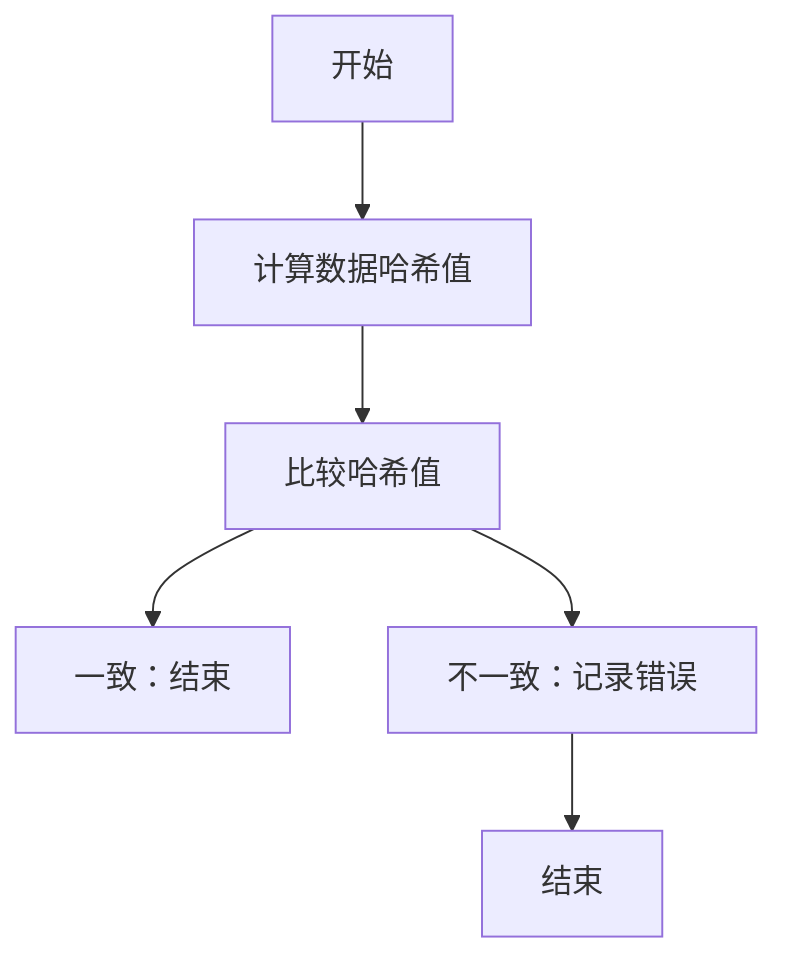
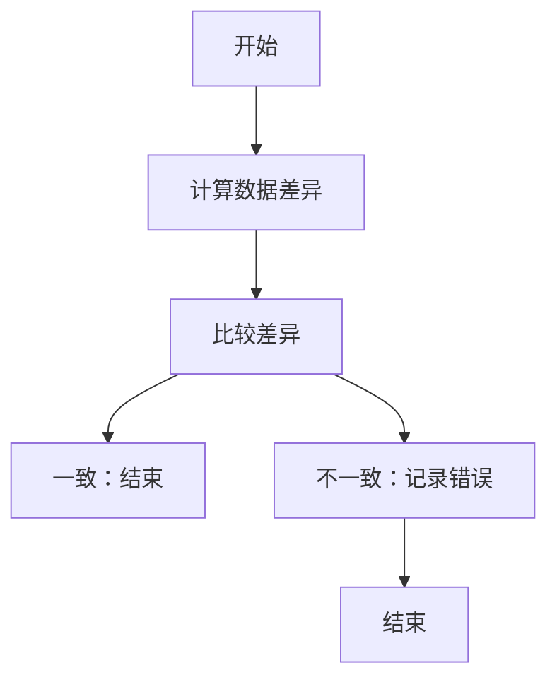
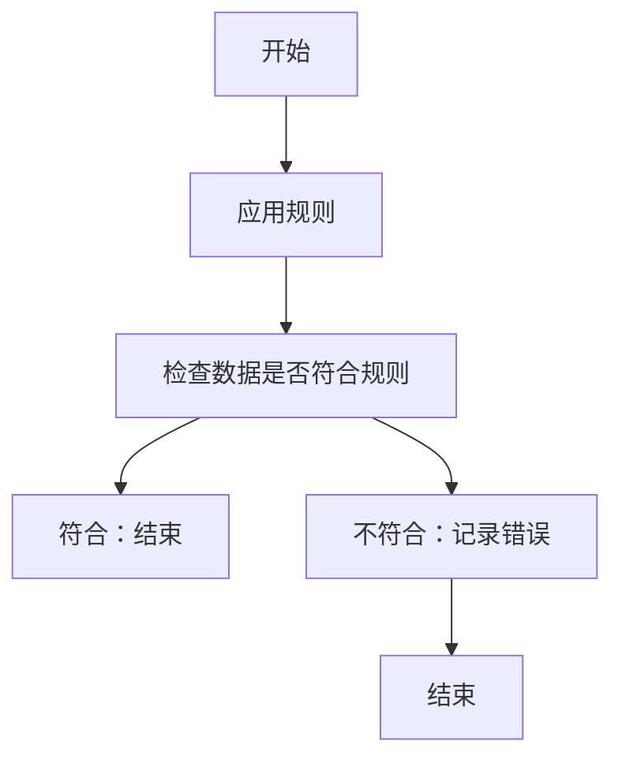
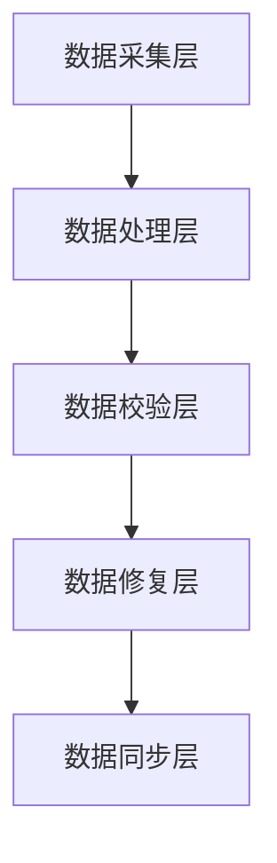
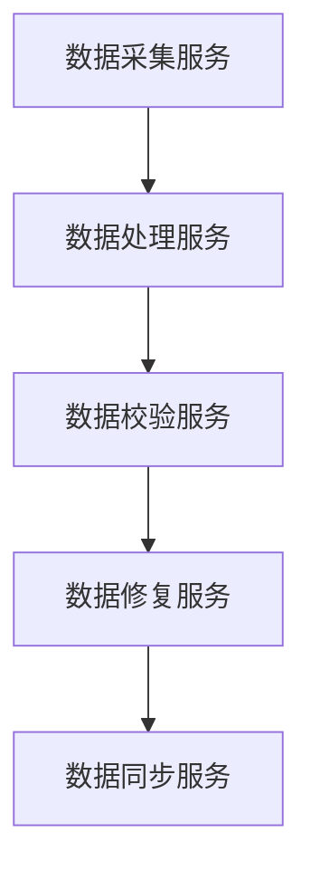
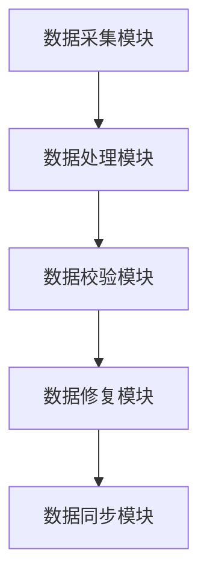
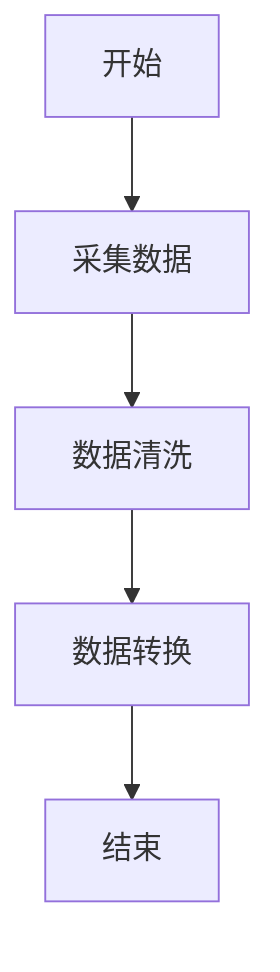
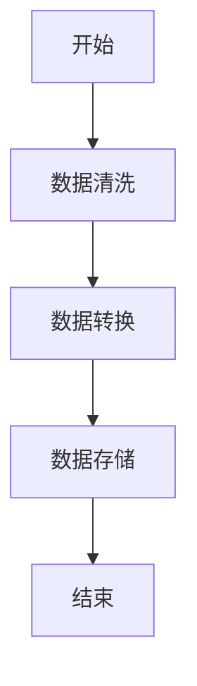
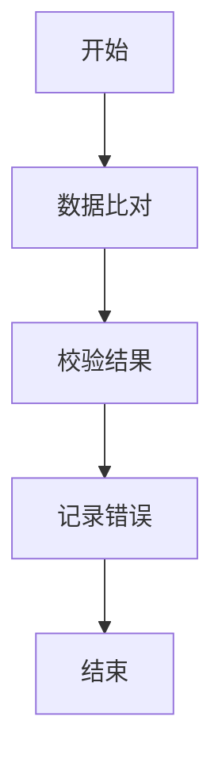
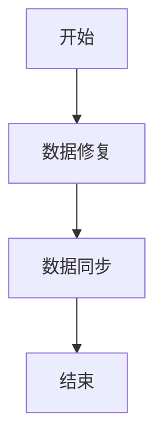

                 


# 《金融监管报告数据一致性检查工具》

---

## 关键词：
金融监管、数据一致性、数据校验、系统架构、算法原理、项目实战

---

## 摘要：
金融监管的核心目标是确保市场透明、公正和合规，而数据一致性是实现这一目标的基础。本文将深入探讨金融监管报告数据一致性检查工具的设计与实现，从背景、核心概念、算法原理到系统架构和项目实战，层层剖析，为读者提供一份全面的技术指南。通过本文，读者将掌握如何构建高效、可靠的金融数据一致性检查工具，确保金融数据的准确性和一致性。

---

## 第1章: 数据一致性检查的背景与意义

### 1.1 金融监管的重要性
金融监管是维护金融市场秩序、保护投资者利益的重要手段。金融监管的核心目标是确保金融机构的合规性、市场透明性和数据的准确性。

#### 1.1.1 金融监管的基本概念
金融监管是指通过对金融机构的业务、行为和数据进行监督和管理，确保其符合相关法律法规和行业标准。

#### 1.1.2 金融监管的核心目标
- 确保金融市场的稳定性和安全性。
- 保护投资者利益。
- 防范金融风险。

#### 1.1.3 数据一致性在金融监管中的作用
数据一致性是金融监管的基础，只有确保数据的准确性和一致性，才能保证监管决策的科学性和有效性。

### 1.2 数据一致性问题的背景
在金融领域，数据来源多样、格式复杂，数据不一致的问题时有发生，严重影响了金融监管的效果。

#### 1.2.1 数据不一致的常见原因
- 数据来源多样，不同系统记录的数据格式和内容不一致。
- 数据采集和处理过程中可能出现的错误或遗漏。
- 不同机构对数据的理解和定义可能存在差异。

#### 1.2.2 数据不一致对金融监管的影响
- 导致监管决策的错误或延迟。
- 影响金融市场的透明性和公信力。
- 增加金融机构的合规成本。

#### 1.2.3 数据一致性检查的必要性
通过数据一致性检查，可以及时发现和解决数据不一致的问题，确保金融监管的准确性和有效性。

### 1.3 本章小结
本章介绍了金融监管的重要性和数据一致性在金融监管中的关键作用，强调了数据一致性检查的必要性。

---

## 第2章: 数据一致性检查的核心概念

### 2.1 数据一致性检查的定义
数据一致性检查是指通过对数据的采集、处理和校验，确保不同数据源中的数据在内容、格式和含义上保持一致的过程。

#### 2.1.1 数据一致性的定义
数据一致性是指同一数据在不同系统或不同时间段内保持一致的状态。

#### 2.1.2 数据一致性检查的目标
- 确保数据的准确性和完整性。
- 发现和解决数据不一致的问题。
- 保证数据的可比性和一致性。

#### 2.1.3 数据一致性检查的范围
- 数据来源的多样性。
- 数据格式的标准化。
- 数据内容的准确性。

### 2.2 数据一致性检查的关键要素
数据一致性检查的关键要素包括数据模型、校验规则和校验算法。

#### 2.2.1 数据模型的特征对比
| 特征 | 数据模型A | 数据模型B | 数据模型C |
|------|------------|------------|------------|
| 数据来源 | 单一来源 | 多个来源 | 混合来源 |
| 数据格式 | 结构化 | 非结构化 | 混合结构 |
| 数据内容 | 标准化 | 非标准化 | 部分标准化 |

#### 2.2.2 数据校验规则的制定
数据校验规则是数据一致性检查的核心，主要包括以下几种规则：
- 字段校验规则：检查字段的格式和取值范围。
- 关联校验规则：检查数据之间的关联关系。
- 逻辑校验规则：检查数据是否符合业务逻辑。

#### 2.2.3 数据校验算法的原理
数据校验算法通过对数据的特征进行计算，生成校验码，用于数据的一致性检查。

### 2.3 数据一致性检查的实现原理
数据一致性检查的实现通常包括数据采集、数据清洗、数据校验和数据修复四个步骤。

#### 2.3.1 数据采集与清洗
数据采集是数据一致性检查的第一步，需要从多个数据源中采集数据，并进行清洗，确保数据的完整性和准确性。

#### 2.3.2 数据比对与校验
数据比对是通过比较不同数据源中的数据，发现数据不一致的问题。

#### 2.3.3 数据修复与同步
数据修复是通过调整数据使其一致，数据同步是将修复后的数据同步到各个数据源。

### 2.4 本章小结
本章详细介绍了数据一致性检查的核心概念，包括数据模型、校验规则和校验算法，并通过对比分析，帮助读者更好地理解数据一致性检查的关键要素。

---

## 第3章: 数据一致性检查的算法原理

### 3.1 数据一致性检查的算法概述
数据一致性检查的算法包括哈希校验、差分校验和基于规则的校验算法。

#### 3.1.1 常见的数据一致性检查算法
- 哈希校验算法：通过计算数据的哈希值，进行数据一致性检查。
- 差分校验算法：通过计算数据的差异，进行数据一致性检查。
- 基于规则的校验算法：根据预定义的规则，进行数据一致性检查。

#### 3.1.2 算法选择的依据
- 数据量的大小：哈希校验算法适用于大数据量，差分校验算法适用于小数据量。
- 数据类型的多样性：基于规则的校验算法适用于复杂数据类型。
- 计算效率：哈希校验算法计算效率高，差分校验算法计算效率较低。

#### 3.1.3 算法的优缺点对比
| 算法类型 | 优点 | 缺点 |
|----------|------|------|
| 哈希校验 | 计算效率高 | 无法定位具体不一致的位置 |
| 差分校验 | 可以定位不一致的位置 | 计算效率低 |
| 基于规则校验 | 可以根据业务规则进行校验 | 实现复杂 |

### 3.2 数据一致性检查的核心算法
#### 3.2.1 哈希校验算法
哈希校验算法通过计算数据的哈希值，进行数据一致性检查。以下是哈希校验算法的实现流程：



数学公式：
$$ hash(data) = \sum_{i=1}^{n} data[i] \times weight[i] $$

#### 3.2.2 差分校验算法
差分校验算法通过计算数据的差异，进行数据一致性检查。以下是差分校验算法的实现流程：



数学公式：
$$ diff(data1, data2) = |data1 - data2| $$

#### 3.2.3 基于规则校验算法
基于规则的校验算法根据预定义的规则，进行数据一致性检查。以下是基于规则校验算法的实现流程：



数学公式：
$$ rule(data) = \begin{cases} 
    true & \text{if } data \text{ 符合规则} \\
    false & \text{否则}
\end{cases} $$

### 3.3 本章小结
本章详细介绍了数据一致性检查的核心算法，包括哈希校验算法、差分校验算法和基于规则的校验算法，并通过mermaid流程图和数学公式，帮助读者理解算法的实现原理。

---

## 第4章: 数据一致性检查的系统架构设计

### 4.1 系统功能设计
数据一致性检查系统需要具备数据采集、数据处理、数据校验和数据修复功能。

#### 4.1.1 数据采集模块
数据采集模块负责从多个数据源中采集数据，确保数据的完整性和准确性。

#### 4.1.2 数据处理模块
数据处理模块负责对采集到的数据进行清洗和转换，使其符合数据一致性检查的要求。

#### 4.1.3 数据校验模块
数据校验模块负责根据预定义的校验规则，对数据进行一致性检查。

#### 4.1.4 数据修复模块
数据修复模块负责对不一致的数据进行修复，确保数据的一致性。

#### 4.1.5 数据同步模块
数据同步模块负责将修复后的数据同步到各个数据源。

### 4.2 系统架构设计
数据一致性检查系统的架构设计包括分层架构和微服务架构两种方式。

#### 4.2.1 分层架构设计
分层架构设计将系统划分为数据采集层、数据处理层、数据校验层和数据修复层。



#### 4.2.2 微服务架构设计
微服务架构设计将系统划分为多个独立的服务模块，包括数据采集服务、数据处理服务、数据校验服务和数据修复服务。



#### 4.2.3 组件间的交互关系
数据一致性检查系统的组件包括数据采集模块、数据处理模块、数据校验模块和数据修复模块，各模块之间的交互关系如下：



### 4.3 系统接口设计
数据一致性检查系统需要设计合理的接口，确保各模块之间的交互顺利进行。

#### 4.3.1 数据接口定义
数据接口定义包括数据输入格式、数据输出格式和接口调用方式。

#### 4.3.2 API接口设计
API接口设计包括数据采集接口、数据处理接口、数据校验接口和数据修复接口。

#### 4.3.3 接口安全设计
接口安全设计包括身份认证、权限控制和数据加密。

### 4.4 系统交互流程图
数据一致性检查系统的交互流程图包括数据采集流程、数据处理流程、数据校验流程和数据修复流程。

#### 4.4.1 数据采集流程图


#### 4.4.2 数据处理流程图


#### 4.4.3 数据校验流程图


#### 4.4.4 数据修复流程图


### 4.5 本章小结
本章详细介绍了数据一致性检查系统的功能设计、架构设计、接口设计和交互流程图，为读者提供了系统的整体框架和实现思路。

---

## 第5章: 数据一致性检查工具的项目实战

### 5.1 环境安装与配置
数据一致性检查工具的环境安装与配置包括安装必要的开发工具、安装依赖库和配置开发环境。

#### 5.1.1 开发工具安装
- 安装Python
- 安装Jupyter Notebook
- 安装Git

#### 5.1.2 依赖库安装
- 安装Pandas
- 安装NumPy
- 安装Scikit-learn

#### 5.1.3 开发环境配置
- 配置Python环境变量
- 配置Jupyter Notebook启动参数
- 配置Git配置文件

### 5.2 系统核心实现
数据一致性检查工具的核心实现包括数据采集、数据处理、数据校验和数据修复功能。

#### 5.2.1 数据采集实现
```python
import pandas as pd

def data_collection():
    # 从多个数据源中采集数据
    data1 = pd.read_csv('data1.csv')
    data2 = pd.read_csv('data2.csv')
    return data1, data2
```

#### 5.2.2 数据处理实现
```python
def data_processing(data1, data2):
    # 数据清洗和转换
    data1 = data1.dropna()
    data2 = data2.dropna()
    return data1, data2
```

#### 5.2.3 数据校验实现
```python
def data_validation(data1, data2):
    # 数据比对和校验
    differences = data1.compare(data2)
    return differences
```

#### 5.2.4 数据修复实现
```python
def data_repair(data1, data2, differences):
    # 数据修复
    repaired_data = data1.where(data1.notna(), data2)
    return repaired_data
```

### 5.3 代码应用解读与分析
数据一致性检查工具的核心代码包括数据采集、数据处理、数据校验和数据修复功能。

#### 5.3.1 数据采集模块
数据采集模块通过读取CSV文件，从多个数据源中采集数据。

#### 5.3.2 数据处理模块
数据处理模块对采集到的数据进行清洗和转换，确保数据的完整性和准确性。

#### 5.3.3 数据校验模块
数据校验模块通过对数据进行比对，发现数据不一致的问题。

#### 5.3.4 数据修复模块
数据修复模块对不一致的数据进行修复，确保数据的一致性。

### 5.4 实际案例分析
通过实际案例分析，验证数据一致性检查工具的 effectiveness。

#### 5.4.1 案例背景
某金融机构需要对两个数据源中的客户信息进行一致性检查。

#### 5.4.2 数据采集与处理
```python
data1, data2 = data_collection()
data1, data2 = data_processing(data1, data2)
```

#### 5.4.3 数据校验与修复
```python
differences = data_validation(data1, data2)
repaired_data = data_repair(data1, data2, differences)
```

#### 5.4.4 数据同步
```python
data_sync(repaired_data)
```

### 5.5 项目小结
本章通过实际案例分析，详细介绍了数据一致性检查工具的实现过程，包括环境安装、核心代码实现和案例分析。

---

## 第6章: 数据一致性检查工具的总结与展望

### 6.1 本章总结
本章总结了数据一致性检查工具的核心概念、算法原理和系统架构设计，并通过实际案例分析，验证了工具的有效性。

### 6.2 未来展望
未来，数据一致性检查工具将在以下几个方面进行优化和扩展：
- 数据源的多样性：支持更多类型的数据源。
- 数据格式的多样性：支持更多类型的数据格式。
- 数据校验规则的多样性：支持更多类型的数据校验规则。
- 数据修复算法的优化：提高数据修复的效率和准确性。

### 6.3 最佳实践 tips
- 数据一致性检查工具的设计需要考虑数据源的多样性和数据格式的多样性。
- 数据校验规则的制定需要结合业务需求和行业标准。
- 数据修复算法的实现需要考虑数据修复的效率和准确性。

### 6.4 本章小结
本章总结了数据一致性检查工具的核心内容，并展望了未来的发展方向，为读者提供了进一步研究和实践的参考。

---

## 附录

### 附录A: 数据一致性检查工具的术语表
- 数据一致性：数据在不同系统或时间段内保持一致的状态。
- 数据校验：通过对数据进行检查，确保数据的准确性和一致性。
- 数据修复：对不一致的数据进行调整，使其保持一致。

### 附录B: 数据一致性检查工具的安装指南
- 安装Python和相关依赖库。
- 下载数据一致性检查工具的源代码。
- 配置开发环境并运行工具。

### 附录C: 数据一致性检查工具的参考文献
- [1] 《金融监管数据一致性检查工具的设计与实现》
- [2] 《数据一致性检查算法的研究与应用》
- [3] 《基于规则的金融数据一致性检查系统》

---

# 结语
数据一致性检查是金融监管的核心环节，通过本文的详细讲解，读者可以掌握数据一致性检查工具的设计与实现方法，并能够将其应用到实际的金融监管工作中。未来，随着金融市场的不断发展，数据一致性检查工具将发挥越来越重要的作用。

