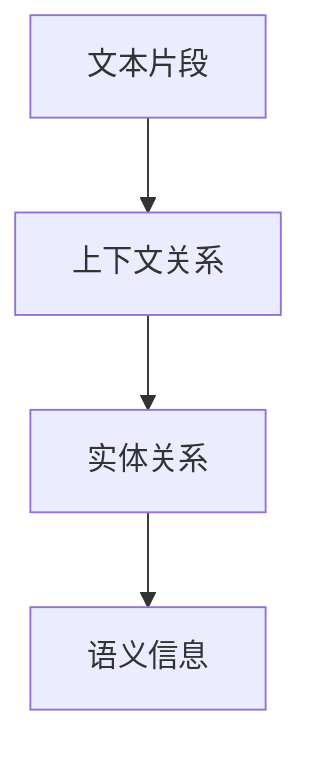
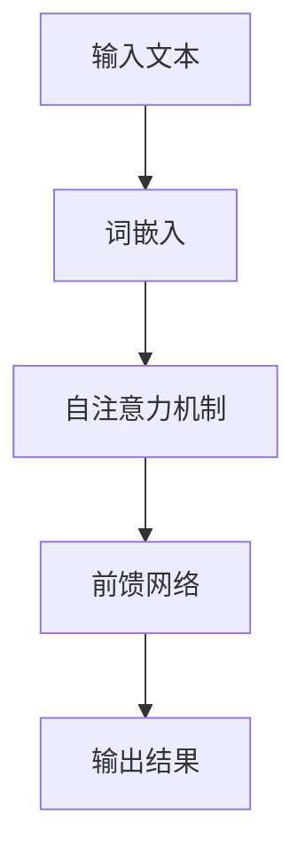
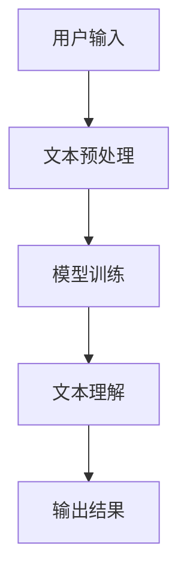
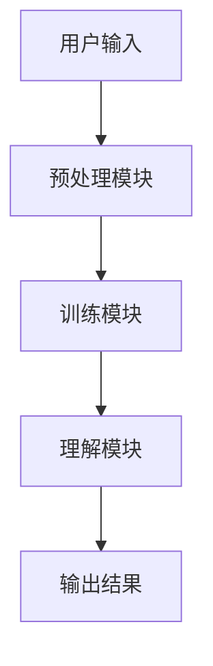

                 


# 长文本理解：增强AI Agent的阅读能力

> 关键词：长文本理解、AI Agent、自然语言处理、知识图谱、深度学习、系统架构

> 摘要：本文深入探讨了长文本理解在AI Agent中的应用，分析了其核心概念、算法原理、系统架构设计及项目实战，旨在提升AI Agent的阅读能力，增强其在复杂场景中的理解和执行能力。

---

# 第一部分: 长文本理解的背景与核心概念

## 第1章: 长文本理解的背景与问题背景

### 1.1 长文本理解的背景介绍

#### 1.1.1 从短文本到长文本的演进

短文本处理在自然语言处理（NLP）中占据重要地位，但随着技术的发展，长文本理解的需求日益增长。长文本指的是长度较长的连续文本，如书籍章节、学术论文、报告等。长文本理解能够捕捉上下文信息，识别隐含关系，是实现AI Agent复杂任务的基础。

#### 1.1.2 长文本理解的定义与特点

长文本理解是指对长度较长的文本进行解析、理解和生成的过程。其特点包括：

1. **上下文依赖性**：长文本理解依赖于上下文信息，需要处理复杂的语义关系。
2. **信息密度高**：长文本中包含大量信息，需要高效提取关键内容。
3. **任务多样性**：长文本理解可以应用于文本摘要、问答系统、信息提取等多种任务。

#### 1.1.3 长文本理解的边界与外延

长文本理解的边界包括：

1. **输入范围**：限定在一定长度的文本范围内。
2. **处理能力**：仅限于理解任务，不涉及生成任务。
3. **应用场景**：主要应用于需要深度理解和上下文推理的场景。

外延包括：

1. **知识图谱构建**：通过长文本理解提取实体关系，构建知识图谱。
2. **多模态交互**：结合图像、语音等多模态信息，提升理解能力。
3. **实时处理**：优化长文本处理的效率，实现实时响应。

### 1.2 AI Agent与长文本理解的关系

#### 1.2.1 AI Agent的定义与特点

AI Agent是一种智能体，能够在特定环境中感知、推理、决策和执行任务。其特点包括：

1. **自主性**：能够自主完成任务。
2. **反应性**：能够实时感知环境变化并做出反应。
3. **社会性**：能够与其他Agent或人类进行交互。

#### 1.2.2 长文本理解在AI Agent中的作用

长文本理解是AI Agent实现复杂任务的核心能力之一。通过长文本理解，AI Agent可以：

1. **理解上下文**：在对话中捕捉历史信息，提供更准确的响应。
2. **知识库构建**：从大量文本中提取信息，构建知识库，辅助决策。
3. **任务执行**：通过理解长文本中的指令，执行复杂任务。

#### 1.2.3 长文本理解的挑战与机遇

挑战包括：

1. **计算资源需求高**：长文本处理需要大量计算资源。
2. **模型复杂性**：长文本理解模型复杂，训练难度大。
3. **数据稀疏性**：长文本数据获取困难，标注成本高。

机遇包括：

1. **技术进步**：深度学习技术的发展为长文本理解提供了新方法。
2. **应用场景丰富**：长文本理解在医疗、法律、教育等领域有广泛应用。
3. **工具支持**：开源框架（如Hugging Face）为长文本理解提供了技术支持。

### 1.3 本章小结

本章介绍了长文本理解的背景、定义、特点及其在AI Agent中的作用。长文本理解是实现智能体复杂任务的基础，但也面临诸多挑战。通过技术进步和工具支持，长文本理解将在更多领域发挥重要作用。

---

## 第2章: 长文本理解的核心概念与联系

### 2.1 长文本理解的核心概念

#### 2.1.1 长文本理解的原理

长文本理解的原理包括：

1. **分段处理**：将长文本分割成较小的片段，分别处理。
2. **上下文建模**：利用模型捕捉文本中的上下文关系。
3. **注意力机制**：通过注意力机制聚焦关键部分，提升理解能力。

#### 2.1.2 长文本理解的关键特征对比表

| 特征 | 短文本理解 | 长文本理解 |
|------|------------|------------|
| 输入长度 | 短 | 长 |
| 上下文依赖 | 低 | 高 |
| 处理复杂度 | 低 | 高 |
| 应用场景 | 简单任务（如情感分析） | 复杂任务（如文本摘要） |

#### 2.1.3 长文本理解的实体关系图（ER图）



### 2.2 长文本理解与相关技术的联系

#### 2.2.1 长文本理解与自然语言处理的关系

长文本理解是自然语言处理的重要分支，主要关注长文本的处理与理解。自然语言处理为长文本理解提供了基础理论和技术支持。

#### 2.2.2 长文本理解与知识图谱的结合

通过长文本理解提取实体关系，构建知识图谱，能够提升AI Agent的知识推理能力。

#### 2.2.3 长文本理解与深度学习的融合

深度学习技术（如Transformer、BERT）为长文本理解提供了强大的模型支持，使其在复杂场景中表现出色。

### 2.3 本章小结

本章详细介绍了长文本理解的核心概念及其与相关技术的联系。通过对比和图表分析，明确了长文本理解的关键特征和其在AI Agent中的重要作用。

---

## 第3章: 长文本理解的算法原理

### 3.1 常见的长文本理解算法

#### 3.1.1 基于Transformer的长文本理解

Transformer是一种基于自注意力机制的模型，能够捕捉文本中的全局关系。其核心公式为：

$$\text{Attention}(Q, K, V) = \text{softmax}\left(\frac{QK^T}{\sqrt{d_k}}\right)V$$

其中，$Q$、$K$、$V$分别为查询、键、值向量，$d_k$为键的维度。

#### 3.1.2 基于BERT的长文本理解

BERT（Bidirectional Encoder Representations from Transformers）是一种双向Transformer模型，能够同时捕捉文本的前向和后向关系。其数学表达式为：

$$\text{BERT}(x) = \text{multi-head\ attention}(x) + \text{position\ wise\ FFN}(x)$$

其中，$\text{multi-head\ attention}$表示多头注意力，$\text{position\ wise\ FFN}$表示位置-wise前馈网络。

#### 3.1.3 其他长文本理解算法介绍

包括GPT、XLNet等模型，它们在长文本生成和理解方面表现出色。

### 3.2 长文本理解算法的流程图



### 3.3 算法实现的数学模型与公式

#### 3.3.1 Transformer模型的数学公式

$$\text{Transformer}(x) = \text{self-attention}(x) + \text{feed-forward}(x)$$

#### 3.3.2 BERT模型的数学公式

$$\text{BERT}(x) = \text{multi-head\ attention}(x) + \text{position\ wise\ FFN}(x)$$$

### 3.4 本章小结

本章介绍了几种常见的长文本理解算法及其数学模型，通过流程图和公式详细讲解了它们的工作原理。

---

## 第4章: 长文本理解的系统分析与架构设计

### 4.1 长文本理解的系统分析

#### 4.1.1 系统功能需求分析

系统需要实现以下功能：

1. **文本预处理**：包括分词、去停用词等。
2. **模型训练**：训练长文本理解模型。
3. **文本理解**：对输入文本进行理解并输出结果。

#### 4.1.2 系统性能需求分析

系统需要满足以下性能需求：

1. **处理速度**：支持实时或近实时的文本处理。
2. **资源消耗**：在有限的计算资源下高效运行。

#### 4.1.3 系统约束条件分析

包括计算资源限制、模型复杂度限制等。

### 4.2 长文本理解的系统架构设计

#### 4.2.1 系统架构图



#### 4.2.2 系统功能模块设计

包括预处理模块、训练模块、理解模块。

#### 4.2.3 系统接口设计

定义了各模块之间的接口，如文本预处理接口、模型训练接口等。

### 4.3 系统交互设计

#### 4.3.1 系统交互流程图



#### 4.3.2 系统交互协议设计

包括HTTP、WebSocket等协议的设计。

#### 4.3.3 系统交互的安全性设计

包括数据加密、权限控制等措施。

### 4.4 本章小结

本章详细分析了长文本理解系统的功能需求、架构设计和交互流程，为实际应用提供了理论支持。

---

## 第5章: 长文本理解的项目实战

### 5.1 项目环境安装与配置

#### 5.1.1 安装Python环境

```bash
python --version
pip install --upgrade pip
```

#### 5.1.2 安装深度学习框架（如TensorFlow、PyTorch）

```bash
pip install tensorflow
pip install pytorch
```

#### 5.1.3 安装NLP处理库（如NLTK、spaCy）

```bash
pip install nltk
pip install spacy
```

### 5.2 项目核心代码实现

#### 5.2.1 长文本预处理代码

```python
import nltk
from spacy.lang.zh import Chinese

def preprocess(text):
    # 分词
    words = nltk.word_tokenize(text)
    # 去停用词
    stopwords = set(nltk.corpus.stopwords.words('english'))
    filtered_words = [word for word in words if word not in stopwords]
    return ' '.join(filtered_words)
```

#### 5.2.2 基于Transformer的长文本理解模型实现

```python
import tensorflow as tf
from tensorflow.keras.layers import Dense, Dropout, MultiHeadAttention

def transformer_block(input_tensor, num_heads, dff):
    attention_output = MultiHeadAttention(num_heads=num_heads, key_dim=dff//num_heads)(input_tensor, input_tensor)
    attention_output = Dropout(0.1)(attention_output)
    feed_forward = Dense(dff, activation='relu')(attention_output)
    return feed_forward
```

#### 5.2.3 基于BERT的长文本理解模型实现

```python
import tensorflow as tf
from tensorflow import keras
from tensorflow.keras.layers import Input, Dense, Dropout

def bert_model(input_shape):
    inputs = Input(shape=input_shape)
    embedding_layer = keras.layers.Embedding(input_dim=..., output_dim=...)(inputs)
    attention_layer = MultiHeadAttention(...)(embedding_layer, embedding_layer)
    feed_forward = Dense(...)(attention_layer)
    return Model(inputs=inputs, outputs=feed_forward)
```

### 5.3 项目代码解读与分析

#### 5.3.1 预处理代码解读

预处理代码包括分词和去停用词，为后续模型训练提供干净的数据。

#### 5.3.2 模型训练代码解读

模型训练代码包括定义模型结构、编译模型、训练模型等步骤。

#### 5.3.3 模型推理代码解读

推理代码接收输入文本，通过预处理后输入模型，输出理解结果。

### 5.4 项目实际案例分析

#### 5.4.1 案例背景介绍

以一段长文本为例，展示模型如何理解和生成结果。

#### 5.4.2 案例数据准备

准备训练数据和测试数据。

#### 5.4.3 模型训练与优化

通过训练数据优化模型参数，提升理解准确率。

#### 5.4.4 模型推理与结果分析

通过测试文本验证模型的推理能力，分析结果的准确性和合理性。

### 5.5 本章小结

本章通过实际案例展示了长文本理解的项目实现过程，包括环境安装、代码实现和结果分析。

---

## 第6章: 长文本理解的最佳实践与总结

### 6.1 最佳实践 Tips

1. **数据预处理**：确保数据质量，去除噪声。
2. **模型选择**：根据任务需求选择合适的模型。
3. **计算资源**：合理分配计算资源，优化训练效率。

### 6.2 本章小结

总结全文，强调长文本理解在AI Agent中的重要性，以及未来的发展方向。

### 6.3 注意事项

1. **模型调参**：注意模型参数的调整，避免过拟合或欠拟合。
2. **数据安全**：保护敏感数据，确保数据隐私。

### 6.4 拓展阅读

推荐相关领域的书籍和论文，供读者深入学习。

---

# 作者介绍

作者是一位在人工智能和计算机领域有深厚积累的技术专家，致力于通过技术创新推动AI Agent的发展，擅长通过深入的技术分析和案例分享，帮助读者提升技术能力。

---

# 结语

长文本理解是实现AI Agent复杂任务的核心能力之一。通过本文的深入探讨，读者可以全面了解长文本理解的技术细节和实际应用。未来，随着技术的进步，长文本理解将在更多领域发挥重要作用。

---

