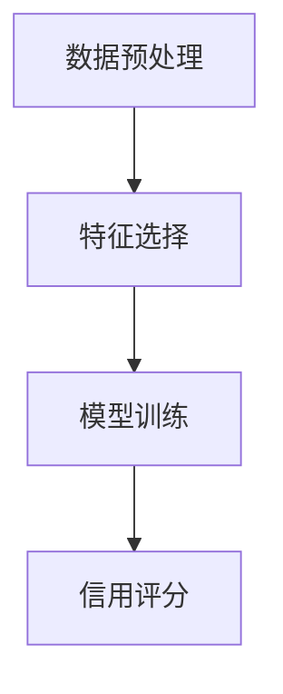

                 


# AI Agent在企业信用风险评估中的深度应用与模型解释

> 关键词：AI Agent，信用风险评估，机器学习，深度学习，模型解释，企业信用评分

> 摘要：本文深入探讨AI Agent在企业信用风险评估中的应用，从核心概念、算法原理到系统架构设计，结合实际案例，详细分析其在提升信用评估效率和准确性中的作用。通过机器学习和深度学习算法，构建高效的风险评估模型，并提供清晰的模型解释，助力企业降低风险成本，推动AI技术在金融领域的深度应用。

---

## 第一章：AI Agent与企业信用风险评估的背景介绍

### 1.1 问题背景与描述

#### 1.1.1 信用风险评估的定义与重要性
信用风险评估是企业在信贷决策中对客户违约风险的量化过程。传统方法依赖于财务指标和人工经验，存在效率低、主观性强的问题。

#### 1.1.2 AI Agent在信用评估中的应用潜力
AI Agent具备实时决策、自主学习和多任务处理能力，能显著提升信用评估的效率和准确性。

#### 1.1.3 当前信用评估中的挑战与不足
- 数据维度不足，难以捕捉复杂风险因素。
- 传统模型解释性差，难以满足监管要求。
- 高维度数据处理能力不足，影响模型精度。

### 1.2 问题解决与边界

#### 1.2.1 AI Agent如何解决信用风险问题
通过实时数据处理、智能决策和动态调整，AI Agent优化信用评估流程。

#### 1.2.2 信用评估的边界与外延
限定于企业信用评估，不涵盖个人信用和市场风险。

#### 1.2.3 AI Agent的应用场景与限制
应用场景包括实时信用评分、风险预警和动态监控。限制因素包括数据隐私和模型解释性。

### 1.3 核心概念与结构

#### 1.3.1 信用风险评估的核心要素
- 企业财务状况：如资产负债率、流动比率。
- 偿债能力：如速动比率、利息覆盖倍数。
- 经营状况：如收入增长率、利润率。

#### 1.3.2 AI Agent的基本构成与功能
- 信息获取与处理：实时抓取企业数据。
- 智能决策：基于数据生成信用评分。
- 自适应学习：优化模型参数。

#### 1.3.3 两者的结合方式与系统架构
通过数据接口连接企业数据源，AI Agent进行实时分析并生成信用评分。

### 1.4 应用价值与意义

#### 1.4.1 提升信用评估的效率与准确性
AI Agent能快速处理多维度数据，生成高精度评分。

#### 1.4.2 降低企业风险成本
通过实时监控和预警，减少潜在损失。

#### 1.4.3 推动AI技术在金融领域的深度应用
AI Agent的应用为金融行业智能化转型提供了成功案例。

## 第二章：AI Agent的原理与特征

### 2.1 AI Agent的基本原理

#### 2.1.1 基于强化学习的决策机制
通过奖励机制优化决策策略，提升信用评分准确性。

#### 2.1.2 多智能体协作模型
多个AI Agent协同工作，分别负责不同任务，如数据预处理和模型训练。

#### 2.1.3 知识图谱构建与推理
利用知识图谱关联企业内外部信息，增强模型理解能力。

### 2.2 核心概念对比分析

#### 2.2.1 AI Agent与传统机器学习模型的对比
| 特性            | AI Agent                          | 传统机器学习模型                   |
|-----------------|-----------------------------------|------------------------------------|
| 自主性          | 高，能自主决策和学习             | 低，依赖预设规则和训练数据         |
| 适应性          | 强，能动态调整模型               | 弱，需重新训练以适应新数据         |
| 可解释性        | 较低，复杂决策过程难解释         | 较高，基于固定特征和规则           |

#### 2.2.2 不同AI Agent算法的特征分析
| 算法            | 强化学习                          | 多智能体协作                      |
|-----------------|-----------------------------------|------------------------------------|
| 优势            | 高效决策，适合动态环境           | 多任务处理，分工明确              |
| 动作空间        | 复杂，涉及多个决策维度           | 简单，通常处理单一任务            |

### 2.3 实体关系图

#### 2.3.1 信用风险评估的ER实体关系图
```mermaid
er
    entity 企业 (id, 名称, 行业, 规模)
    entity 信用评分 (id, 评分, 时间戳)
    entity 风险因素 (id, 类型, 数值)
    entity 交易记录 (id, 金额, 时间)
```

#### 2.3.2 AI Agent与信用评估实体的交互关系
```mermaid
er
    entity AI Agent (id, 状态, 决策规则)
    entity 信用评分 (id, 评分, 时间戳)
    entity 企业 (id, 名称, 行业)
```

## 第三章：基于机器学习的信用风险模型

### 3.1 传统机器学习模型概述

#### 3.1.1 逻辑回归模型
用于分类问题，模型简洁，可解释性高，但对非线性关系处理能力有限。

#### 3.1.2 支持向量机模型
适用于高维数据，分类精度高，但计算复杂度高，适合小数据集。

#### 3.1.3 随机森林
通过集成学习提升精度，适合高维数据，但解释性差。

### 3.2 改进的机器学习模型

#### 3.2.1 基于XGBoost的信用评分模型


#### 3.2.2 神经网络模型
使用深度学习处理非线性关系，但模型复杂，解释性低。

### 3.3 基于深度学习的信用风险模型

#### 3.3.1 循环神经网络（RNN）
适合时间序列数据，但训练复杂，收敛困难。

#### 3.3.2 图神经网络（GNN）
通过图结构捕捉企业间关联，提升模型表现。

## 第四章：系统分析与架构设计方案

### 4.1 问题场景介绍

#### 4.1.1 系统介绍
构建一个实时信用评分系统，支持企业信用评估和风险预警。

#### 4.1.2 系统功能设计
- 数据预处理：清洗和特征提取。
- 模型训练：训练机器学习模型。
- 信用评分：实时生成信用评分。
- 风险评估：生成风险报告。
- 结果分析：分析模型性能。

### 4.2 系统架构设计

#### 4.2.1 系统架构图


## 第五章：项目实战

### 5.1 环境安装

```bash
pip install numpy scikit-learn xgboost
```

### 5.2 系统核心实现源代码

```python
import numpy as np
from sklearn.model_selection import train_test_split
from xgboost import XGBClassifier
from sklearn.metrics import accuracy_score

# 数据预处理
def preprocess(data):
    # 假设data为包含企业特征的数据框
    X = data.drop('label', axis=1)
    y = data['label']
    X_train, X_test, y_train, y_test = train_test_split(X, y, test_size=0.2)
    return X_train, X_test, y_train, y_test

# 模型训练
def train_model(X_train, y_train):
    model = XGBClassifier()
    model.fit(X_train, y_train)
    return model

# 信用评分预测
def predict(model, X_test):
    y_pred = model.predict(X_test)
    return y_pred

# 模型评估
def evaluate(y_test, y_pred):
    print("Accuracy:", accuracy_score(y_test, y_pred))
```

### 5.3 实际案例分析

#### 5.3.1 案例介绍
分析一家中型制造企业的信用评分，数据包括财务指标和交易记录。

#### 5.3.2 数据预处理
清洗数据，处理缺失值和异常值，提取关键特征。

#### 5.3.3 模型训练
使用XGBoost训练模型，调整超参数优化性能。

#### 5.3.4 模型预测与分析
生成信用评分，分析模型准确性，调整阈值优化效果。

### 5.4 小结

## 第六章：最佳实践与总结

### 6.1 总结

#### 6.1.1 AI Agent的应用价值
提升信用评估效率和准确性，降低风险成本。

#### 6.1.2 实施中的注意事项
数据隐私保护，模型解释性要求，系统稳定性维护。

### 6.2 未来挑战与发展趋势

#### 6.2.1 当前挑战
数据隐私和模型解释性是主要障碍。

#### 6.2.2 未来趋势
向自动化、智能化方向发展，应用领域将进一步扩展。

### 6.3 小结与注意事项

#### 6.3.1 小结
详细介绍了AI Agent在信用评估中的应用，展示了其实战价值。

#### 6.3.2 注意事项
数据隐私保护、模型可解释性、系统稳定性。

### 6.4 拓展阅读

#### 6.4.1 推荐书籍
《机器学习实战》、《深度学习》。

#### 6.4.2 相关论文
推荐几篇关于AI Agent和信用评估的最新研究论文。

---

通过以上章节的详细分析，我们全面探讨了AI Agent在企业信用风险评估中的应用，从理论到实践，结合实际案例，展示了其在提升信用评估效率和准确性中的重要价值。希望本文能为相关领域的研究和实践提供有益的参考和指导。

