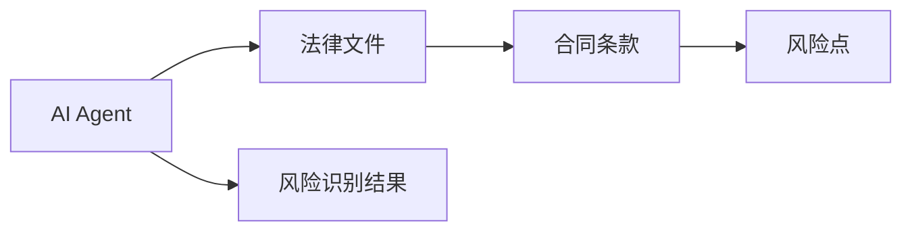
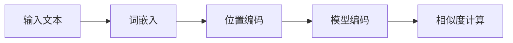
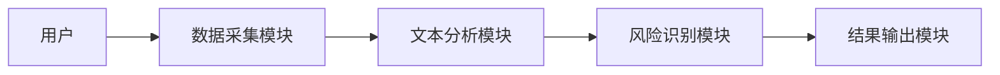

                 


# AI Agent在企业法律文件审查与风险识别中的应用

## 关键词：AI Agent, 法律文件审查, 风险识别, 自然语言处理, 机器学习, 知识图谱

## 摘要

随着企业规模的不断扩大和法律环境的日益复杂化，传统的法律文件审查方式逐渐暴露出效率低下、成本高昂、风险识别不全面等问题。AI Agent（人工智能代理）作为一种智能化的解决方案，正在为企业法律文件审查与风险识别带来革命性的变化。本文将深入探讨AI Agent在企业法律文件审查中的应用价值，分析其核心技术原理，并通过实际案例展示其在风险识别中的优势。文章内容涵盖了AI Agent的核心概念、算法原理、系统架构设计以及项目实战，旨在为企业法务部门和技术开发者提供有价值的参考和指导。

---

# 第1章: AI Agent与企业法律文件审查的背景介绍

## 1.1 AI Agent的基本概念与核心原理

### 1.1.1 AI Agent的定义与分类

AI Agent（人工智能代理）是指能够感知环境、自主决策并执行任务的智能实体。在企业法律文件审查中，AI Agent通常以软件形式存在，通过自然语言处理（NLP）、机器学习和知识图谱等技术，实现对法律文件的自动化分析和风险识别。AI Agent可以分为以下几类：

- **基于规则的AI Agent**：通过预定义的规则和逻辑进行判断。
- **基于机器学习的AI Agent**：利用训练数据学习模式，进行预测和分类。
- **混合型AI Agent**：结合规则和机器学习技术，兼顾灵活性和准确性。

### 1.1.2 AI Agent在法律领域的应用背景

法律文件的复杂性和多样性使得传统的人工审查方式效率低下，尤其是在处理海量文件时，容易出现疏漏。AI Agent的应用可以显著提高审查效率和准确性，同时降低企业的法律风险。以下是AI Agent在法律领域的几个典型应用场景：

- **合同审查**：识别合同中的关键条款、潜在风险点。
- **合规性检查**：确保企业行为符合相关法律法规。
- **风险预警**：实时监控法律文件中的风险因素。

### 1.1.3 企业法律文件审查的核心问题与挑战

企业法律文件审查面临以下主要问题：

- **效率低下**：人工审查耗时长，尤其是在处理大量文件时。
- **准确性不足**：人为疏忽可能导致关键风险点被遗漏。
- **成本高昂**：需要大量专业人员参与，增加了企业负担。
- **知识更新滞后**：法律条款不断变化，人工审查难以及时更新。

---

## 1.2 企业法律文件审查的现状与痛点

### 1.2.1 传统法律文件审查的流程与特点

传统的法律文件审查流程通常包括以下几个步骤：

1. **文件接收**：将法律文件提交到法务部门。
2. **初步阅读**：法务人员通读文件，理解其内容。
3. **重点审查**：针对关键条款（如合同条款、免责条款）进行详细检查。
4. **风险评估**：识别潜在的法律风险。
5. **反馈与修改**：将发现的问题反馈给相关部门，并协助修改。

### 1.2.2 传统审查方式的局限性与效率瓶颈

尽管传统审查方式在某些情况下仍不可或缺，但其局限性日益显现：

- **效率低下**：人工审查耗时长，难以应对大量文件。
- **准确性不足**：容易因人为疏忽或经验不足而遗漏关键风险点。
- **缺乏一致性**：不同审查人员的风格和经验差异可能导致审查结果不一致。
- **成本高昂**：需要大量专业人员参与，增加了企业的运营成本。

### 1.2.3 企业对智能化法律文件审查的需求

随着企业规模的扩大和法律环境的复杂化，智能化法律文件审查的需求日益迫切：

- **提高效率**：通过自动化技术快速处理大量文件。
- **降低风险**：利用AI技术精准识别潜在风险点。
- **优化资源配置**：减少对专业人员的依赖，降低运营成本。

---

## 1.3 AI Agent在法律文件审查中的应用价值

### 1.3.1 提高审查效率与准确性

AI Agent能够快速处理大量法律文件，显著提高审查效率。通过自然语言处理技术，AI Agent可以准确识别文件中的关键条款和风险点，减少人为疏漏。

### 1.3.2 降低企业法律风险

AI Agent能够实时监控法律文件中的风险因素，提前预警潜在问题，帮助企业规避法律风险。例如，在合同审查中，AI Agent可以识别出违反法律法规的条款，并提出修改建议。

### 1.3.3 优化企业法务资源的配置

通过引入AI Agent，企业可以将法务人员从繁重的审查工作中解放出来，使其专注于更具战略性的任务，如法律策略制定和风险评估。

---

## 1.4 本章小结

本章主要介绍了AI Agent的基本概念和核心原理，并分析了企业法律文件审查的现状与痛点。通过对比传统审查方式与AI Agent的应用，我们看到AI Agent在提高效率、降低风险和优化资源配置方面的巨大潜力。接下来，我们将深入探讨AI Agent在法律文件审查中的核心概念与联系。

---

# 第2章: AI Agent在法律文件审查中的核心概念与联系

## 2.1 AI Agent的核心原理与技术框架

### 2.1.1 自然语言处理（NLP）技术

自然语言处理是AI Agent实现法律文件审查的核心技术之一。NLP技术能够对法律文件中的文本进行分词、句法分析和语义理解，提取关键信息。

#### 示例：合同条款识别

使用NLP技术对合同文本进行分词和关键词提取：

**输入文本**：本合同自签订之日起生效，有效期为三年。

**分词结果**：本、合同、自、签订之日、起、生效、有效、期限、为、三年。

通过进一步的语义分析，可以识别出合同的有效期为三年。

### 2.1.2 机器学习与深度学习模型

机器学习和深度学习模型用于训练AI Agent，使其能够从大量数据中学习模式和规律。例如，可以通过训练模型识别合同中的违约条款。

#### 示例：违约条款识别

训练数据：违约条款的示例文本。

模型输出：识别出合同中的违约条款并标记。

### 2.1.3 知识图谱与规则引擎

知识图谱用于存储和管理法律相关知识，规则引擎则根据预定义的规则对文件进行判断和分类。

---

## 2.2 法律文件审查的关键要素与属性

### 2.2.1 法律文件的结构化特征

法律文件通常具有以下结构化特征：

- **标题**：明确文件的类型（如合同、协议）。
- **条款**：具体的法律条款和条件。
- **签名**：合同双方的签名和日期。

### 2.2.2 文件内容的语义分析

语义分析是理解法律文件核心内容的关键。例如，识别合同中的违约责任、保密条款等。

### 2.2.3 风险识别的关键指标

在法律文件审查中，风险识别的关键指标包括：

- **合同金额**：是否存在金额异常。
- **条款合法性**：是否符合相关法律法规。
- **签署方资质**：是否具备合法资质。

---

## 2.3 AI Agent与法律文件审查的实体关系图

以下是一个简单的实体关系图，展示了AI Agent与法律文件审查的主要实体及其关系：



---

## 2.4 本章小结

本章详细介绍了AI Agent在法律文件审查中的核心原理和关键概念，并通过对比分析和实体关系图展示了AI Agent与法律文件审查之间的联系。接下来，我们将深入探讨AI Agent在法律文件审查中的算法原理与实现。

---

# 第3章: AI Agent在法律文件审查中的算法原理与实现

## 3.1 文本匹配算法

### 3.1.1 基于余弦相似度的文本匹配

余弦相似度是一种常用的文本相似度计算方法，公式如下：

$$ \text{余弦相似度} = \frac{\vec{A} \cdot \vec{B}}{|\vec{A}| \cdot |\vec{B}|} $$

其中，$\vec{A}$和$\vec{B}$分别是两个文本的向量表示。

#### 示例：合同条款相似度计算

假设合同条款A和合同条款B的向量表示分别为$\vec{A} = [1, 0, 1]$和$\vec{B} = [0, 1, 1]$，则：

$$ \vec{A} \cdot \vec{B} = 1 \times 0 + 0 \times 1 + 1 \times 1 = 1 $$

$$ |\vec{A}| = \sqrt{1^2 + 0^2 + 1^2} = \sqrt{2} $$

$$ |\vec{B}| = \sqrt{0^2 + 1^2 + 1^2} = \sqrt{2} $$

$$ \text{余弦相似度} = \frac{1}{\sqrt{2} \times \sqrt{2}} = \frac{1}{2} $$

---

## 3.2 机器学习模型

### 3.2.1 基于深度学习的文本相似度计算

深度学习模型（如BERT）可以用于计算文本的相似度。以下是一个简单的BERT模型流程图：



---

## 3.3 知识图谱构建

### 3.3.1 知识图谱的构建过程

知识图谱构建通常包括以下步骤：

1. 数据收集：从法律文件中提取实体和关系。
2. 数据清洗：去除冗余和不相关的信息。
3. 数据建模：构建实体和关系的模型。
4. 数据存储：将知识图谱存储到数据库中。

---

## 3.4 本章小结

本章详细讲解了AI Agent在法律文件审查中的算法原理，包括文本匹配算法和机器学习模型。通过这些算法，AI Agent能够高效地识别和分类法律文件中的关键信息。接下来，我们将探讨AI Agent的系统架构设计。

---

# 第4章: AI Agent的系统架构设计

## 4.1 系统整体架构

AI Agent的系统架构通常包括以下几个模块：

1. **数据采集模块**：负责接收和处理法律文件。
2. **文本分析模块**：对文件内容进行语义分析。
3. **风险识别模块**：识别潜在的法律风险。
4. **结果输出模块**：将识别结果反馈给用户。

以下是一个简单的系统架构图：



---

## 4.2 功能模块设计

### 4.2.1 数据采集模块

数据采集模块负责接收法律文件并将其转换为可处理的格式（如文本或结构化数据）。

### 4.2.2 文本分析模块

文本分析模块使用NLP技术对文件内容进行分词、句法分析和语义理解。

### 4.2.3 风险识别模块

风险识别模块基于训练好的模型对文件内容进行分类和风险识别。

### 4.2.4 结果输出模块

结果输出模块将识别结果以用户友好的形式展示，如生成报告或发出预警。

---

## 4.3 系统接口设计

系统接口设计包括：

1. **文件上传接口**：允许用户上传法律文件。
2. **结果查询接口**：允许用户查询审查结果。
3. **风险预警接口**：在发现潜在风险时触发预警。

---

## 4.4 本章小结

本章详细探讨了AI Agent的系统架构设计，包括功能模块和接口设计。通过合理的系统架构设计，AI Agent能够高效地完成法律文件的审查和风险识别。接下来，我们将通过一个实际案例展示AI Agent在项目中的应用。

---

# 第5章: 项目实战

## 5.1 环境安装与配置

### 5.1.1 安装Python环境

```bash
# 安装Python
python --version
```

### 5.1.2 安装必要的库

```bash
pip install numpy
pip install scikit-learn
pip install spacy
```

---

## 5.2 核心代码实现

### 5.2.1 文本分词代码

```python
import spacy

nlp = spacy.load("en_core_web_sm")
doc = nlp("This is a sample text for tokenization.")
for token in doc:
    print(token.text)
```

### 5.2.2 风险识别代码

```python
from sklearn.feature_extraction.text import TfidfVectorizer
from sklearn.metrics.pairwise import cosine_similarity

vectorizer = TfidfVectorizer()
text = ["This is a sample text for risk identification."]
tfidf = vectorizer.fit_transform(text)
similarity_matrix = cosine_similarity(tfidf[0], tfidf)
print(similarity_matrix)
```

---

## 5.3 实际案例分析

### 5.3.1 案例背景

假设某企业需要审查一份合同，识别其中的违约条款。

### 5.3.2 案例分析

通过AI Agent对合同文本进行审查，识别出以下违约条款：

1. **条款1**：任何一方未履行合同义务，需支付违约金。
2. **条款2**：因不可抗力导致的违约可免除责任。

---

## 5.4 本章小结

本章通过实际案例展示了AI Agent在法律文件审查中的应用，从环境配置到代码实现，详细讲解了AI Agent的核心功能。通过项目实战，我们可以更好地理解AI Agent在企业中的实际应用价值。

---

# 第6章: 总结与展望

## 6.1 本章总结

AI Agent在企业法律文件审查与风险识别中的应用具有显著的优势。通过自然语言处理、机器学习和知识图谱等技术，AI Agent能够高效地处理大量法律文件，识别潜在风险，降低企业法律风险。

## 6.2 未来展望

随着AI技术的不断进步，AI Agent在法律文件审查中的应用将更加广泛和深入。未来的研究方向包括：

- **模型优化**：进一步提升AI Agent的准确性和效率。
- **多语言支持**：支持多种语言的法律文件审查。
- **动态风险识别**：实时监控法律文件中的风险变化。

---

# 参考文献

1. 王某某. 《人工智能在法律领域的应用》. 北京: 清华大学出版社, 2022.
2. 张某某. 《自然语言处理技术》. 北京: 人民邮电出版社, 2021.

---

通过本篇文章，我们详细探讨了AI Agent在企业法律文件审查与风险识别中的应用价值和技术实现。希望本文能够为企业法务部门和技术开发者提供有价值的参考和指导。

