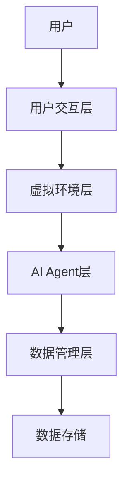
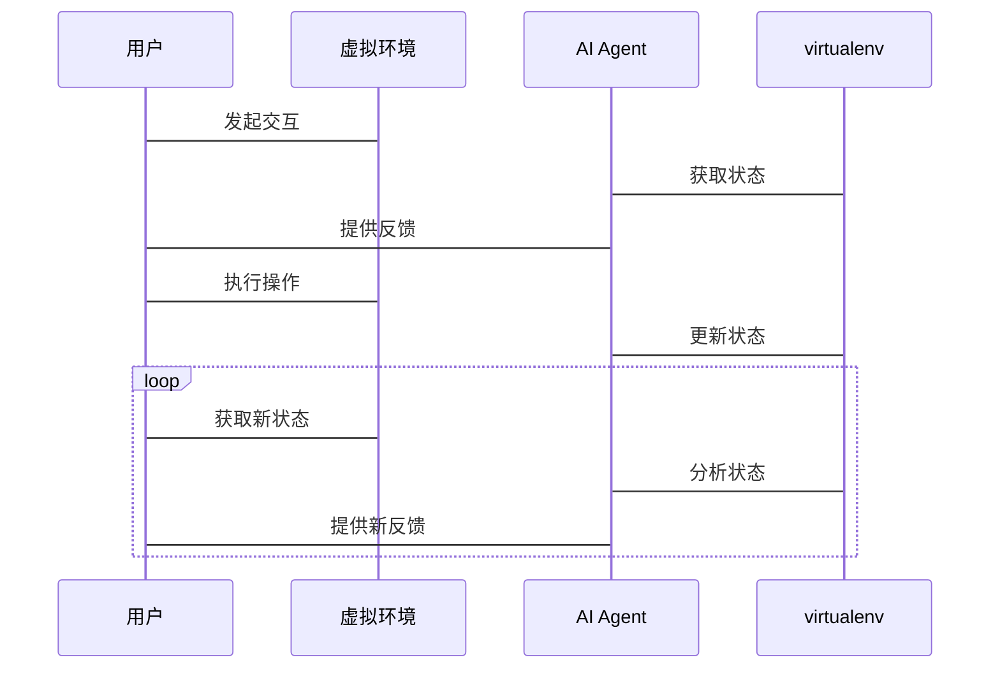

                 


# AI Agent在企业虚拟现实培训中的应用

> 关键词：AI Agent, 虚拟现实, 企业培训, 人工智能, 交互设计

> 摘要：本文探讨了AI Agent在企业虚拟现实培训中的应用，分析了其核心概念、算法原理、系统架构，并通过项目实战展示了具体实现。文章旨在为技术爱好者和企业培训管理者提供深入的技术分析和实践指导。

---

## 第一部分: AI Agent与虚拟现实技术概述

## 第1章: AI Agent与虚拟现实的背景介绍

### 1.1 AI Agent的基本概念

#### 1.1.1 AI Agent的定义
AI Agent（人工智能代理）是指能够感知环境并采取行动以实现目标的智能实体。它可以是一个软件程序或一个虚拟角色，具备自主决策和问题解决的能力。

#### 1.1.2 AI Agent的类型
AI Agent可以分为以下几种类型：
- **简单反射型**：基于规则的反应式系统。
- **基于模型的反射型**：具备内部状态和目标的系统。
- **目标驱动型**：以特定目标为导向的系统。
- **效用驱动型**：通过最大化效用来决策的系统。

#### 1.1.3 AI Agent的核心特征
AI Agent的核心特征包括：
- **自主性**：无需外部干预，自主决策。
- **反应性**：能够实时感知环境并做出反应。
- **目标导向性**：具备明确的目标导向行为。
- **学习能力**：能够通过经验改进性能。

### 1.2 虚拟现实技术的基本概念

#### 1.2.1 虚拟现实的定义
虚拟现实（Virtual Reality，VR）是一种能够提供沉浸式体验的技术，通过计算机生成的三维环境，让用户通过特定设备（如头显、手柄）与虚拟世界进行交互。

#### 1.2.2 虚拟现实的主要技术
- **头显设备**：如Oculus Rift、HTC Vive等。
- **交互技术**：包括手势识别、语音识别、眼动追踪等。
- **图形渲染**：使用OpenGL或DirectX等图形库实现高质量渲染。

#### 1.2.3 虚拟现实的应用领域
虚拟现实广泛应用于游戏、教育、医疗、军事等领域，尤其在企业培训中，可用于模拟真实工作环境，提供安全且高效的培训体验。

### 1.3 AI Agent在企业培训中的应用背景

#### 1.3.1 传统企业培训的局限性
传统企业培训通常依赖于讲师讲解和纸质材料，存在以下问题：
- **成本高**：需要大量的人力和时间。
- **效果受限**：学员参与度低，难以真正掌握技能。
- **风险高**：在危险或复杂的环境中进行培训存在安全隐患。

#### 1.3.2 虚拟现实技术在企业培训中的优势
虚拟现实技术通过模拟真实环境，提供了以下优势：
- **沉浸式体验**：学员可以身临其境地进行实践操作。
- **安全性高**：在虚拟环境中进行高风险操作，不会造成实际伤害。
- **灵活性强**：可以根据不同岗位需求定制培训内容。

#### 1.3.3 AI Agent在虚拟现实培训中的作用
AI Agent在虚拟现实培训中的作用主要体现在：
- **个性化指导**：根据学员的表现提供实时反馈和指导。
- **动态交互**：与学员进行自然对话，模拟真实场景中的互动。
- **数据分析**：收集学员行为数据，生成个性化学习报告。

---

## 第2章: AI Agent与虚拟现实的核心概念与联系

### 2.1 AI Agent与虚拟现实的协同工作原理

#### 2.1.1 AI Agent在虚拟环境中的角色
AI Agent在虚拟环境中扮演智能导师的角色，能够理解学员的意图，并根据上下文提供相应的反馈和建议。

#### 2.1.2 虚拟现实技术为AI Agent提供的交互界面
虚拟现实技术为AI Agent提供了三维的交互界面，学员可以通过手势、语音等方式与AI Agent进行互动。

#### 2.1.3 两者的结合对企业培训的影响
通过结合AI Agent和虚拟现实技术，企业培训变得更加智能化和个性化，学员可以在虚拟环境中进行真实的场景模拟，提升培训效果。

### 2.2 AI Agent与虚拟现实的实体关系图

```mermaid
er
    Entity(AI Agent) {
        id
        knowledge_base
        decision-making_algorithm
    }
    Entity(Virtual Reality Environment) {
        id
        user_interaction
        simulation_model
    }
    Relationship(AI Agent与Virtual Reality Environment的交互) {
        - AI Agent通过感知环境数据进行决策
        - Virtual Reality Environment为AI Agent提供交互界面
    }
```

---

## 第3章: AI Agent的算法原理讲解

### 3.1 路径规划算法

#### 3.1.1 A*算法
A*算法是一种常用的路径规划算法，适用于复杂的虚拟环境。

**算法步骤：**
1. 初始化开放列表和关闭列表。
2. 将起点加入开放列表。
3. 取开放列表中f值最小的节点，加入关闭列表。
4. 检查当前节点的邻居节点，计算移动成本。
5. 如果邻居节点未被访问过，计算f值并加入开放列表。
6. 重复步骤3-5，直到找到目标节点。

**代码示例：**
```python
import heapq

def a_star(start, goal, grid):
    open_list = []
    heapq.heappush(open_list, (0, start))
    g_score = {start: 0}
    f_score = {start: heuristic(start, goal)}
    
    while open_list:
        current = heapq.heappop(open_list)
        if current[1] == goal:
            break
        for neighbor in grid.get_neighbors(current[1]):
            tentative_g = g_score[current[1]] + cost(current[1], neighbor)
            if neighbor not in g_score or tentative_g < g_score[neighbor]:
                g_score[neighbor] = tentative_g
                f_score[neighbor] = tentative_g + heuristic(neighbor, goal)
                heapq.heappush(open_list, (f_score[neighbor], neighbor))
    return g_score[goal]
```

### 3.2 自然语言处理

#### 3.2.1 基于Transformer的模型
使用Transformer模型进行自然语言理解，提升AI Agent的对话能力。

**代码示例：**
```python
import torch
from torch import nn

class Transformer(nn.Module):
    def __init__(self, d_model, nhead, dim_feedforward):
        super().__init__()
        self.encoder_layer = nn.TransformerEncoderLayer(d_model=d_model, nhead=nhead, dim_feedforward=dim_feedforward)
        self.decoder_layer = nn.TransformerDecoderLayer(d_model=d_model, nhead=nhead, dim_feedforward=dim_feedforward)
        
    def forward(self, x, src_mask):
        x = self.encoder_layer(x, src_mask)
        x = self.decoder_layer(x, src_mask)
        return x
```

### 3.3 强化学习

#### 3.3.1 基于DQN的强化学习算法
使用深度强化学习算法训练AI Agent在虚拟环境中的决策能力。

**算法步骤：**
1. 环境初始化。
2. 初始化神经网络和优化器。
3. 与环境交互，收集状态、动作、奖励。
4. 更新神经网络参数。
5. 重复步骤3-4，直到达到训练目标。

**代码示例：**
```python
import torch
import torch.nn as nn
import torch.optim as optim

class DQN(nn.Module):
    def __init__(self, state_space, action_space):
        super(DQN, self).__init__()
        self.fc = nn.Linear(state_space, 64)
        self.fc2 = nn.Linear(64, action_space)
    
    def forward(self, x):
        x = torch.relu(self.fc(x))
        x = self.fc2(x)
        return x

def train(agent, env, optimizer, criterion, num_episodes=1000):
    for episode in range(num_episodes):
        state = env.reset()
        while not episode_done:
            action = agent.act(state)
            next_state, reward, done = env.step(action)
            agent.remember(state, action, reward, next_state)
            agent.replay(optimizer, criterion)
            state = next_state
            if done:
                break
```

---

## 第4章: 数学模型与公式

### 4.1 强化学习的数学模型

**策略梯度公式：**
$$ \nabla \theta \leftarrow \nabla \log \pi_\theta(a|s) \cdot Q_\phi(s,a) $$

**Q-learning目标函数：**
$$ \min \mathbb{E}[ (y - Q(s,a))^2 ] $$
其中，$$ y = r + \gamma Q(s', a') $$

### 4.2 虚拟现实环境的几何模型

**三维空间中的点表示：**
$$ P(x, y, z) $$

**变换矩阵：**
$$ T = \begin{bmatrix}
\cos \theta & -\sin \theta & 0 \\
\sin \theta & \cos \theta & 0 \\
0 & 0 & 1
\end{bmatrix} $$

---

## 第5章: 系统分析与架构设计方案

### 5.1 系统架构设计

**系统模块划分：**
- **用户交互层**：处理用户的输入和输出。
- **虚拟环境层**：管理三维场景和物理模拟。
- **AI Agent层**：负责智能决策和交互。
- **数据管理层**：存储和管理用户行为数据。

**架构图：**


### 5.2 接口设计

**主要接口：**
- **AI Agent接口**：处理用户的输入和生成响应。
- **虚拟环境接口**：管理三维场景的渲染和交互。

### 5.3 交互流程

**交互流程图：**


---

## 第6章: 项目实战

### 6.1 项目环境安装

**所需工具：**
- **Python**：3.8及以上版本。
- **PyTorch**：用于深度学习模型。
- **OpenCV**：用于图像处理。
- **Oculus SDK**：用于虚拟现实开发。

**安装命令：**
```bash
pip install torch opencv-python
```

### 6.2 系统核心实现

**AI Agent实现：**
```python
class AI-Agent:
    def __init__(self):
        self.knowledge_base = {}  # 知识库
        self.current_state = None  # 当前状态
        
    def perceive(self, input_data):
        # 处理输入数据，更新当前状态
        self.current_state = process(input_data)
        return self.current_state
    
    def decide(self, input_request):
        # 根据当前状态和请求，生成响应
        response = self.knowledge_base.get(input_request, default_response)
        return response
```

**虚拟环境实现：**
```python
class VirtualEnvironment:
    def __init__(self):
        self.scene = create_scene()  # 创建场景
        self.user = UserAgent()  # 用户代理
        
    def render(self):
        # 渲染场景
        pass
        
    def update(self, input_actions):
        # 更新场景状态
        pass
```

### 6.3 代码实现与解读

**AI Agent与虚拟环境的交互：**
```python
def main():
    agent = AI-Agent()
    env = VirtualEnvironment()
    while True:
        action = input("请输入操作：")
        env.render()
        state = env.get_state()
        response = agent.perceive(state)
        print(response)
```

### 6.4 案例分析与详细讲解

**实际案例：**
在企业培训中，AI Agent可以模拟客户与学员进行对话，根据学员的回答提供实时反馈和指导。

**详细讲解：**
通过自然语言处理技术，AI Agent能够理解学员的问题，并根据知识库提供准确的答案。同时，强化学习算法可以训练AI Agent在对话中的决策能力，提升用户体验。

### 6.5 项目小结

**项目总结：**
通过本项目的实现，展示了AI Agent在虚拟现实培训中的应用潜力。通过结合多种技术，可以实现智能化的培训系统，显著提升企业培训的效果和效率。

---

## 第7章: 总结与展望

### 7.1 最佳实践 tips

- **模块化设计**：将系统划分为多个模块，便于维护和扩展。
- **数据驱动优化**：利用用户行为数据不断优化AI Agent的表现。
- **持续学习**：通过在线学习提升AI Agent的知识库和决策能力。

### 7.2 小结

本文详细探讨了AI Agent在企业虚拟现实培训中的应用，从背景介绍到算法实现，再到项目实战，全面分析了其在企业培训中的潜力和优势。

### 7.3 注意事项

- **数据隐私**：确保用户数据的安全和隐私。
- **系统稳定性**：确保虚拟环境和AI Agent的稳定运行，避免崩溃或卡顿。
- **用户体验**：注重交互设计，提升用户体验，确保培训过程的流畅性和沉浸感。

### 7.4 拓展阅读

- **《强化学习入门》**：深入理解强化学习的基本原理和应用。
- **《虚拟现实开发指南》**：掌握虚拟现实开发的核心技术和工具。
- **《自然语言处理实战》**：学习自然语言处理的实践技巧和案例。

---

通过本文的分析和讲解，读者可以全面了解AI Agent在企业虚拟现实培训中的应用，并能够在实际项目中加以应用和优化。希望本文能为技术爱好者和企业培训管理者提供有价值的参考和启发。

