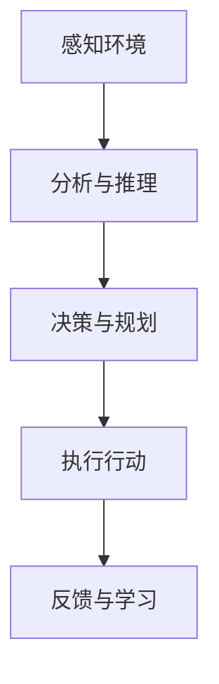
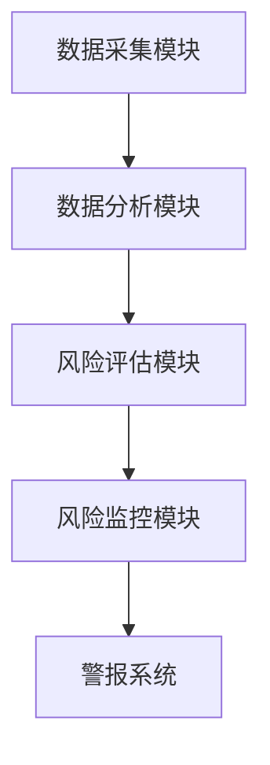

                 


# AI Agent在企业风险评估与管理中的应用

> 关键词：AI Agent, 企业风险管理, 风险评估, 人工智能, 数据分析, 系统架构

> 摘要：随着人工智能技术的迅速发展，AI Agent在企业风险评估与管理中的应用日益广泛。本文详细探讨了AI Agent的基本概念、技术基础、在风险评估与管理中的具体应用，以及系统架构设计。通过实际案例分析和项目实战，展示了AI Agent如何提升企业风险管理的效率和准确性。文章最后总结了AI Agent的优势，并展望了其未来的发展趋势。

---

## 第一部分: AI Agent的基本概念与技术基础

### 第1章: AI Agent的定义与核心原理

#### 1.1 AI Agent的定义
AI Agent（人工智能代理）是一种能够感知环境、自主决策并采取行动的智能实体。它通过传感器获取信息，利用算法进行分析和推理，最终做出最优决策。AI Agent可以是软件程序、机器人或其他智能设备。

#### 1.2 AI Agent的核心特征
AI Agent的核心特征包括：
1. **自主性**：能够自主决策和行动，无需外部干预。
2. **反应性**：能够实时感知环境变化并做出反应。
3. **学习能力**：能够通过经验改进自身的决策能力。
4. **社交能力**：能够与其他系统或人类进行有效沟通和协作。

#### 1.3 AI Agent与传统软件代理的区别
| 特性 | AI Agent | 传统软件代理 |
|------|----------|--------------|
| 决策能力 | 基于机器学习和推理 | 基于预设规则 |
| 学习能力 | 具备学习能力 | 无学习能力 |
| 适应性 | 能够自适应环境变化 | 适应性有限 |

#### 1.4 AI Agent的核心原理
AI Agent的工作流程可以分为以下几个步骤：
1. **感知环境**：通过传感器或数据接口获取环境信息。
2. **分析与推理**：利用机器学习算法对数据进行分析和推理。
3. **决策与规划**：基于分析结果制定行动计划。
4. **执行行动**：通过执行器或接口实施行动计划。
5. **反馈与学习**：根据执行结果进行反馈，优化未来决策。

**Mermaid图：AI Agent的工作流程**


### 第2章: AI Agent与传统风险评估方法的对比

#### 2.1 传统企业风险管理方法
传统企业风险管理方法依赖于人工分析和经验判断，具有以下特点：
1. **低效性**：人工分析耗时且容易出错。
2. **有限的实时性**：无法实时监控和应对风险。
3. **依赖经验**：高度依赖专家的经验，难以量化分析。

#### 2.2 AI Agent在风险管理中的优势
AI Agent通过数据驱动的方法，能够显著提升风险管理的效率和准确性：
1. **高效性**：能够快速处理大量数据，提供实时风险评估。
2. **准确性**：利用机器学习算法，能够发现潜在风险因素，提高预测准确性。
3. **动态适应性**：能够实时监控环境变化，动态调整风险管理策略。

#### 2.3 AI Agent的应用潜力
AI Agent在企业风险管理中的应用潜力体现在以下几个方面：
1. **风险预测**：通过分析历史数据和市场趋势，预测潜在风险。
2. **实时监控**：实时跟踪企业运营中的各项指标，及时发现异常情况。
3. **优化资源配置**：根据风险评估结果，优化企业资源配置，降低风险影响。

---

## 第二部分: 企业风险管理的基础

### 第3章: 企业风险管理概述

#### 3.1 企业风险管理的定义
企业风险管理是指企业通过识别、评估和应对各种潜在风险，以确保企业目标的实现和稳健发展的过程。

#### 3.2 风险识别与评估的传统方法
传统风险识别与评估方法主要包括：
1. **问卷调查法**：通过员工填写问卷收集风险信息。
2. **专家访谈法**：通过与专家讨论识别潜在风险。
3. **流程分析法**：通过分析企业流程中的潜在风险点。

#### 3.3 企业风险管理的关键要素
企业风险管理的关键要素包括：
1. **风险识别**：识别企业可能面临的风险因素。
2. **风险评估**：评估风险的可能性和影响程度。
3. **风险应对**：制定应对策略，降低风险影响。

#### 3.4 企业风险管理的挑战
企业风险管理面临以下挑战：
1. **数据复杂性**：企业数据来源多样，难以统一管理和分析。
2. **动态变化**：市场环境和企业运营状况不断变化，需要动态调整风险管理策略。
3. **资源限制**：企业往往缺乏足够的资源和专业人员进行风险管理。

---

## 第三部分: AI Agent在风险评估中的应用

### 第4章: 风险数据的收集与处理

#### 4.1 数据收集渠道
AI Agent可以通过以下渠道收集风险数据：
1. **企业内部数据**：包括财务数据、销售数据、运营数据等。
2. **外部数据**：包括市场数据、行业数据、宏观经济数据等。
3. **实时数据流**：包括社交媒体数据、新闻数据、实时传感器数据等。

#### 4.2 数据预处理与清洗
在进行风险评估之前，需要对收集到的数据进行预处理和清洗：
1. **数据清洗**：去除噪声数据和重复数据。
2. **数据转换**：将数据转换为适合分析的格式。
3. **数据标准化**：对数据进行标准化处理，确保数据的一致性。

#### 4.3 数据分析与特征提取
通过机器学习算法对数据进行分析和特征提取，识别出影响风险的关键因素。例如，可以使用主成分分析（PCA）提取数据的主要特征。

**数学公式：主成分分析（PCA）**
$$
\text{主成分} = \sum_{i=1}^{n} \lambda_i v_i
$$
其中，$\lambda_i$是特征值，$v_i$是对应的特征向量。

---

## 第四部分: AI Agent在风险监控与应对中的应用

### 第5章: 风险监控的实现

#### 5.1 实时监控系统设计
实时监控系统设计需要考虑以下因素：
1. **数据采集频率**：根据风险类型确定数据采集的频率。
2. **监控指标选择**：选择能够反映风险的关键指标。
3. **监控阈值设定**：设定监控指标的阈值，当指标超过阈值时触发警报。

#### 5.2 异常检测算法
异常检测算法用于识别数据中的异常值，常见的算法包括：
1. **基于统计的方法**：如Z-score方法。
2. **基于机器学习的方法**：如Isolation Forest算法。

**数学公式：Z-score方法**
$$
Z = \frac{X - \mu}{\sigma}
$$
其中，$\mu$是数据的均值，$\sigma$是数据的标准差。

#### 5.3 应急响应机制
当检测到异常情况时，系统需要触发应急响应机制，包括：
1. **警报通知**：通过邮件、短信等方式通知相关人员。
2. **自动应对措施**：如暂停高风险交易、调整资源配置等。

---

## 第五部分: 系统架构设计

### 第6章: 系统设计与实现

#### 6.1 系统功能设计
系统功能设计包括：
1. **数据采集模块**：负责采集企业内外部数据。
2. **数据分析模块**：负责对数据进行分析和特征提取。
3. **风险评估模块**：负责生成风险评估报告。
4. **风险监控模块**：负责实时监控风险指标并触发警报。

#### 6.2 系统架构设计
**Mermaid图：系统架构设计**


#### 6.3 系统接口设计
系统接口设计需要考虑以下方面：
1. **数据接口**：与企业内部系统和其他数据源对接。
2. **用户接口**：提供友好的用户界面，方便用户查看和操作。

---

## 第六部分: 项目实战

### 第7章: 项目实战与案例分析

#### 7.1 项目环境搭建
项目环境搭建需要安装以下工具和库：
1. **Python**：用于编程和数据分析。
2. **TensorFlow**：用于机器学习模型的训练。
3. **Pandas**：用于数据处理和分析。
4. **Flask**：用于搭建Web应用。

#### 7.2 核心代码实现
以下是风险评估模块的核心代码实现：
```python
import pandas as pd
from sklearn.ensemble import IsolationForest

# 数据加载
data = pd.read_csv('risk_data.csv')

# 数据预处理
data = data.dropna()
data = pd.get_dummies(data)

# 模型训练
model = IsolationForest(n_estimators=100, random_state=42)
model.fit(data)

# 异常检测
outliers = model.predict(data)
outliers[outliers == -1] = 1
outliers[outliers == 1] = 0
outliers = pd.Series(outliers)
```

#### 7.3 案例分析
以某企业为例，分析其风险评估过程：
1. **数据收集**：收集过去一年的销售数据、财务数据和市场数据。
2. **数据分析**：使用Isolation Forest算法检测异常数据点。
3. **风险评估**：生成风险评估报告，识别高风险部门和潜在风险因素。

---

## 总结与展望

### 第8章: 总结与展望

#### 8.1 总结
本文详细探讨了AI Agent在企业风险评估与管理中的应用，从基本概念到具体实现，全面分析了其优势和挑战。通过实际案例分析，展示了AI Agent如何提升企业风险管理的效率和准确性。

#### 8.2 展望
未来，随着人工智能技术的不断发展，AI Agent在企业风险管理中的应用将更加广泛和深入。预计会有更多智能化的工具和平台出现，帮助企业更好地应对复杂多变的市场环境。

#### 8.3 最佳实践 Tips
1. **数据质量管理**：确保数据的准确性和完整性。
2. **模型持续优化**：定期更新模型，确保其适应性。
3. **团队协作**：加强技术团队与业务部门的协作，确保风险管理的落地实施。

---

通过本文的分析，读者可以全面了解AI Agent在企业风险管理中的应用，掌握其核心原理和实现方法。希望本文能够为企业在风险管理领域的实践提供有价值的参考和指导。

