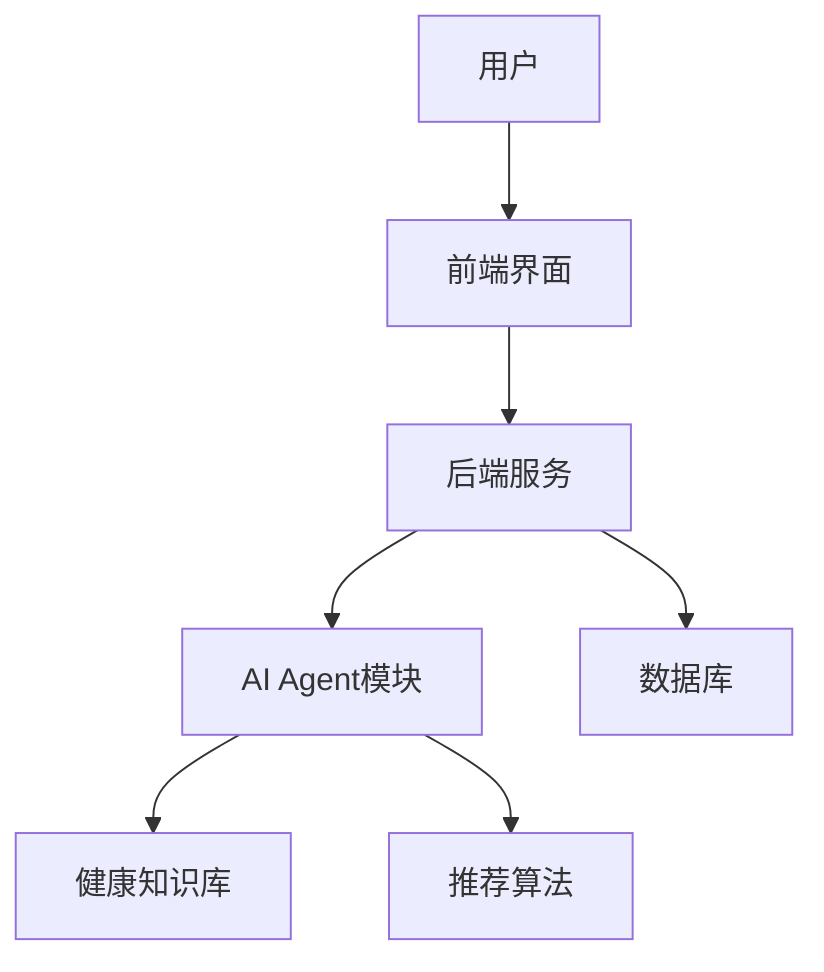
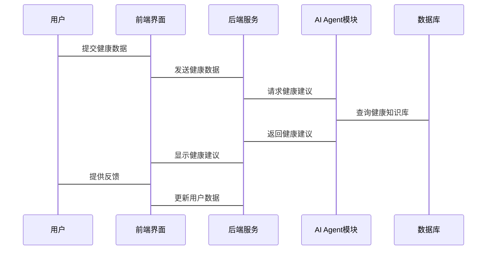

                 


---

# AI Agent在智能个性化健康建议中的应用

> 关键词：AI Agent, 个性化健康建议, 智能健康系统, 推荐算法, 系统架构, 项目实战

> 摘要：本文详细探讨AI Agent在智能个性化健康建议中的应用，从核心概念、算法原理到系统架构和项目实战，全面解析如何利用AI技术为用户提供精准的健康建议。通过分析用户需求、设计推荐算法、构建系统架构，结合实际案例，最终实现一个高效、智能的个性化健康建议系统。

---

## 第一部分: AI Agent与智能个性化健康建议的背景介绍

### 第1章: AI Agent的基本概念与应用背景

#### 1.1 AI Agent的定义与核心概念
- 1.1.1 AI Agent的基本定义
  - AI Agent是具有感知环境、自主决策、执行任务能力的智能体。
  - 区别于传统软件，AI Agent具备学习和自适应能力。

- 1.1.2 AI Agent的核心属性与特征
  - 智能性：能理解并处理复杂信息。
  - 自主性：无需外部干预，可自主决策。
  - 交互性：能与用户或其他系统进行有效交互。
  - 社会性：能在协作环境中与其他实体互动。

- 1.1.3 AI Agent与传统软件代理的区别
  - 数据处理能力：AI Agent具备深度学习和推理能力。
  - 适应性：能根据反馈不断优化行为。
  - 决策能力：具备复杂决策能力，而非简单的规则执行。

#### 1.2 智能个性化健康建议的背景
- 1.2.1 健康管理的现状与挑战
  - 传统健康管理方式存在效率低、个性化不足的问题。
  - 现代人健康需求日益多样化，单一方不能满足个性化需求。

- 1.2.2 个性化健康建议的重要性
  - 通过AI技术实现精准化、个性化的健康指导。
  - 提高健康建议的科学性和实用性，帮助用户实现健康目标。

- 1.2.3 AI Agent在健康领域的应用潜力
  - 通过AI Agent实现健康数据的实时分析和个性化建议。
  - 支持多维度健康监测，包括生理指标、生活习惯等。

#### 1.3 问题背景与目标
- 1.3.1 当前健康建议系统的痛点分析
  - 数据采集不全面，难以准确分析用户健康状况。
  - 健康建议缺乏个性化，难以满足不同用户需求。
  - 系统交互性不足，用户体验不佳。

- 1.3.2 AI Agent解决的核心问题
  - 提供个性化的健康建议，满足不同用户需求。
  - 实现实时数据采集与分析，提高建议的科学性。
  - 优化用户体验，实现智能化、便捷化的健康管理。

- 1.3.3 本书的研究目标与范围界定
  - 探讨AI Agent在智能个性化健康建议中的具体应用。
  - 分析现有技术的优缺点，提出优化方案。
  - 展望未来发展方向，为实际应用提供理论支持。

---

### 第2章: AI Agent的核心概念与原理

#### 2.1 AI Agent的感知、决策与执行模块
- 2.1.1 感知模块: 数据采集与分析
  - 数据采集：通过传感器、问卷等方式获取用户健康数据。
  - 数据分析：利用机器学习算法处理和分析数据，提取有用信息。

- 2.1.2 决策模块: 算法与模型选择
  - 基于用户数据，选择合适的算法模型进行预测和推荐。
  - 根据预测结果，生成个性化健康建议。

- 2.1.3 执行模块: 动作生成与反馈
  - 根据决策结果生成具体行动建议。
  - 实时反馈用户行为，不断优化建议内容。

#### 2.2 智能个性化健康建议的系统架构
- 2.2.1 用户模型构建
  - 用户基本信息：年龄、性别、职业等。
  - 健康状况：体能、疾病史、过敏史等。
  - 生活习惯：饮食、运动、作息等。

- 2.2.2 健康知识库的构建与管理
  - 知识库内容：健康知识、疾病信息、营养建议等。
  - 知识库管理：数据更新、知识推理、信息检索。

- 2.2.3 推荐算法与策略
  - 基于用户的健康数据，选择合适的推荐算法。
  - 根据用户反馈，动态调整推荐策略。

#### 2.3 AI Agent与用户交互的实体关系图
```mermaid
er
actor: 用户
agent: AI健康建议代理
user_data: 用户数据
health_knowledge: 健康知识库
recommendation: 建议结果
```

---

### 第3章: 基于数据的推荐算法

#### 3.1 协同过滤推荐算法
- 3.1.1 基于用户的协同过滤
  - 方法：通过相似用户的健康数据，推荐相似的健康建议。
  - 优势：适用于用户数量较多的情况，推荐结果较准确。

- 3.1.2 基于物品的协同过滤
  - 方法：基于健康建议本身的特征，找出相似的健康建议进行推荐。
  - 优势：适用于健康建议种类较多的情况。

- 3.1.3 混合推荐模型的构建
  - 方法：结合用户协同过滤和基于内容的推荐，构建混合模型。
  - 优势：综合两种算法的优势，提高推荐精度。

#### 3.2 基于内容的推荐算法
- 3.2.1 健康数据的特征提取
  - 方法：从用户数据中提取有用的特征，如饮食习惯、运动频率等。
  - 优势：特征提取有助于提高推荐的准确性。

- 3.2.2 基于向量空间模型的相似度计算
  - 方法：将健康数据转换为向量，计算向量之间的相似度。
  - 优势：向量空间模型能够有效捕捉数据的语义信息。

- 3.2.3 内容过滤的实现细节
  - 方法：根据健康数据的特征，过滤掉不相关的健康建议。
  - 优势：减少无效信息，提高推荐质量。

#### 3.3 推荐算法的数学模型
- 3.3.1 协同过滤的数学公式
  $$ sim(u, v) = \frac{\sum_{i=1}^{n} (r_{u,i} - \bar{r}_u)(r_{v,i} - \bar{r}_v)}{\sqrt{\sum_{i=1}^{n} (r_{u,i} - \bar{r}_u)^2} \sqrt{\sum_{i=1}^{n} (r_{v,i} - \bar{r}_v)^2}} $$
  其中，$\bar{r}_u$ 表示用户u的平均评分。

- 3.3.2 混合推荐模型的数学表达
  $$ P(r) = \alpha P(u) + (1-\alpha) P(i) $$
  其中，$\alpha$ 是协同过滤的权重，$P(u)$ 是基于用户的推荐概率，$P(i)$ 是基于内容的推荐概率。

---

### 第4章: 系统分析与架构设计方案

#### 4.1 问题场景介绍
- 系统需要实现的功能：
  - 数据采集：通过多种方式获取用户的健康数据。
  - 数据分析：对用户数据进行处理和分析，提取有用信息。
  - 健康建议生成：根据分析结果，生成个性化的健康建议。
  - 用户交互：与用户进行有效交互，实时反馈建议的执行情况。

#### 4.2 项目介绍
- 项目目标：
  - 开发一个智能个性化健康建议系统。
  - 实现AI Agent的核心功能，包括数据采集、分析和建议生成。

- 项目范围：
  - 系统功能：用户注册、数据采集、健康建议生成、用户反馈。
  - 系统架构：前端、后端、数据库、AI模块。

#### 4.3 系统功能设计
- 4.3.1 用户模型
  - 用户基本信息：年龄、性别、职业等。
  - 健康状况：体能、疾病史、过敏史等。
  - 生活习惯：饮食、运动、作息等。

- 4.3.2 健康知识库
  - 知识库内容：健康知识、疾病信息、营养建议等。
  - 知识库管理：数据更新、知识推理、信息检索。

- 4.3.3 推荐引擎
  - 推荐算法：协同过滤、基于内容的推荐、混合推荐模型。
  - 系统接口：与用户交互，实时反馈建议的执行情况。

#### 4.4 系统架构设计
- 4.4.1 系统架构图


- 4.4.2 系统接口设计
  - 用户接口：API接口，用于用户数据的上传和健康建议的获取。
  - 系统接口：用于后端服务与AI模块之间的数据交互。

- 4.4.3 系统交互序列图


---

### 第5章: 项目实战

#### 5.1 环境安装
- 安装Python：确保Python 3.8及以上版本。
- 安装依赖库：
  - `pip install numpy`
  - `pip install pandas`
  - `pip install scikit-learn`

#### 5.2 核心代码实现
- 数据预处理：
```python
import numpy as np
import pandas as pd

# 加载数据
data = pd.read_csv('health_data.csv')

# 数据清洗
data.dropna(inplace=True)
data = data[~data['age'].isnull()]
```

- 协同过滤实现：
```python
from sklearn.metrics.pairwise import cosine_similarity

# 计算用户相似度矩阵
user_similarity = cosine_similarity(data)
```

- 混合推荐模型：
```python
from sklearn.feature_extraction.text import TfidfVectorizer
from sklearn.decomposition import NMF

# 文本特征提取
vectorizer = TfidfVectorizer()
X = vectorizer.fit_transform(data['description'])

# 模型训练
nmf = NMF(n_components=5)
nmf.fit_transform(X)
```

#### 5.3 实际案例分析
- 案例背景：用户A，25岁，BMI为24，平时饮食不规律，运动量少。
- 系统分析：基于协同过滤和混合推荐模型，生成个性化健康建议。
- 建议内容：改善饮食结构，增加运动量，保持规律作息。

---

### 第6章: 最佳实践与小结

#### 6.1 最佳实践
- 数据预处理：确保数据质量和完整性。
- 模型选择：根据实际需求选择合适的推荐算法。
- 系统优化：优化算法性能，提高用户体验。

#### 6.2 小结
- 本文详细探讨了AI Agent在智能个性化健康建议中的应用，从核心概念到算法实现，再到系统架构，全面解析了如何利用AI技术为用户提供精准的健康建议。
- 通过实际案例分析，展示了系统的实用性和有效性。

#### 6.3 注意事项
- 数据隐私保护：确保用户数据的安全性。
- 系统可扩展性：设计时考虑未来的扩展需求。
- 模型可解释性：提高模型的透明度，方便用户理解和信任。

#### 6.4 拓展阅读
- 推荐阅读相关书籍和论文，深入了解AI Agent和推荐算法的最新研究成果。
- 关注健康领域的技术动态，了解新的技术应用和发展趋势。

---

通过以上目录和内容的详细阐述，本文为读者提供了一个全面了解AI Agent在智能个性化健康建议中的应用的框架。从理论到实践，从概念到实现，系统地介绍了如何利用AI技术提升健康建议的智能化和个性化水平。希望本文能为相关领域的研究和实践提供有价值的参考和启发。

