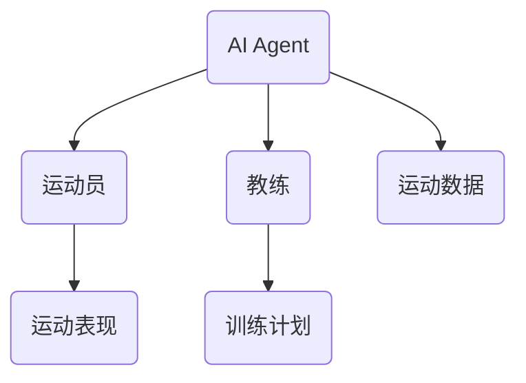

                 

# AI Agent在智能体育训练中的应用

## 关键词：人工智能、AI Agent、智能体育训练、算法原理、系统架构设计、强化学习

## 摘要：  
本文探讨了AI Agent在智能体育训练中的应用，分析了AI Agent的基本概念、核心原理及其在体育训练中的实际应用。通过强化学习、监督学习等算法的数学模型和Python代码示例，详细阐述了AI Agent在运动数据分析、训练计划优化和运动表现评估中的作用。此外，本文还设计了基于AI Agent的智能体育训练系统架构，并通过实际案例展示了系统的实现与应用效果。

---

# 第一部分: AI Agent与智能体育训练的背景与基础

## 第1章: AI Agent与智能体育训练概述

### 1.1 AI Agent的基本概念

#### 1.1.1 人工智能代理的定义  
AI Agent（人工智能代理）是指能够感知环境、做出决策并执行动作的智能实体。它通过传感器获取信息，利用计算模型进行分析，并通过执行器与环境交互。AI Agent可以是软件程序，也可以是硬件设备，其核心目标是帮助用户完成特定任务或提供决策支持。

#### 1.1.2 AI Agent的核心特征  
- **自主性**：能够在没有外部干预的情况下独立运作。  
- **反应性**：能够实时感知环境变化并做出响应。  
- **学习能力**：通过数据和经验不断优化自身的决策能力。  
- **协作性**：能够与其他AI Agent或人类进行协作。  

#### 1.1.3 AI Agent与传统软件的区别  
传统的软件程序通常基于固定的规则执行任务，而AI Agent具有自主性和学习能力，能够适应复杂多变的环境。AI Agent能够处理不确定性和模糊性，这使得它在需要动态决策的应用场景中更具优势。

---

### 1.2 智能体育训练的定义与需求

#### 1.2.1 体育训练的数字化转型  
随着科技的发展，体育训练逐渐从传统的经验驱动转向数据驱动。通过传感器、穿戴设备和数据分析技术，运动员的表现可以被实时监测和分析，从而为训练提供科学依据。

#### 1.2.2 智能体育训练的目标  
智能体育训练的目标是通过AI技术优化训练计划、提高训练效率、降低受伤风险，并帮助运动员达到最佳竞技状态。具体目标包括：  
1. 实时监测运动员的生理和运动数据。  
2. 分析数据并生成个性化的训练计划。  
3. 提供实时反馈和调整建议。  
4. 预测运动员的表现并制定比赛策略。  

#### 1.2.3 体育训练中的数据来源与特征  
在智能体育训练中，数据来源主要包括：  
- **运动数据**：如心率、步频、加速度等。  
- **视频数据**：通过动作捕捉技术获取运动员的动作细节。  
- **生物特征数据**：如肌肉疲劳程度、体能水平等。  

这些数据具有实时性、多样性、动态性等特点，为AI Agent的分析提供了丰富的信息源。

---

### 1.3 AI Agent在体育训练中的应用背景

#### 1.3.1 体育训练中的问题与挑战  
传统体育训练主要依赖教练的经验和运动员的自我调节，存在以下问题：  
1. **个性化不足**：每个运动员的身体条件和能力不同，通用的训练计划难以满足个体需求。  
2. **数据利用低效**：传统训练中，大量的运动数据往往被忽视或未能得到充分分析。  
3. **决策滞后**：教练在做出训练调整时，往往基于有限的实时反馈，导致决策不够及时和精准。  

#### 1.3.2 AI Agent如何解决这些问题  
AI Agent通过实时数据分析和自主决策，能够帮助教练和运动员解决上述问题。例如：  
- AI Agent可以根据运动员的实时数据，动态调整训练计划。  
- 它可以快速识别运动员的技术缺陷并提供优化建议。  
- AI Agent还可以预测运动员的潜在风险，如受伤风险，并提前制定预防措施。  

#### 1.3.3 智能体育训练的边界与外延  
智能体育训练不仅限于运动员的训练过程，还包括以下方面：  
- **运动员选拔**：通过数据分析筛选出具有潜力的运动员。  
- **比赛策略制定**：基于对手数据和战术分析，制定最佳比赛策略。  
- **康复与恢复**：帮助运动员制定科学的康复计划，加速恢复过程。  

---

## 1.4 本章小结  
本章介绍了AI Agent的基本概念及其在智能体育训练中的应用背景。通过分析传统体育训练的局限性，我们看到AI Agent在提高训练效率、个性化训练计划和实时反馈方面具有巨大潜力。接下来的章节将深入探讨AI Agent的核心概念与原理，并结合具体算法和系统设计，进一步分析其在智能体育训练中的实际应用。

--- 

# 第二部分: AI Agent的核心概念与原理  

## 第2章: AI Agent的核心概念与体育训练的关系  

### 2.1 AI Agent的核心概念原理  

#### 2.1.1 知识表示与推理  
知识表示是AI Agent理解世界的基础。在体育训练中，知识可以表示为运动员的动作模型、技术特点和训练目标等。  
- **符号表示**：使用符号逻辑表示知识，例如“如果运动员的步频低于正常水平，则可能需要加强耐力训练”。  
- **语义网络**：通过节点和边表示概念及其关系，例如“力量训练”与“肌肉群”之间的关联。  

推理是基于知识表示进行逻辑推导的过程。例如，AI Agent可以通过推理分析运动员的体能状况，并推荐适合的训练项目。  

#### 2.1.2 行为决策机制  
AI Agent的行为决策通常基于以下两种方式：  
1. **基于规则的决策**：根据预定义的规则做出决策，例如“如果运动员的心率超过一定阈值，则降低训练强度”。  
2. **基于学习的决策**：通过机器学习算法从历史数据中学习决策策略，例如使用强化学习训练AI Agent在特定场景下的最优决策。  

#### 2.1.3 学习与自适应能力  
AI Agent的核心优势在于其学习能力。通过监督学习、无监督学习和强化学习等方法，AI Agent可以从大量数据中提取规律，并不断优化自身的决策能力。例如，AI Agent可以通过分析运动员的历史训练数据，学习如何制定更有效的训练计划。  

---

### 2.2 体育训练系统的核心要素  

#### 2.2.1 运动数据采集与处理  
运动数据是AI Agent进行分析的基础。数据采集通常通过传感器、穿戴设备和视频捕捉技术实现。例如，心率监测器可以实时采集运动员的心率数据，动作捕捉设备可以记录运动员的动作细节。  
数据处理包括数据清洗、特征提取和数据建模等步骤。例如，AI Agent可以通过对运动员的步频数据进行特征提取，识别其技术动作中的不足之处。  

#### 2.2.2 运动分析与反馈  
运动分析是AI Agent的核心任务之一。通过分析运动数据，AI Agent可以评估运动员的表现，并提供实时反馈。例如，AI Agent可以通过分析运动员的跳跃高度和起跳速度，评估其爆发力，并提出针对性的训练建议。  

#### 2.2.3 训练计划与优化  
基于分析结果，AI Agent可以生成个性化的训练计划，并实时调整训练强度和内容。例如，AI Agent可以根据运动员的疲劳程度动态调整训练负荷，确保训练的科学性和安全性。  

---

### 2.3 AI Agent与体育训练系统的实体关系图  

---

### 2.4 本章小结  
本章详细探讨了AI Agent的核心概念及其在体育训练中的具体应用。通过分析知识表示、行为决策和学习能力等关键因素，我们看到了AI Agent在智能体育训练中的巨大潜力。接下来的章节将深入探讨AI Agent的算法原理，并结合具体案例展示其在体育训练中的实际应用。

---

接下来，我将继续完成后续章节的内容，包括算法原理、系统架构设计和项目实战等部分。如需进一步了解，请告诉我！

