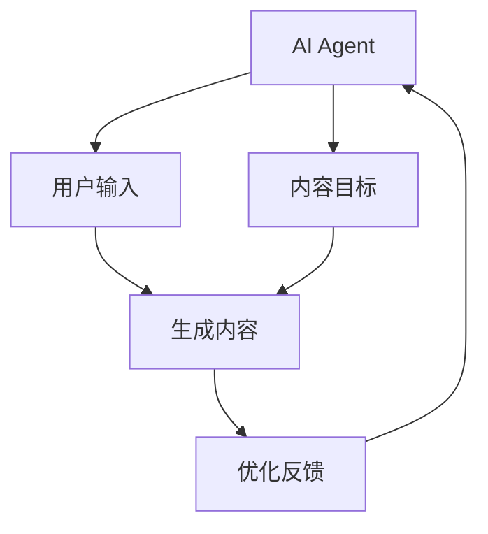
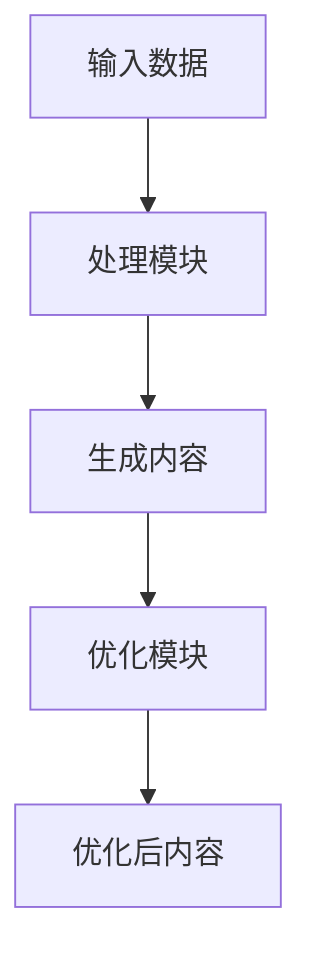
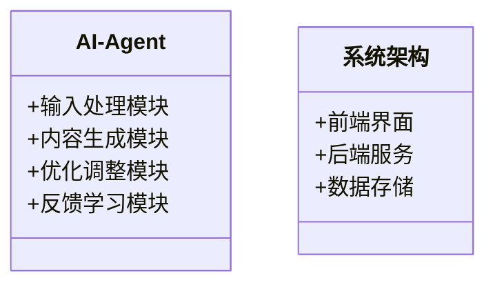
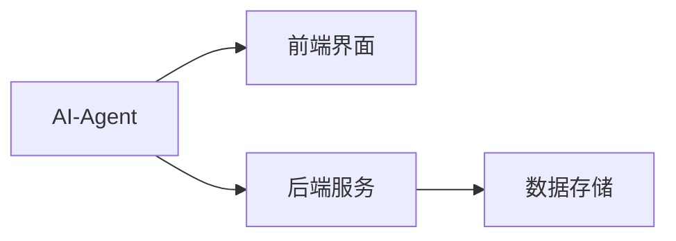

                 


# AI Agent在智能内容创作中的应用

## 关键词：AI Agent, 智能内容创作, 生成式AI, 机器学习, 自然语言处理

## 摘要：本文深入探讨AI Agent在智能内容创作中的应用，涵盖其核心概念、算法原理、系统设计及实际案例，分析其在提升内容创作效率和质量中的作用。

---

# 第1章: AI Agent与智能内容创作概述

## 1.1 AI Agent的基本概念

### 1.1.1 什么是AI Agent
AI Agent（人工智能代理）是能够感知环境并采取行动以实现目标的智能实体。它可以是软件程序或硬件设备，具备自主决策能力，通过传感器接收信息，利用算法处理数据，并通过执行器采取行动。

### 1.1.2 AI Agent的核心特征
1. **自主性**：无需外部干预，自主决策。
2. **反应性**：能实时感知环境变化并做出反应。
3. **目标导向性**：基于目标驱动行动。
4. **学习能力**：通过经验改进性能。

### 1.1.3 AI Agent与传统技术的区别
AI Agent与传统技术相比，具有更强的自主性和适应性。传统技术依赖于固定的规则和流程，而AI Agent能够动态调整策略，适应环境变化。

## 1.2 智能内容创作的定义与特点

### 1.2.1 内容创作的演变
内容创作从人工创作到半自动化，再到智能化的演变过程中，AI Agent的引入显著提升了创作效率和质量。

### 1.2.2 智能内容创作的定义
智能内容创作是指利用AI技术辅助或自动化内容生成的过程，涵盖文本、图像、视频等多种形式。

### 1.2.3 智能内容创作的特点与优势
1. **自动化**：AI代理能够自动生成内容，减少人工干预。
2. **高效性**：快速生成大量高质量内容。
3. **多样性**：适应不同风格和需求，提供多样化内容。
4. **智能化**：通过学习和优化，提升内容的相关性和吸引力。

## 1.3 AI Agent在内容创作中的应用背景

### 1.3.1 内容创作的痛点与挑战
1. **效率低下**：传统内容创作耗时长，效率低。
2. **一致性问题**：难以保证大规模内容的风格和质量一致。
3. **创意枯竭**：创作者可能面临创意瓶颈，难以持续输出高质量内容。

### 1.3.2 AI Agent如何解决内容创作问题
AI Agent通过自动化处理、智能推荐和实时反馈，帮助创作者快速生成内容，优化创作流程，提升效率和质量。

### 1.3.3 应用场景与边界
AI Agent广泛应用于新闻报道、营销文案、社交媒体内容等领域。其边界主要在于需要人类创造力和审美的领域，如高度创意的艺术作品。

---

# 第2章: AI Agent的核心概念与原理

## 2.1 AI Agent的核心概念

### 2.1.1 智能体的基本结构
AI Agent由感知模块、推理模块和行动模块组成。感知模块接收输入数据，推理模块处理数据，行动模块执行决策。

### 2.1.2 AI Agent的类型与分类
1. **简单反射型**：基于规则的反应式代理。
2. **基于模型的反应型**：利用内部模型进行推理和决策。
3. **目标驱动型**：以目标为导向，主动采取行动。
4. **实用驱动型**：追求效用最大化，优化决策。

### 2.1.3 AI Agent与人类的交互方式
1. **文本交互**：通过自然语言处理技术进行对话。
2. **图形交互**：通过可视化界面进行操作。
3. **多模态交互**：结合语音、图像等多种方式。

## 2.2 AI Agent的原理与机制

### 2.2.1 信息处理流程
1. **感知环境**：接收输入数据，如文本、图像等。
2. **理解需求**：解析用户意图，提取关键信息。
3. **生成内容**：利用生成式模型生成初步内容。
4. **优化调整**：根据反馈进行内容优化，提升质量。

### 2.2.2 决策与行动机制
1. **决策逻辑**：基于目标和当前状态，选择最优行动。
2. **行动执行**：通过执行器模块执行决策，如生成文本、调整参数等。

### 2.2.3 学习与优化算法
1. **监督学习**：基于标注数据进行训练。
2. **强化学习**：通过奖励机制优化策略。
3. **迁移学习**：将知识迁移到新任务。

## 2.3 AI Agent与智能内容创作的关系

### 2.3.1 AI Agent在内容创作中的角色
AI Agent作为创作工具，帮助创作者生成、优化和管理内容，提升创作效率和质量。

### 2.3.2 内容创作的智能化流程
1. **需求分析**：明确创作目标和用户需求。
2. **内容生成**：利用生成式模型生成内容。
3. **内容优化**：基于反馈进行调整和优化。
4. **发布与监控**：实时监控内容效果，进行动态调整。

### 2.3.3 AI Agent的核心能力与创作需求的匹配
AI Agent具备内容生成、优化和实时反馈能力，能够满足创作过程中的多样化需求。

---

# 第3章: AI Agent在智能内容创作中的核心概念联系

## 3.1 核心概念原理

### 3.1.1 AI Agent的感知与理解能力
AI Agent通过多模态数据输入，利用自然语言处理技术理解用户需求，生成相应内容。

### 3.1.2 内容生成的算法与模型
生成式AI模型（如GPT系列）能够生成多样化的内容，通过概率分布模型预测下一个词，生成连贯文本。

### 3.1.3 优化与调整机制
基于用户反馈，AI Agent通过增量学习优化生成内容的质量和相关性。

## 3.2 核心概念属性特征对比表格

| 概念       | 输入处理 | 内容生成 | 优化调整 |
|------------|----------|----------|----------|
| AI Agent   | 多模态数据 | GPT系列模型 | 增量学习 |
| 传统技术   | 单一模态数据 | 基于规则 | 固定流程 |

## 3.3 ER实体关系图（Mermaid）



---

# 第4章: AI Agent的算法原理与数学模型

## 4.1 生成式AI的算法流程（Mermaid图）



## 4.2 Python代码实现示例

```python
import numpy as np
import torch

# 示例生成式模型
class Generator:
    def __init__(self, vocab_size):
        self.vocab_size = vocab_size
        self.temperature = 1.0

    def generate(self, input_length=50):
        # 随机生成文本
        text = []
        for _ in range(input_length):
            # 随机选择一个词
            word_idx = np.random.randint(self.vocab_size)
            text.append(word_idx)
        return text

# 初始化模型
vocab_size = 10000
generator = Generator(vocab_size)
content = generator.generate()

print(content)
```

## 4.3 数学模型与公式

生成式AI模型通常基于概率分布进行预测，公式如下：

$$ P(y|x) = \frac{P(x,y)}{P(x)} $$

其中，$x$是输入，$y$是输出。模型通过最大化条件概率$P(y|x)$来生成内容。

---

# 第5章: 系统分析与架构设计

## 5.1 系统功能设计（Mermaid类图）



## 5.2 系统架构设计（Mermaid图）



---

# 第6章: 项目实战与最佳实践

## 6.1 环境安装与配置
安装必要的库，如Python、TensorFlow、PyTorch等，配置开发环境。

## 6.2 核心代码实现
实现AI Agent的核心功能，如内容生成和优化模块。

## 6.3 案例分析与解读
通过具体案例分析，展示AI Agent在智能内容创作中的实际应用效果。

## 6.4 最佳实践
总结经验，提出优化建议，如数据质量、模型调优等。

---

# 第7章: 总结与展望

## 7.1 全文总结
回顾全文，总结AI Agent在智能内容创作中的应用价值和实现方法。

## 7.2 未来展望
探讨AI Agent技术的未来发展方向，如多模态生成、实时交互优化等。

---

通过以上结构化的内容，您可以系统地撰写出一篇全面而深入的关于AI Agent在智能内容创作中的应用的技术博客文章。

