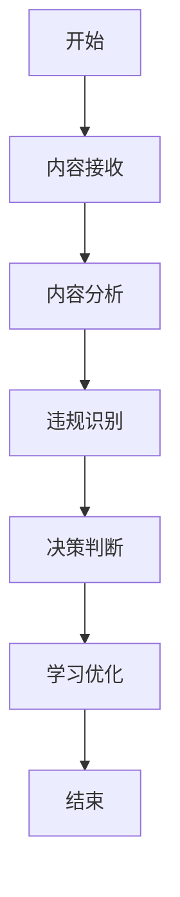
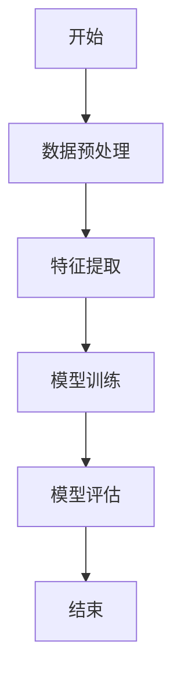
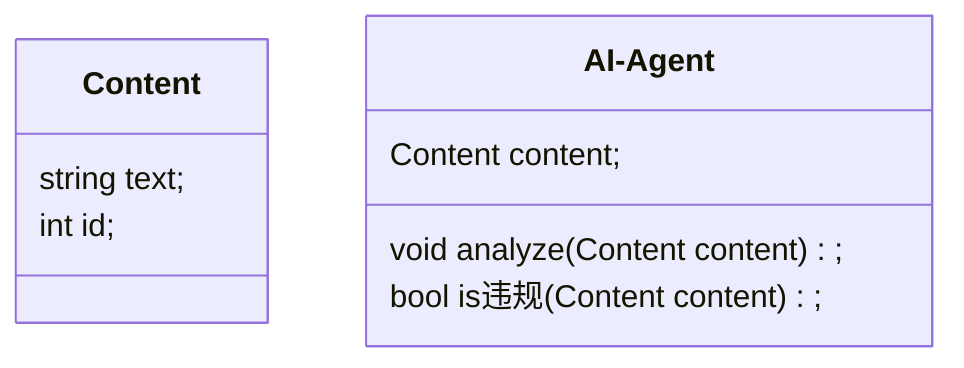
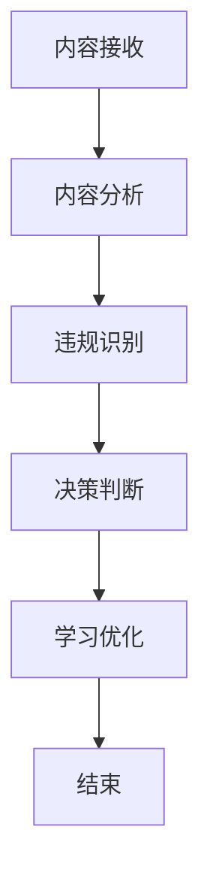
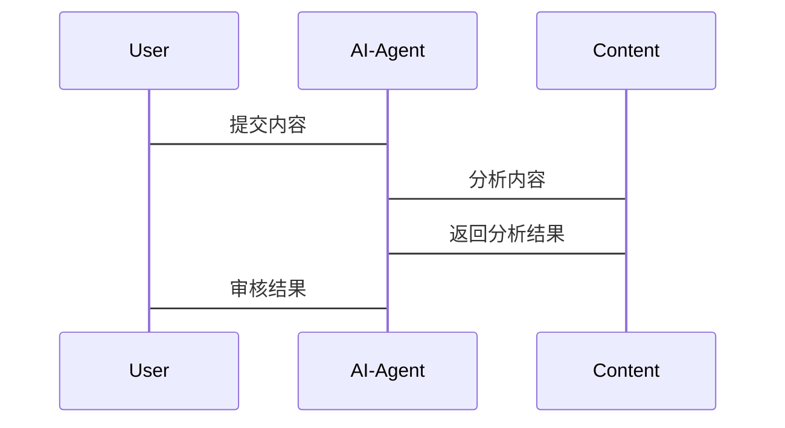

                 


# AI Agent在智能内容审核中的应用

> 关键词：AI Agent、智能内容审核、自然语言处理、机器学习、深度学习

> 摘要：本文将深入探讨AI Agent在智能内容审核中的应用，从背景、核心概念、算法原理、系统设计到项目实战，全面解析AI Agent在内容审核中的技术实现与实际应用。通过分析AI Agent的核心功能与技术原理，结合实际案例，展示AI Agent如何提升内容审核的效率与准确性。

---

# 第一部分: AI Agent与智能内容审核的背景与概念

## 第1章: AI Agent与智能内容审核概述

### 1.1 AI Agent的基本概念

#### 1.1.1 什么是AI Agent
AI Agent（人工智能代理）是指能够感知环境、执行任务并做出决策的智能实体。它通过自然语言处理、机器学习和深度学习等技术，能够理解和分析文本、图像等信息，从而实现自动化的内容审核。

#### 1.1.2 AI Agent的核心特征
- **自主性**：AI Agent能够独立执行任务，无需人工干预。
- **反应性**：能够实时感知环境并做出响应。
- **学习能力**：通过机器学习模型不断优化自身的审核能力。
- **可扩展性**：能够处理不同类型和规模的内容数据。

#### 1.1.3 AI Agent与传统内容审核的区别
- **效率**：AI Agent能够快速处理大量数据，显著提高审核效率。
- **准确性**：通过机器学习模型，AI Agent能够减少人为错误，提高审核准确性。
- **适应性**：能够根据数据变化动态调整审核策略。

### 1.2 智能内容审核的背景与需求

#### 1.2.1 内容审核的挑战与痛点
- **数据量大**：随着互联网的快速发展，每天产生的内容数量巨大，传统的人工审核方式难以应对。
- **内容多样性**：内容形式多样，包括文本、图片、视频等，审核难度大。
- **审核标准复杂**：不同场景下的审核标准不同，需要动态调整审核策略。

#### 1.2.2 AI技术在内容审核中的优势
- **高效性**：AI Agent能够快速处理大量数据，显著提高审核效率。
- **准确性**：通过机器学习和深度学习技术，AI Agent能够更准确地识别违规内容。
- **灵活性**：能够根据需求动态调整审核策略，适应不同的场景。

#### 1.2.3 智能内容审核的应用场景
- **社交媒体**：实时审核用户发布的内容，防止违规信息的传播。
- **电商平台**：审核商品描述、评论等内容，确保内容合规。
- **新闻媒体**：审核新闻稿，避免虚假信息的传播。

### 1.3 AI Agent在内容审核中的定位与作用

#### 1.3.1 AI Agent在内容审核中的角色
- **内容分析器**：通过自然语言处理技术，分析文本内容，识别违规信息。
- **决策者**：基于分析结果，做出是否通过或拦截内容的决策。
- **学习者**：通过机器学习模型，不断优化自身的审核能力。

#### 1.3.2 AI Agent的核心功能与能力
- **内容理解**：通过自然语言处理技术，理解文本内容的语义。
- **违规识别**：识别文本中的敏感词、色情内容、垃圾信息等。
- **动态调整**：根据审核结果和反馈，动态调整审核策略。

#### 1.3.3 AI Agent与其他内容审核技术的对比
| 技术 | 优点 | 缺点 |
|------|------|------|
| 传统人工审核 | 高准确性 | 低效率，成本高 |
| 基于规则的审核 | 易实现 | 灵活性差，难以应对复杂场景 |
| AI Agent | 高效率，高准确性，灵活性强 | 技术复杂，需要大量数据支持 |

### 1.4 本章小结
本章介绍了AI Agent的基本概念、核心特征以及在内容审核中的作用。通过对比传统内容审核方式，突出了AI Agent在提高审核效率和准确性方面的优势。

---

# 第二部分: AI Agent的核心概念与技术原理

## 第2章: AI Agent的核心概念与原理

### 2.1 AI Agent的组成与工作原理

#### 2.1.1 AI Agent的组成模块
- **感知模块**：负责接收和解析输入的内容数据。
- **分析模块**：通过自然语言处理技术，分析内容的语义。
- **决策模块**：根据分析结果，做出是否通过或拦截内容的决策。
- **学习模块**：通过机器学习模型，不断优化审核能力。

#### 2.1.2 AI Agent的工作流程
1. **输入接收**：接收需要审核的内容数据。
2. **内容分析**：通过自然语言处理技术，分析内容的语义。
3. **违规识别**：识别内容中的违规信息。
4. **决策判断**：根据分析结果，做出是否通过或拦截内容的决策。
5. **学习优化**：根据审核结果和反馈，优化自身的审核能力。

#### 2.1.3 AI Agent的决策机制
- **基于规则的决策**：根据预定义的规则，做出决策。
- **基于机器学习的决策**：通过训练好的机器学习模型，预测内容是否违规。
- **混合决策机制**：结合规则和机器学习模型的结果，做出最终决策。

### 2.2 AI Agent的核心算法与技术

#### 2.2.1 自然语言处理技术
- **分词**：将文本分割成词语或短语，常用工具如jieba。
- **语义理解**：通过词袋模型、TF-IDF等技术，理解文本的语义。
- **文本生成**：通过生成模型，生成符合要求的文本。

#### 2.2.2 机器学习算法
- **分类算法**：如支持向量机（SVM）、随机森林（Random Forest）等，用于分类任务。
- **回归算法**：用于预测任务，如情感分析。
- **聚类算法**：用于将相似的内容分组。

#### 2.2.3 深度学习模型
- **RNN（循环神经网络）**：适用于序列数据的处理。
- **LSTM（长短期记忆网络）**：用于处理长序列数据，避免梯度消失问题。
- **Transformer**：如BERT、GPT等，用于自然语言理解任务。

### 2.3 AI Agent的实体关系与功能架构

#### 2.3.1 实体关系图（ER图）
```mermaid
erDiagram
    user {
        int id
        string username
    }
    content {
        int id
        string text
        int user_id
    }
    ai_agent {
        int id
        string model_type
        float accuracy
    }
    user --> content : 发布
    ai_agent --> content : 审核
```

#### 2.3.2 功能架构图


### 2.4 本章小结
本章详细介绍了AI Agent的组成、工作原理以及核心算法与技术。通过实体关系图和功能架构图，展示了AI Agent在内容审核中的整体架构。

---

# 第三部分: AI Agent的算法原理与数学模型

## 第3章: AI Agent的算法原理

### 3.1 自然语言处理算法

#### 3.1.1 分词算法
- **分词方法**：如jieba分词，将文本分割成词语。
- **分词流程**：
  1. 预处理：去除停用词、标点符号等。
  2. 分词：将预处理后的文本分割成词语。
  3. 后处理：去除重复词语、空格等。

#### 3.1.2 语义理解算法
- **词袋模型**：将文本表示为词袋，计算词语的出现频率。
- **TF-IDF**：计算词语的重要性，用于文本相似度计算。
- **Word2Vec**：通过词向量表示词语，用于语义分析。

#### 3.1.3 文本生成算法
- **马尔可夫链**：基于概率的文本生成方法。
- **LSTM**：通过记忆单元，生成连贯的文本。
- **Transformer**：通过自注意力机制，生成高质量的文本。

### 3.2 机器学习算法

#### 3.2.1 分类算法
- **支持向量机（SVM）**：通过最大化分类间隔，实现分类任务。
- **随机森林**：通过构建多个决策树，提高分类准确率。
- **逻辑回归**：通过sigmoid函数，实现二分类任务。

#### 3.2.2 回归算法
- **线性回归**：通过最小二乘法，拟合最佳回归线。
- **岭回归**：通过L2正则化，防止过拟合。
- **弹性网络回归**：结合L1和L2正则化，优化回归模型。

#### 3.2.3 聚类算法
- **K-means**：通过距离度量，将数据分成K个簇。
- **层次聚类**：通过层次结构，将数据逐步聚类。
- **DBSCAN**：基于密度的聚类算法，识别噪声点。

### 3.3 深度学习算法

#### 3.3.1 RNN网络
- **RNN结构**：通过循环层处理序列数据。
- **梯度消失问题**：通过长短时记忆网络（LSTM）解决。

#### 3.3.2 LSTM网络
- **LSTM结构**：通过记忆单元，保存长期信息。
- **LSTM优势**：能够处理长序列数据，避免梯度消失问题。

#### 3.3.3 Transformer网络
- **自注意力机制**：通过全局上下文，生成高质量的文本。
- **多头注意力**：通过并行处理多个注意力头，提高模型性能。

### 3.4 算法流程图（使用mermaid）


### 3.5 本章小结
本章详细介绍了AI Agent中常用的自然语言处理算法、机器学习算法和深度学习算法。通过流程图展示了算法的整体流程。

---

# 第四部分: AI Agent的系统分析与架构设计

## 第4章: 系统分析与架构设计

### 4.1 项目背景与目标

#### 4.1.1 项目背景
- **互联网内容爆炸式增长**：每天产生的内容数量巨大，人工审核难以应对。
- **内容审核需求多样化**：不同场景下的审核标准不同，需要灵活的审核方案。

#### 4.1.2 项目目标
- **提高审核效率**：通过AI Agent快速处理大量内容。
- **提高审核准确性**：通过机器学习模型，减少人为错误。
- **支持多种内容类型**：能够审核文本、图片、视频等多种内容。

### 4.2 系统功能设计

#### 4.2.1 领域模型类图


#### 4.2.2 功能架构图


#### 4.2.3 系统交互流程图


### 4.3 系统架构设计

#### 4.3.1 系统架构图
```mermaid
graph TD
    UI --> Controller: 发送内容
    Controller --> Service: 调用服务
    Service --> AI-Agent: 调用AI Agent
    AI-Agent --> Database: 存储结果
    Database --> Controller: 返回结果
    Controller --> UI: 显示结果
```

#### 4.3.2 接口设计
- **API接口**：提供RESTful API，供其他系统调用。
- **数据格式**：采用JSON格式，便于数据传输。

#### 4.3.3 交互设计
- **用户输入**：通过UI提交内容。
- **系统响应**：系统返回审核结果。
- **反馈机制**：用户可以对审核结果进行反馈，优化AI Agent的审核能力。

### 4.4 本章小结
本章详细介绍了AI Agent系统的背景、功能设计和架构设计。通过类图和流程图，展示了系统的整体架构和交互流程。

---

# 第五部分: 项目实战与案例分析

## 第5章: 项目实战

### 5.1 环境安装与配置

#### 5.1.1 安装Python
- **安装步骤**：下载并安装Python 3.8或更高版本。
- **环境配置**：配置Python路径，确保命令行可以识别Python命令。

#### 5.1.2 安装依赖库
- **自然语言处理库**：jieba、spacy。
- **机器学习库**：scikit-learn、xgboost。
- **深度学习库**：TensorFlow、PyTorch。

#### 5.1.3 安装开发工具
- **IDE**：推荐使用PyCharm、VS Code。
- **版本控制**：使用Git进行代码管理。

### 5.2 核心代码实现

#### 5.2.1 分词模块
```python
import jieba

def text_segmentation(text):
    words = jieba.lcut(text)
    return words
```

#### 5.2.2 语义理解模块
```python
from sklearn.feature_extraction.text import TfidfVectorizer

def text_representation(texts):
    vectorizer = TfidfVectorizer()
    X = vectorizer.fit_transform(texts)
    return X
```

#### 5.2.3 违规识别模块
```python
from sklearn.svm import SVC

def is_offensive(text):
    model = SVC()
    vectorizer = TfidfVectorizer()
    X = vectorizer.fit_transform([text])
    prediction = model.predict(X)
    return prediction[0]
```

### 5.3 案例分析与解读

#### 5.3.1 案例背景
假设我们有一个社交媒体平台，需要审核用户发布的内容是否违规。

#### 5.3.2 数据准备
- **训练数据**：包含正常和违规内容的文本数据。
- **测试数据**：用于评估模型的准确率。

#### 5.3.3 模型训练与评估
```python
from sklearn.model_selection import train_test_split
from sklearn.metrics import accuracy_score

# 数据准备
X_train, X_test, y_train, y_test = train_test_split(X, y, test_size=0.2)

# 模型训练
model = SVC()
model.fit(X_train, y_train)

# 模型评估
y_pred = model.predict(X_test)
print(accuracy_score(y_test, y_pred))
```

### 5.4 本章小结
本章通过实际案例，展示了AI Agent在内容审核中的具体实现。通过代码示例，详细讲解了分词、语义理解、违规识别等模块的实现过程。

---

# 第六部分: 总结与展望

## 第6章: 总结与展望

### 6.1 本章总结
本文详细介绍了AI Agent在智能内容审核中的应用，从背景、核心概念、算法原理到系统设计和项目实战，全面解析了AI Agent在内容审核中的技术实现与实际应用。

### 6.2 未来展望
- **技术优化**：通过更先进的深度学习模型，进一步提高审核准确率。
- **多模态审核**：结合文本、图像、视频等多种模态信息，实现更全面的审核。
- **实时性提升**：通过边缘计算和分布式架构，实现更高效的实时审核。

### 6.3 注意事项
- **数据隐私**：在处理用户数据时，需要注意数据隐私保护，遵守相关法律法规。
- **模型优化**：需要不断优化模型，确保审核的准确性和效率。
- **用户反馈**：通过用户反馈，不断优化审核策略和用户体验。

### 6.4 拓展阅读
- **《深度学习入门：基于Python和Keras》**：了解深度学习的基本概念和实现方法。
- **《自然语言处理实战：基于Python的语料库分析》**：深入理解自然语言处理的技术和应用。

### 6.5 本章小结
本文总结了AI Agent在内容审核中的应用，并展望了未来的发展方向，为读者提供了进一步学习和研究的方向。

---

# 结语

通过本文的详细介绍，读者可以全面了解AI Agent在智能内容审核中的应用，从理论到实践，掌握AI Agent的核心技术和实际应用。未来，随着AI技术的不断发展，AI Agent在内容审核中的应用将更加广泛和深入，为互联网内容的安全和合规提供更强大的技术支持。

--- 

**注意**：以上目录和内容仅为示例，实际撰写时需要根据具体需求和场景进行调整和补充。

