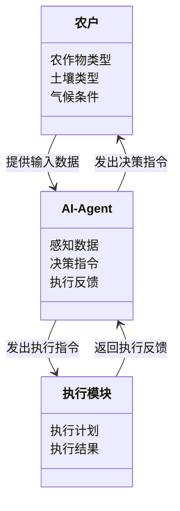

                 


# AI Agent在智能农业规划中的实践

## 关键词
AI Agent, 智能农业, 农业规划, 强化学习, 农业生态系统

## 摘要
本文探讨了AI Agent在智能农业规划中的应用，详细分析了其核心概念、算法原理和系统架构，并通过具体案例展示了其在实际农业场景中的应用价值。

---

# 第一部分: AI Agent在智能农业规划中的背景与概念

## 第1章: AI Agent与智能农业概述

### 1.1 AI Agent的基本概念
#### 1.1.1 什么是AI Agent
人工智能代理（AI Agent）是指能够感知环境、做出决策并执行动作的智能体，用于解决特定问题。

#### 1.1.2 AI Agent的核心特征
- **自主性**：能够在没有外部干预的情况下运行。
- **反应性**：能够实时感知环境并做出响应。
- **目标导向**：根据目标进行决策和行动。

#### 1.1.3 AI Agent与传统自动化的区别
AI Agent具备学习和适应能力，能够处理复杂和不确定性问题，而传统自动化依赖固定程序。

### 1.2 智能农业的定义与发展趋势
#### 1.2.1 智能农业的定义
智能农业是利用现代信息技术，如物联网、大数据和AI，优化农业生产过程。

#### 1.2.2 智能农业的发展现状
- **物联网设备**：传感器、无人机等广泛应用于农业生产。
- **AI技术**：用于作物监测、病虫害识别等。

#### 1.2.3 智能农业的未来趋势
- **智能化决策**
- **精准化管理**
- **可持续发展**

### 1.3 AI Agent在智能农业中的应用价值
#### 1.3.1 提高农业生产效率
AI Agent可以优化作物种植和资源分配，减少浪费。

#### 1.3.2 优化资源利用
通过实时数据分析，AI Agent帮助农民更有效地利用水资源和肥料。

#### 1.3.3 支持精准农业
AI Agent可以根据土壤和气候条件，制定精准的种植计划。

### 1.4 本章小结
本章介绍了AI Agent的基本概念及其在智能农业中的应用价值，为后续内容打下基础。

---

# 第二部分: AI Agent的核心概念与原理

## 第2章: AI Agent的核心概念与联系

### 2.1 AI Agent的组成与结构
#### 2.1.1 感知模块
负责收集环境数据，如土壤湿度、温度等。

#### 2.1.2 决策模块
基于感知数据，使用算法制定决策。

#### 2.1.3 执行模块
根据决策执行动作，如灌溉、施肥等。

### 2.2 AI Agent与智能农业的关系
#### 2.2.1 AI Agent在农业规划中的角色
作为决策支持系统，帮助农民优化种植计划。

#### 2.2.2 AI Agent与农业生态系统的互动
通过实时数据反馈，AI Agent能够动态调整农业策略。

#### 2.2.3 AI Agent在农业数据中的应用
AI Agent可以处理大量农业数据，提取有价值的信息。

### 2.3 AI Agent的核心属性对比
| 属性       | AI Agent                         | 传统自动化                  |
|------------|----------------------------------|-----------------------------|
| 自主性       | 高                              | 低                          |
| 反应性       | 高                              | 中                          |
| 学习能力     | 强                              | 无                          |

### 2.4 AI Agent的ER实体关系图
```mermaid
erDiagram
    actor 农户 {
        农作物类型
        土壤类型
        气候条件
    }
    agent AI-Agent {
        感知数据
        决策指令
        执行反馈
    }
    农户 --> AI-Agent : 提供输入数据
    AI-Agent --> 农户 : 发出决策指令
    AI-Agent --> 执行模块 : 发出执行指令
```

### 2.5 本章小结
本章详细讲解了AI Agent的核心概念及其在智能农业中的作用，并通过ER图展示了其与农业生态系统的互动。

---

# 第三部分: AI Agent的算法原理与数学模型

## 第3章: AI Agent的算法原理

### 3.1 AI Agent的感知算法
#### 3.1.1 数据采集与预处理
使用传感器采集数据，如温度、湿度等，并进行清洗和归一化处理。

#### 3.1.2 感知模型的构建
使用回归分析或分类算法，建立感知模型。

#### 3.1.3 感知结果的输出
输出环境状态，如“土壤湿度不足”。

### 3.2 AI Agent的决策算法
#### 3.2.1 决策树算法
通过构建决策树，基于环境数据做出决策。

#### 3.2.2 基于强化学习的决策
使用强化学习算法，通过奖励机制优化决策策略。

#### 3.2.3 基于规则的决策
根据预设规则，做出简单决策。

### 3.3 AI Agent的执行算法
#### 3.3.1 执行策略的制定
根据决策结果，制定执行计划。

#### 3.3.2 执行过程的监控
实时监控执行过程，确保按计划进行。

#### 3.3.3 执行结果的反馈
将执行结果反馈给感知模块，用于后续决策。

### 3.4 AI Agent的数学模型
#### 3.4.1 感知模型的数学表达
$$ y = f(x) $$
其中，y为输出，x为输入数据，f为感知模型。

#### 3.4.2 决策模型的数学表达
$$ P(a|b) = \frac{P(b|a)P(a)}{P(b)} $$
其中，P(a|b)为在b条件下选择a的概率。

#### 3.4.3 执行模型的数学表达
$$ R = r(s,a) + \gamma \max_{a'} Q(s',a') $$
其中，R为奖励，s为当前状态，a为动作，γ为折扣因子。

### 3.5 本章小结
本章详细讲解了AI Agent的感知、决策和执行算法，并通过数学模型展示了其工作原理。

---

# 第四部分: AI Agent的系统架构与设计

## 第4章: AI Agent的系统架构设计

### 4.1 系统功能设计
#### 4.1.1 领域模型


#### 4.1.2 系统架构


#### 4.1.3 系统接口设计
- 感知模块接口：提供环境数据获取接口。
- 决策模块接口：接收感知数据，输出决策指令。
- 执行模块接口：接收决策指令，执行动作并反馈结果。

#### 4.1.4 系统交互设计
```mermaid
sequenceDiagram
    actor 农户
    agent AI-Agent
    actor 执行模块
    农户 -> AI-Agent : 提供环境数据
    AI-Agent -> 执行模块 : 发出执行指令
    执行模块 -> AI-Agent : 返回执行反馈
```

### 4.2 本章小结
本章详细设计了AI Agent的系统架构，包括功能模块、架构图和交互流程。

---

# 第五部分: AI Agent在智能农业中的项目实战

## 第5章: 项目实战

### 5.1 环境安装与配置
#### 5.1.1 安装Python
安装Python 3.x，确保环境支持AI开发库。

#### 5.1.2 安装依赖库
安装NumPy、Pandas、Scikit-learn等库。

### 5.2 核心代码实现
#### 5.2.1 感知模块代码
```python
import numpy as np
from sklearn.tree import DecisionTreeClassifier

# 感知数据
data = np.array([[25, 60], [30, 50], [28, 65], [35, 70]])
labels = np.array(['湿度不足', '湿度正常', '湿度正常', '湿度充足'])
```

#### 5.2.2 决策模块代码
```python
model = DecisionTreeClassifier()
model.fit(data, labels)
```

#### 5.2.3 执行模块代码
```python
def execute_action(action):
    print(f'执行动作：{action}')
```

### 5.3 实际案例分析
#### 5.3.1 案例背景
农民希望通过AI Agent优化灌溉计划。

#### 5.3.2 数据分析
通过感知模块收集土壤湿度和温度数据，分析得出最佳灌溉时间。

#### 5.3.3 决策与执行
AI Agent根据数据，决策在何时进行灌溉，并通过执行模块完成。

### 5.4 代码应用解读
详细解读上述代码，说明每一步的作用和实现细节。

### 5.5 本章小结
本章通过实际案例展示了AI Agent在智能农业中的应用，并提供了代码实现。

---

# 第六部分: 总结与展望

## 第6章: 总结与展望

### 6.1 总结
本文详细探讨了AI Agent在智能农业中的应用，从背景到实现，全面分析了其在农业规划中的价值。

### 6.2 展望
未来，AI Agent将在农业智能化中发挥更大作用，推动农业可持续发展。

### 6.3 最佳实践Tips
- 确保数据质量
- 定期更新模型
- 结合实际情况调整策略

### 6.4 小结
AI Agent为智能农业带来了新的可能性，值得进一步研究和应用。

---

通过以上目录结构，文章详细分析了AI Agent在智能农业中的各个方面，从理论到实践，为读者提供了全面的知识和指导。

