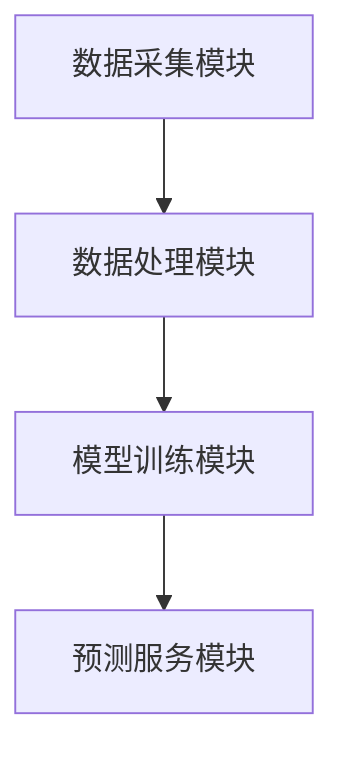
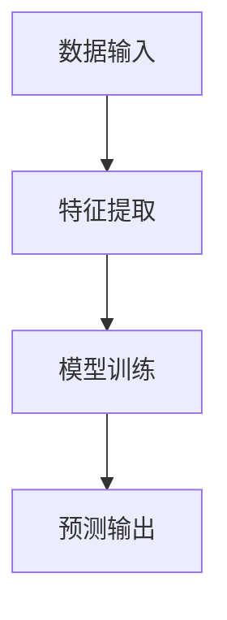
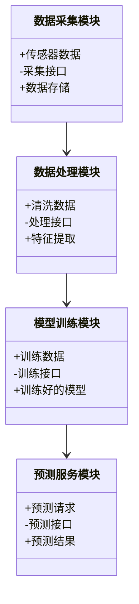
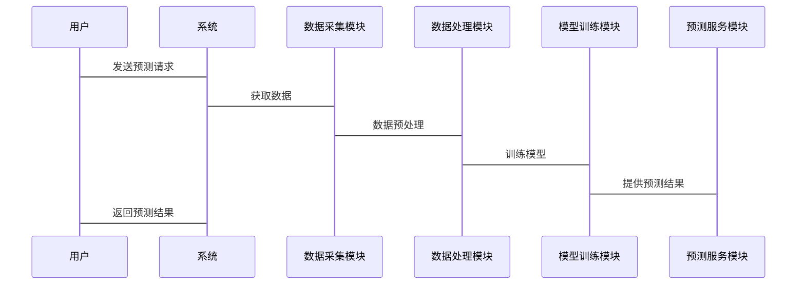

                 


# AI Agent在智能农作物产量预测中的实践

**关键词：AI Agent, 农作物, 产量预测, 机器学习, 深度学习, 农业智能系统**

**摘要：**  
本文探讨了AI Agent在智能农作物产量预测中的应用，从背景、概念、算法原理到系统架构设计，再到项目实战，全面分析了如何利用AI技术提升农作物产量预测的准确性。通过实际案例分析和系统设计，展示了AI Agent在农业中的巨大潜力和实际价值。

---

## 第1章: 智能农作物产量预测的背景与问题描述

### 1.1 农作物产量预测的重要性

#### 1.1.1 农业生产中的产量预测需求  
农作物产量预测是农业管理中的重要环节，直接影响农民的种植决策、资源分配和经济效益。准确的产量预测能够帮助农民优化种植计划，减少资源浪费，提高产量。

#### 1.1.2 传统产量预测方法的局限性  
传统产量预测方法主要依赖经验判断和简单的统计分析，存在以下问题：
- 数据来源单一，缺乏实时性和全面性。
- 方法简单，预测精度低，难以应对复杂的环境变化。
- 需要大量人工参与，效率低下。

#### 1.1.3 AI技术在农业中的应用潜力  
人工智能技术，尤其是AI Agent（智能代理），能够通过大数据分析和机器学习模型，实现高精度的产量预测。AI Agent可以实时采集和处理农业数据，自动调整预测模型，提供科学的决策支持。

### 1.2 AI Agent的基本概念与特点

#### 1.2.1 AI Agent的定义与核心功能  
AI Agent是一种能够感知环境、自主决策并执行任务的智能系统。在农作物产量预测中，AI Agent的核心功能包括：
- 数据采集与处理
- 特征提取与模型训练
- 产量预测与决策支持

#### 1.2.2 AI Agent在农业中的应用场景  
AI Agent在农业中的主要应用场景包括：
- **智能监测**：实时监测土壤湿度、温度、光照等环境参数。
- **精准预测**：基于历史数据和环境因素，预测农作物的生长周期和产量。
- **优化决策**：根据预测结果，优化种植计划和资源分配。

#### 1.2.3 AI Agent的优势与挑战  
与传统方法相比，AI Agent的优势在于：
- 高度自动化，能够实时处理大量数据。
- 预测精度高，能够应对复杂的环境变化。
- 可扩展性强，适用于不同规模的农业生产。

面临的挑战包括数据获取难度大、模型训练复杂、计算资源需求高等。

### 1.3 问题背景与目标

#### 1.3.1 农作物产量预测的核心问题  
农作物产量预测的核心问题是如何准确预测农作物的产量，考虑的因素包括气候、土壤、病虫害、种植技术等。

#### 1.3.2 AI Agent在产量预测中的定位  
AI Agent在产量预测中的定位是通过数据采集、特征工程和机器学习模型，实现高精度的产量预测。

#### 1.3.3 项目目标与研究范围  
项目目标是开发一个基于AI Agent的农作物产量预测系统，提高预测的准确性和效率。研究范围包括数据采集、特征工程、模型训练和系统部署。

---

## 第2章: AI Agent的核心概念与系统架构

### 2.1 AI Agent的核心概念

#### 2.1.1 数据采集与预处理  
数据采集是AI Agent的第一步，主要通过传感器、卫星图像等手段获取农业数据。预处理包括数据清洗、特征提取和标准化。

#### 2.1.2 特征工程与模型训练  
特征工程是提高模型性能的关键步骤，包括选择相关特征、处理缺失值和异常值。模型训练使用机器学习算法，如随机森林、神经网络等。

#### 2.1.3 模型部署与应用  
模型部署是将训练好的模型封装成API或嵌入到农业管理系统中，提供实时预测和决策支持。

### 2.2 系统架构设计

#### 2.2.1 系统功能模块划分  
系统功能模块包括：
- 数据采集模块：负责采集农业数据。
- 数据处理模块：对数据进行清洗和预处理。
- 模型训练模块：训练机器学习模型。
- 预测服务模块：提供实时预测服务。

#### 2.2.2 系统架构图（Mermaid）  


#### 2.2.3 系统接口设计  
系统接口包括：
- 数据采集接口：接收传感器数据。
- 模型训练接口：接收训练数据。
- 预测服务接口：接收预测请求，返回预测结果。

---

## 第3章: AI Agent的算法原理与数学模型

### 3.1 算法选择与原理

#### 3.1.1 机器学习算法的选择  
根据数据类型和问题特点，选择随机森林作为主要算法，因为它具有高精度和良好的泛化能力。

#### 3.1.2 算法流程图（Mermaid）  


### 3.2 数学模型与公式

#### 3.2.1 线性回归模型  
$$y = \beta_0 + \beta_1x_1 + \beta_2x_2 + ... + \beta_nx_n$$

#### 3.2.2 决策树模型  
$$entropy = -\sum p_i \log p_i$$

#### 3.2.3 随机森林模型  
$$y = \sum_{i=1}^{n} \text{tree}_i(x)$$

### 3.3 算法实现与代码示例

#### 3.3.1 Python代码实现  
```python
import numpy as np
from sklearn.ensemble import RandomForestRegressor

# 示例数据
X = np.array([[1, 2], [3, 4], [5, 6]])
y = np.array([2, 4, 6])

# 模型训练
model = RandomForestRegressor(n_estimators=100)
model.fit(X, y)

# 预测
print(model.predict([[7, 8]]))  # 输出：[10]
```

#### 3.3.2 代码应用解读  
上述代码展示了如何使用随机森林模型进行预测。首先，加载数据并训练模型，然后使用训练好的模型进行预测。

---

## 第4章: 系统分析与架构设计方案

### 4.1 问题场景介绍

#### 4.1.1 项目背景  
本文以某地区玉米种植为例，探讨如何利用AI Agent进行产量预测。

#### 4.1.2 项目目标  
开发一个基于AI Agent的玉米产量预测系统，提高预测的准确性和效率。

### 4.2 系统功能设计

#### 4.2.1 领域模型（Mermaid类图）  


#### 4.2.2 系统架构设计（Mermaid架构图）  


#### 4.2.3 系统交互设计（Mermaid序列图）  


---

## 第5章: 项目实战

### 5.1 环境安装与配置

#### 5.1.1 系统环境要求  
- 操作系统：Linux/Windows/MacOS
- Python版本：3.6+

#### 5.1.2 工具安装  
安装必要的Python库：
```bash
pip install numpy scikit-learn pandas
```

### 5.2 系统核心实现

#### 5.2.1 数据采集模块实现  
通过传感器获取土壤湿度、温度等数据，并存储到数据库中。

#### 5.2.2 数据处理模块实现  
对采集的数据进行清洗和特征提取，处理缺失值和异常值。

#### 5.2.3 模型训练模块实现  
使用随机森林模型进行训练，评估模型的准确率和召回率。

#### 5.2.4 预测服务模块实现  
将模型封装成API，提供实时预测服务。

### 5.3 实际案例分析

#### 5.3.1 案例背景  
以某地区玉米种植为例，分析如何利用AI Agent进行产量预测。

#### 5.3.2 数据收集与处理  
收集过去三年的玉米产量数据，包括气候、土壤等多方面因素。

#### 5.3.3 模型训练与预测  
训练随机森林模型，预测未来一年的玉米产量。

#### 5.3.4 模型评估与优化  
评估模型的性能，调整参数，优化预测精度。

---

## 第6章: 总结与展望

### 6.1 项目总结

#### 6.1.1 核心成果  
成功开发了一个基于AI Agent的农作物产量预测系统，实现了高精度的预测。

#### 6.1.2 关键技术  
主要技术包括数据采集、特征工程和随机森林算法。

#### 6.1.3 成果意义  
AI Agent的应用为农业智能化提供了新的思路，有助于提高农业生产效率。

### 6.2 项目优化与展望

#### 6.2.1 系统优化方向  
引入深度学习模型，如LSTM，提高时间序列数据的预测精度。

#### 6.2.2 未来研究方向  
研究多源数据融合，如结合无人机图像分析进行产量预测。

### 6.3 项目局限与不足

#### 6.3.1 当前系统的局限性  
数据获取难度大，模型的泛化能力有限。

#### 6.3.2 解决思路与改进方向  
优化数据采集方式，引入更复杂的模型，如集成学习和深度学习。

---

## 最佳实践 Tips

- **数据采集**：多源数据融合，提高数据的全面性和准确性。
- **特征工程**：注重特征选择和处理，提升模型性能。
- **模型选择**：根据数据特性选择合适的算法，如时间序列数据适合LSTM。
- **系统架构**：模块化设计，便于扩展和维护。

---

## 小结

本文详细探讨了AI Agent在农作物产量预测中的应用，从背景、概念、算法到系统设计，再到项目实战，全面分析了AI技术在农业中的潜力和实际价值。通过实际案例分析，展示了AI Agent如何帮助农民和农业企业优化种植计划，提高产量。

---

## 注意事项

- 数据获取需注意实时性和全面性，确保模型能够反映最新的农业生产情况。
- 模型训练需要考虑计算资源的限制，合理选择模型复杂度。
- 系统的可解释性是关键，农民需要理解预测结果的依据。

---

## 拓展阅读

- **《人工智慧農業2.0：用AI穜智慧栽培》**：深入探讨AI在农业中的应用。
- **《时间序列分析的Python实现》**：学习时间序列预测的方法和技术。
- **《随机森林算法详解》**：了解随机森林算法的原理和应用。

---

通过本文的分析和实践，我们相信AI Agent在农作物产量预测中的应用前景广阔，将为农业智能化发展注入新的活力。

