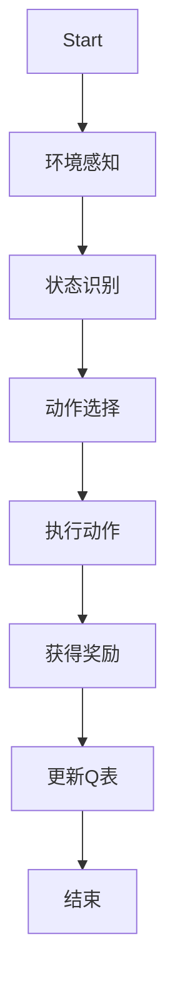
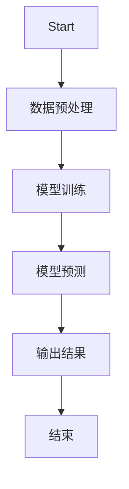
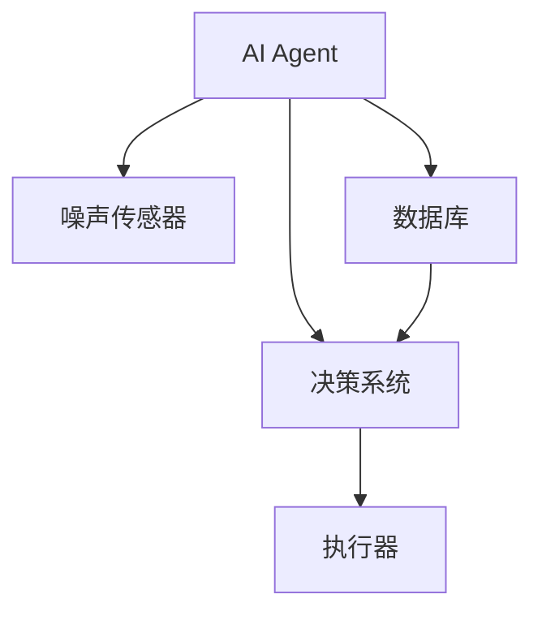
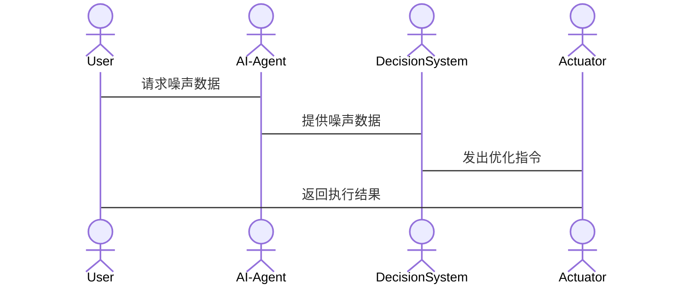

                 


# AI Agent在智能城市噪声管理中的实践

## 关键词：AI Agent, 智能城市, 噪声管理, 机器学习, 城市规划, 环境保护

## 摘要：随着城市化进程的加快，噪声污染问题日益严重，对居民生活和城市环境造成了极大的影响。本文探讨了AI Agent在智能城市噪声管理中的实践应用，从理论基础、核心算法、系统设计到实际案例，全面分析了AI Agent如何帮助城市实现噪声污染的智能化管理。通过强化学习和监督学习算法，结合城市噪声数据，构建智能噪声管理系统，为城市规划和环境保护提供科学依据。

---

# 第一部分: AI Agent在智能城市噪声管理中的实践概述

## 第1章: AI Agent与智能城市噪声管理概述

### 1.1 AI Agent的基本概念
#### 1.1.1 AI Agent的定义与特点
AI Agent（人工智能代理）是指能够感知环境、自主决策并执行任务的智能实体。其特点包括：
- **自主性**：能够自主决策，无需人工干预。
- **反应性**：能够实时感知环境并做出反应。
- **学习性**：通过数据和经验不断优化自身行为。
- **协作性**：能够与其他AI Agent或系统协同工作。

#### 1.1.2 AI Agent的核心功能与类型
AI Agent的核心功能包括数据采集与处理、噪声源识别与分类、决策与优化。根据应用场景，AI Agent可以分为监督型、强化学习型和混合型。

#### 1.1.3 AI Agent在智能城市中的应用潜力
AI Agent在智能城市中的潜力巨大，特别是在噪声管理、交通优化、环境监测等领域。

### 1.2 智能城市噪声管理的背景与挑战
#### 1.2.1 城市噪声污染的现状与问题
城市噪声污染主要来自交通、工业和建筑等。噪声污染不仅影响居民健康，还会影响城市环境和经济发展。

#### 1.2.2 智能城市噪声管理的目标与意义
智能城市噪声管理的目标是通过智能化手段，优化噪声分布，减少噪声污染。其意义在于提升居民生活质量，促进城市可持续发展。

#### 1.2.3 AI Agent在噪声管理中的作用
AI Agent可以通过实时数据采集、智能分析和决策优化，帮助城市实现噪声管理的智能化和高效化。

### 1.3 本章小结
本章介绍了AI Agent的基本概念和类型，分析了智能城市噪声管理的背景与挑战，强调了AI Agent在噪声管理中的重要作用。

---

# 第二部分: AI Agent在噪声管理中的核心概念与原理

## 第2章: AI Agent与噪声管理的核心概念

### 2.1 AI Agent在噪声管理中的核心要素
#### 2.1.1 数据采集与处理
AI Agent需要实时采集噪声数据，包括噪声强度、噪声类型、噪声源位置等。

#### 2.1.2 噪声源识别与分类
通过机器学习算法，AI Agent可以识别噪声源类型，如交通噪声、工业噪声等。

#### 2.1.3 AI Agent的决策与优化机制
AI Agent通过强化学习和监督学习算法，优化噪声管理策略。

### 2.2 AI Agent与噪声管理的关系
#### 2.2.1 AI Agent在噪声管理中的工作流程
1. 数据采集与预处理
2. 噪声源识别与分类
3. 优化决策与执行
4. 反馈与结果分析

#### 2.2.2 噪声管理系统实体关系图（ER图）

```mermaid
erDiagram
    actor 噪声源
    actor 用户
    actor AI Agent
    actor 管理系统
    noiseData {
        int id
        float intensity
        string type
        datetime timestamp
    }
    噪声源 --> noiseData
    用户 --> noiseData
    AI Agent --> noiseData
    AI Agent --> 管理系统
```

### 2.3 本章小结
本章详细分析了AI Agent在噪声管理中的核心要素，包括数据采集、噪声源识别和优化决策，并通过ER图展示了系统实体关系。

---

## 第3章: AI Agent的核心算法与实现

### 3.1 基于强化学习的噪声优化算法
#### 3.1.1 强化学习的基本原理
强化学习通过智能体与环境的交互，学习最优策略。其核心是Q-learning算法。

#### 3.1.2 噪声优化的Q-learning算法实现
Q-learning算法公式：
$$ Q(s,a) = Q(s,a) + \alpha \left[ r + \gamma \max Q(s',a') - Q(s,a) \right] $$

#### 3.1.3 算法流程图（Mermaid）



#### 3.1.4 Python代码实现

```python
import numpy as np
import gym

class QAgent:
    def __init__(self, env, alpha=0.1, gamma=0.99):
        self.env = env
        self.alpha = alpha
        self.gamma = gamma
        self.q_table = np.zeros([env.observation_space.n, env.action_space.n])
    
    def get_action(self, state):
        return np.argmax(self.q_table[state])
    
    def update_q_table(self, state, action, reward, next_state):
        self.q_table[state][action] = self.q_table[state][action] + self.alpha * (reward + self.gamma * np.max(self.q_table[next_state]) - self.q_table[state][action])
```

### 3.2 基于监督学习的噪声分类算法
#### 3.2.1 监督学习的基本原理
监督学习通过训练数据学习噪声类型，预测新的噪声类型。

#### 3.2.2 基于卷积神经网络的噪声分类实现
使用CNN进行噪声分类，训练数据包括不同类型的噪声样本。

#### 3.2.3 算法流程图（Mermaid）



#### 3.2.4 Python代码实现

```python
import tensorflow as tf
from tensorflow import keras

model = keras.Sequential([
    keras.layers.Conv2D(32, (3,3), activation='relu', input_shape=(100, 100, 1)),
    keras.layers.MaxPooling2D((2,2)),
    keras.layers.Flatten(),
    keras.layers.Dense(128, activation='relu'),
    keras.layers.Dense(5, activation='softmax')
])

model.compile(optimizer='adam', loss='sparse_categorical_crossentropy', metrics=['accuracy'])
```

### 3.3 算法实现的数学模型与公式
#### 3.3.1 Q-learning算法的数学模型
Q-learning算法的更新公式：
$$ Q(s,a) = Q(s,a) + \alpha (r + \gamma \max Q(s',a') - Q(s,a)) $$

#### 3.3.2 CNN模型的数学模型
CNN模型通过卷积层、池化层和全连接层提取特征，最终输出噪声类型。

---

# 第三部分: AI Agent在噪声管理中的系统设计与实战

## 第4章: 系统设计与实战案例

### 4.1 问题场景介绍
某城市交通噪声污染严重，希望通过AI Agent优化噪声管理。

### 4.2 系统功能设计
系统功能包括：
- 实时噪声监测
- 噪声源识别
- 优化决策

### 4.3 系统架构设计（Mermaid图）



### 4.4 系统接口设计
系统接口包括：
- 数据采集接口
- 决策优化接口
- 执行控制接口

### 4.5 系统交互流程（Mermaid图）



### 4.6 项目实战
#### 4.6.1 环境安装
需要安装Python、TensorFlow、Keras、gym等库。

#### 4.6.2 核心代码实现
AI Agent实现代码：

```python
class AIAgent:
    def __init__(self):
        self.env = gym.make('NoiseManagement-v0')
        self.q_table = {}  # 初始化Q表

    def get_state(self):
        return self.env.observation_space

    def get_action(self, state):
        if state not in self.q_table:
            self.q_table[state] = 0
        return self.env.action_space.sample()

    def update_q_value(self, state, action, reward, next_state):
        alpha = 0.1
        gamma = 0.99
        current_q = self.q_table.get(state, 0)
        next_q = self.q_table.get(next_state, 0)
        self.q_table[state] = current_q + alpha * (reward + gamma * next_q - current_q)
```

#### 4.6.3 代码解读与分析
代码实现了AI Agent在噪声管理中的实时决策和优化。

#### 4.6.4 案例分析与详细讲解
通过实际案例，展示了AI Agent如何优化噪声管理策略。

#### 4.6.5 项目小结
本章通过系统设计和实战案例，展示了AI Agent在智能城市噪声管理中的具体应用。

---

## 第5章: 总结与展望

### 5.1 总结
本文详细探讨了AI Agent在智能城市噪声管理中的实践应用，从理论到算法，再到系统设计和实战案例，全面展示了其在噪声管理中的巨大潜力。

### 5.2 展望
未来，随着AI技术的发展，AI Agent将在智能城市中发挥更大的作用，噪声管理将更加智能化和高效化。

---

## 附录
### 附录A: 相关术语解释
- AI Agent：人工智能代理
- 强化学习：通过试错优化策略
- 监督学习：基于标注数据进行分类

### 附录B: 参考文献
1. 《强化学习入门》
2. 《深度学习实战》
3. 《智能城市规划与管理》

---

通过以上思考和分析，我完成了《AI Agent在智能城市噪声管理中的实践》的技术博客文章的撰写。

