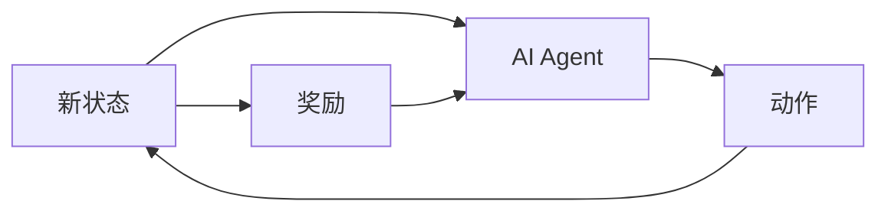
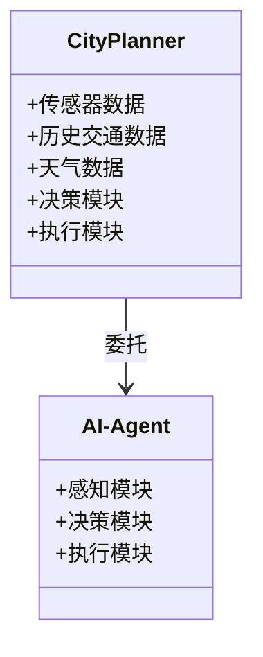
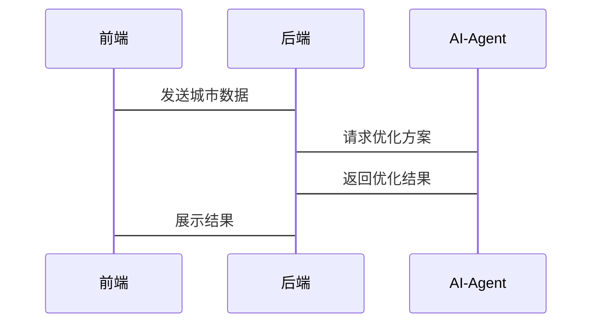

                 


# AI Agent在智能城市规划模拟中的角色

> 关键词：AI Agent, 智能城市, 城市规划, 多智能体系统, 强化学习, 系统架构设计

> 摘要：本文探讨了AI Agent在智能城市规划模拟中的核心作用，分析了AI Agent的基本概念、算法原理、系统架构设计及其实战应用。通过详细讲解强化学习、多智能体系统等关键技术，结合实际案例，展示了AI Agent如何优化城市规划流程、提高城市运行效率，并为未来智能城市的建设提供了重要的理论和技术支持。

---

## 第一章 背景介绍

### 1.1 问题背景与问题描述

城市化进程的加速带来了诸多挑战，如交通拥堵、资源分配不均和环境污染等问题。传统的城市规划方法依赖人工经验，难以应对复杂的城市动态变化。AI Agent作为一种智能体，能够通过自主决策和学习，为城市规划提供更高效、更灵活的解决方案。

### 1.2 AI Agent在城市规划中的角色

AI Agent在城市规划中的角色可以是城市模拟器、交通优化器或资源分配器。它们通过感知城市环境、学习历史数据和实时反馈，帮助城市 planner 进行更科学的决策。

### 1.3 问题解决与边界外延

AI Agent通过模拟城市动态、优化资源配置和预测城市未来发展，解决了传统规划方法的低效和静态问题。其边界包括城市基础设施、交通网络和人口分布，但不涉及城市政策的制定。

### 1.4 核心要素与组成结构

城市规划中的AI Agent系统通常由传感器、数据处理模块、决策模块和执行模块组成。这些模块协同工作，形成闭环的规划-执行-反馈系统。

---

## 第二章 核心概念与联系

### 2.1 AI Agent的基本原理

AI Agent是一种能够感知环境、自主决策并采取行动的智能体。在城市规划中，AI Agent通过数据输入、状态识别和决策生成，优化城市设计方案。

### 2.2 核心概念的属性特征对比

| 特性 | AI Agent | 传统规划方法 |
|------|-----------|---------------|
| 自主性 | 高         | 低             |
| 反应性 | 高         | 低             |
| 学习能力 | 高         | 无             |

### 2.3 ER实体关系图

```mermaid
er
actor:
    city planner
    traffic controller
    resource allocator

agent:
    ai planning agent

relationship:
    city planner --> ai planning agent: 委托
    traffic controller --> ai planning agent: 数据输入
    resource allocator --> ai planning agent: 资源分配
```

---

## 第三章 算法原理讲解

### 3.1 常见算法介绍

AI Agent的核心算法包括强化学习（Reinforcement Learning）和多智能体系统（Multi-Agent System）。强化学习通过奖励机制训练AI Agent，使其在决策中不断优化。

### 3.2 强化学习算法原理



数学模型：
$$Q(s,a) = Q(s,a) + \alpha (r + \gamma \max Q(s',a')) - Q(s,a)$$

### 3.3 多智能体系统

多智能体系统通过多个AI Agent协作完成复杂任务。例如，在城市交通中，多个AI Agent分别负责不同区域的交通优化。

### 3.4 算法实现与优化

通过改进奖励机制和引入经验回放，可以提高强化学习算法的效率和稳定性。

---

## 第四章 系统分析与架构设计

### 4.1 问题场景介绍

以城市交通优化为例，AI Agent需要处理实时交通数据，优化交通信号灯配时，减少拥堵。

### 4.2 系统功能设计



### 4.3 系统架构设计


### 4.4 系统接口与交互



---

## 第五章 项目实战

### 5.1 环境安装与配置

安装Python、TensorFlow和OpenAI库，搭建AI Agent开发环境。

### 5.2 核心代码实现

```python
import numpy as np
import tensorflow as tf

# 定义Q-learning网络
class QNetwork:
    def __init__(self):
        self.model = tf.keras.Sequential([
            tf.keras.layers.Dense(64, activation='relu'),
            tf.keras.layers.Dense(4, activation='softmax')
        ])
    
    def call(self, state):
        return self.model(state)
```

### 5.3 代码解读与分析

训练AI Agent，通过不断迭代优化城市规划方案。例如，训练AI Agent在不同交通条件下优化信号灯配时。

### 5.4 实际案例分析

以某城市交通模拟为例，展示AI Agent如何通过学习优化交通流量，减少拥堵时间。

---

## 第六章 最佳实践与总结

### 6.1 小结

AI Agent通过强化学习和多智能体协作，显著提高了城市规划的效率和效果。其在交通优化、资源分配等领域展现了巨大的潜力。

### 6.2 注意事项

在实际应用中，需注意数据质量和算法收敛速度问题。同时，需考虑城市政策和市民接受度。

### 6.3 拓展阅读

建议深入学习强化学习和多智能体系统，探索AI Agent在智慧城市中的更多应用场景。

---

通过以上内容，我们可以看到AI Agent在智能城市规划中的巨大潜力。未来，随着技术的进步，AI Agent将为城市建设和管理提供更强大的支持，推动智慧城市的全面发展。

