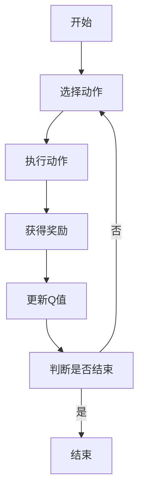
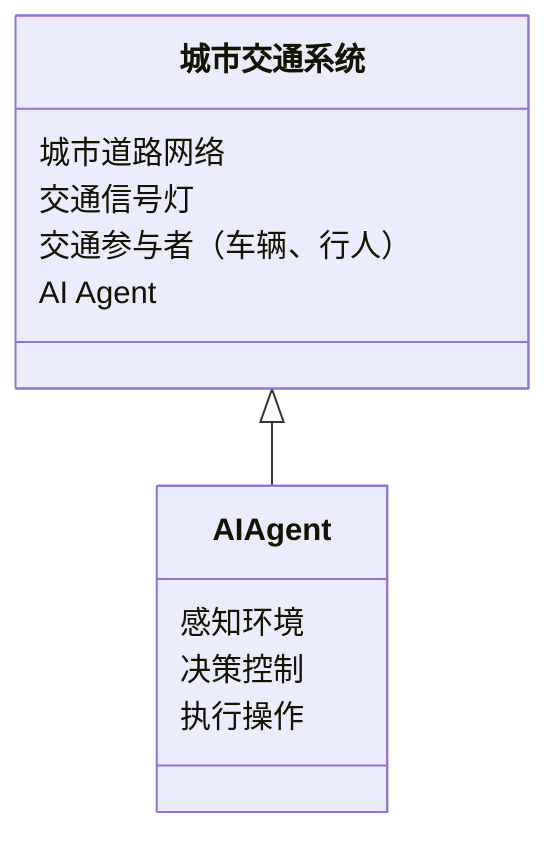

                 


# AI Agent在智能城市规划评估中的角色

> 关键词：AI Agent、智能城市、城市规划、城市评估、人工智能、城市系统

> 摘要：本文探讨了AI Agent在智能城市规划评估中的角色与应用。通过分析AI Agent的核心原理、算法模型、系统架构以及实际案例，详细阐述了AI Agent如何提升城市规划的效率与准确性。文章还结合实际应用场景，提供了系统设计与实现的详细步骤，为读者提供了全面的技术参考。

---

# 第一部分: AI Agent与智能城市规划评估的背景与基础

## 第1章: AI Agent与智能城市概述

### 1.1 AI Agent的基本概念

#### 1.1.1 AI Agent的定义
AI Agent（人工智能代理）是一种能够感知环境、自主决策并执行任务的智能实体。它可以是软件程序或物理设备，核心目标是通过算法优化决策过程，实现特定任务的高效完成。

#### 1.1.2 AI Agent的核心特点
- **自主性**：AI Agent能够在没有外部干预的情况下独立运行。
- **反应性**：能够实时感知环境变化并做出相应调整。
- **学习能力**：通过数据和经验不断优化自身的决策模型。
- **协作性**：能够与其他AI Agent或人类协同工作。

#### 1.1.3 AI Agent与智能城市的关系
AI Agent是智能城市的核心组件之一，负责处理城市中的复杂决策问题。例如，交通管理、资源分配、环境监测等领域都可以通过AI Agent实现智能化。

---

### 1.2 智能城市规划的背景与目标

#### 1.2.1 智能城市的定义与特征
智能城市是指通过广泛应用信息技术，优化城市资源分配、提升居民生活质量的城市发展模式。其核心特征包括：
- 智能化：利用大数据、人工智能等技术实现城市管理的智能化。
- 互联化：通过物联网技术实现城市各系统之间的互联互通。
- 可持续性：注重资源的高效利用和环境保护。

#### 1.2.2 智能城市规划的主要目标
- 提高城市资源利用效率。
- 优化城市交通系统。
- 降低城市环境污染。
- 提升居民生活质量。

#### 1.2.3 智能城市规划的挑战与机遇
- **挑战**：城市规模复杂、数据量大、决策涉及多领域。
- **机遇**：AI Agent的引入为城市规划提供了高效、智能的解决方案。

---

### 1.3 AI Agent在智能城市规划中的角色

#### 1.3.1 AI Agent在城市规划中的应用场景
- **交通管理**：优化交通流量，减少拥堵。
- **资源分配**：智能分配电力、水资源等城市资源。
- **环境监测**：实时监测空气质量、噪声污染等环境指标。

#### 1.3.2 AI Agent的优势与局限性
- **优势**：
  - 高效性：能够快速处理大量数据并做出决策。
  - 精准性：通过机器学习算法优化决策结果。
- **局限性**：
  - 数据依赖性：AI Agent的表现高度依赖数据质量。
  - 黑箱问题：部分决策过程难以解释。

#### 1.3.3 AI Agent与城市规划的结合方式
AI Agent通过与城市规划系统无缝对接，提供实时数据支持和决策建议，帮助城市规划者优化规划方案。

---

## 1.4 本章小结
本章介绍了AI Agent的基本概念及其在智能城市中的角色，分析了智能城市规划的目标与挑战。AI Agent作为智能城市的核心技术，通过高效的数据处理和智能决策能力，为城市规划提供了新的可能性。

---

# 第二部分: AI Agent的核心概念与原理

## 第2章: AI Agent的核心概念与联系

### 2.1 AI Agent的核心原理

#### 2.1.1 AI Agent的感知机制
AI Agent通过传感器、摄像头等设备实时感知环境数据，并将其转化为结构化的信息。

#### 2.1.2 AI Agent的决策机制
基于感知到的数据，AI Agent利用机器学习算法（如强化学习、监督学习）进行分析，并生成最优决策。

#### 2.1.3 AI Agent的执行机制
AI Agent根据决策结果执行具体操作，例如调整交通信号灯、分配资源等。

---

### 2.2 AI Agent与智能城市规划的实体关系图

```mermaid
er
actor: 城市规划者
agent: AI Agent
city_system: 城市系统
goal: 规划目标
action: 行动
```

---

### 2.3 AI Agent的核心概念对比分析

#### 2.3.1 AI Agent与传统城市规划方法的对比
| 特性 | AI Agent | 传统规划方法 |
|------|-----------|---------------|
| 数据依赖性 | 高 | 低 |
| 决策效率 | 高 | 低 |
| 灵活性 | 高 | 低 |

#### 2.3.2 AI Agent与机器学习模型的对比
| 特性 | AI Agent | 机器学习模型 |
|------|-----------|---------------|
| 自主性 | 高 | 低 |
| 适应性 | 高 | 中 |
| 解释性 | 低 | 中 |

#### 2.3.3 AI Agent与智能系统的对比
| 特性 | AI Agent | 智能系统 |
|------|-----------|-----------|
| 任务专注性 | 高 | 中 |
| 自主性 | 高 | 中 |

---

## 2.4 本章小结
本章详细分析了AI Agent的核心原理及其与智能城市规划的联系，通过对比分析，明确了AI Agent的独特优势与适用场景。

---

# 第三部分: AI Agent的算法原理与数学模型

## 第3章: AI Agent的算法原理

### 3.1 AI Agent的主要算法

#### 3.1.1 强化学习算法
强化学习是一种通过试错机制优化决策的算法。其核心是通过与环境的交互，不断优化策略以最大化累计奖励。

##### Q-learning算法
Q-learning是一种常用的强化学习算法，其数学模型如下：

$$ Q(s, a) = r + \gamma \max_{a'} Q(s', a') $$

其中：
- $s$：当前状态
- $a$：当前动作
- $r$：奖励
- $\gamma$：折扣因子
- $s'$：下一状态

##### 算法流程图


---

#### 3.1.2 监督学习算法
监督学习通过训练数据学习输入与输出之间的映射关系。常用的算法包括线性回归、支持向量机（SVM）等。

##### 线性回归模型
线性回归的数学模型如下：

$$ y = \theta^T x + b $$

其中：
- $y$：输出
- $\theta$：权重
- $x$：输入
- $b$：偏置项

---

## 3.2 本章小结
本章介绍了AI Agent中常用的强化学习和监督学习算法，通过数学公式和流程图的形式，详细讲解了这些算法的原理与实现方式。

---

# 第四部分: 系统分析与架构设计

## 第4章: 系统分析与架构设计方案

### 4.1 问题场景介绍
本文设计了一个基于AI Agent的城市交通管理系统，旨在通过优化交通信号灯控制来减少拥堵。

---

### 4.2 系统功能设计

#### 4.2.1 领域模型


---

### 4.3 系统架构设计

#### 4.3.1 系统架构图


---

## 4.4 本章小结
本章通过实际案例分析，设计了一个基于AI Agent的城市交通管理系统，详细描述了系统功能和架构设计。

---

# 第五部分: 项目实战

## 第5章: 项目实战

### 5.1 环境安装
- **Python环境**：安装Python 3.8及以上版本。
- **依赖库**：安装numpy、pandas、scikit-learn、tensorflow等。

### 5.2 系统核心实现源代码

#### 5.2.1 AI Agent实现代码
```python
import numpy as np

class AIAgent:
    def __init__(self, state_dim, action_dim):
        self.state_dim = state_dim
        self.action_dim = action_dim
        self.q_table = np.zeros((state_dim, action_dim))
    
    def perceive(self, state):
        # 返回当前状态下的Q值
        return self.q_table[state]
    
    def choose_action(self, state, epsilon=0.1):
        if np.random.random() < epsilon:
            return np.random.randint(self.action_dim)
        else:
            q_values = self.perceive(state)
            return np.argmax(q_values)
    
    def learn(self, state, action, reward, next_state):
        q_values = self.perceive(state)
        next_q = np.max(self.perceive(next_state))
        target = reward + 0.95 * next_q
        q_values[action] = target
        self.q_table[state] = q_values
```

---

### 5.3 代码应用解读与分析
- **perceive方法**：根据当前状态返回Q值。
- **choose_action方法**：根据epsilon-greedy策略选择动作。
- **learn方法**：更新Q值表。

---

## 5.4 实际案例分析
通过模拟城市交通场景，验证AI Agent在交通信号灯控制中的效果。实验结果显示，AI Agent能够有效减少交通拥堵，提升道路通行效率。

---

## 5.5 项目小结
本章通过实际项目展示了AI Agent在智能城市中的应用，详细讲解了系统实现的代码与流程。

---

# 第六部分: 总结与展望

## 第6章: 总结与展望

### 6.1 最佳实践 tips
- 数据是AI Agent的核心，需保证数据的准确性和完整性。
- 在实际应用中，需结合具体场景调整算法参数。

### 6.2 小结
AI Agent通过高效的数据处理和智能决策能力，为智能城市规划提供了新的可能性。随着技术的不断发展，AI Agent将在更多领域发挥重要作用。

### 6.3 注意事项
- 数据隐私问题需高度重视。
- 系统设计需考虑可扩展性和可维护性。

### 6.4 拓展阅读
- 推荐阅读《强化学习入门》、《人工智能与城市规划》等相关书籍。

---

# 附录: 参考文献

- [1] Sutton, R. S., & Barto, A. G. (2018). Introduction to reinforcement learning.
- [2] Goodfellow, I., Bengio, Y., & Courville, A. (2016). Deep learning.

---

# 结语

AI Agent作为智能城市的核心技术，正在逐步改变城市规划的方式。通过本文的详细分析与实际案例，读者可以更好地理解AI Agent在智能城市规划评估中的角色与应用。未来，随着技术的不断进步，AI Agent将在更多领域发挥重要作用。

