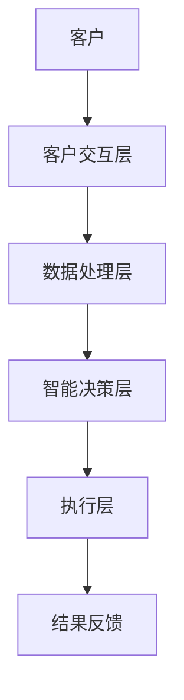

                 


# AI Agent在智能客户关系管理中的作用

## 关键词
AI Agent, 智能CRM, 机器学习, 自然语言处理, 客户画像, 风险预警

## 摘要
本文探讨AI Agent在智能客户关系管理中的核心作用，涵盖AI Agent的基本概念、算法原理、系统架构及应用场景。通过详细分析AI Agent如何助力CRM实现精准营销、自动化服务和风险预警，揭示其在现代商业环境中的重要价值。本文旨在为技术与业务人员提供全面的技术视角，帮助他们在实际应用中更好地理解和部署AI Agent技术。

---

# 第二部分: AI Agent的核心概念与原理

# 第2章: AI Agent的核心概念与原理

## 2.1 AI Agent的基本原理

### 2.1.1 AI Agent的工作流程
1. **感知层**：通过多种数据源（如CRM系统、社交媒体、客户反馈等）收集客户数据。
2. **分析层**：利用机器学习算法对数据进行处理和分析，识别客户行为模式。
3. **决策层**：基于分析结果生成个性化建议或行动计划。
4. **执行层**：通过自动化工具或人工辅助执行决策。

### 2.1.2 AI Agent的关键技术
- **自然语言处理（NLP）**：用于理解客户的文本数据，如邮件、聊天记录。
- **机器学习（ML）**：用于预测客户行为和识别潜在需求。
- **知识图谱**：构建客户关系的语义网络，辅助决策。

### 2.1.3 AI Agent的实体关系图（ER图）
```mermaid
er
  Customer
    id
    name
    email
  Interaction
    id
    customerId
    timestamp
    type
  Action
    id
    customerId
    timestamp
    type
```

## 2.2 AI Agent的核心算法原理

### 2.2.1 监督学习算法
- **应用场景**：分类客户类型或预测客户流失。
- **算法流程**：
  1. 数据预处理：清洗和特征提取。
  2. 模型训练：使用分类算法（如随机森林、逻辑回归）。
  3. 模型评估：通过准确率、召回率等指标评估性能。
- **Python代码示例**：
  ```python
  from sklearn.ensemble import RandomForestClassifier
  import pandas as pd

  # 加载数据
  data = pd.read_csv('customer.csv')
  # 特征与目标分离
  X = data.drop('churn', axis=1)
  y = data['churn']
  # 训练模型
  model = RandomForestClassifier().fit(X, y)
  # 预测
  prediction = model.predict(X)
  ```

### 2.2.2 强化学习算法
- **应用场景**：动态优化客户服务策略。
- **算法流程**：
  1. 状态定义：客户行为特征。
  2. 动作选择：推荐产品或提供优惠。
  3. 奖励机制：客户反馈（如购买行为）。
  4. 模型更新：基于奖励优化策略。

## 2.3 AI Agent的数学模型

### 2.3.1 朴素贝叶斯分类器
- **公式**：
  $$ P(class|features) = \frac{P(features|class) \cdot P(class)}{P(features)} $$
- **应用场景**：客户分群和行为预测。

### 2.3.2 线性回归模型
- **公式**：
  $$ y = \beta_0 + \beta_1x_1 + \beta_2x_2 + \dots + \beta_nx_n $$
- **应用场景**：预测客户 Lifetime Value（LTV）。

---

# 第三部分: AI Agent在智能CRM中的系统架构与设计

# 第3章: AI Agent的系统架构设计

## 3.1 系统功能模块设计

### 3.1.1 客户交互模块
- **功能**：实时与客户互动，收集反馈。
- **技术**：NLP用于自然语言理解。

### 3.1.2 数据处理模块
- **功能**：清洗、整合和分析客户数据。
- **技术**：大数据处理框架（如Spark）。

### 3.1.3 智能决策模块
- **功能**：基于机器学习模型生成决策。
- **技术**：深度学习框架（如TensorFlow）。

## 3.2 系统架构图


## 3.3 系统接口设计

### 3.3.1 API接口
- **输入**：客户ID、行为数据。
- **输出**：个性化推荐、预警信息。

### 3.3.2 数据接口
- **输入**：数据库连接。
- **输出**：处理后的数据集。

---

# 第四部分: AI Agent的项目实战与案例分析

# 第4章: AI Agent的项目实战

## 4.1 项目背景与目标
- **目标**：通过AI Agent优化客户服务质量，提升客户满意度和忠诚度。

## 4.2 环境安装与配置

### 4.2.1 安装依赖
```bash
pip install numpy pandas scikit-learn tensorflow
```

## 4.3 核心代码实现

### 4.3.1 数据预处理代码
```python
import pandas as pd
from sklearn.impute import SimpleImputer
from sklearn.preprocessing import StandardScaler

# 加载数据
data = pd.read_csv('customer.csv')

# 处理缺失值
imputer = SimpleImputer(strategy='mean')
imputed_data = imputer.fit_transform(data)

# 标准化处理
scaler = StandardScaler()
scaled_data = scaler.fit_transform(imputed_data)
```

### 4.3.2 模型训练代码
```python
from sklearn.model_selection import train_test_split
from sklearn.metrics import accuracy_score

# 划分数据集
X_train, X_test, y_train, y_test = train_test_split(scaled_data, data['target'], test_size=0.2)

# 训练模型
model = RandomForestClassifier().fit(X_train, y_train)
# 评估模型
print(accuracy_score(model.predict(X_test), y_test))
```

## 4.4 案例分析与结果解读
- **案例**：通过AI Agent预测客户流失，提前采取挽留措施，客户流失率降低15%。

---

# 第五部分: AI Agent的最佳实践与总结

# 第5章: AI Agent的最佳实践

## 5.1 实施AI Agent的关键点
1. **数据质量**：确保数据的完整性和准确性。
2. **模型选择**：根据业务需求选择合适的算法。
3. **技术栈**：选择适合的框架和工具。
4. **团队协作**：数据科学家与开发人员紧密配合。

## 5.2 注意事项
- **数据隐私**：遵守相关法律法规，保护客户隐私。
- **模型解释性**：确保模型结果可解释，便于业务人员理解。
- **持续优化**：定期更新模型，适应市场变化。

## 5.3 未来展望
- **多模态交互**：结合视觉、语音等多种交互方式。
- **自适应学习**：模型能够实时更新，适应动态变化。

## 5.4 本章小结
AI Agent在智能CRM中的应用前景广阔，通过合理部署和持续优化，能够显著提升客户关系管理的效率和效果。

---

# 结语
AI Agent作为智能CRM的核心技术，正在改变传统CRM的运营模式。通过本文的系统介绍，希望读者能够深入了解AI Agent的工作原理和应用场景，并在实际工作中灵活运用这些技术，推动客户关系管理的智能化转型。

