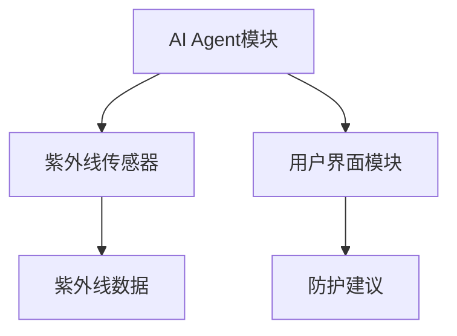

                 


# AI Agent在智能帽子中的紫外线防护

## 关键词：
AI Agent, 紫外线防护, 智能帽子, 机器学习, 算法设计

## 摘要：
本文深入探讨AI Agent在智能帽子中的紫外线防护应用。从紫外线防护的重要性出发，结合AI Agent的核心概念、算法原理和系统架构设计，详细讲解如何利用AI技术优化紫外线防护效果。通过实际案例分析和代码实现，展示AI Agent在智能帽子中的具体应用和最佳实践。

---

# 第1章: 紫外线防护与AI Agent的背景介绍

## 1.1 紫外线防护的重要性

### 1.1.1 紫外线的危害与防护需求
紫外线（UV）是太阳辐射中的一部分，分为UV-A、UV-B和UV-C三种类型。其中，UV-B是主要的有害射线，能够穿透大气层，对人类的皮肤和眼睛造成伤害。长期暴露在紫外线下可能导致皮肤癌、白内障等健康问题。因此，紫外线防护是保护人体健康的重要措施。

### 1.1.2 现有紫外线防护技术的局限性
传统的紫外线防护主要依赖物理屏障，如帽子、太阳镜和防晒霜。然而，这些方法存在以下局限性：
- 无法实时监测紫外线强度。
- 无法根据环境变化主动调整防护措施。
- 缺乏智能化的提醒和优化功能。

### 1.1.3 AI技术在紫外线防护中的潜力
人工智能（AI）技术的发展为紫外线防护提供了新的解决方案。通过AI Agent，智能帽子可以实时监测紫外线强度，并根据环境变化主动调整防护策略，为用户提供智能化的紫外线防护服务。

---

## 1.2 AI Agent的基本概念

### 1.2.1 AI Agent的定义与特点
AI Agent是一种能够感知环境、做出决策并执行任务的智能体。它具有以下特点：
- **自主性**：能够自主决策和行动。
- **反应性**：能够实时感知环境并做出反应。
- **学习能力**：能够通过数据学习和优化决策策略。

### 1.2.2 AI Agent在智能设备中的应用
AI Agent广泛应用于智能设备中，如智能家居、自动驾驶和医疗设备。在紫外线防护中，AI Agent可以实时监测紫外线强度，并根据数据调整帽子的防护功能。

### 1.2.3 AI Agent与智能帽子的结合
智能帽子通过集成AI Agent，能够实时监测紫外线强度，并根据数据优化防护策略。例如，当紫外线强度较高时，AI Agent可以提醒用户佩戴帽子或调整帽子的角度。

---

## 1.3 本章小结
本章介绍了紫外线防护的重要性以及AI Agent的基本概念。通过对比传统紫外线防护技术的局限性，提出了AI Agent在智能帽子中的应用潜力。

---

# 第2章: 紫外线监测与AI Agent的感知机制

## 2.1 紫外线监测技术

### 2.1.1 紫外线传感器的工作原理
紫外线传感器是一种能够检测紫外线强度的设备。它通过测量紫外线的辐射强度，将数据传输给AI Agent。

### 2.1.2 紫外线强度的测量与数据采集
智能帽子中的紫外线传感器会实时采集紫外线强度数据，并将其传输给AI Agent。数据采集的频率和精度直接影响防护效果。

### 2.1.3 紫外线数据的预处理与特征提取
为了提高AI Agent的决策精度，需要对紫外线数据进行预处理和特征提取。例如，可以使用滑动窗口技术去除噪声数据，并提取紫外线强度的变化趋势。

## 2.2 AI Agent的感知与决策机制

### 2.2.1 AI Agent的感知模型
AI Agent的感知模型包括紫外线传感器和环境感知模块。传感器负责采集紫外线数据，环境感知模块负责分析环境变化。

### 2.2.2 紫外线数据的特征分析
通过分析紫外线数据的特征，AI Agent可以预测紫外线强度的变化趋势。例如，可以使用统计分析方法提取紫外线强度的均值、方差等特征。

### 2.2.3 AI Agent的决策逻辑
AI Agent根据紫外线数据和环境信息，制定防护策略。例如，当紫外线强度超过阈值时，AI Agent可以触发提醒功能或调整帽子的角度。

---

## 2.3 本章小结
本章详细介绍了紫外线监测技术和AI Agent的感知与决策机制。通过分析紫外线数据的特征，AI Agent能够实时调整防护策略，优化紫外线防护效果。

---

# 第3章: AI Agent的算法原理

## 3.1 紫外线防护的机器学习模型

### 3.1.1 紫外线强度预测的线性回归模型
线性回归是一种常用的机器学习模型，用于预测紫外线强度。其数学表达式为：
$$ y = \beta_0 + \beta_1x + \epsilon $$
其中，$y$是紫外线强度，$x$是时间或天气特征，$\beta_0$和$\beta_1$是模型参数。

### 3.1.2 基于决策树的紫外线强度分类模型
决策树是一种用于分类和回归的机器学习模型。在紫外线防护中，可以使用决策树模型对紫外线强度进行分类，例如将紫外线强度分为高、中、低三个级别。

### 3.1.3 神经网络在紫外线防护中的应用
神经网络是一种强大的机器学习模型，可以用于紫外线强度的预测和分类。通过训练神经网络模型，AI Agent可以更准确地预测紫外线强度。

## 3.2 算法的数学模型与公式

### 3.2.1 线性回归模型的数学表达式
$$ y = \beta_0 + \beta_1x + \epsilon $$
其中，$\epsilon$是误差项。

### 3.2.2 决策树模型的特征分割
决策树模型通过特征分割将数据划分为不同的子集。例如，可以使用信息增益作为特征选择的标准。

### 3.2.3 神经网络模型的结构与训练
神经网络模型由输入层、隐藏层和输出层组成。通过反向传播算法训练模型，优化模型参数。

## 3.3 算法实现与优化

### 3.3.1 算法的训练与调优
通过训练数据集对机器学习模型进行训练，并使用验证集进行调优。例如，可以使用交叉验证方法选择最优模型参数。

### 3.3.2 算法的性能评估与优化
通过评估指标（如准确率、召回率）对模型性能进行评估，并根据评估结果优化模型结构和参数。

---

## 3.4 本章小结
本章详细讲解了AI Agent在紫外线防护中的算法原理。通过对比线性回归、决策树和神经网络模型，提出了最优的紫外线强度预测和分类方法。

---

# 第4章: AI Agent智能帽子的系统架构

## 4.1 系统功能需求分析

### 4.1.1 系统功能模块
智能帽子系统主要包括紫外线传感器、AI Agent模块和用户界面模块。紫外线传感器负责数据采集，AI Agent模块负责数据处理和决策，用户界面模块负责显示结果和提醒。

### 4.1.2 功能模块的交互设计
各功能模块之间的交互流程如下：
1. 紫外线传感器采集紫外线数据。
2. AI Agent模块接收数据并进行处理。
3. 根据处理结果，AI Agent模块触发提醒功能或调整帽子的角度。
4. 用户界面模块显示防护建议或调整结果。

---

## 4.2 系统架构设计

### 4.2.1 系统架构的组成
智能帽子系统由硬件部分和软件部分组成。硬件部分包括紫外线传感器、帽子本体和用户界面模块。软件部分包括AI Agent模块和数据处理模块。

### 4.2.2 系统架构的mermaid图


### 4.2.3 系统接口设计
系统接口包括紫外线传感器接口和用户界面接口。紫外线传感器接口用于接收紫外线数据，用户界面接口用于显示防护建议。

---

## 4.3 本章小结
本章详细介绍了AI Agent智能帽子系统的架构设计。通过分析功能模块的交互流程和系统架构，提出了一个高效的紫外线防护系统。

---

# 第5章: 项目实战

## 5.1 环境安装与配置

### 5.1.1 开发环境的选择
建议使用Python编程语言和TensorFlow机器学习框架。安装必要的库，如numpy、pandas、scikit-learn和keras。

### 5.1.2 紫外线传感器的连接
将紫外线传感器连接到智能帽子的硬件模块，并确保数据能够正常传输。

---

## 5.2 系统核心实现

### 5.2.1 紫外线数据的采集与处理
编写代码实现紫外线数据的采集和处理。例如，使用Python的serial库读取传感器数据，并进行预处理。

```python
import serial

ser = serial.Serial('COM3', 9600)
data = ser.readline().decode().strip()
```

### 5.2.2 AI Agent的实现
编写AI Agent模块，实现紫外线强度的预测和分类。例如，使用scikit-learn库训练一个决策树模型。

```python
from sklearn.tree import DecisionTreeClassifier

model = DecisionTreeClassifier()
model.fit(X_train, y_train)
```

### 5.2.3 系统交互的实现
实现AI Agent与硬件模块的交互。例如，当紫外线强度超过阈值时，触发提醒功能。

```python
if uv_intensity > threshold:
    print("提醒用户佩戴帽子")
```

---

## 5.3 实际案例分析

### 5.3.1 案例背景
在晴朗的天气下，紫外线强度较高。AI Agent需要实时监测紫外线强度，并提醒用户佩戴帽子。

### 5.3.2 数据分析与处理
通过实际数据验证AI Agent的决策逻辑。例如，分析紫外线强度随时间的变化趋势。

### 5.3.3 系统优化
根据实际使用情况，优化AI Agent的算法和系统架构。例如，增加更多的传感器或优化模型参数。

---

## 5.4 本章小结
本章通过实际项目案例，详细讲解了AI Agent智能帽子的实现过程。通过代码示例和数据分析，展示了AI Agent在紫外线防护中的实际应用。

---

# 第6章: 最佳实践与总结

## 6.1 最佳实践

### 6.1.1 系统设计中的注意事项
在系统设计中，需要注意传感器的精度和稳定性，以及算法的实时性和准确性。

### 6.1.2 系统实现中的技巧
在系统实现中，可以通过数据预处理和模型调优提高AI Agent的性能。

### 6.1.3 系统维护与优化
定期更新传感器和算法模型，确保系统长期稳定运行。

---

## 6.2 本章小结
本章总结了AI Agent智能帽子系统的最佳实践，为读者提供了实际应用中的注意事项和优化建议。

---

# 总结

通过本篇文章的讲解，读者可以全面了解AI Agent在智能帽子中的紫外线防护应用。从算法原理到系统架构，从理论分析到实际实现，本文为读者提供了深入的技术指导。未来，随着AI技术的不断发展，AI Agent在紫外线防护中的应用将更加广泛和智能化。

---

