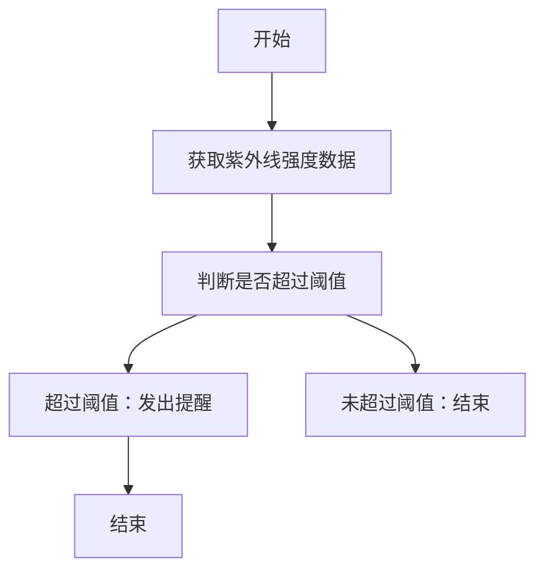
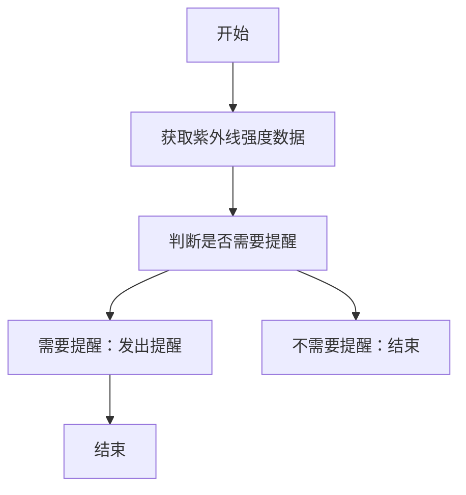
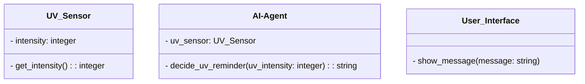
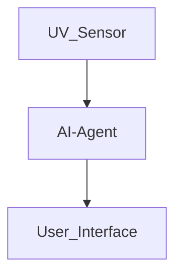

                 


# AI Agent在智能帽子中的紫外线防护提醒

## 关键词：AI Agent, 智能帽子, 紫外线防护, 紫外线提醒, 紫外线强度预测

## 摘要：本文详细探讨了AI Agent在智能帽子中的紫外线防护提醒功能。通过分析紫外线防护的重要性，结合AI Agent的核心算法和系统架构设计，展示了如何通过智能帽子实现紫外线防护提醒。文章从背景介绍、核心概念、算法原理、系统架构到项目实战，全面解析了AI Agent在智能帽子中的应用。

---

## 第一部分: 背景介绍

### 1.1 问题背景

#### 1.1.1 紫外线的危害与防护的重要性
紫外线（UV）是太阳辐射中的一部分，其中UV-A、UV-B和UV-C对人体健康有不同的影响。UV-B是导致皮肤癌、晒伤和皮肤老化的主要原因，而UV-C主要被臭氧层吸收，但UV-A也能穿透云层和玻璃，对人体造成伤害。因此，紫外线防护是保护皮肤健康的重要手段。

#### 1.1.2 智能帽子的发展趋势
随着科技的进步，智能帽子逐渐从传统的遮阳工具演变为集成多种功能的智能设备。智能帽子可以通过传感器、AI算法和互联网连接，为用户提供更智能、更贴心的服务，例如天气预报、紫外线防护提醒、健康监测等。

#### 1.1.3 AI Agent在智能设备中的应用现状
AI Agent（人工智能代理）是一种能够感知环境、执行任务的智能实体。在智能设备中，AI Agent通常用于数据处理、决策制定和用户交互。例如，智能音箱中的语音助手、智能手机中的健康监测应用，都是AI Agent的典型应用。

### 1.2 问题描述

#### 1.2.1 紫外线防护提醒的需求分析
在户外活动时，人们通常无法实时了解紫外线的强度，这可能导致过度曝晒。因此，需要一种能够实时监测紫外线强度并提醒用户的设备。

#### 1.2.2 智能帽子的功能定位
智能帽子的功能定位是通过集成传感器、AI算法和通信模块，为用户提供实时的紫外线防护提醒，同时结合其他功能（如天气预报、健康监测）提升用户体验。

#### 1.2.3 AI Agent在紫外线防护中的作用
AI Agent在智能帽子中的作用是实时监测紫外线强度、分析数据并根据用户的防护需求提供提醒或建议。

### 1.3 问题解决

#### 1.3.1 AI Agent的核心功能设计
AI Agent在智能帽子中的核心功能包括：
1. 实时监测紫外线强度。
2. 分析紫外线强度数据，判断是否需要提醒。
3. 根据用户的偏好和环境数据提供个性化建议。

#### 1.3.2 紫外线防护提醒的实现方案
实现紫外线防护提醒需要以下步骤：
1. 使用紫外线传感器监测紫外线强度。
2. 通过AI算法分析紫外线强度，判断是否超过安全阈值。
3. 如果超过阈值，通过震动或语音提醒用户。

#### 1.3.3 智能帽子的硬件与软件结合
智能帽子的硬件包括紫外线传感器、处理器、存储器和通信模块。软件部分包括AI算法、数据处理模块和用户界面。

### 1.4 边界与外延

#### 1.4.1 AI Agent的功能边界
AI Agent的功能边界包括：
1. 仅限于紫外线防护提醒。
2. 不提供医疗建议。
3. 仅在智能帽子的硬件支持范围内工作。

#### 1.4.2 紫外线防护提醒的适用场景
紫外线防护提醒适用于户外活动、海滩、登山等场景。

#### 1.4.3 智能帽子的扩展功能
智能帽子的扩展功能包括：
1. 天气预报。
2. 健康监测。
3. 娱乐功能。

### 1.5 概念结构与核心要素组成

#### 1.5.1 AI Agent的组成要素
AI Agent的组成要素包括：
1. 传感器：用于采集环境数据。
2. 处理器：用于数据处理和算法运行。
3. 通信模块：用于与外部系统交互。
4. 用户界面：用于与用户交互。

#### 1.5.2 紫外线防护系统的模块划分
紫外线防护系统的模块划分包括：
1. 传感器模块：用于监测紫外线强度。
2. 数据处理模块：用于分析紫外线强度数据。
3. 提醒模块：用于向用户发出提醒。

#### 1.5.3 智能帽子的系统架构
智能帽子的系统架构包括：
1. 硬件层：包括传感器、处理器、存储器和通信模块。
2. 软件层：包括AI算法、数据处理模块和用户界面。
3. 用户层：用户通过智能帽子的界面与系统交互。

## 第二部分: 核心概念与联系

### 2.1 AI Agent的核心原理

#### 2.1.1 AI Agent的基本定义
AI Agent是一种能够感知环境、执行任务的智能实体。它可以自主决策并执行任务，无需人工干预。

#### 2.1.2 AI Agent的核心算法
AI Agent的核心算法包括：
1. 机器学习算法：用于数据处理和模式识别。
2. 自然语言处理算法：用于与用户的交互。

#### 2.1.3 AI Agent的决策机制
AI Agent的决策机制包括：
1. 数据采集：通过传感器采集环境数据。
2. 数据分析：通过算法分析数据，判断是否需要采取行动。
3. 行动决策：根据分析结果，决定是否需要提醒用户。

### 2.2 紫外线防护系统的核心原理

#### 2.2.1 紫外线强度检测原理
紫外线强度检测通过紫外线传感器实现，传感器将紫外线强度转换为电信号，供处理器分析。

#### 2.2.2 紫外线防护提醒的触发条件
紫外线防护提醒的触发条件包括：
1. 紫外线强度超过安全阈值。
2. 用户设置的提醒时间。

#### 2.2.3 紫外线防护提醒的实现方式
紫外线防护提醒的实现方式包括：
1. 通过震动提醒用户。
2. 通过语音提醒用户。
3. 通过LED灯闪烁提醒用户。

### 2.3 AI Agent与紫外线防护系统的联系

#### 2.3.1 AI Agent在紫外线防护中的作用
AI Agent在紫外线防护中的作用包括：
1. 实时监测紫外线强度。
2. 分析紫外线强度数据，判断是否需要提醒。
3. 提供个性化建议。

#### 2.3.2 紫外线防护系统对AI Agent的需求
紫外线防护系统对AI Agent的需求包括：
1. 高精度的紫外线强度预测算法。
2. 快速响应的决策机制。
3. 与硬件设备的无缝集成。

#### 2.3.3 两者的协同工作流程
两者的协同工作流程包括：
1. 传感器采集紫外线强度数据。
2. AI Agent分析数据，判断是否需要提醒。
3. 如果需要提醒，AI Agent通过震动或语音提醒用户。

## 第三部分: 核心概念与联系的ER实体关系图

### 3.1 AI Agent与紫外线防护系统的实体关系

```mermaid
er
actor(AI Agent) {
  id: string
  function: string
}
actor(Ultraviolet Protection System) {
  id: string
  intensity: integer
}
relation(ship) {
  actor_id: string
  role: 
}
```

---

## 第四部分: 算法原理讲解

### 4.1 紫外线强度预测算法

#### 4.1.1 算法流程图


#### 4.1.2 算法实现代码
```python
def uv_protection(uv_intensity):
    threshold = 3  # 紫外线强度阈值
    if uv_intensity > threshold:
        return "发出提醒"
    else:
        return "结束"
```

#### 4.1.3 数学模型和公式
紫外线强度预测的数学模型可以使用线性回归模型：
$$ y = a x + b $$
其中，y是预测的紫外线强度，x是当前时间，a和b是模型参数。

### 4.2 行为决策算法

#### 4.2.1 算法流程图


#### 4.2.2 算法实现代码
```python
def decide_uv_reminder(uv_intensity, user_settings):
    threshold = 3  # 紫外线强度阈值
    if uv_intensity > threshold:
        return "发出提醒"
    else:
        return "结束"
```

#### 4.2.3 数学模型和公式
行为决策算法可以使用决策树模型，例如：
$$ \text{如果} \ uv\_intensity > \text{阈值} \ \text{则} \ \text{提醒} $$

---

## 第五部分: 系统分析与架构设计方案

### 5.1 问题场景介绍

#### 5.1.1 紫外线防护提醒系统的需求
紫外线防护提醒系统的需求包括：
1. 实时监测紫外线强度。
2. 提供个性化的提醒服务。
3. 与智能帽子的其他功能协同工作。

### 5.2 系统功能设计

#### 5.2.1 领域模型


#### 5.2.2 系统架构设计


#### 5.2.3 系统接口设计
系统接口设计包括：
1. UV_Sensor接口：提供紫外线强度数据。
2. AI-Agent接口：提供决策服务。
3. User_Interface接口：显示提醒信息。

#### 5.2.4 系统交互流程
系统交互流程包括：
1. UV_Sensor采集紫外线强度数据。
2. AI-Agent分析数据，判断是否需要提醒。
3. 如果需要提醒，User_Interface发出提醒。

---

## 第六部分: 项目实战

### 6.1 环境搭建

#### 6.1.1 硬件环境
硬件环境包括：
1. 智能帽子：集成紫外线传感器、处理器和通信模块。
2. 开发工具：Python、Jupyter Notebook。

#### 6.1.2 软件环境
软件环境包括：
1. Python编程语言。
2. Mermaid图表工具。
3. Git版本控制工具。

### 6.2 核心代码实现

#### 6.2.1 UV_Sensor类实现
```python
class UV_Sensor:
    def __init__(self):
        self.intensity = 0

    def get_intensity(self):
        return self.intensity
```

#### 6.2.2 AI-Agent类实现
```python
class AI-Agent:
    def __init__(self, sensor):
        self.sensor = sensor

    def decide_uv_reminder(self):
        intensity = self.sensor.get_intensity()
        threshold = 3
        if intensity > threshold:
            return "发出提醒"
        else:
            return "结束"
```

#### 6.2.3 User_Interface类实现
```python
class User_Interface:
    def __init__(self):
        pass

    def show_message(self, message):
        print(message)
```

#### 6.2.4 系统集成
```python
sensor = UV_Sensor()
agent = AI-Agent(sensor)
interface = User_Interface()

agent.decide_uv_reminder()  # 调用决策算法
message = agent.decide_uv_reminder()
interface.show_message(message)
```

### 6.3 案例分析与实现解读

#### 6.3.1 实际案例分析
实际案例分析包括：
1. 紫外线强度为4时，系统发出提醒。
2. 紫外线强度为2时，系统不发出提醒。

#### 6.3.2 代码实现解读
代码实现解读包括：
1. UV_Sensor类用于采集紫外线强度数据。
2. AI-Agent类用于分析数据并决定是否需要提醒。
3. User_Interface类用于显示提醒信息。

### 6.4 项目总结

#### 6.4.1 项目实现的关键点
项目实现的关键点包括：
1. 紫外线传感器的集成与测试。
2. AI-Agent算法的实现与优化。
3. 用户界面的设计与实现。

#### 6.4.2 项目实现的注意事项
项目实现的注意事项包括：
1. 确保传感器的精度和稳定性。
2. 优化AI-Agent算法的响应速度。
3. 提供良好的用户体验。

---

## 第七部分: 最佳实践 tips、小结、注意事项、拓展阅读

### 7.1 最佳实践 tips

#### 7.1.1 AI Agent的设计原则
AI Agent的设计原则包括：
1. 简单性：算法简单易懂，便于维护。
2. 可扩展性：系统设计易于扩展功能。
3. 可靠性：系统运行稳定，能够长时间运行。

#### 7.1.2 紫外线防护系统的设计原则
紫外线防护系统的设计原则包括：
1. 实时性：能够实时监测紫外线强度。
2. 个性化：能够根据用户需求提供个性化服务。
3. 可靠性：系统运行稳定，能够长时间运行。

### 7.2 小结

通过本文的详细讲解，我们了解了AI Agent在智能帽子中的紫外线防护提醒功能。从背景介绍、核心概念、算法原理、系统架构到项目实战，全面解析了AI Agent在智能帽子中的应用。

### 7.3 注意事项

#### 7.3.1 紫外线防护系统的注意事项
紫外线防护系统的注意事项包括：
1. 确保传感器的精度和稳定性。
2. 定期校准传感器。
3. 提供用户手册，指导用户正确使用系统。

#### 7.3.2 AI Agent的注意事项
AI Agent的注意事项包括：
1. 确保算法的准确性和响应速度。
2. 定期更新算法，以适应环境变化。
3. 提供用户友好的界面，方便用户操作。

### 7.4 拓展阅读

#### 7.4.1 推荐书籍
推荐书籍包括：
1. 《人工智能：一种现代的方法》
2. 《智能系统设计》
3. 《传感器网络与应用》

#### 7.4.2 推荐技术博客
推荐技术博客包括：
1. 紫外线传感器的应用。
2. AI Agent在智能设备中的应用。
3. 智能帽子的设计与实现。

---

通过本文的详细讲解，我们了解了AI Agent在智能帽子中的紫外线防护提醒功能。从背景介绍、核心概念、算法原理、系统架构到项目实战，全面解析了AI Agent在智能帽子中的应用。

