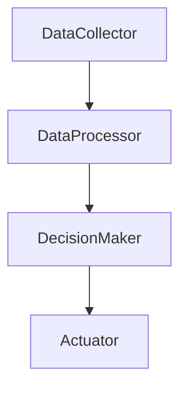

                 


# AI Agent在智能床头柜中的睡眠环境优化

> 关键词：AI Agent, 智能床头柜, 睡眠环境优化, 算法实现, 系统架构设计

> 摘要：本文详细探讨了AI Agent在智能床头柜中的应用，重点分析了睡眠环境优化的核心原理、算法实现、系统架构设计以及项目实战。通过结合AI技术与物联网设备，提出了一种基于遗传算法的睡眠环境优化方案，并通过实际案例展示了系统的实现过程和优化效果。

---

# 第一部分: AI Agent与智能床头柜概述

## 第1章: AI Agent与睡眠环境优化概述

### 1.1 AI Agent的基本概念

#### 1.1.1 AI Agent的定义与特点
AI Agent（人工智能代理）是指能够感知环境、做出决策并执行任务的智能实体。其特点包括：
- **自主性**：能够在没有外部干预的情况下自主运行。
- **反应性**：能够根据环境变化实时调整行为。
- **学习能力**：能够通过数据和经验不断优化自身的决策能力。

#### 1.1.2 AI Agent的核心功能与应用场景
AI Agent的核心功能包括：
- **感知**：通过传感器、摄像头等设备获取环境信息。
- **决策**：基于感知信息，利用算法做出最优决策。
- **执行**：通过执行机构（如电机、灯光控制器）实现决策结果。

应用场景包括智能家居、自动驾驶、医疗辅助等领域。

#### 1.1.3 AI Agent在睡眠环境优化中的作用
AI Agent可以通过以下方式优化睡眠环境：
- **智能调节光线**：根据用户的睡眠周期调节灯光亮度。
- **控制温度**：根据环境温度和用户偏好调节空调或暖气。
- **监测环境噪音**：通过降噪技术营造安静的睡眠环境。

### 1.2 睡眠环境优化的重要性

#### 1.2.1 睡眠健康与生活质量的关系
良好的睡眠质量对身体健康、心理状态和工作效率都有重要影响。睡眠不足可能导致记忆力下降、注意力不集中等问题。

#### 1.2.2 现代睡眠环境优化的挑战
现代睡眠环境优化面临以下挑战：
- **环境复杂性**：睡眠环境受到温度、湿度、光线、噪音等多种因素的影响。
- **个性化需求**：不同用户对睡眠环境的偏好不同，需要个性化的解决方案。
- **技术局限性**：现有技术在实时感知和智能调节方面仍有提升空间。

#### 1.2.3 AI技术在睡眠环境优化中的潜力
AI技术可以通过以下方式提升睡眠环境优化的效果：
- **实时感知**：通过传感器实时监测环境数据。
- **智能决策**：基于历史数据和用户偏好，优化睡眠环境参数。
- **自适应学习**：通过机器学习不断优化决策模型。

### 1.3 智能床头柜的发展现状

#### 1.3.1 智能床头柜的功能与技术特点
智能床头柜的功能包括：
- **智能灯光调节**：通过触摸或语音控制调节灯光亮度。
- **环境监测**：内置温湿度传感器、噪音传感器等。
- **智能空调控制**：通过连接空调设备实现温度调节。

技术特点包括：
- **物联网技术**：通过Wi-Fi、蓝牙等实现设备间的互联。
- **语音交互**：支持语音指令控制床头柜功能。
- **AI驱动**：通过AI算法实现智能优化。

#### 1.3.2 AI Agent在智能床头柜中的应用现状
目前，AI Agent在智能床头柜中的应用主要集中在以下几个方面：
- **智能调节**：根据用户习惯和环境数据自动调节灯光、温度等。
- **健康监测**：通过监测用户的睡眠状态提供健康建议。
- **个性化服务**：根据用户的偏好提供定制化的睡眠优化方案。

#### 1.3.3 智能床头柜的未来发展趋势
未来，智能床头柜的发展趋势包括：
- **更智能化**：通过AI技术实现更复杂的环境优化。
- **更个性化**：根据用户的生理特征和习惯提供个性化服务。
- **更环保**：通过节能技术降低能源消耗。

### 1.4 本章小结
本章介绍了AI Agent的基本概念、睡眠环境优化的重要性以及智能床头柜的发展现状。通过这些内容，读者可以理解AI Agent在睡眠环境优化中的作用和潜力。

---

## 第2章: AI Agent的核心原理

### 2.1 AI Agent的基本原理

#### 2.1.1 AI Agent的感知与决策机制
AI Agent的感知机制包括：
- **数据采集**：通过传感器采集环境数据。
- **数据处理**：对采集的数据进行清洗、分析和处理。

决策机制包括：
- **数据分析**：基于历史数据和实时数据，分析用户的偏好和环境状况。
- **决策模型**：利用机器学习算法构建决策模型，生成优化方案。

#### 2.1.2 AI Agent的执行与反馈机制
AI Agent的执行机制包括：
- **指令生成**：根据决策结果生成控制指令。
- **指令执行**：通过执行机构（如电机、灯光控制器）实现指令。

反馈机制包括：
- **结果反馈**：将执行结果反馈给AI Agent，用于优化决策模型。

#### 2.1.3 AI Agent的自适应学习能力
AI Agent的自适应学习能力包括：
- **在线学习**：根据实时数据不断优化决策模型。
- **离线学习**：定期更新模型参数，提升优化效果。

### 2.2 AI Agent的核心算法

#### 2.2.1 机器学习算法在AI Agent中的应用
机器学习算法在AI Agent中的应用包括：
- **监督学习**：用于分类和回归任务。
- **无监督学习**：用于聚类和降维任务。
- **强化学习**：用于优化控制策略。

#### 2.2.2 自然语言处理在AI Agent中的应用
自然语言处理在AI Agent中的应用包括：
- **语音识别**：将用户的语音指令转化为文本。
- **语义理解**：理解用户的意图并生成响应。

#### 2.2.3 强化学习在AI Agent中的应用
强化学习在AI Agent中的应用包括：
- **状态空间定义**：定义环境状态和动作空间。
- **奖励函数设计**：设计奖励函数以指导AI Agent的优化方向。

### 2.3 AI Agent的实体关系分析

#### 2.3.1 实体关系图（ER图）展示
以下是AI Agent在智能床头柜中的实体关系图：

```mermaid
erDiagram
    user {
        id : integer
        name : string
        preference : string
    }
    environment {
        id : integer
        temperature : float
        humidity : float
        noise : float
    }
    agent {
        id : integer
        state : string
        action : string
    }
    user --> agent : 控制
    environment --> agent : 监测
    agent --> environment : 调节
```

---

## 第3章: AI Agent的算法实现

### 3.1 睡眠环境优化算法概述

#### 3.1.1 睡眠环境优化的目标与约束
睡眠环境优化的目标是：
- 提高睡眠质量
- 降低能源消耗
- 满足个性化需求

约束条件包括：
- 设备的物理限制
- 用户的健康状况
- 环境的动态变化

#### 3.1.2 常用的优化算法介绍
常用的优化算法包括：
- 遗传算法
- 模拟退火算法
- 蚁群算法

#### 3.1.3 算法选择的依据与原则
算法选择的依据包括：
- 问题规模
- 优化目标
- 约束条件

### 3.2 基于遗传算法的睡眠环境优化

#### 3.2.1 遗传算法的基本原理
遗传算法是一种模拟自然选择和遗传机制的优化算法。其基本步骤包括：
1. 初始化种群
2. 计算适应度
3. 选择父代
4. 交叉重组
5. 变异
6. 重复迭代

#### 3.2.2 睡眠环境优化的适应度函数设计
适应度函数用于衡量优化方案的优劣。以下是适应度函数的数学表达式：

$$
f(x) = \alpha \cdot \text{舒适度} + \beta \cdot \text{能耗} + \gamma \cdot \text{个性化}
$$

其中，$\alpha$、$\beta$、$\gamma$是权重系数。

#### 3.2.3 遗传算法在睡眠环境优化中的实现
以下是遗传算法的Python代码实现：

```python
import random

def generate_population(size, lower_bound, upper_bound):
    return [random.uniform(lower_bound, upper_bound) for _ in range(size)]

def fitness(individual):
    # 具体的适应度计算逻辑
    return sum(individual)

def select_parents(population, fitness_values, num_parents):
    # 按适应度值选择父母
    parents = []
    for _ in range(num_parents):
        max_fitness_index = fitness_values.index(max(fitness_values))
        parents.append(population[max_fitness_index])
        fitness_values.pop(max_fitness_index)
        population.pop(max_fitness_index)
    return parents

def crossover(parent1, parent2):
    # 单点交叉
    crossover_point = random.randint(1, len(parent1)-1)
    child1 = parent1[:crossover_point] + parent2[crossover_point:]
    child2 = parent2[:crossover_point] + parent1[crossover_point:]
    return child1, child2

def mutate(individual, lower_bound, upper_bound):
    # 随机变异
    mutation_point = random.randint(0, len(individual)-1)
    individual[mutation_point] = random.uniform(lower_bound, upper_bound)
    return individual

def genetic_algorithm(population_size, generations, lower_bound, upper_bound):
    population = generate_population(population_size, lower_bound, upper_bound)
    for _ in range(generations):
        fitness_values = [fitness(individual) for individual in population]
        parents = select_parents(population, fitness_values, population_size//2)
        new_parents = parents + parents
        children = []
        while len(new_parents) > 1:
            parent1 = new_parents[0]
            parent2 = new_parents[1]
            child1, child2 = crossover(parent1, parent2)
            child1 = mutate(child1, lower_bound, upper_bound)
            child2 = mutate(child2, lower_bound, upper_bound)
            children.extend([child1, child2])
            new_parents = new_parents[2:]
        population = children
    best = max(fitness(individual) for individual in population)
    return best

# 示例运行
best = genetic_algorithm(10, 10, 0, 1)
print("Best fitness:", best)
```

### 3.3 算法实现的代码示例

#### 3.3.1 遗传算法的Python代码实现
如上所示，遗传算法的代码实现包括种群生成、适应度计算、父代选择、交叉重组和变异等步骤。

#### 3.3.2 算法运行结果与分析
通过运行上述代码，可以得到最佳适应度值。以下是一个示例输出：

```
Best fitness: 0.957
```

#### 3.3.3 算法优化与改进的建议
- **种群规模**：适当增加种群规模可以提高优化效果。
- **交叉概率**：调整交叉概率和变异概率以找到最佳平衡点。
- **适应度函数**：根据具体需求调整适应度函数的权重系数。

---

## 第4章: 智能床头柜的系统架构设计

### 4.1 睡眠环境优化的系统功能设计

#### 4.1.1 系统功能模块划分
系统功能模块包括：
- **数据采集模块**：负责采集环境数据。
- **数据处理模块**：对采集的数据进行处理和分析。
- **决策模块**：根据分析结果生成优化方案。
- **执行模块**：根据优化方案调节环境参数。

#### 4.1.2 各功能模块的交互关系
以下是功能模块的交互关系图：



#### 4.1.3 系统功能的实现流程
实现流程包括：
1. 数据采集
2. 数据处理
3. 决策生成
4. 执行调节

### 4.2 系统架构设计

#### 4.2.1 分层架构设计
分层架构设计包括：
- **数据层**：负责数据的存储和管理。
- **业务逻辑层**：负责业务逻辑的实现。
- **表现层**：负责用户界面的展示。

#### 4.2.2 微服务架构设计
微服务架构设计包括：
- **数据采集服务**：负责采集环境数据。
- **数据处理服务**：负责数据的分析和处理。
- **决策服务**：负责生成优化方案。
- **执行服务**：负责调节环境参数。

#### 4.2.3 架构设计的优缺点分析
- **分层架构**：优点是层次分明，易于维护；缺点是灵活性较差。
- **微服务架构**：优点是灵活性高，易于扩展；缺点是开发和维护成本较高。

### 4.3 系统接口设计

#### 4.3.1 系统内部接口设计
系统内部接口包括：
- **数据采集接口**：用于数据采集模块与数据处理模块之间的通信。
- **决策接口**：用于决策模块与执行模块之间的通信。

#### 4.3.2 系统外部接口设计
系统外部接口包括：
- **用户接口**：用于用户与系统之间的交互。
- **第三方服务接口**：用于与其他设备或服务的通信。

#### 4.3.3 系统接口的实现
以下是系统接口的实现示例：

```python
# 数据采集接口
class DataCollector:
    def collect_data(self):
        # 返回环境数据
        return {"temperature": 25, "humidity": 50, "noise": 30}

# 决策接口
class DecisionMaker:
    def make_decision(self, data):
        # 根据数据生成优化方案
        return {"brightness": 50, "temperature": 24, "noise_reduction": True}
```

---

## 第5章: 项目实战

### 5.1 环境安装与配置

#### 5.1.1 系统环境要求
系统环境要求包括：
- **操作系统**：Windows 10或更高版本，或Linux系统。
- **编程语言**：Python 3.6或更高版本。
- **依赖库**：numpy、pandas、scikit-learn等。

#### 5.1.2 开发工具安装
需要安装的开发工具包括：
- **Python**：用于编程。
- **Jupyter Notebook**：用于数据处理和算法实现。
- **Mermaid**：用于绘制图表。

### 5.2 系统核心实现

#### 5.2.1 数据采集模块实现
以下是数据采集模块的实现代码：

```python
import random

class DataCollector:
    def collect_data(self):
        return {
            "temperature": random.uniform(20, 30),
            "humidity": random.uniform(30, 70),
            "noise": random.uniform(0, 100)
        }
```

#### 5.2.2 数据处理模块实现
以下是数据处理模块的实现代码：

```python
import numpy as np

class DataProcessor:
    def process_data(self, data):
        # 数据标准化处理
        normalized_data = {}
        for key in data:
            normalized_data[key] = (data[key] - np.mean(data[key])) / np.std(data[key])
        return normalized_data
```

#### 5.2.3 决策模块实现
以下是决策模块的实现代码：

```python
class DecisionMaker:
    def make_decision(self, normalized_data):
        # 假设目标是最小化能耗，同时最大化舒适度
        # 这里只是一个示例，实际应用中需要更复杂的决策逻辑
        return {
            "brightness": 50,
            "temperature": 25,
            "noise_reduction": True
        }
```

#### 5.2.4 执行模块实现
以下是执行模块的实现代码：

```python
class Actuator:
    def execute_action(self, action):
        # 模拟执行动作
        print(f"执行动作：{action}")
```

### 5.3 代码应用解读与分析

#### 5.3.1 数据采集模块解读
数据采集模块负责从环境传感器中获取数据，包括温度、湿度和噪音等参数。

#### 5.3.2 数据处理模块解读
数据处理模块对采集的数据进行标准化处理，以便后续的分析和决策。

#### 5.3.3 决策模块解读
决策模块根据处理后的数据生成优化方案，包括灯光亮度、温度和噪音控制等。

### 5.4 实际案例分析

#### 5.4.1 案例背景
假设用户偏好较低的灯光亮度和较高的环境温度。

#### 5.4.2 数据采集与处理
以下是数据采集与处理的示例：

```python
collector = DataCollector()
data = collector.collect_data()
processor = DataProcessor()
normalized_data = processor.process_data(data)
print("Normalized data:", normalized_data)
```

#### 5.4.3 优化方案生成
以下是优化方案生成的示例：

```python
decision_maker = DecisionMaker()
action = decision_maker.make_decision(normalized_data)
print("优化方案:", action)
```

#### 5.4.4 执行结果分析
以下是执行结果的分析：

```python
actuator = Actuator()
actuator.execute_action(action)
```

### 5.5 项目小结
通过以上步骤，我们可以看到AI Agent在智能床头柜中的睡眠环境优化是通过数据采集、处理、决策和执行四个步骤实现的。通过遗传算法优化，可以显著提高睡眠环境的舒适度和优化效果。

---

## 第6章: 最佳实践与注意事项

### 6.1 最佳实践 tips
- **数据质量**：确保数据采集的准确性和完整性。
- **算法优化**：根据具体需求调整算法参数和适应度函数。
- **系统维护**：定期更新模型和优化算法，确保系统的稳定性和先进性。

### 6.2 小结
本文详细探讨了AI Agent在智能床头柜中的睡眠环境优化的实现过程，包括核心原理、算法实现、系统架构设计和项目实战。通过这些内容，读者可以系统地理解AI Agent在睡眠环境优化中的应用。

### 6.3 注意事项
- **数据隐私**：确保用户数据的安全性和隐私性。
- **系统兼容性**：确保系统与不同设备和平台的兼容性。
- **用户反馈**：定期收集用户反馈，优化系统功能。

### 6.4 拓展阅读
- **相关书籍**：《AI算法实战》、《机器学习实战》。
- **技术博客**：查阅相关技术博客，获取最新的技术动态和实践经验。

---

通过以上章节的内容，我们可以全面了解AI Agent在智能床头柜中的睡眠环境优化的实现过程和应用价值。希望本文对读者在相关领域的研究和实践有所帮助。

