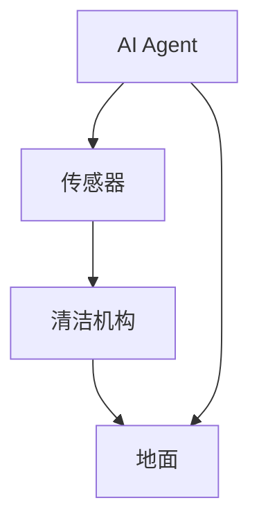
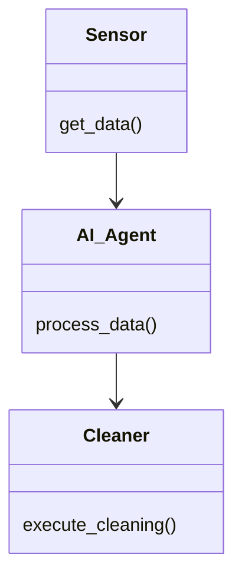
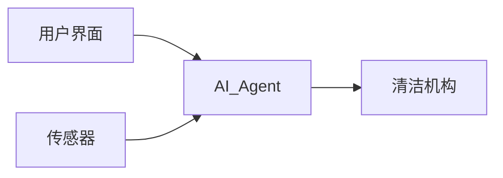
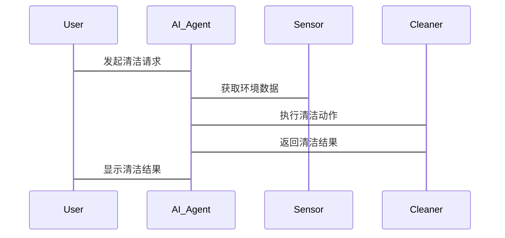

                 


# AI Agent在智能拖把中的深度清洁指导

**关键词**：AI Agent，智能拖把，深度清洁，路径规划，污渍识别，清洁优化

**摘要**：本文详细探讨AI Agent在智能拖把中的应用，重点分析其在深度清洁中的技术原理和实现方法。通过背景介绍、核心概念、算法原理、系统架构、项目实战等多维度的分析，结合实际案例，深入剖析AI Agent如何实现智能拖把的高效清洁。文章内容涵盖从理论到实践的全过程，为读者提供清晰的技术指导和深度分析。

---

# 第一部分: AI Agent在智能拖把中的深度清洁背景介绍

# 第1章: AI Agent与智能拖把概述

## 1.1 问题背景与描述

### 1.1.1 智能拖把的清洁需求
随着智能家居的普及，智能拖把作为一种便捷的清洁工具，逐渐走进千家万户。然而，传统智能拖把的清洁效率和清洁质量仍有提升空间。深度清洁需求主要集中在以下几点：
- **高效清洁路径规划**：避免重复清洁，减少清洁时间。
- **精准污渍识别**：智能识别不同类型的污渍，并采取针对性的清洁策略。
- **优化清洁模式**：根据环境变化动态调整清洁模式，确保清洁效果。

### 1.1.2 AI Agent在智能拖把中的应用
AI Agent（人工智能代理）是一种能够感知环境、自主决策并执行任务的智能体。在智能拖把中，AI Agent主要负责以下几个方面：
- **环境感知**：通过传感器感知拖把的当前位置、环境布局以及污渍分布。
- **决策制定**：基于感知数据，制定清洁路径和清洁策略。
- **动作执行**：通过机械结构执行具体的清洁动作，如移动、转向、吸尘、拖地等。

### 1.1.3 深度清洁的核心问题
深度清洁的核心问题在于如何实现高效、精准和个性化的清洁。AI Agent需要解决以下关键问题：
- **路径规划**：如何在复杂的环境中规划最优路径，减少清洁时间。
- **污渍识别**：如何准确识别不同类型的污渍，并采取相应的清洁模式。
- **动态调整**：如何根据环境变化动态调整清洁策略，确保清洁效果。

## 1.2 问题解决与边界

### 1.2.1 AI Agent如何解决清洁问题
AI Agent通过以下方式解决智能拖把的清洁问题：
- **路径规划算法**：利用A*算法规划最优路径，减少清洁时间。
- **污渍识别算法**：通过图像分割技术识别不同类型的污渍。
- **动态调整机制**：根据环境反馈实时调整清洁策略。

### 1.2.2 深度清洁的边界与外延
深度清洁的边界主要集中在以下几个方面：
- **清洁范围**：仅限于拖把可到达的区域。
- **清洁类型**：主要针对地面污渍，不涉及其他清洁任务。
- **环境限制**：受限于拖把的机械结构和传感器能力。

### 1.2.3 智能拖把与传统拖把的对比分析
智能拖把与传统拖把的主要区别在于智能化程度和清洁效果：
- **智能化程度**：智能拖把具备自主决策能力，能够实现路径规划和污渍识别。
- **清洁效果**：智能拖把通过AI Agent优化清洁策略，能够实现更高效的清洁效果。

## 1.3 概念结构与核心要素

### 1.3.1 AI Agent的核心要素
AI Agent的核心要素包括以下三个部分：
- **感知层**：通过传感器感知环境信息。
- **决策层**：基于感知数据制定决策。
- **执行层**：通过机械结构执行决策。

### 1.3.2 智能拖把的系统架构
智能拖把的系统架构主要由以下几个部分组成：
- **传感器模块**：用于感知环境信息。
- **AI Agent模块**：负责决策和控制。
- **执行机构**：用于执行具体的清洁动作。

### 1.3.3 深度清洁的实现路径
深度清洁的实现路径主要包括以下步骤：
1. **环境感知**：通过传感器获取环境信息。
2. **路径规划**：基于环境信息规划最优路径。
3. **污渍识别**：通过图像识别技术识别污渍类型。
4. **清洁执行**：根据识别结果执行具体的清洁动作。

## 1.4 本章小结
本章主要介绍了AI Agent在智能拖把中的应用背景、核心概念和实现路径。通过分析智能拖把的清洁需求和AI Agent的功能特点，明确了深度清洁的核心问题和实现路径。

---

# 第二部分: AI Agent的核心概念与联系

# 第2章: AI Agent的原理与特征

## 2.1 AI Agent的基本原理

### 2.1.1 感知层：环境数据采集
AI Agent通过以下传感器实现环境感知：
- **激光雷达**：用于感知环境布局。
- **摄像头**：用于识别污渍类型。
- **红外传感器**：用于检测障碍物。

### 2.1.2 决策层：清洁策略生成
决策层主要通过以下算法实现：
- **路径规划算法**：如A*算法。
- **污渍识别算法**：如图像分割算法。
- **决策优化算法**：如强化学习算法。

### 2.1.3 执行层：动作输出
执行层主要通过以下机构实现：
- **驱动电机**：用于拖把的移动。
- **清洁机构**：用于执行具体的清洁动作。

## 2.2 AI Agent的核心特征对比

### 2.2.1 感知能力对比表格
| 感知能力 | 智能拖把AI Agent | 传统拖把 |
|----------|------------------|----------|
| 环境感知 | 高精度传感器 | 无 |
| 污渍识别 | 图像识别技术 | 无 |

### 2.2.2 决策能力对比表格
| 决策能力 | 智能拖把AI Agent | 传统拖把 |
|----------|------------------|----------|
| 路径规划 | 自主规划 | 无 |
| 清洁策略 | 动态调整 | 固定模式 |

### 2.2.3 执行能力对比表格
| 执行能力 | 智能拖把AI Agent | 传统拖把 |
|----------|------------------|----------|
| 动作控制 | 精准控制 | 简单机械控制 |

## 2.3 实体关系图（ER图）



---

# 第三部分: AI Agent在智能拖把中的算法原理

# 第3章: AI Agent的核心算法

## 3.1 路径规划算法

### 3.1.1 A*算法原理
A*算法是一种经典的路径规划算法，主要步骤如下：
1. **生成候选路径**：根据起点和终点生成多个候选路径。
2. **评估路径成本**：通过启发函数评估每个候选路径的成本。
3. **选择最优路径**：选择成本最低的路径作为最终路径。

### 3.1.2 A*算法的数学模型
$$\text{cost}(path) = \text{g}(path) + \text{h}(path)$$
其中，$\text{g}(path)$表示从起点到当前点的实际成本，$\text{h}(path)$表示从当前点到终点的估计成本。

### 3.1.3 A*算法的Python实现
```python
import heapq

def a_star(start, end, grid):
    open_set = {start}
    came_from = {}
    g_score = {start: 0}
    f_score = {start: heuristic(start, end)}
    
    while open_set:
        current = heapq.heappop(open_set)
        if current == end:
            break
        for neighbor in grid.get_neighbors(current):
            tentative_g_score = g_score.get(current, float('inf')) + grid.cost(current, neighbor)
            if tentative_g_score < g_score.get(neighbor, float('inf')):
                came_from[neighbor] = current
                g_score[neighbor] = tentative_g_score
                f_score[neighbor] = g_score[neighbor] + heuristic(neighbor, end)
                heapq.heappush(open_set, neighbor)
    return came_from
```

## 3.2 污渍识别算法

### 3.2.1 图像分割算法
图像分割算法主要用于识别地面的污渍类型。常见的图像分割算法包括：
- **阈值分割**：基于灰度值的分割。
- **边缘检测**：基于边缘特征的分割。
- **区域生长**：基于区域特征的分割。

### 3.2.2 图像分割的数学模型
$$I(x, y) = \sum_{i=1}^{n} w_i \cdot f_i(x, y)$$
其中，$I(x, y)$表示图像的像素值，$w_i$表示特征函数的权重，$f_i(x, y)$表示特征函数。

### 3.2.3 图像分割的Python实现
```python
import cv2

def segment_image(image):
    gray = cv2.cvtColor(image, cv2.COLOR_BGR2GRAY)
    ret, binary = cv2.threshold(gray, 127, 255, cv2.THRESH_BINARY)
    return binary
```

## 3.3 清洁策略优化算法

### 3.3.1 强化学习算法
强化学习算法通过不断试错优化清洁策略。主要步骤如下：
1. **状态定义**：定义环境状态。
2. **动作选择**：选择具体的清洁动作。
3. **奖励机制**：根据清洁效果给予奖励。

### 3.3.2 强化学习的数学模型
$$Q(s, a) = Q(s, a) + \alpha [r + \max_{a'} Q(s', a') - Q(s, a)]$$
其中，$Q(s, a)$表示状态-动作对的价值，$\alpha$表示学习率，$r$表示奖励，$s'$表示下一个状态。

### 3.3.3 强化学习的Python实现
```python
import numpy as np

class QLearning:
    def __init__(self, state_space_size, action_space_size):
        self.q_table = np.zeros((state_space_size, action_space_size))
    
    def choose_action(self, state, epsilon=0.1):
        if np.random.random() < epsilon:
            return np.random.randint(action_space_size)
        return np.argmax(self.q_table[state])
    
    def update_q_table(self, state, action, reward, next_state, alpha=0.1):
        self.q_table[state, action] += alpha * (reward + np.max(self.q_table[next_state]) - self.q_table[state, action])
```

---

# 第四部分: AI Agent在智能拖把中的系统架构

# 第4章: 智能拖把的系统分析

## 4.1 系统功能设计

### 4.1.1 领域模型


### 4.1.2 功能模块
- **传感器模块**：负责数据采集。
- **AI Agent模块**：负责数据处理和决策。
- **清洁机构**：负责执行具体的清洁动作。

## 4.2 系统架构设计

### 4.2.1 系统架构图


### 4.2.2 接口设计
- **输入接口**：传感器数据、用户指令。
- **输出接口**：清洁动作指令。

## 4.3 系统交互设计

### 4.3.1 交互流程


---

# 第五部分: AI Agent在智能拖把中的项目实战

# 第5章: 项目实战

## 5.1 环境搭建

### 5.1.1 开发环境
- **操作系统**：Windows/Mac/Linux。
- **编程语言**：Python。
- **库依赖**：OpenCV、NumPy、scikit-learn。

### 5.1.2 依赖安装
```bash
pip install numpy opencv-python scikit-learn
```

## 5.2 核心代码实现

### 5.2.1 路径规划代码
```python
import heapq

def a_star(start, end, grid):
    open_set = {start}
    came_from = {}
    g_score = {start: 0}
    f_score = {start: heuristic(start, end)}
    
    while open_set:
        current = heapq.heappop(open_set)
        if current == end:
            break
        for neighbor in grid.get_neighbors(current):
            tentative_g_score = g_score.get(current, float('inf')) + grid.cost(current, neighbor)
            if tentative_g_score < g_score.get(neighbor, float('inf')):
                came_from[neighbor] = current
                g_score[neighbor] = tentative_g_score
                f_score[neighbor] = g_score[neighbor] + heuristic(neighbor, end)
                heapq.heappush(open_set, neighbor)
    return came_from
```

### 5.2.2 污渍识别代码
```python
import cv2

def segment_image(image):
    gray = cv2.cvtColor(image, cv2.COLOR_BGR2GRAY)
    ret, binary = cv2.threshold(gray, 127, 255, cv2.THRESH_BINARY)
    return binary
```

## 5.3 实际案例分析

### 5.3.1 案例一：复杂环境下的路径规划
案例描述：在一个复杂的房间布局中，智能拖把需要规划最优路径。
分析步骤：
1. **环境感知**：通过激光雷达获取房间布局。
2. **路径规划**：利用A*算法规划最优路径。
3. **清洁执行**：按照规划路径执行清洁任务。

### 5.3.2 案例二：多种污渍的识别与清洁
案例描述：在不同类型的污渍中，智能拖把需要识别并采取不同的清洁策略。
分析步骤：
1. **污渍识别**：通过图像分割技术识别污渍类型。
2. **清洁策略生成**：根据污渍类型制定清洁策略。
3. **清洁执行**：根据策略执行具体的清洁动作。

---

# 第六部分: AI Agent在智能拖把中的最佳实践

# 第6章: 最佳实践

## 6.1 小结
本文详细介绍了AI Agent在智能拖把中的应用，重点分析了路径规划、污渍识别和清洁策略优化的核心算法，并通过实际案例展示了如何实现深度清洁。

## 6.2 注意事项
- **算法优化**：在实际应用中，需要根据具体场景优化算法参数。
- **系统集成**：在系统集成过程中，需要考虑传感器的精度和机械机构的响应速度。
- **用户体验**：在设计过程中，需要注重用户体验，确保用户能够方便地操作智能拖把。

## 6.3 拓展阅读
- **相关书籍**：《强化学习：算法与应用》。
- **技术博客**：推荐关注AI领域的技术博客，获取最新的技术动态。

---

# 结语
通过本文的详细分析，读者可以深入了解AI Agent在智能拖把中的深度清洁指导技术。从理论分析到实际应用，本文为读者提供了全面的技术指导和深度分析。希望本文能够为相关领域的研究和实践提供有价值的参考。

