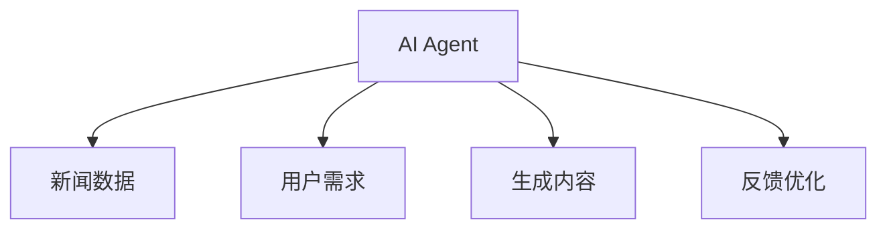
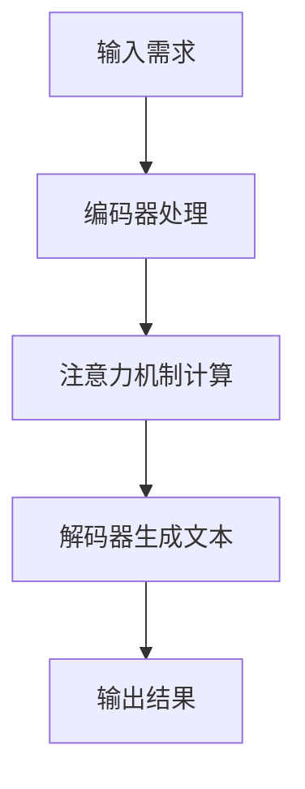
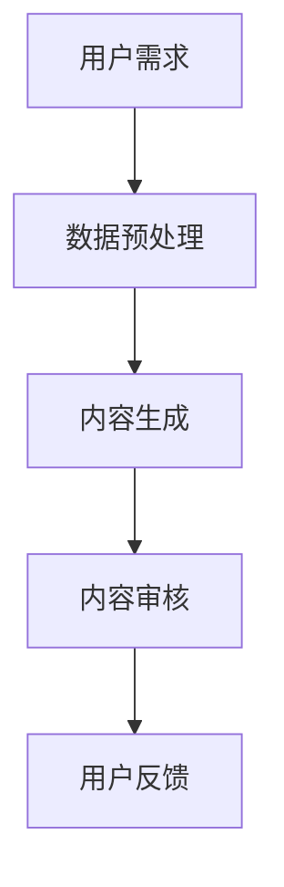
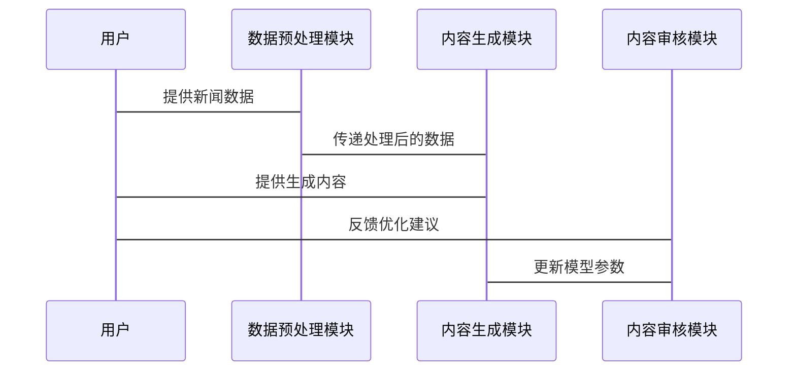

                 


# AI Agent在智能新闻写作中的角色

## 关键词：
AI Agent, 智能新闻写作, 自然语言处理, 新闻生成, 文本生成

## 摘要：
本文深入探讨AI Agent在智能新闻写作中的角色，从概念、算法、系统架构到实际应用，全面分析其优势与挑战。通过技术细节和案例分析，揭示AI Agent如何推动新闻写作的智能化进程。

---

## 第一部分：AI Agent与智能新闻写作的背景

### 第1章：AI Agent的基本概念与新闻写作背景

#### 1.1 AI Agent的基本概念
- **定义**：AI Agent是智能主体，能够感知环境并采取行动以实现目标。
- **特点**：自主性、反应性、目标导向、社交能力。
- **与传统新闻写作的对比**：传统写作依赖人类，AI Agent则自动化处理。

#### 1.2 智能新闻写作的背景
- **传统新闻写作模式**：依赖记者的手工撰写，效率低，资源消耗大。
- **智能新闻写作的兴起**：技术进步推动AI在新闻领域的应用，提高效率和精准度。

#### 1.3 AI Agent在新闻写作中的角色
- **内容生成工具**：AI Agent可以自动生成新闻标题和内容。
- **编辑辅助工具**：帮助编辑优化内容，检查错误。
- **分发优化工具**：根据用户反馈优化新闻分发策略。

---

## 第二部分：AI Agent的核心概念与原理

### 第2章：AI Agent的核心概念与联系

#### 2.1 AI Agent的核心概念
- **感知机制**：AI Agent通过数据源获取新闻相关的信息，分析用户需求。
- **决策机制**：基于分析结果，生成新闻内容并优化。
- **执行机制**：将生成的内容分发给目标受众。

#### 2.2 智能新闻写作的核心要素
- **数据来源与处理**：从多渠道获取新闻数据，清洗和预处理。
- **内容生成与优化**：利用NLP技术生成新闻标题和正文，优化语言表达。
- **用户反馈与迭代**：根据用户反馈不断优化生成模型。

#### 2.3 AI Agent在新闻写作中的实体关系图


### 第3章：AI Agent的算法原理与数学模型

#### 3.1 生成式AI的基本原理
- **变换器架构（Transformer）**：由编码器和解码器组成，用于处理序列数据。
- **注意力机制（Attention）**：衡量不同词的重要性，优化生成结果。
- **解码器结构（Decoder）**：逐步生成文本，根据上下文调整输出。

#### 3.2 文本生成的数学模型
- **概率生成模型**：计算每个词的概率，选择概率最高的词生成文本。
- **最大似然估计**：优化模型参数，使生成文本的概率最大化。
- **贝叶斯推断**：根据先验知识和数据，推断生成文本的概率。

#### 3.3 AI Agent的文本生成算法流程


---

## 第三部分：AI Agent的系统架构与实现

### 第4章：系统架构与功能设计

#### 4.1 系统功能模块
- **数据预处理模块**：清洗和结构化新闻数据。
- **内容生成模块**：基于AI模型生成新闻标题和正文。
- **内容审核模块**：检查生成内容的准确性和合理性。
- **用户反馈模块**：收集用户反馈，优化模型。

#### 4.2 系统架构设计


#### 4.3 系统交互流程


### 第5章：项目实战与优化

#### 5.1 环境配置
- **技术栈**：Python, TensorFlow, PyTorch
- **工具安装**：安装必要的NLP库，如spaCy, gensim

#### 5.2 核心代码实现
```python
# 示例代码：生成新闻标题
def generate_headline(model, tokenizer):
    input_ids = tokenizer.encode("Generate headline for: ", return_tensors="pt")
    outputs = model.generate(input_ids, max_length=50, do_sample=True)
    headline = tokenizer.decode(outputs[0], skip_special_tokens=True)
    return headline

# 示例代码：生成新闻内容
def generate_content(model, tokenizer, headline):
    input_ids = tokenizer.encode(f"Generate content for headline: {headline}", return_tensors="pt")
    outputs = model.generate(input_ids, max_length=300, do_sample=True)
    content = tokenizer.decode(outputs[0], skip_special_tokens=True)
    return content
```

#### 5.3 案例分析与优化
- **案例分析**：生成的新闻标题和正文是否准确，语言是否流畅。
- **优化建议**：根据反馈调整模型参数，优化生成效果。

---

## 第四部分：AI Agent的优化与未来展望

### 第6章：AI Agent的优化策略
- **模型优化**：使用更复杂的模型结构，提高生成质量。
- **数据优化**：增加多样化的训练数据，增强模型的泛化能力。
- **用户体验优化**：简化操作流程，提升用户体验。

### 第7章：未来展望
- **技术进步**：AI Agent将更加智能化，生成更高质量的内容。
- **应用拓展**：应用于更多领域，如财经新闻、科技报道等。
- **伦理与责任**：关注AI生成内容的伦理问题，确保信息真实性。

---

## 第五部分：总结与建议

### 第8章：总结与建议
- **总结**：AI Agent在智能新闻写作中的应用潜力巨大，但需克服技术与伦理挑战。
- **建议**：持续优化模型，加强伦理监管，推动AI Agent在新闻写作中的健康发展。

---

通过以上章节的详细分析，我们可以看到AI Agent在智能新闻写作中的巨大潜力和实际应用价值。尽管面临技术和伦理挑战，但通过不断的优化和创新，AI Agent将为新闻写作带来更高效、更智能的解决方案。

