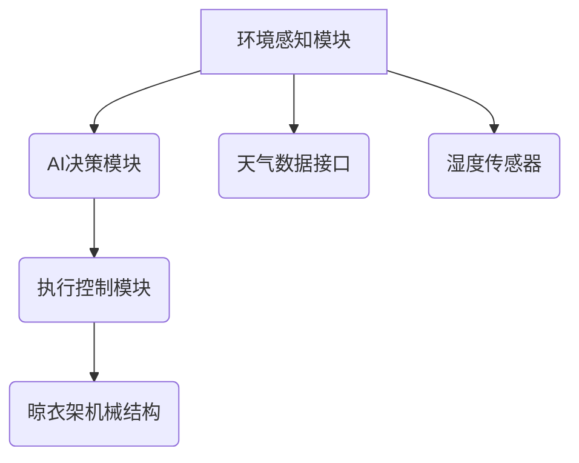
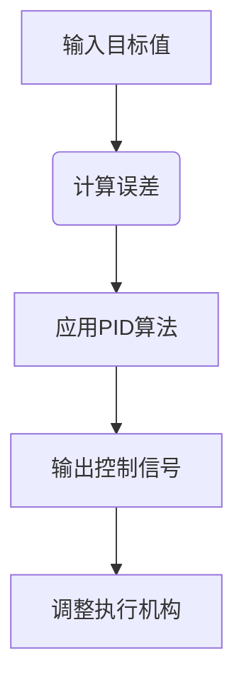
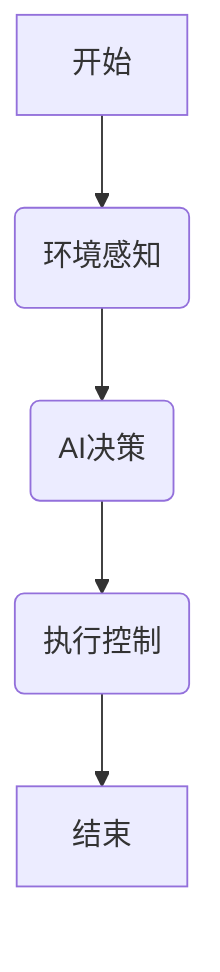
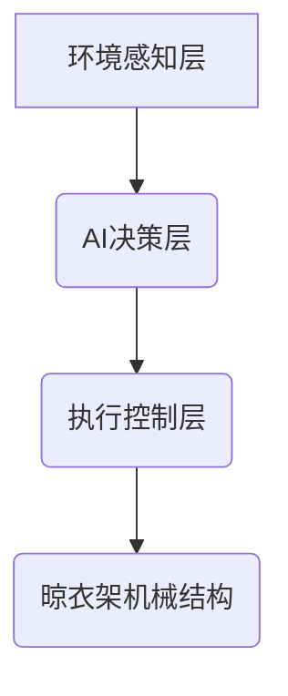
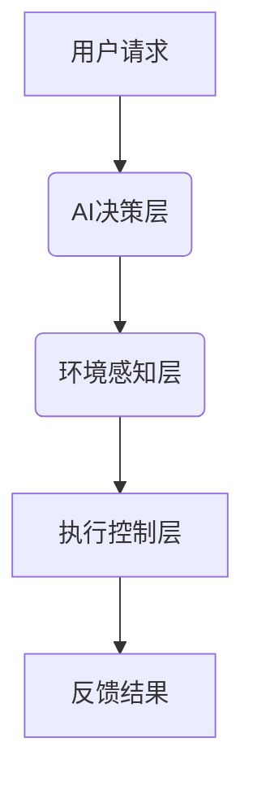

                 


# AI Agent在智能晾衣架中的烘干控制

## 关键词：AI Agent、智能晾衣架、烘干控制、算法原理、系统架构、项目实战

## 摘要：本文深入探讨AI Agent在智能晾衣架中的烘干控制应用，分析其核心概念、算法原理、系统架构及项目实战，展示AI技术在智能家居领域的创新应用。

---

## 第一部分: AI Agent与智能晾衣架概述

### 第1章: AI Agent的基本概念与应用场景

#### 1.1 AI Agent的定义与特点
##### 1.1.1 AI Agent的定义
AI Agent（人工智能代理）是指能够感知环境、自主决策并执行任务的智能实体。它通过传感器获取信息，利用算法处理数据，并通过执行器与环境交互。

##### 1.1.2 AI Agent的核心特点
- **自主性**：无需人工干预，自动完成任务。
- **反应性**：实时感知环境变化并做出反应。
- **目标导向**：以实现特定目标为导向。

##### 1.1.3 AI Agent与传统自动控制系统的区别
| 特性 | AI Agent | 传统控制系统 |
|------|----------|--------------|
| 决策方式 | 基于机器学习算法 | 基于固定规则 |
| 灵活性 | 高 | 低 |
| 学习能力 | 强 | 无 |

#### 1.2 智能晾衣架的发展历程
##### 1.2.1 晾衣架的演变史
从手动晾衣到电动晾衣，再到智能化控制，晾衣架的功能逐步升级。

##### 1.2.2 智能晾衣架的出现与技术支撑
AI技术的兴起推动了智能晾衣架的发展，使其具备环境感知和智能控制能力。

##### 1.2.3 当前智能晾衣架市场现状
市场逐渐普及，AI Agent的应用成为行业趋势。

#### 1.3 AI在智能晾衣架中的作用
##### 1.3.1 AI技术如何提升晾衣效率
通过环境感知和智能决策，优化晾衣时间，提升效率。

##### 1.3.2 AI Agent在智能晾衣架中的具体应用
包括环境感知、智能决策、自动控制等功能。

##### 1.3.3 AI Agent与智能家居的协同工作
AI Agent可与其他智能家居设备联动，实现统一控制。

### 第2章: AI Agent在智能晾衣架中的问题背景与需求分析

#### 2.1 传统晾衣系统的痛点
##### 2.1.1 人工干预的必要性
传统系统依赖人工操作，效率低下。

##### 2.1.2 烘干控制的不智能化
无法根据环境变化自动调整烘干策略。

##### 2.1.3 能耗浪费的问题
不智能的控制导致能源浪费。

#### 2.2 AI Agent解决的核心问题
##### 2.2.1 自动感知环境条件
通过传感器实时监测环境参数。

##### 2.2.2 智能决策烘干策略
基于环境数据，优化烘干时间。

##### 2.2.3 自动执行控制指令
根据决策结果，自动启动或停止烘干功能。

#### 2.3 系统边界与外延
##### 2.3.1 系统功能边界
明确系统功能范围，避免越界。

##### 2.3.2 系统与外部环境的交互
与天气预报接口、传感器等外部设备交互。

##### 2.3.3 系统扩展性分析
具备扩展接口，支持功能扩展。

### 第3章: AI Agent的核心概念与系统架构

#### 3.1 AI Agent的核心概念
##### 3.1.1 感知层
负责采集环境数据，如温度、湿度。

##### 3.1.2 决策层
基于感知数据，制定决策策略。

##### 3.1.3 执行层
根据决策结果，执行相应的操作。

#### 3.2 系统核心要素组成
##### 3.2.1 环境感知模块
通过传感器获取环境数据。

##### 3.2.2 AI决策模块
利用算法处理数据，制定决策。

##### 3.2.3 执行控制模块
根据决策结果，控制晾衣架动作。

#### 3.3 系统架构图（Mermaid）



---

## 第二部分: AI Agent的算法原理与数学模型

### 第4章: AI Agent的算法原理

#### 4.1 算法原理概述
AI Agent的核心算法包括感知、决策和执行三部分。

#### 4.2 PID控制算法的原理
PID（比例-积分-微分）控制是一种常用的控制算法，用于调节系统的输出。

##### 4.2.1 PID控制算法的数学模型
$$u(t) = K_p \cdot e(t) + K_i \cdot \int e(t) dt + K_d \cdot \frac{de(t)}{dt}$$

##### 4.2.2 PID控制算法的流程图


##### 4.2.3 PID控制算法的Python实现
```python
def pid_control(target, current, kp, ki, kd, prev_error, integral):
    error = target - current
    integral += error
    derivative = error - prev_error
    output = kp * error + ki * integral + kd * derivative
    return output, error
```

---

## 第三部分: 系统分析与架构设计

### 第5章: 系统分析与架构设计方案

#### 5.1 系统功能设计
##### 5.1.1 功能模块划分
- 环境感知模块
- AI决策模块
- 执行控制模块

##### 5.1.2 功能流程图


#### 5.2 系统架构设计
##### 5.2.1 系统架构图


#### 5.3 接口设计
##### 5.3.1 接口列表
- 环境感知接口
- AI决策接口
- 执行控制接口

##### 5.3.2 接口交互流程


---

## 第四部分: 项目实战

### 第6章: 项目实战

#### 6.1 环境安装
##### 6.1.1 硬件安装
- 晾衣架机械结构
- 传感器安装
- 控制器安装

##### 6.1.2 软件安装
- AI算法框架安装
- 开发环境配置

#### 6.2 核心代码实现
##### 6.2.1 PID控制算法实现
```python
def pid_control(target, current, kp, ki, kd, prev_error, integral):
    error = target - current
    integral += error
    derivative = error - prev_error
    output = kp * error + ki * integral + kd * derivative
    return output, error
```

##### 6.2.2 AI决策模块实现
```python
def ai_decision(target_humidity, current_humidity, target_temp, current_temp):
    # 实现AI决策逻辑
    pass
```

#### 6.3 代码应用解读与分析
##### 6.3.1 PID控制算法解读
PID算法通过比例、积分和微分三项调节，实现精确控制。

##### 6.3.2 AI决策模块解读
AI决策模块根据环境数据，制定最优控制策略。

#### 6.4 实际案例分析
##### 6.4.1 案例背景
某天天气潮湿，晾衣架需要智能控制烘干时间。

##### 6.4.2 系统运行流程
- 环境感知模块获取湿度和温度数据。
- AI决策模块根据数据制定烘干策略。
- 执行控制模块执行烘干操作。

#### 6.5 项目小结
通过项目实战，验证了AI Agent在智能晾衣架中的有效性和可行性。

---

## 第五部分: 总结与展望

### 第7章: 总结与展望

#### 7.1 总结
本文详细探讨了AI Agent在智能晾衣架中的应用，分析了其算法原理和系统架构，展示了实际项目的实现过程。

#### 7.2 展望
随着AI技术的不断发展，智能晾衣架的功能将更加智能化，应用前景广阔。

---

## 第六部分: 最佳实践与资源

### 7.1 最佳实践 tips
- 定期更新AI算法，提升系统性能。
- 确保传感器数据的准确性。
- 定期维护系统硬件，确保正常运行。

### 7.2 小结
通过本文的学习，读者可以系统地理解AI Agent在智能晾衣架中的应用，掌握其核心技术和实现方法。

### 7.3 注意事项
- 确保系统数据安全。
- 定期更新软件版本，提升系统兼容性。

### 7.4 拓展阅读
推荐阅读《人工智能在智能家居中的应用》、《智能控制系统设计》等书籍，深入学习相关知识。

---

通过以上内容，您可以系统地了解AI Agent在智能晾衣架中的烘干控制应用，掌握其核心技术与实现方法。

