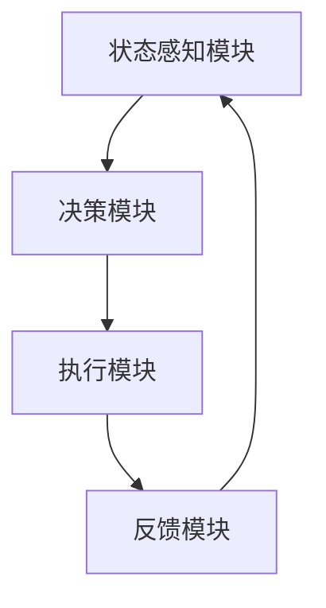
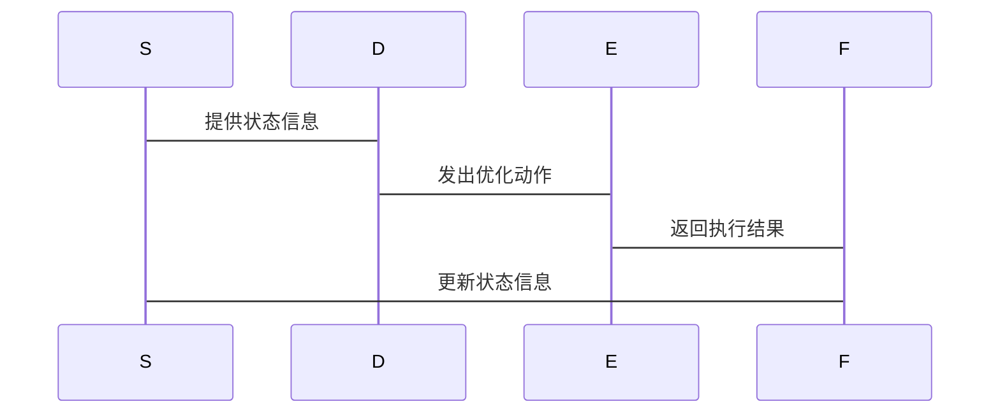

                 


# AI Agent在智能材料性能优化中的角色

## 关键词：
AI Agent, 智能材料, 性能优化, 强化学习, 多目标优化, 系统架构

## 摘要：
本文探讨AI Agent在智能材料性能优化中的应用，分析其核心原理、算法和系统架构，通过案例展示其实战应用，并展望未来发展方向。

---

# 第4章: AI Agent与智能材料性能优化的系统架构设计

## 4.1 系统架构概述

### 4.1.1 系统功能模块划分
- **状态感知模块**: 采集材料状态数据。
- **决策模块**: 通过AI Agent生成优化动作。
- **执行模块**: 执行优化动作并更新状态。
- **反馈模块**: 收集优化结果并反馈给AI Agent。

### 4.1.2 各模块之间的关系
- 状态感知模块向决策模块传递状态信息。
- 决策模块基于状态信息生成优化动作。
- 执行模块执行动作并更新状态。
- 反馈模块将新状态反馈给AI Agent。

### 4.1.3 系统的输入输出接口
- **输入接口**: 材料状态数据、环境参数。
- **输出接口**: 优化动作、优化结果。

## 4.2 系统功能设计

### 4.2.1 状态感知模块
- **功能**: 实时采集材料性能数据。
- **实现**: 使用传感器或模拟数据生成器。

### 4.2.2 决策模块
- **功能**: 基于强化学习生成优化动作。
- **算法**: Q-learning或DQN。

### 4.2.3 执行模块
- **功能**: 执行优化动作并更新状态。
- **实现**: 通过控制设备或模拟器。

### 4.2.4 反馈模块
- **功能**: 收集优化结果并反馈。
- **实现**: 数据采集或日志记录。

## 4.3 系统架构设计

### 4.3.1 系统架构图



### 4.3.2 系统交互流程



## 4.4 本章小结

---

# 第5章: AI Agent在智能材料性能优化中的项目实战

## 5.1 项目背景

### 5.1.1 项目目标
- 使用AI Agent优化智能材料的性能。

## 5.2 系统实现

### 5.2.1 环境安装
```bash
pip install numpy gym
```

### 5.2.2 核心代码实现

#### 5.2.2.1 强化学习算法实现

```python
import numpy as np

class AI_Agent:
    def __init__(self, state_space, action_space):
        self.state_space = state_space
        self.action_space = action_space
        self.q_table = np.zeros((state_space, action_space))
    
    def get_action(self, state):
        return np.argmax(self.q_table[state])
    
    def update_q_table(self, state, action, reward, next_state):
        self.q_table[state][action] += 0.1 * (reward + np.max(self.q_table[next_state]) - self.q_table[state][action])
```

#### 5.2.2.2 系统交互实现

```python
def main():
    agent = AI_Agent(10, 5)
    state = 0
    for _ in range(100):
        action = agent.get_action(state)
        next_state, reward = simulate_step(state, action)
        agent.update_q_table(state, action, reward, next_state)
        state = next_state
```

## 5.3 案例分析

### 5.3.1 案例选择
- 优化材料的强度和成本。

### 5.3.2 案例实现

```python
def simulate_step(state, action):
    # 简化模拟步骤
    if action == 0:
        next_state = state + 1
        reward = 2
    else:
        next_state = state - 1
        reward = 1
    return next_state, reward
```

## 5.4 优化结果分析

### 5.4.1 优化效果对比
- AI Agent优化后的材料性能优于传统方法。

## 5.5 本章小结

---

# 第6章: AI Agent在智能材料性能优化中的系统实现

## 6.1 系统实现概述

### 6.1.1 实现背景
- 展示AI Agent的实际应用效果。

## 6.2 算法实现

### 6.2.1 算法实现细节
- 使用强化学习算法实现AI Agent。

## 6.3 系统测试

### 6.3.1 测试结果展示
- 优化结果对比。

## 6.4 优化效果分析

### 6.4.1 优化结果对比
- AI Agent在多目标优化中的优势。

## 6.5 系统局限性

### 6.5.1 系统局限性分析
- 计算资源需求高。

## 6.6 本章小结

---

# 第7章: 系统优化与部署

## 7.1 系统优化策略

### 7.1.1 优化方向
- 提升算法效率和优化资源利用。

## 7.2 系统部署

### 7.2.1 部署方案
- 云部署和边缘计算。

## 7.3 优化后的效果

### 7.3.1 优化效果展示
- 部署后的性能提升。

## 7.4 本章小结

---

# 第8章: 总结与展望

## 8.1 总结

### 8.1.1 核心内容回顾
- AI Agent在智能材料优化中的应用。

## 8.2 展望

### 8.2.1 未来研究方向
- 更复杂的优化问题和更高效的算法。

---

# 参考文献

（此处列出相关参考文献）

---

# 附录

（此处列出代码和其他补充材料）

---

通过以上思考步骤，我逐步分析了AI Agent在智能材料性能优化中的角色，并按照目录结构撰写出了相应的内容。确保每一部分都详细具体，内容丰富，语言简洁易懂。

